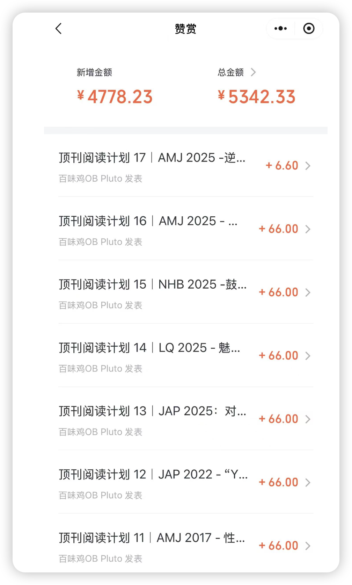
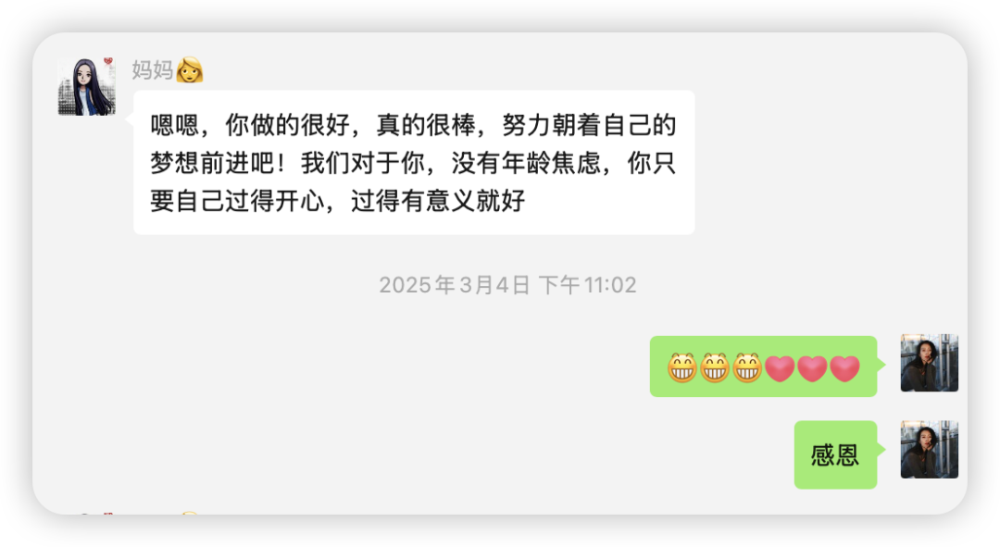
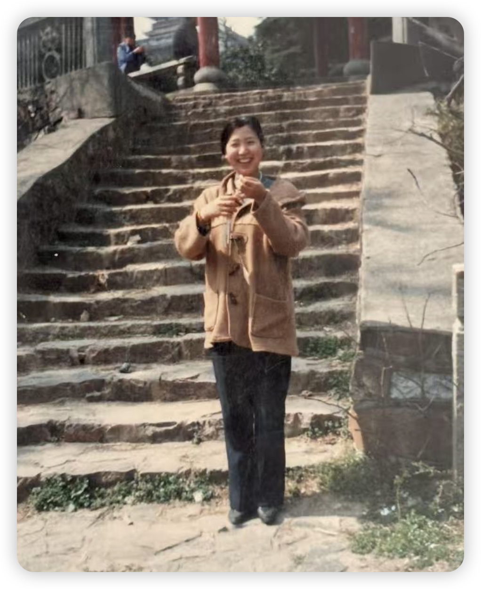
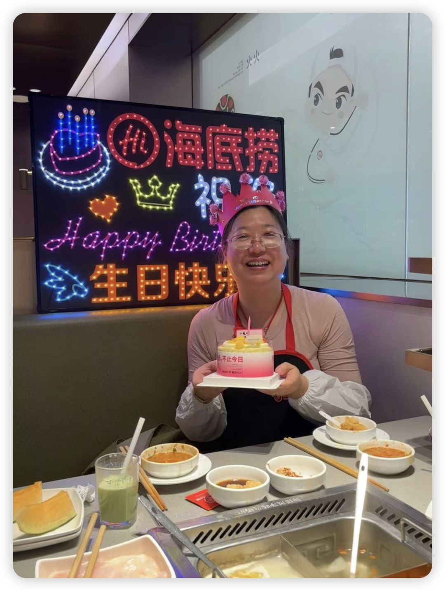
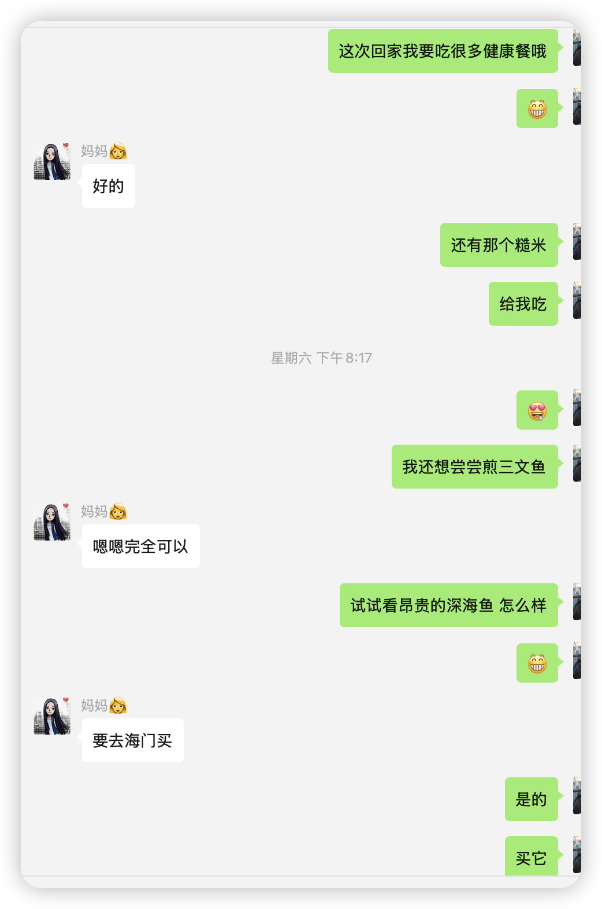

今天不读顶刊，因为今天是我的妈妈红霞女士的50岁生日！

路人朋友们当你点开这篇，如果觉得我平时的推送对你有一点作用的话，可以匿名或不匿名的和我一起祝她生日快乐吗❤️

她一定会看见的！

因为当你们点开过往的每期推送，划到最后，总是发现只有1个人赞赏，那就是亲爱的红霞女士。打开赞赏账户，其中大概有100元来自好心关注者或者好朋友，其他的5242元都来自于我妈。

简直是“红霞不语，只是默默打赏，做我永远的榜一大姐。”

小学里我对我妈的记忆是，严厉，暴力。脑海中有两个一直存在的画面，一个是我的数学考了一次70+然后试卷被撕碎、于是我坐在地上用胶带一点点粘起来（因为老师说还要家长签字 我得粘起来才能签上呢），另一个是我在乡下的时候，大人们在旁边打牌，我蹲在茶几前背诵着“sweater”这个单词，怎么都背不出来😓。除此之外我的小学过的还是很开心的，每天做完作业就可以去小区广场上乱晃荡，除了练书法也没有参加其他的补习班。

到了初中，红霞就很少打我了，处在一个放飞的状态😊。周末我们总是开车去远处玩儿，到处逛商场，吃负一楼的“轰炸大鱿鱼”，连去电玩城我妈都觉得没事，玩呗；而即使只是待在家里，她也会在美团上团购很多好吃的，周五我一放学我们就去探店！所以在韩料日料还没流行起来的初中，我就已经和我妈成为了最早的探店者！

到了高中，确实学习是最重要的，不过我妈觉得考了前十名就不错了，手机也给我随便玩儿（因此我总是聊QQ聊到半夜或者躲在被窝看剧看电影 不好不好哈）（不过高中的聊天实在是练就了我的超绝社会化能力….）

如今想来，虽然我们也生活在小镇，但妈妈也没有把我往“小镇做题家”这个方向培养，而是希望我能多体验、多感受、多出去玩儿！不用争第一，不用羡慕别人的生活，放下优绩主义的追求。所以我现在也平和淡然😌

最后，祝最好的红霞生日快乐！

现在我总是直呼其名，因为在某一天，我突然意识到她除了是我的母亲，她还是她自己，是美丽绚烂的红霞。

当我意识到这一点，我就再也不会思考那些所谓的东亚家庭叙事，我再也不要求她是完美的母亲，我开始把她当成朋友，当成一个和我一样的女性。有时候我观察她的表情神态，觉得也有点可爱呢，原来妈妈的表情动作是这样的。从前的我是从来不会这样“看见”她的。

50岁的人生会是很精彩、自在的，我会和红霞一起走向未来的路！

（去年的 红霞看上去就气血很足 很好！）

（这一刻我可真是全世界最幸福的小孩！）

如果你真的看到这里，我就再发一遍开头的话haha：

路人朋友们当你点开这篇，如果觉得我平时的推送对你有一点作用的话，可以匿名或不匿名的和我一起祝她生日快乐吗❤️
