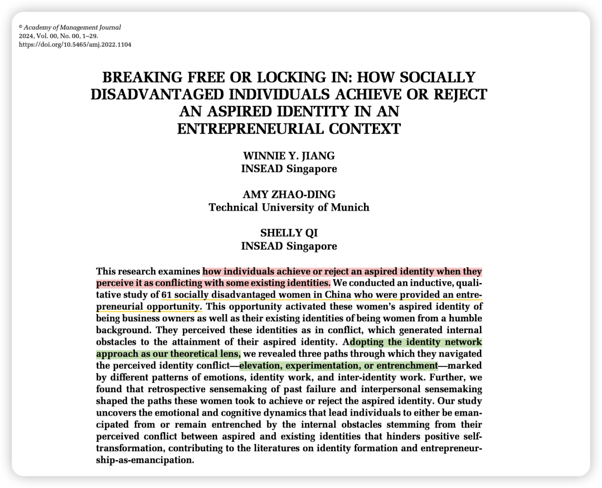

***Reference：***Jiang, W. Y., Zhao-Ding, A., Qi, S.. (2025). Breaking Free or Locking In: How Socially Disadvantaged Individuals Achieve or Reject an Aspired Identity in an Entrepreneurial Context. *Academy of Management Journal*, *68*(1), 162–190. https://doi.org/10.5465/amj.2022.1104

### 写在前面：

我其实是先在听了AMJ播客讲这一期后才读了这篇文章，强烈建议大家搭配播客一起食用(Spotify或Podbean上搜AMJ Lit Review即可），在播客里Winnie Jiang老师还分享了她和合作者们是如何建立联系、如何发现了这个现象、她未来的研究方向等等，结尾也很可爱和温暖hh！

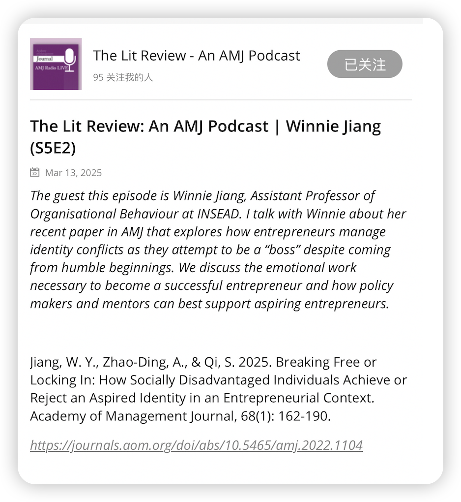

**三位华人女性**从2019年开始对对于那些处于社会弱势地位的女性进行了长期的访谈，解释了当创业机遇如普罗米修斯之火般降临后，那些被贴上"低学历农村女性"标签的个体如何在传统性别规训与经济赋权的撕扯中书写她们的Herstory，文章中放入的部分访谈原话读来简直字字泣血（当然有的也很鼓舞人心）。

女人写女人们的故事总是令人动容！

### **背景简介：**

在四线城市的美容院工作的“阿珍”们，突然有了一个可以自己当老板、拥有自己美容院的创业机会。

她们内心深处的声音是兴奋、期待，还是忐忑、不安？

之后她们又会如何选择，是否真的会逆风翻盘，改变自己的劣势出身成为老板？

总之，这篇文章旨在考察：**当个体认为其渴望的身份与某些现有身份相冲突时，处于社会弱势地位的女性们是如何实现或拒绝这种渴望的身份的。**

### 

### **为什么要做这个研究？**

以往的研究主要关注个体如何通过获得新的渴望身份来实现积极的自我转变，以及如何管理新获得的身份与既有身份之间的持续紧张关系。

但它们**往往忽略了一个重要的方面：当个体认为其渴望的身份与某些现有身份相冲突时，这种冲突如何成为他们获得渴望身份的内在障碍，并导致一些人未能实现其渴望。**

**尤其是在社会地位处于劣势的群体中**，他们不仅面临外部的歧视等障碍，还要应对由于感知的身份冲突而产生的内在障碍，例如负面情绪和不利的自我评价。

### 

### 理论概述：

本研究**采用身份网络理论（identity network approach）作为其主要的理论视角。身份网络理论将个体拥有的各种身份概念化为网络中的节点，拥有相同身份标签的个体可能对其感知到不同的含义。**

Ramarajan (2014) 描述了三种类型的联系：**冲突、提升和整合。**

**-冲突：**当人们感到无法满足不同身份相关的期望（例如，作为职业女性和母亲），或者当这些身份的含义似乎不一致时（例如，受教育程度低和成为领导者），身份之间就会产生冲突。

**-提升：**当扮演一种身份有益于另一种身份的体验或表现时（例如，当老师有助于成为更好的研究者），身份之间可以相互提升

**-整合：**当多个身份的含义模糊且重叠时，就会发生整合（例如，成为父母和领导者都是关于培养他人）。

### 

### **方法概述：**

在中国一家大型美容服务公司（化名为BeautyCo）进行研究。该公司为这些女性提供了一个创业机会：开设和经营自己的美容院，还提供了一个“启动工具包”来帮助她们克服资源和知识障碍，包括初始贷款、商业培训和个人指导。

在这个背景下，作者对这家公司中的61 位社会地位处于劣势的女性员工进行了四个阶段的深入访谈，共收集了 102 份访谈记录。

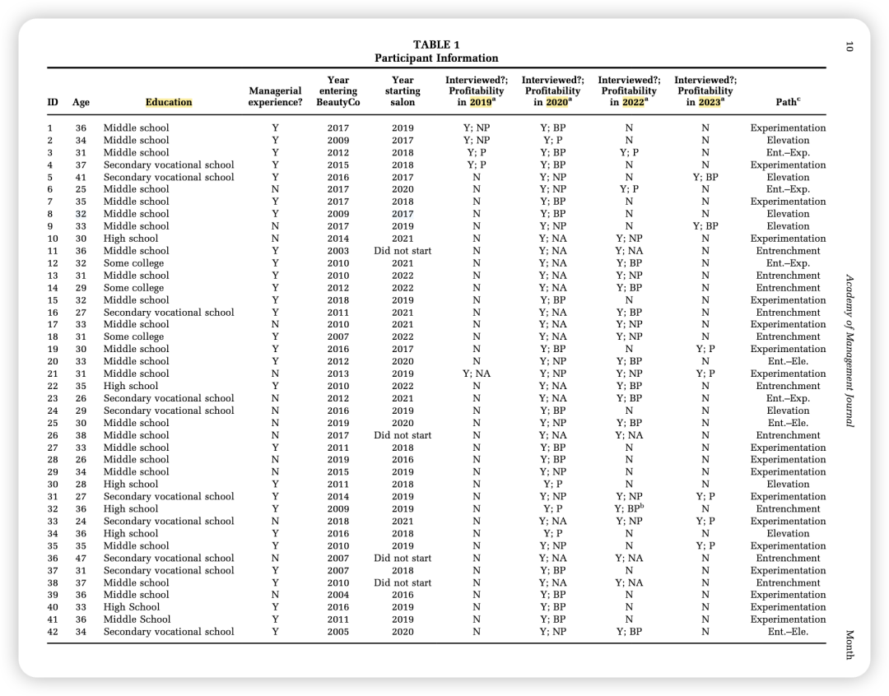

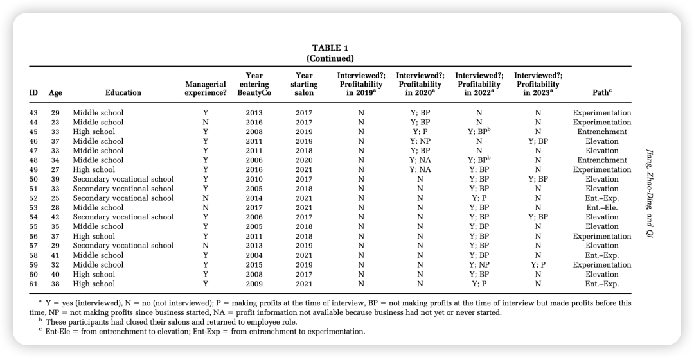

**第一阶段 (2019年12月)：**对 5 位不同任期的沙龙老板进行了探索性深度访谈。

第二阶段 (2020年夏季)：访谈了被人力资源部门评估为具有或不具有“老板心态”的沙龙老板，以及尚未成为沙龙老板的员工。此阶段共访谈了 49 位参与者。

第三阶段 (2022年夏季)：对 2020 年未将自己视为老板的 7 位老板以及当时的非老板（18位）进行了追踪访谈。此外，还访谈了 12 位以赚钱为主要 导向 的老板，以丰富研究发现。

第四阶段 (2023年2月)：根据新的数据分析结果，对 11 位参与者进行了再次访谈，重点询问她们对自己以及家庭背景和义务的看法如何随时间变化。

除了访谈之外，作者还结合了来自公司管理层、人力资源经理和导师的**二手数据**（访谈、简报和媒体文章。

### 

### **结果概述：**

这些女性在面对创业机会以及随之而来的渴望身份和现有弱势身份之间的冲突时，经历了**三条不同的路径：提升路径 (elevation path)、实验路径 (experimentation path) 和固化路径 (entrenchment path)。**

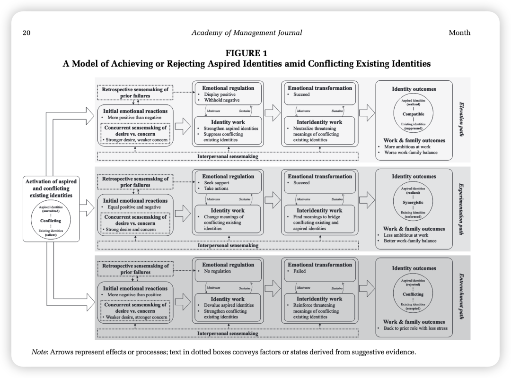

### 

### 提升路径：

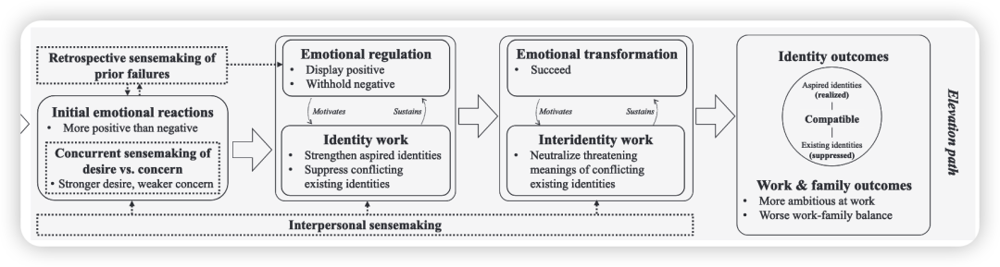

**-初始情绪反应：**对创业机会感到强烈的积极情绪（兴奋、希望），但也伴随对失败和能力不足的担忧，但积极情绪占主导。她们倾向于淡化过去的失败及其影响。

**-情绪调节与身份工作：**积极展示自己是能干的老板，积极应对挑战，专注于建立能力。她们压抑自己的负面情绪，不向他人传递。她们努力忘记自己卑微的出身和有限的教育，决心在城市中闯出一番天地。

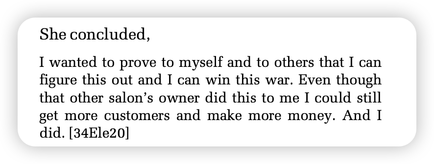

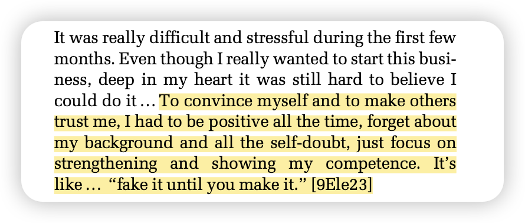

-情绪转变与跨身份工作：随着时间的推移，她们的情绪反应转变为积极，面对挑战感到平静甚至兴奋。她们开始区分自己与类似背景的人，不再认为自己的弱势身份会阻碍自己的成长，从而中和了这些身份最初带来的威胁性含义，使其与渴望的身份变得兼容。

-工作与家庭成果：对工作抱有很高的野心，更重视工作。因此工作与家庭的平衡较差。

### 实验路径：

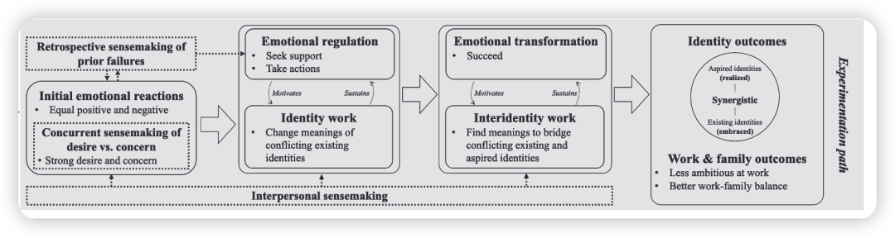

**-初始情绪反应：**对创业机会感到兴奋，但也同样担心失败和自身能力不足，情绪较为矛盾。她们更倾向于思考失败的可能性，并回忆和重视从过去的失败中吸取的教训。

-情绪调节与身份工作：积极寻求工作场所其他人的支持和肯定，以增强自信心，并与团队分享压力和担忧。她们专注于积极行动，通过实践学习和适应。她们从他人的支持中获得动力，并将最初与弱势身份相关的威胁性含义转变为激励自己坚持下去的动力。

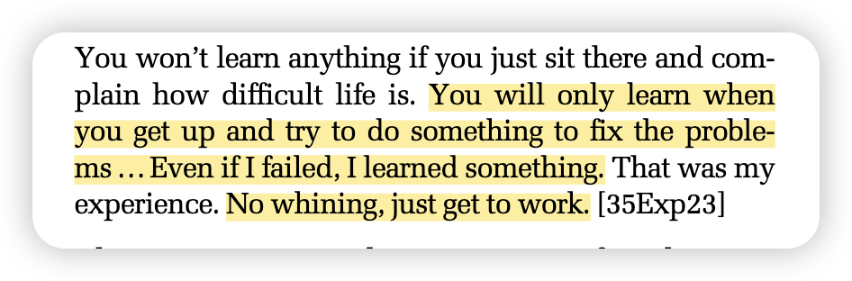

-情绪转变与跨身份工作：经历情绪转变后，她们成功地将老板的渴望身份融入自我概念。她们以新的视角看待自己的社会弱势身份，发现其积极含义，例如将自己的勤奋和吃苦耐劳归因于自己的出身，从而在渴望身份和现有身份之间建立起协同关系。

-工作与家庭成果：与提升路径的参与者相比，她们对工作抱有更保守的期望，更注重循序渐进地发展业务，并倾向于在工作和家庭之间取得更好的平衡。

### 固化路径：

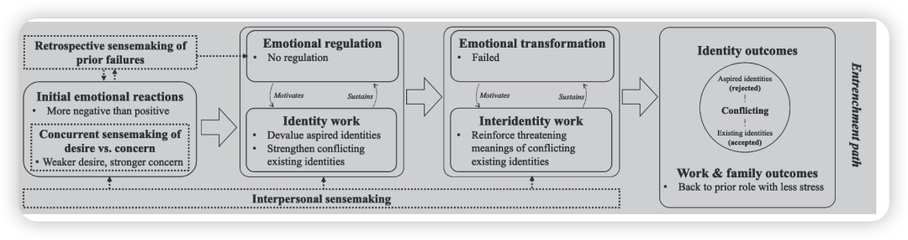

**-初始情绪反应：**听到创业机会后也感到兴奋，但这种积极情绪明显弱于她们的负面情绪，尤其害怕亏损和让他人失望。她们倾向于强调过去的失败带来的失望感，并因此更倾向于避免任何风险。

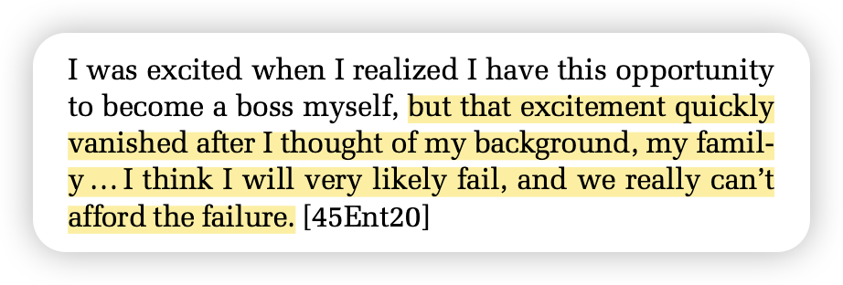

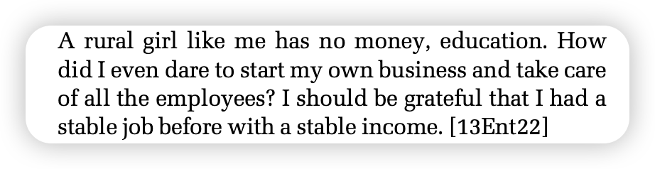

-缺乏情绪调节与身份工作：尽管在同事的鼓励下开始了创业，但恐惧和担忧依然强烈。她们的弱势社会经济背景和对家庭的经济责任感使她们感受到强烈的负面情绪，创业的渴望未能实现。创业过程中遇到的挑战引发了她们更多的恐惧、焦虑和压力，但她们没有采取有效的调节策略。

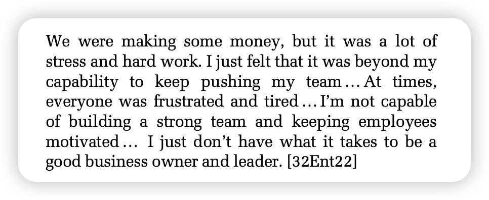

-缺乏情绪转变与跨身份工作：随着时间的推移，她们感受到的焦虑、恐惧和压力并未减轻，反而产生了“绝望”感。她们没有经历情绪转变，即使获得了新技能并实现了盈利，仍然感觉“很挣扎”。她们未能获得并拒绝了老板的渴望身份。许多人最终关闭了沙龙，即使盈利也在所不惜。她们强调对财务稳定和更多家庭时间的渴望，并将此归因于自己的出身。

人际意义构建的作用：

研究发现，人际意义构建（从他人那里发现、解释和采取行动的过程）可以塑造参与者的情绪体验，并重定向她们的身份工作或跨身份工作，从而改变她们的路径。一些参与者通过人际意义构建，从固化路径转向提升路径或实验路径。例如，上级和同事的鼓励和支持帮助她们调节负面情绪，并认识到自身的能力。

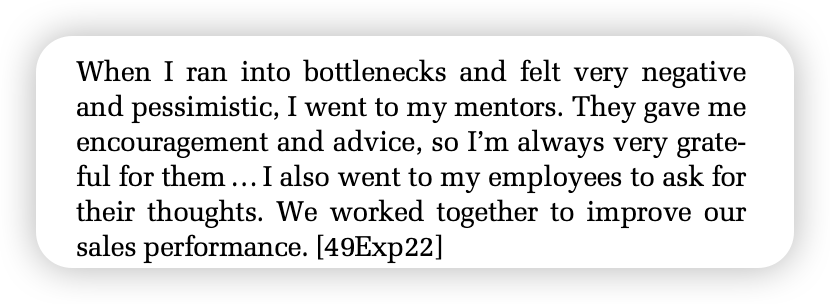

### 

### **贡献点：**

1、 揭示了当渴望身份与现有身份冲突时，个体如何以及**为何能够或不能获得新的渴望身份**，填补了以往研究主要关注成功获得身份的过程的不足。

2、展示了身份如何从冲突转变为兼容或协同，以及不同类型的身份关系如何形成、演变并产生不同的结果，为理解个体身份网络中不同联系的动态发展提供了新的视角。

3、将情绪置于身份形成过程的前沿，揭示了情绪如何通过其效价、强度以及个体调节和转变情绪反应的方式来塑造渴望身份的获得。这与以往研究更多关注专业人士理性认知过程有所不同。

4、揭示了不同的跨身份关系如何解释社会地位处于劣势的成功创业者
**在工作与家庭平衡方面的不同结果。**

### 

### 写在后面：

这篇文章的细节好多！特别是方法部分，简直是在看一本社科书籍了！

可惜周一上午时间有限，无法奢侈地细细解读了。

之后要是做相关的方法或题材，必须拿出来好好品读！

真的是好棒的一篇文章！！

（而且Winnie老师也太厉害了 2篇独作ASQ的含金量！

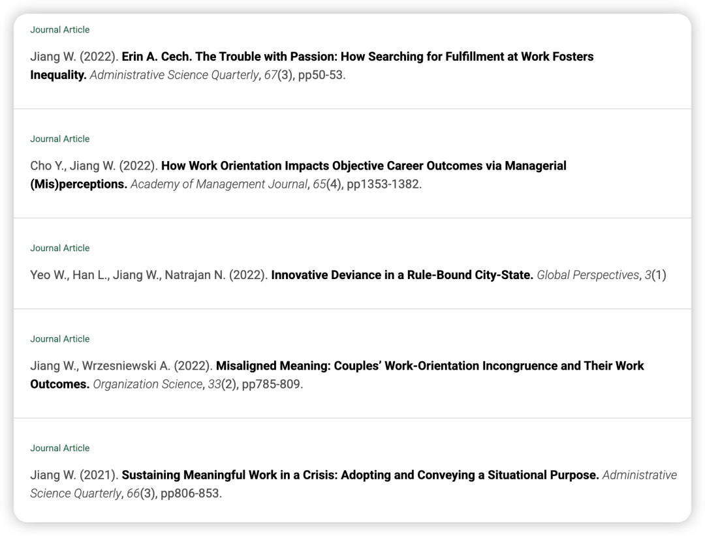
