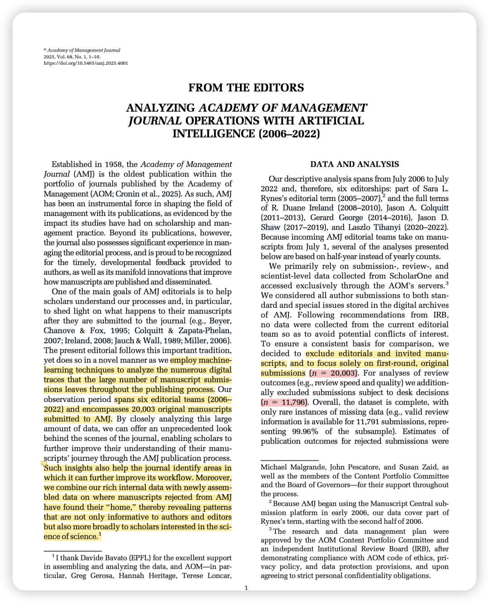
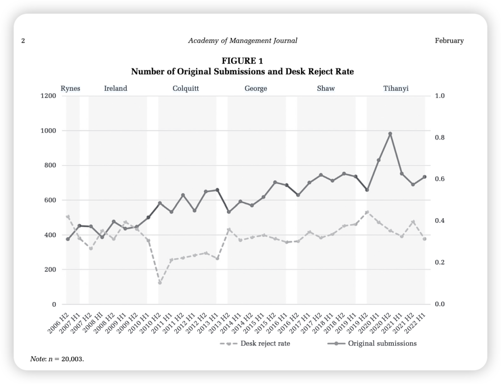
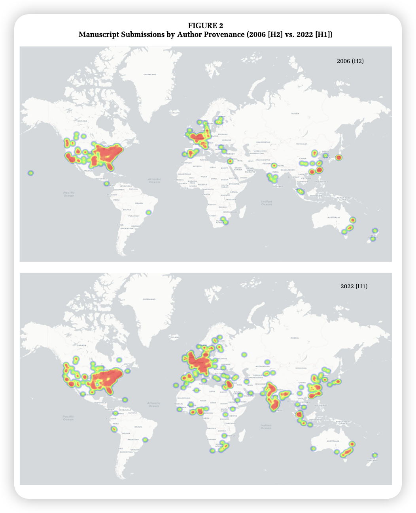
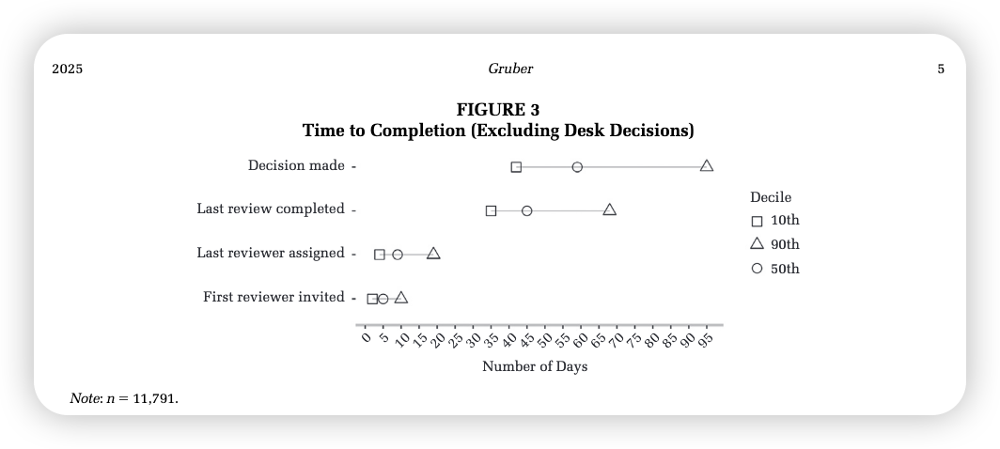
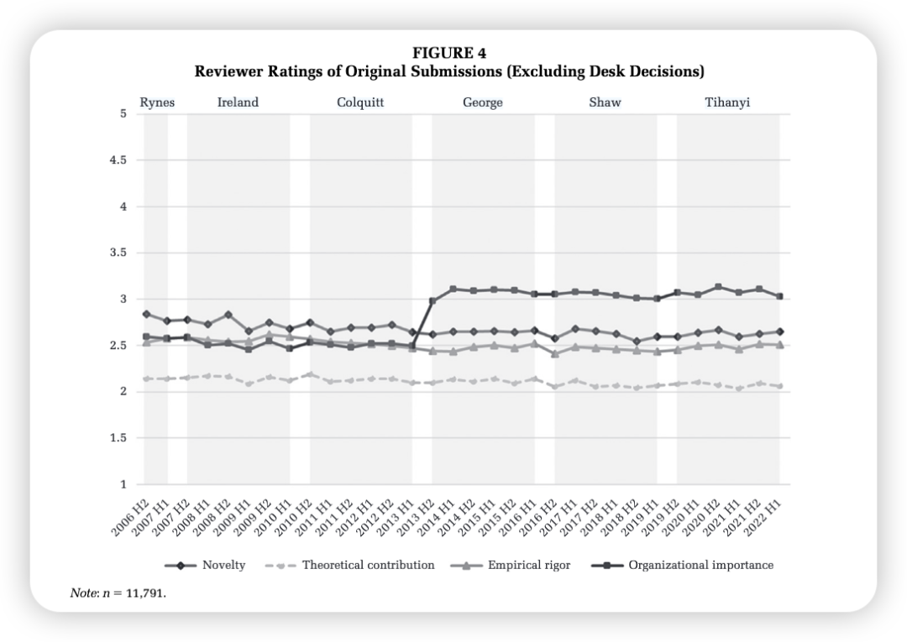
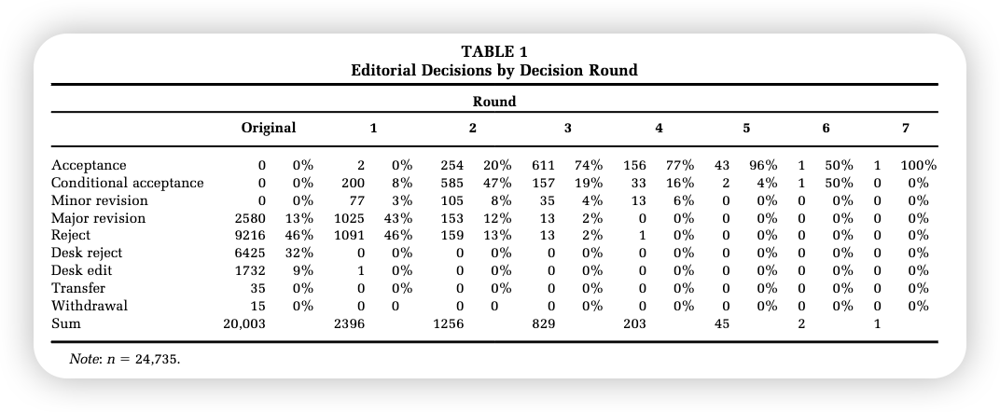
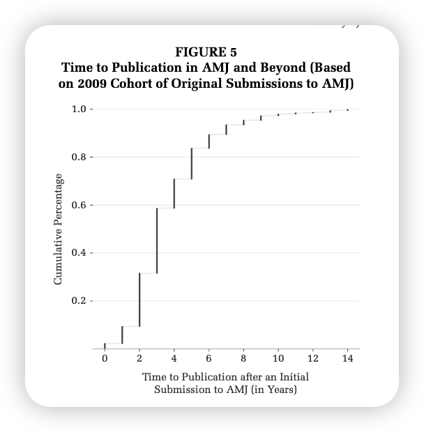
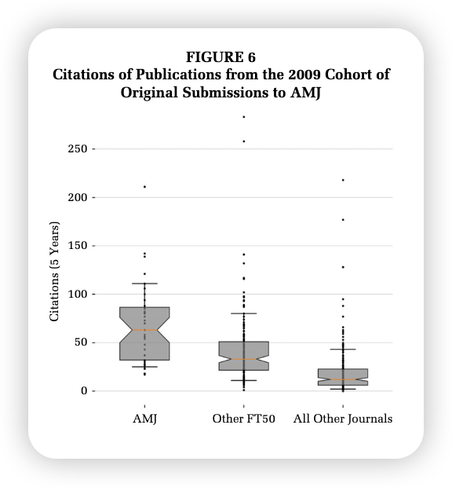

***Reference：***Gruber, M. (2025). Analyzing *Academy of Management Journal* Operations with Artificial Intelligence (2006–2022). *Academy of Management Journal*, *68*(1), 1–10. https://doi.org/10.5465/amj.2025.4001

### 

### 文章简介：

准备每周末都看看顶刊的from the editors （FTE）系列或者一些方法学的文章。

今天的这篇就是AMJ 2025年的第一篇FTE。

现任主编Marc Gruber通过分析2006年至2022年间AMJ的大量投稿和评审数据，让学者们更好地理解AMJ的运作流程，并帮助期刊自身改进工作流程。

有趣的是，**文章还探讨了被AMJ拒稿的论文最终的发表去向以及其影响力，看看每篇投稿最终归宿在何方！**

有一种打开了顶刊投稿黑箱的感觉。

### 要点概述：

这篇文章的精华都在图里，所以我就根据内容总结一下每张图片呈现的要点：

### Figure 1:

### 

这张折线图展示了从2006年下半年到2022年上半年期间，AMJ每半年的原始投稿数量以及desk rejection的变化趋势。

1、可以看出原始投稿数量**呈现持续增长的趋势，大约增长了一倍。**

**2、“end-of-term effect” （末期效应）：** 在主编团队换届（每年的7月1日）后的半年内，投稿数量往往会下降，然后又会回升并超过之前的水平。

3、**2020-2021年的投稿高峰：** 值得注意的是，**在2020年下半年，投稿数量急剧增加，几乎达到1000篇**。作者认为这可能与COVID-19疫情导致的居家办公，使得学者们有更多时间投入研究有关。

4、**Desk Rejection比率：Desk Rejection率呈现上升趋势，但整体在30%-40%之间波动**，**低于其他顶级期刊的平均水平**。因为AMJ的传统是“providing developmental support to authors”，所以也并不想有特别高的桌拒率。

### Figure 2: 2006年和2022年的作者机构来源地分布情况

### 

### 

1、饼图的对比清晰地表明，AMJ的**全球影响力显著增强。**

2、中国、印度和南非的投稿增长最为显著，甚至达到了以前的六倍多。

### Figure 3: 审稿完成时间

### 

1、图中显示，对于经过完整评审的首轮稿件，**平均决策时间为59天。**10%的稿件能在42天内收到反馈，而90%的稿件能在大约三个月内得到最终决定。

2、**平均而言，所有三位审稿人在稿件提交后九天内同意审稿**，这表明编辑和审稿人共同努力确保了期刊的高效运作。

### Figure 4: **审稿人对原始投稿的评分**

### 

展示了审稿人在新颖性、理论贡献、实证严谨性和组织重要性上对原始投稿的评分随时间的变化趋势。

1、总体而言，审稿人对稿件质量的评分在观察期间以及不同主编团队之间**保持相对稳定。**

2、审稿人对初始投稿的平均评分**通常在2到3分之间。**

3、**理论贡献始终是所有经过完整评审的原始投稿中得分最低的维度**，这表明审稿人认为许多稿件在**理论贡献方面**可能达不到AMJ的出版标准

4、**织重要性的评分在George主编任期开始时出现显著上升**，这与他强调通过管理研究应对“重大挑战”的主题有关。

5、**新颖性评价的两极分化：** 关于新颖性评分的分析表明，约**50%的稿件至少有一位审稿人给出4分或5分**，但**只有5%的稿件所有三位审稿人都给出4分或5分**。这提示作者在投稿AMJ时需**要考虑其研究的新颖性并向更广泛的读者解释其意义。**

### Table 1：

### 

列出了在2006-2022年期间，AMJ不同评审轮次的编辑决定结果。

1、尽管表格显示最多有七轮评审，但**只有一篇稿件经历了七轮评审最终被接受（太夸张了 7轮！）**。绝大多数稿件在三轮以内做出最终决定。

2、 一旦稿件进入第三轮之后，**被AMJ拒绝的可能性非常小。**（只有一篇稿件在第四轮被拒绝 Oh 太可怜！）

3、 **13%的原始投稿会收到R&R。**

4、比较不同轮次的拒稿和积极决定（接受、有条件接受、大小修）的数量可以发现，获得积极决定的可能性随着评审轮次的增加而显著提高。

后面的分析可有意思了哦！

为了追踪被拒稿件的发表情况，Marc Gruber特别分析了2009年的稿件，并利用**句子嵌入模型（SBERT）等文本分析技术**来**匹配被拒稿件和后续发表的论文。**（这个思路太牛了！不愧是AMJ主编呀！）

### Figure 5:

### 

这是一条累积分布曲线，展示了2009年提交给AMJ的原始投稿，最终在任何期刊上发表所需的时间。

1、从最初投稿给AMJ**到最终在任何期刊上发表**，**平均需要三年时间。**

2、**90%的可追踪发表的稿件在七年内出现在期刊上。**这些数据表明，即使被AMJ拒绝，作者也应该**坚持改进稿件并投稿到其他期刊。**

### Figure 6: **2009年原始稿件最终的publication引用情况**

### 

比较了2009年提交给AMJ的原始投稿，最终发表在AMJ、其他FT50期刊以及所有其他期刊上的论文在发表后五年内的被引用次数。

1、**发表在AMJ的论文在发表后五年内的平均被引用次数显著高于**那些被AMJ拒绝后最终发表在其他FT50期刊或所有其他期刊上的论文。

2、这个结果初步表明，**AMJ的审稿过程具有积极的选择和培育作用。**

**写在后面的碎碎念：**

虽然发不了AMJ，但看看这个过程也挺有意思的！

祝愿大家都能有给AMJ投稿的底气、并借此来获得最有价值的审稿意见！
