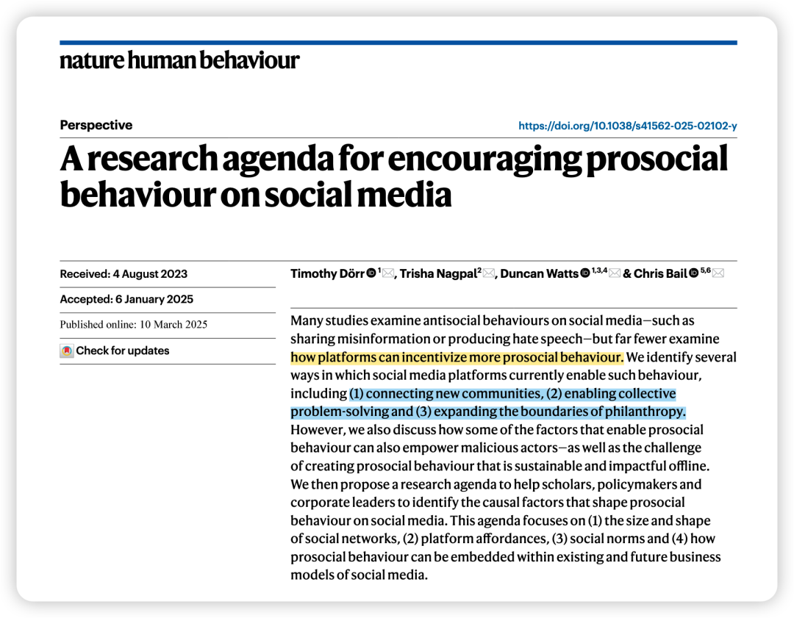
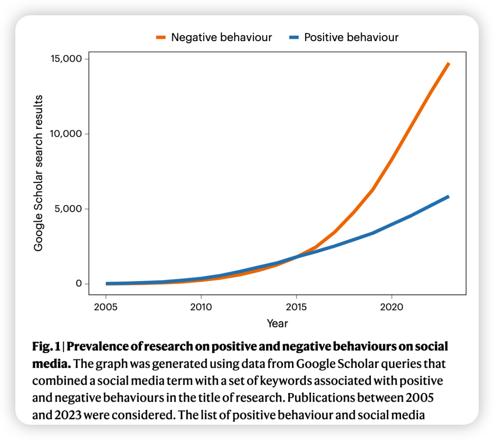
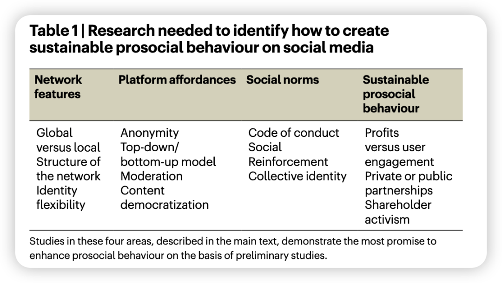

***Reference：***Dörr, T., Nagpal, T., Watts, D., & Bail, C. (2025). A research agenda for encouraging prosocial behaviour on social media. *Nature Human Behaviour*, 1–9. https://doi.org/10.1038/s41562-025-02102-y

### 

### **对文章的简介：**

在zotero订阅的rss里面瞄了一眼NHB最新的一期，看着标题有意思就点进来了。因为对我来说，social media带来的正向作用是大于负向作用的，而我也非常喜欢利用这些媒体来进行prosocial behavior。

这篇文章就对于目前社交媒体上亲社会行为的好处、面临的挑战、需要作出的改进进行了归纳（只是总结，非综述、非元分析），并对于学界/业界在增加社交媒体上的亲社会行为上要考虑的方面。

看这篇文章反而有一种在听《声动早咖啡》、看《哈佛商业评论》的感觉哈哈哈… 但里面的一些points**感觉对做IS或者传播学的研究者会有所启发！我只攫取了其中我觉得有意思的内容，省略了很多细节，大家还是要回原文看哈。**

### 

### **为什么要做这个总结？**

虽然许多研究关注社交媒体上的反社会行为（如传播虚假信息和仇恨言论），但**平台如何激励更多亲社会行为的研究却相对较少。**

作者认为，**在解决社交媒体负面影响的同时，也需要培养更多的亲社会行为。**

### **社交媒体在促进亲社会行为方面的潜力**

1、**连接新的社群**

社交媒体能够促进身处异地的人们之间的对话，创建在线下无法存在的社群。

例如，Instagram赋能了白癜风患者群体，让他们在彼此身上找到慰藉；Reddit上的匿名社群为患有绝症、遭受性虐待和心理健康障碍的人们提供了关键支持。

2、**促成集体问题解决**

社交媒体平台可以在危机时期通过在政府、非营利组织和公众之间传播紧急信息来促进问题解决。灾难受害者也经常使用社交媒体沟通他们的需求，例如通过带有地理标签的帖子发出求救信号以加强救援行动。

社交媒体平台还在解决医学领域的大规模问题方面发挥了作用。例如，Facebook在2012年推出了一项功能，允许用户表明其器官捐赠意愿并鼓励他人效仿，结果显示活动第一天注册人数激增了2112%。

**3、拓展慈善事业的边界**

社交媒体平台创造了新的慈善形式 （belike水滴筹💧）。

例如，Facebook Causes允许用户为有需要的人创建筹款活动，Twitter之前也通过连接等功能帮助非营利组织组织支持者联盟，并通过转推和超链接促进宣传活动。

例如冰桶挑战赛，旨在提高人们对肌萎缩侧索硬化症的认识并筹集研究资金。尽管冰桶挑战赛也存在争议，但其参与规模令人印象深刻：超过1700万人发布了视频，2800万人捐赠了超过2.2亿美元。

然而，作者也强调了促成亲社会行为的相同因素也可能被恶意利用。因此，作者提出了一个研究议程，重点关注以下四个方面：

1、**社交网络的规模和形状**

尽管许多平台的目标是连接尽可能多的人，但这既可能促进虚假信息和仇恨言论的传播等负面结果，也可能带来ALS挑战赛等亲社会结果。

文章提出，**仅仅依靠连接性可能不足以产生积极结果，网络结构的其他特征可能更具预测性。**例如，Twitter的网络结构近似于“无尺度”网络，而Facebook等网络则具有“小世界”特征。

2、**平台功能**

文章指出，匿名性有时可以促进亲社会行为，但在其他情况下，实名制也发挥了作用。

另一个问题是，平台应该以自上而下的方式实施功能，还是给予用户自下而上的塑造空间？

文章还讨论了内容审核的作用，认为内容审核似乎有助于亲社会行，但尚不清楚在哪些条件下社区可以有效地自我管理，以及平台应该如何进行干预。

此外，平台的内容推荐算法通常以用户互动为导向，这可能放大负面甚至反社会内容。

——因此，需要研究哪些平台功能能够为不同类型的用户在不同规模和结构的社交网络上激发积极或消极行为。

**3、社会规范**

一项在Reddit科学讨论社区进行的实验表明，提醒social norms可以提高用户的规则遵守度和新参与者的参与度。维基百科的成功可能部分**归因于人们普遍认同免费获取高质量信息是一个有益于所有人的目标**。相比之下，Facebook、Twitter或TikTok等大型平台缺**乏明确的social norms**。

——因此，需要研究哪些类型的状态标志能够激励亲社会行为，以及平台直接提供还是允许用户创建这些标志更有效。

**4、可持续的亲社会行为**

未来研究最重要的领域可能是学者们如何找到既能激励亲社会行为**又具有可持续商业模式**的系统，这可能**需要学术界与产业界的合作**。

即使促进亲社会行为的干预措施不降低用户参与度，它们也可能需要新的功能、员工或其他资源，公司必须权衡这些因素与其他可能产生更大利润的优先级。许多人认为社交媒体公司有保护公共利益的道德义务，但管理人员的激励机制和义务是为股东创造利润，因此这两者存在分歧，需要好好考虑。

**最后，文章也提醒，执行上述研究议程将充满挑战，尤其是在数据获取方面。**

许多提出的研究需要与社交媒体公司密切合作；**然而，目前最大的三个社交媒体平台（TikTok、Facebook和YouTube）极少与研究人员分享数据，而曾经广泛共享的Twitter和Reddit的数据现在要么无法访问，要么成本过高。**

作者指出，许多学者认为产业界的利益与社会利益本质上是对立的，但事实并非必须如此。**与学术研究界合作，寻找能够产生更好产品和良好科学的科学合作机会，更能符合产业界的利益。**

为了使这种观点具有说服力，**研究界需要以建设性的批判伙伴的身份与产业界合作，而不是作为寻求数据的恳求者或寻求指责的对抗者。**就公司而言，**应该将学者视为推进共同目标的合作伙伴，而不是修复声誉的工具。**

因此，产业界和研究人员都有责任创建新的、互利的合作模式，从而造福社会

**写在后面的碎碎念：**

今天突然想到，我的每周4篇的顶刊推送可以这样构成：

2篇传统OB研究——跟进最新动态；

1篇nature/science/pnas正刊或子刊的研究——打开思维和眼界；

1篇方法论或者做研究guideline性质的文章 ——更好地精进研究细节，从而构建自己的research philosophy！

这样简直是妙哦！
