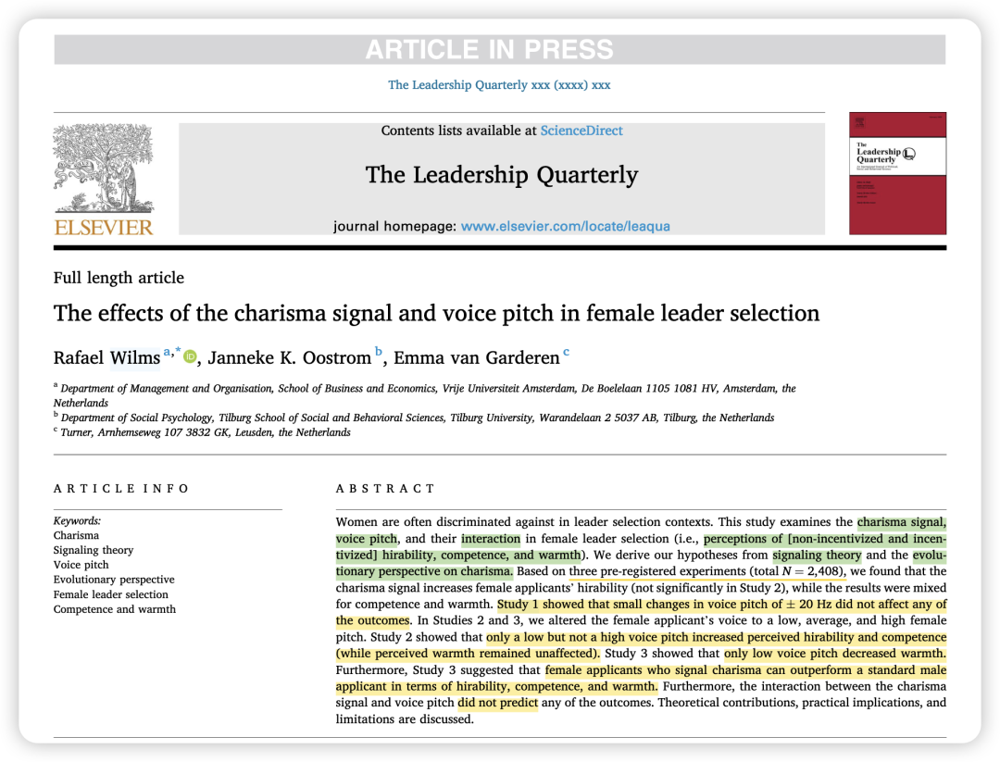
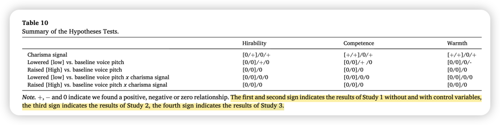

***Reference：Wilms, R., Oostrom, J. K., & van Garderen, E. (2025). The effects of the charisma signal and voice pitch in female leader selection.****The Leadership Quarterly*, 101857. https://doi.org/10.1016/j.leaqua.2024.101857

### **背景简介：**

女性在领导者选拔中经常面临歧视，为了解决这个问题，本研究着重考察了两种可能影响女性领导者前景的因素：**魅力信号和音高。**

也是受撒切尔夫人的启发: 撒切尔夫人同时展现了魅力信号和降低的音高这两个特点。

### 为什么要做这个研究？

1、尽管魅力信号被认为是领导力的重要因素，但目前的研究主要集中在男性领导者身上，例如在选举或 CEO 留任方面，**尚无研究专门考察魅力信号在女性领导者选拔背景下的影响。**

2、以往关于音高的研究没有明确区分是降低音高还是升高音高产生了影响，缺乏一个明确的基线条件。本研究会在实验设计上有所进步，更清晰地揭示音高（特别是降低或升高女性领导候选人的音高）如何在领导者选拔中发挥作用。

### 理论概述与假设推理：

这篇文章的理论基础主要来源于**信号理论 (signaling theory)** 和 **魅力的进化视角 (evolutionary perspective on charisma)。**

**1、魅力信号理论：** 根据魅力信号理论，一方（信号发送者，如领导者或领导者候选人）可以通过发送特定的、可观察的信号向另一方（信号接收者，如选拔者）传递关于自身某些特质或能力的信息。

魅力领导策略 (Charismatic Leadership Tactics, CLTs) 是魅力信号的具体体现。这些策略包括内容策略（比如道德信念、集体情感、远大目标等）、**框架策略（如使用隐喻、故事、对比等来构建和清晰化信息）和****表达** 策略（如通过手势、面部表情和充满活力的声音来强调信息并传递激情）。研究者认为，通过操纵这些 CLTs 的频率和强度，可以有效地控制魅力信号的强弱。

因此，基于信号理论，研究者推断，发出更强烈的魅力信号的女性申请者会传递出更积极的领导能力和潜力信号，从而提高她们在领导者选拔中的可聘用性、能力和热情评价。

**2、魅力的进化视角：**有效的信号传递对于物种的适应性是有益的。从进化角度来看，有效的信号传递对于物种的适应性是有益的。如果发送者和接收者都能从特定信号的传递中获益，并且双方都关注这些信号，那么这种信号传递就会增强物种的繁衍。

其实作者还用了**领导分类理论（leader categorization theory）**，但是却没有在abstract里面单独列出来。根据**领导分类理论**，当女性领导者展现出魅力信号时，人们更倾向于将她们**归类到**“理想或优秀领导者”的原型中。

### **贡献点：**

1、之前关于领导魅力的研究是将其放在**“观看者”**的视角中，**将这种领导客观行为和观察者的主观感知混为一谈**。而本研究则**将魅力视为一种可以客观操控和训练的信号。**

2、本研究将魅力信号的研究拓展到女性领导者的选拔背景下，探索魅力信号是否能够提升女性的领导前景，并帮助她们应对在领导者选拔中经常面临的性别偏见。

### **方法概述：**

3个实验研究，层层递进。

研究一：在prolific招募有招聘经验的被试，采用了 2（强 vs. 中等魅力信号）× 3（人为降低、升高或基准音高） 的 被试间设计 (between-subjects design)。

参与者被告知他们是自然博物馆馆长和 CEO 的选拔委员会成员，之后他们阅读了职位广告，并审阅了一份事先经过测试的质量中等偏上的简历。

之后收听一段由专业女演员录制的视频，该音频中申请人的魅力信号（强或中等）和声音音高（降低、升高或基准） 经过了系统地操控。魅力信号的强弱通过使用不同频率的魅力领导策略 (CLTs) 来实现，音高的改变是在基准音高的基础上进行了 ±20 Hz 的微小调整。

**研究一发现：**

**（1）魅力信号的增强显著提高了女性申请人的可聘用性、能力和热情。**

**（2）微小的音高变化对这些结果没有显著影响。**

**（3）魅力信号和音高之间也没有观察到显著的交互作用。**

研究二：大部分流程都和研究一类似，区别是：（1）研究二没有让参与者评价简历。研究者认为，简历可能提供了过强的积极信号，掩盖了魅力信号和音高的影响；（2）音高操作方面，研究二将女性申请者的声音调整为 低、高和基准 三种不同的女性音高，音高的变化幅度比研究一更大。

**研究二发现：**

**（1）魅力信号对可聘用性、能力和热情没有显著的独立影响。**

**（2）然而，低音高显著提高了女性申请人的可聘用性和能力，但对热情没有影响。高音高对任何结果变量都没有显著影响。**

**（3）魅力信号和音高之间仍然没有发现显著的交互作用。**

研究三则是更复杂的设计，包含**一个 被试内因子**（女性 vs. 男性申请人） 和女性申请人条件下的 **被试间因子**：2（强 vs. 中等魅力信号）× 3（低 vs. 高 vs. 基准音高）。

与前两个研究的关键区别在于，研究三要求参与者评价两段 2 分钟的音频：一段是女性申请人 Mary 的，另一段是男性申请人 James 的。

对于女性申请人，参与者被随机分配到六种条件之一（强/中等魅力 × 低/高/基准音高）。男性申请人则始终发出中等魅力信号并使用平均男性音高。

**研究三发现：**

（1）魅力信号显著提高了女性申请人在所有可聘用性、能力、热情评价上的得分。

（2）低音高反而降低了热情评价；高音高没有显著影响。

（3）魅力信号和低音高之间没有显著的交互作用。

（4）发出强烈魅力信号的女性申请人在可聘用性、能力和热情方面的得分高于标准的男性申请人。

此外，对参与者性别的探索性分析表明，男性参与者更容易受到女性申请人魅力信号的影响。

### 结果概述：

因为三个研究的结果有点乱，所以可以看下图这个总结的表：

0表示无效应、+/-分别代表正向和负向。

### **彩蛋：来自deepseek（但有时内容和结论不符 瞎看看哈）**

### 

### 

**写在后面的碎碎念：**

这是2025年看得第一篇LQ的文章。

没想到现在AMJ和JAP看多了，看LQ有一种：它怎么这么冗长、混乱、不细致的感觉… （很主观的评价哈）我真是细糠吃多了！

总之，我感觉top journal的那几本和其他的ABS4之间的差距还是有的，大家可以自己细品…
