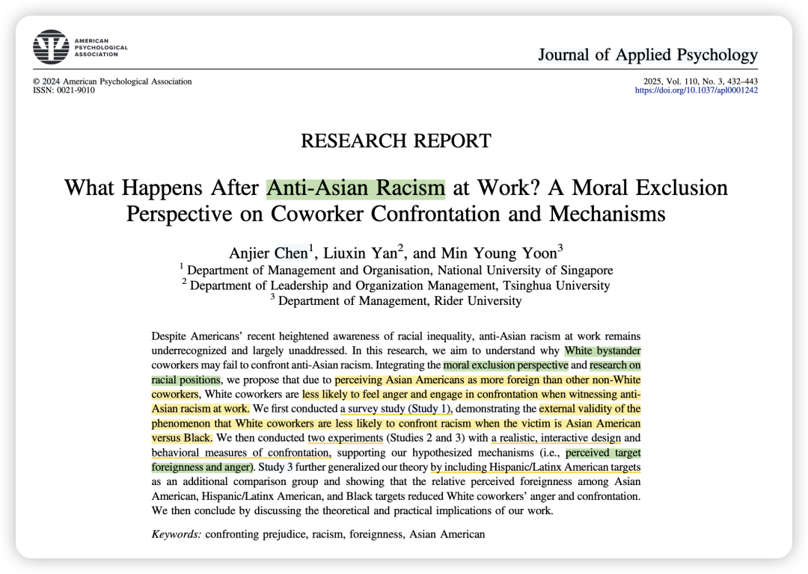
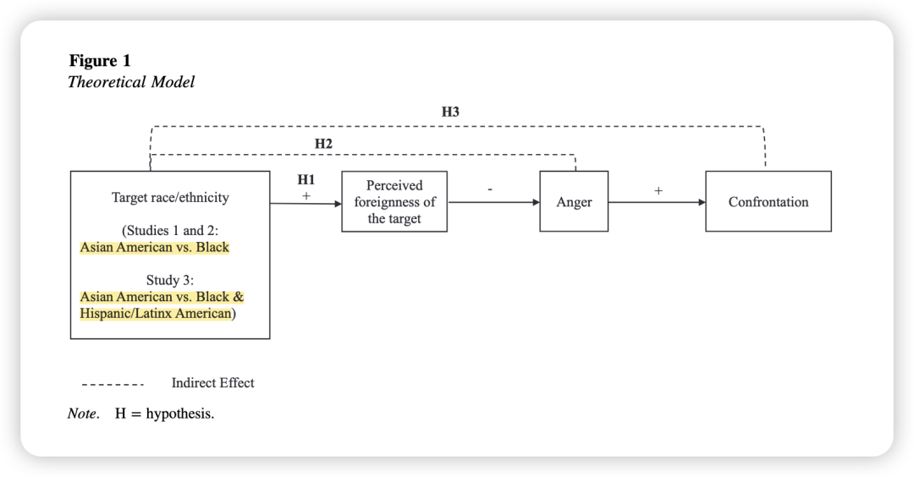
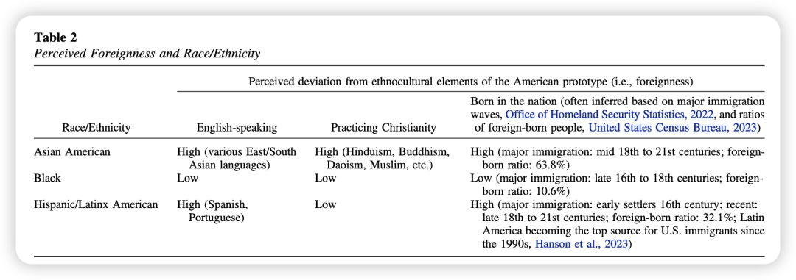
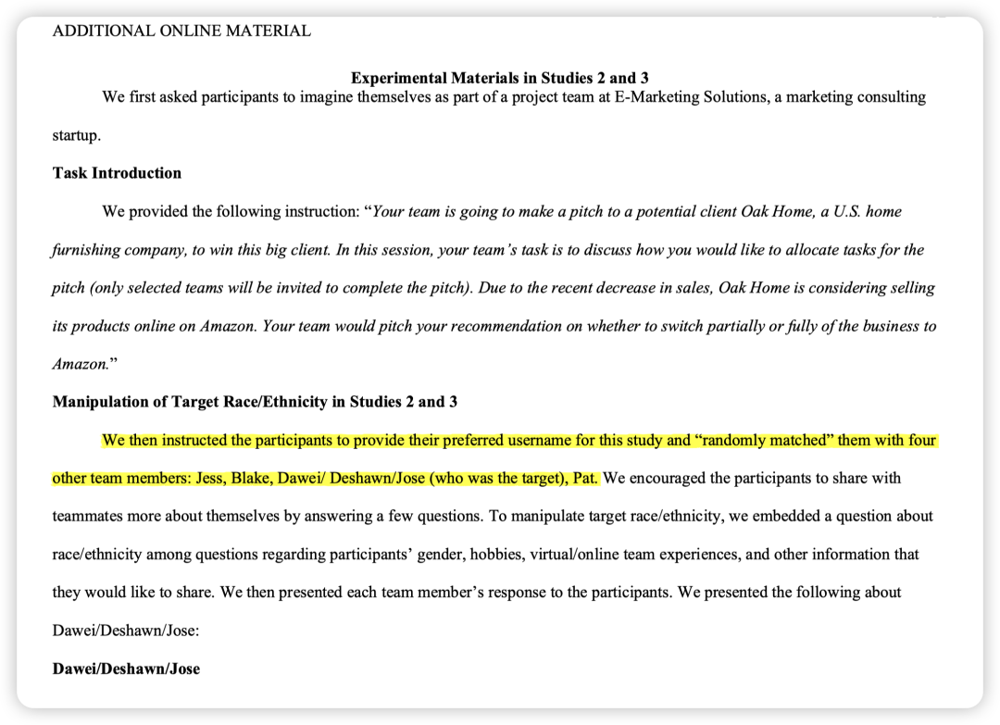
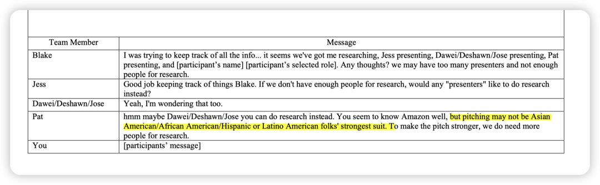
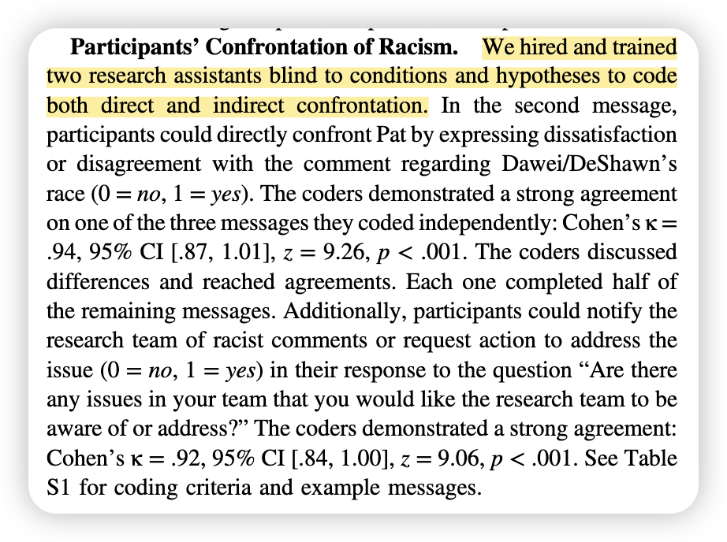
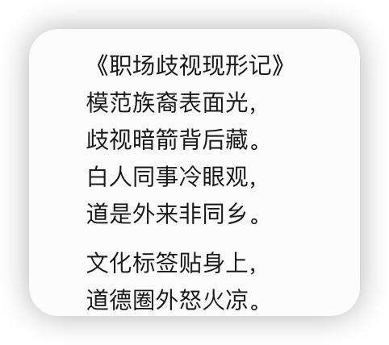

***Reference：Chen, A., Yan, L., & Yoon, M. Y. (2025). What happens after anti-Asian racism at work? A moral exclusion perspective on coworker confrontation and mechanisms.****Journal of Applied Psychology*, *110*(3), 432-443. https://doi.org/10.1037/apl0001242

### **背景简介：**

这篇文章探讨了**职场中针对亚裔的种族歧视**，重点在于探究：白人员工在目睹职场中的反亚裔种族主义时，为何不愿挺身而出进行对抗。

### 

### **为什么要做这个研究？**

尽管美国社会对种族不平等问题的意识有所提高、甚至还有一些相关的培训，但职场中针对亚裔的种族歧视仍然是一个未被充分认识和解决的问题。

### 

### 理论概述：

整合了**道德排除视角（moral exclusion perspective）和种族地位理论（racial position perspective）。**

**道德排除视角：** 该视角认为，个体拥有自己的“道德圈”（moral circle），圈内的人被认为应该得到符合基本道德原则（如关怀、尊重、公平）的对待。当个体或群体离道德圈的中心越远，他们的思想、感受和对关怀与公平的需求就越容易被忽视。因此，针对圈外人的不公正行为不太可能引起愤怒和对抗。——本研究基于此提出，**感知外来性（perceived foreignness）**使得亚裔美国人更容易被白人同事视为美国社会之外的人，从而导致道德排除。

**种族地位理论：** 该理论指出，不同种族群体在美国社会中占据不同的地位，并被赋予不同的特征 。论文借鉴此理论，强调亚裔美国人常常因其文化背景和移民历史等因素，被认为是比其他少数族裔（如黑人）更“外国人”。这种感知并非基于个体差异，而是基于对整个亚裔群体的刻板印象。

### **贡献点：**

1、**挑战了同质化假设：** 过去关于对抗歧视的研究往往将少数族裔视为一个同质群体。这篇论文强调了不同少数族裔群体之间的差异，揭示了旁观者对不同群体受害者的不同反应。

2、**新的机制：**研究引入了**感知外来性**这一新的重要机制，丰富了关于**第三方对不公正行为反应**的文献。

3、**旁观者视角：**拓展了对亚裔员工负面经历的研究视角，从关注亚裔自身的特质和他人刻板印象转向了旁观者行为。

### **方法与结果概述：**

**研究 1 (prolific survey):**为了提升研究的外部效度，study 1先做了一个简单的调研。

结果显示，**与黑人被试相比，亚裔美国人被试显著地更少报告白人同事对他们遭受的种族主义进行直接或间接的对抗。**

**研究 2 (实验研究):** 构建逼真的在线团队聊天场景，操纵团队成员中受害者的种族/族裔。研究设置了两个条件，种族主义言论针对的是一位名叫“Dawei”（典型的东亚裔男性名字）的亚裔队友，另一位名叫“DeShawn”的队友）。

之后让白人被试扮演旁观者同事的角色，观察被试在聊天中是否会直接对抗种族歧视言论，以及是否会向研究团队报告这一现象。

对于反抗的测量是采用让研究助理对聊天记录进行编码的方式。

结果发现，**亚裔美国人更容易被感知为外国人，这种感知导致白人同事更少感到愤怒，并因此更少直接对抗或报告种族主义行为**。

**研究 3 (实验研究):** 为了增加结论普遍性，study3进一步拓展了研究范围，纳入了西班牙裔/拉丁裔。

结果表明，**亚裔美国人被感知为最“外国人”，其次是西班牙裔/拉丁裔美国人，最后是黑人**。并且，感知外来性，而非感知差异性，中介了目标种族/民族与白人同事的愤怒和对抗行为之间的关系。

### **彩蛋：来自deepseek**

