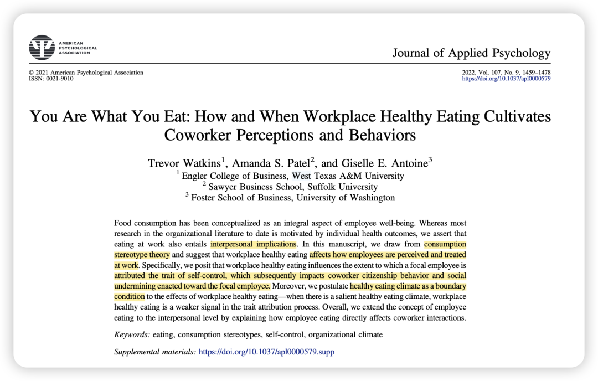
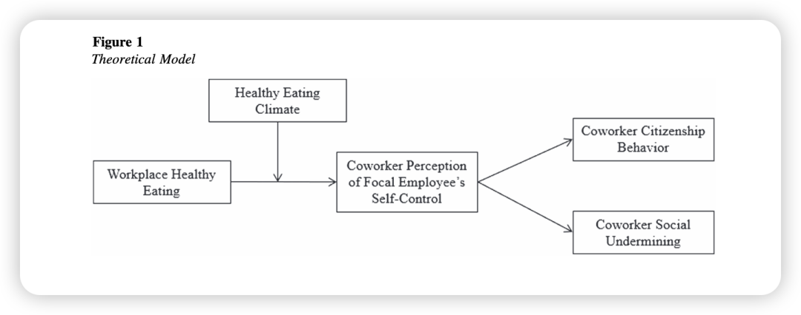
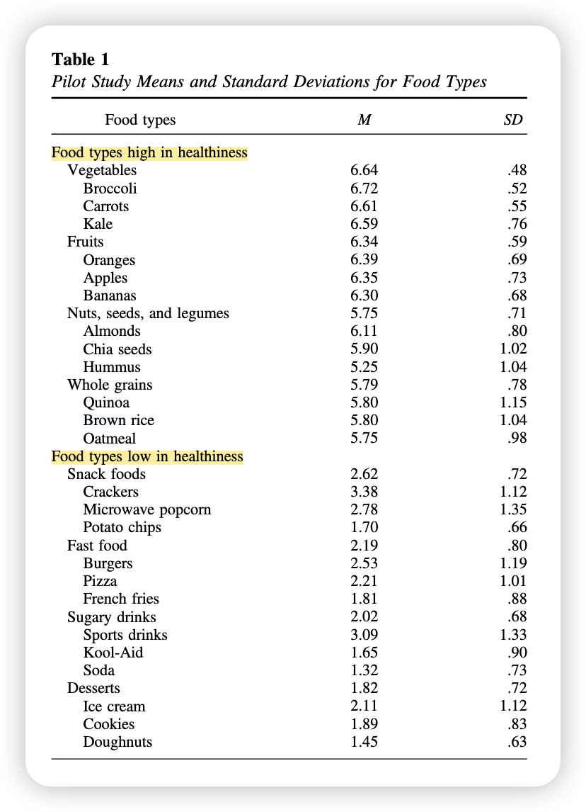
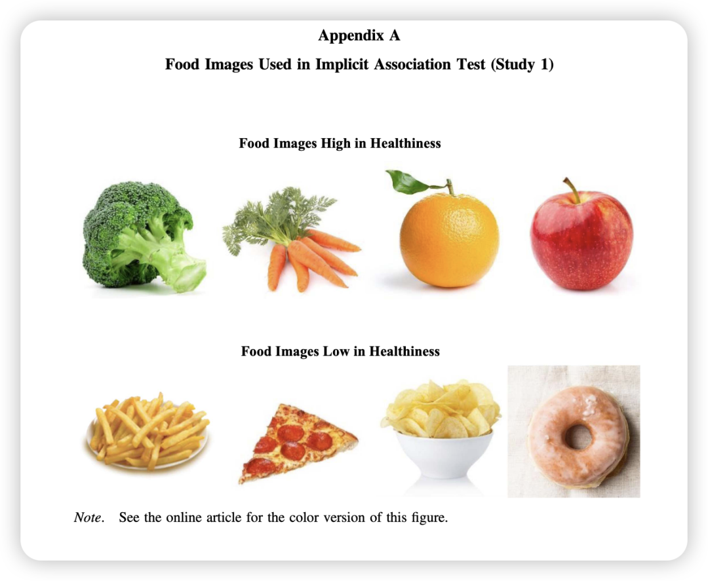
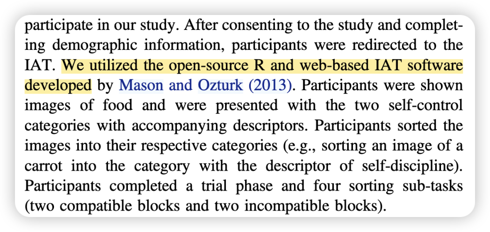
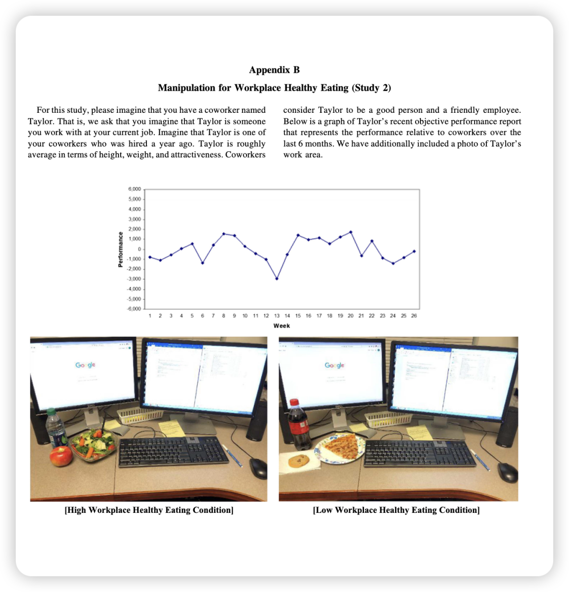
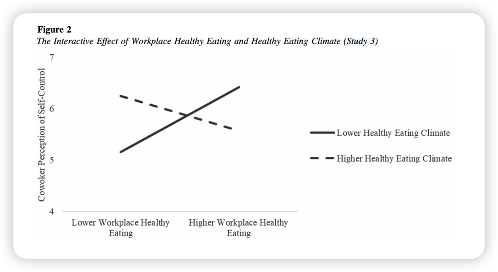
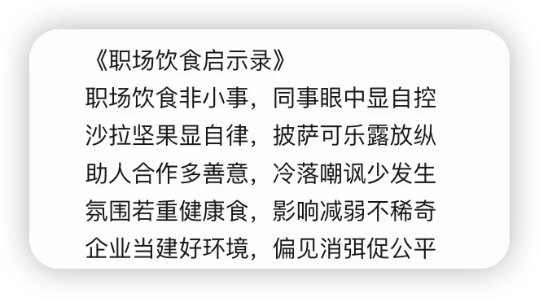
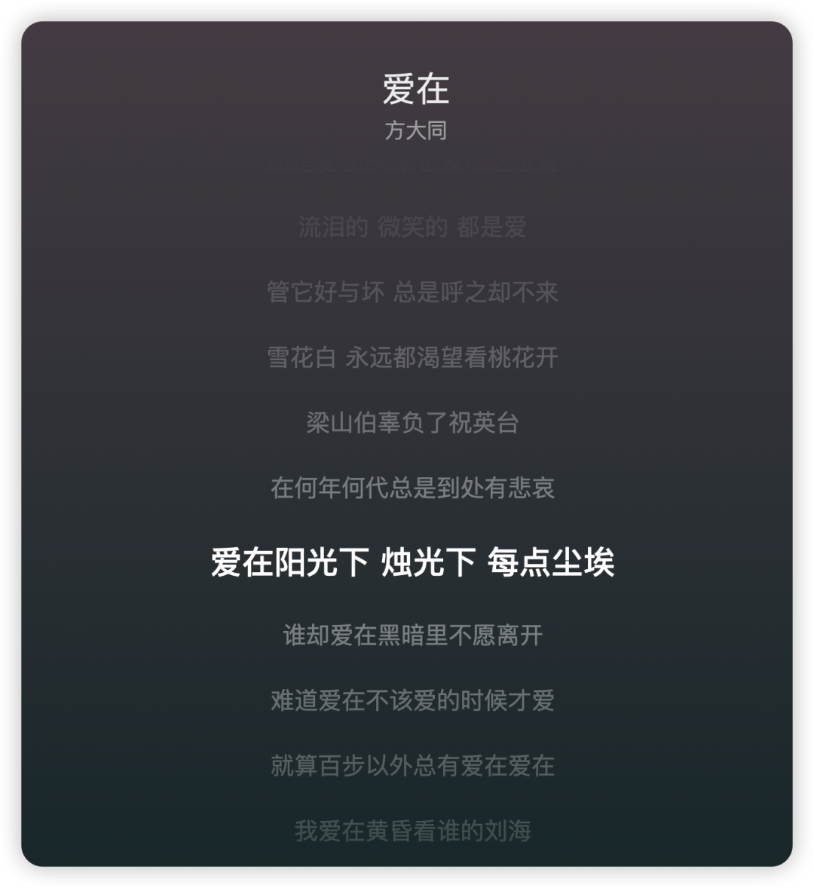

***Reference：***Watkins, T., Patel, A. S., & Antoine, G. E. (2022). You are what you eat: How and when workplace healthy eating cultivates coworker perceptions and behaviors. *Journal of Applied Psychology*, *107*(9), 1459–1478. https://doi.org/10.1037/apl0000579

### 

### **背景简介：**

### **你在办公室吃得健不健康，可能会悄悄影响同事对你的看法和行为。**

### **为什么要做这个研究？**

过去的研究主要关注饮食对员工个人健康和福祉的影响，较少有研究探讨员工饮食习惯对同事间互动和关系的影响。而饮食行为其实是一种社会行为，容易受到观察和评价。

### 理论概述：

**消费刻板印象理论 (Consumption Stereotype Theory)**：该理论认为，人们的食物选择带有象征意义，能够反映他们的生活理念、身份和性格特点 。

因此，同事会根据员工的饮食选择来推断其内在特质。

### **贡献点：**

**1、拓展了员工饮食的研究范围:** 将员工饮食行为的影响扩展到了同事互动与人际关系的层面。

**2、深化了消费刻板印象理论:** 将其应用到职场情境, 并指出情境因素(组织健康文化)对刻板印象的影响。

**3、扩展了自控力理论:** 解释了感知他人自控如何影响人际关系与行为。

**4、揭示了工作场所看似微不足道的健康饮食行为可能带来的社会后果。**

### **方法概述：**

**Pilot**：确定西方文化中普遍认可的健康和不健康的食物类型。

列出了营养丰富、不健康成分低的四类食物以及营养密度低、不健康成分高的四类食物，并通过对成年员工的调查验证了这些食物类型的健康程度。此外，他们还调查了人们实际的食物摄入情况，发现这八类食物涵盖了大部分人的饮食。

**研究1：** 内隐联想测验（IAT），检验个体在内隐层面是否将健康饮食与自控力联系起来。

p.s. 神奇，现在都已经有在线版IAT了…

**研究2：** 实验研究，操纵虚构员工工作场所照片中的午餐健康程度。

参与者看到一位虚构的同事“泰勒”的工作区域照片，照片中泰勒的午餐要么是健康的（水、苹果、沙拉），要么是不健康的（苏打水、饼干、披萨），测试参与者对员工自控力的感知和行为反应。

**研究3：** 现场研究，调查真实组织中员工的饮食习惯、健康饮食氛围、同事对员工自控力的感知以及同事行为。

### 

### **结果概述：**

**1、研究1：** 参与者更快地将健康食物的图片与“自律”、“勤奋”等高自控力的词语联系起来，而更慢地将不健康食物的图片与这些词语联系起来，这初步支持了健康饮食与自控力之间的内隐联系。

**2、研究2：** 看到同事吃健康午餐的参与者认为该同事更具有自控力，并且更有意愿向其提供帮助等亲社会行为，更少意愿对其进行社会排斥。

**3、研究3：** 健康饮食氛围显著调节了工作场所健康饮食对同事自控力认知的影响。在健康饮食氛围较弱的部门，员工的健康饮食更容易被同事认为是其自控力强的表现；而在健康饮食氛围较强的部门，这种联系则不显著。此外，健康饮食氛围还调节了工作场所健康饮食通过自控力认知对社会排斥行为的间接影响。

### **彩蛋：来自Deepseek…**

**写在后面的碎碎念：**

为了带来纯享版顶刊阅读体验，我还是把我的废话放到最后吧..

1、Trevor Watkins的研究一直都很有意思！可以再看看他在AMJ发的关于interpersonal capitalization的两篇文章！

2、有些人看到这个标题可能会觉得这种是毫无意义的研究。但其实仔细想想，这就是非常接地气的现实呈现。记得上次开会看到骏老师自带餐具（为了践行环保）、并说他一直都是这样的，我也真的会觉得，嗯这样的人做什么都会成功的！

在此也引用天才女友小张老师在方大同去世后写的话：

*“真正开始听R&B是从方大同的《面面》，初听觉得这样也能发首歌吗？就好像是疫情期间和歌迷连线，随便哼的几句小话。又想起来自己有时开心的时候也会编点歌唱唱，忍不住又听了几遍，竟然有点爱上了这种古灵精怪的感觉。即使做面、吃面这件小事，也可以带着热爱享受其中，我们每天科研做的其实也是面，努力研究做出美味食物的配方。”*

3、从另一个方面，这个话题看似平凡，但如果它成为一道博资考的题目“让你设计一个研究去探讨饮食和认知”之间的关系，你是否能马上想出这一系列环环相扣、又有点新意的研究设计呢。

春风一吹想起谁～ 最近这几天还是每天都在听方大同的歌、听讲他的播客，就好像他未曾离开。

用这样一篇轻松有趣、但读来津津有味、和他风格很像的文章再缅怀一下他。只要我们一直在听在哼唱，他就永远都在，在阳光下、烛光下每点尘埃～ （又唱起来了）

