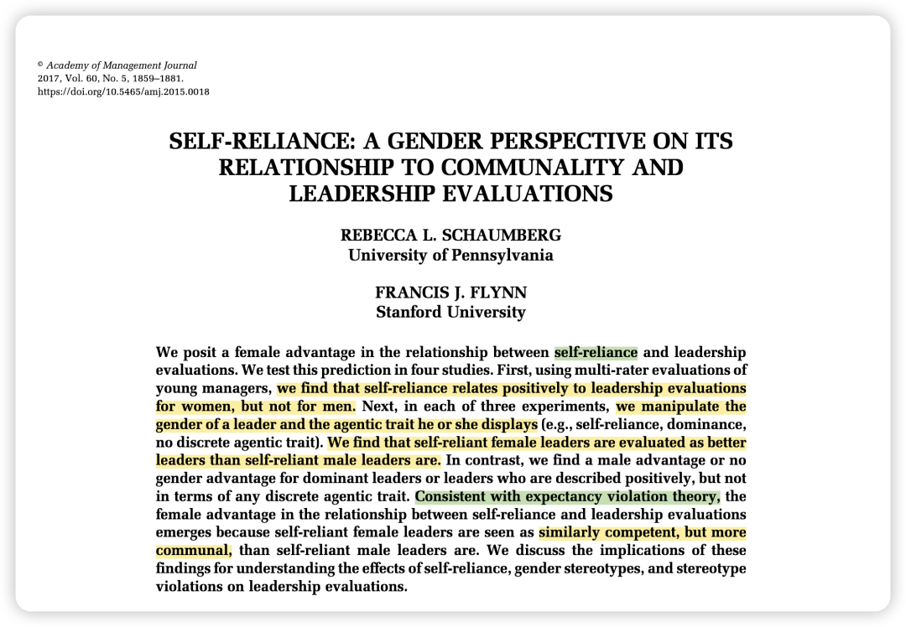
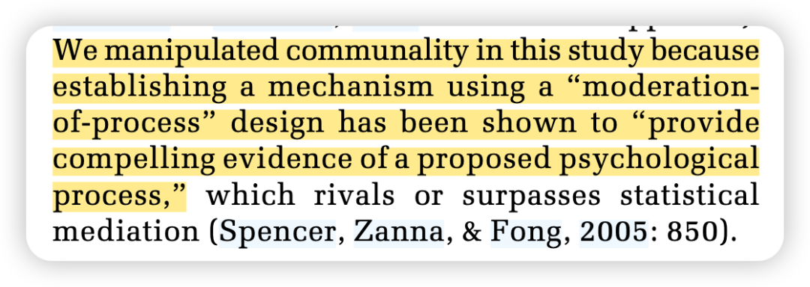
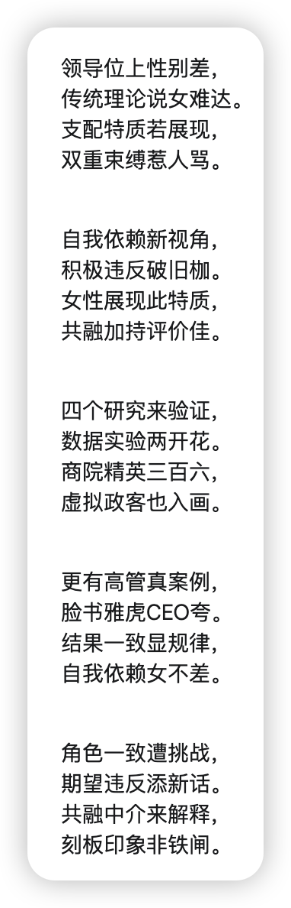

Reference：

Schaumberg, R. L., & Flynn, F. J. (2017). Self-reliance: A Gender Perspective on its Relationship to Communality and Leadership Evaluations. Academy of Management Journal, 60(5), 1859–1881. Scopus. https://doi.org/10.5465/amj.2015.0018

**写在前面的碎碎念：**

三八妇女节来临之际，发点和gender相关的好东西，祝愿我们都能成为独立自主的女性～

昨天又把IACMR第一期的女性发展讲座听了听，把周京老师分享的“**做第一个人，并守住阵地**”、胡佳老师分享的“不要说despite i am a woman, i persisted. 而是说 **because i am a women, i persisted**.” 记在了手帐本的第一页，希望能够伴随这些温柔坚韧的女性力量突破自己给自己设定的障碍，勇敢去奋斗！

寒假有一段时间思考人生的时候，我也突然陷入了科研的无意义感，总觉得自己做的东西也未必会被很多人看到，自娱自乐罢了。

这段时间我突然意识到，如果我否定了自己做这件事情的意义，我好像就否定了那些女性前辈的意义。 —— 可我坚定地认为她们所做的是有意义的。

不谈学术上的理论意义，仅仅是她们能让我这样一个茫茫人海中的女学生 因为她们精心设计的研究、分享的学术和人生经历而打动、从而选择继续向前一步，这就是很大的意义了。而且我相信她们影响的一定不只是我一个人。

所以最近越来越清晰地觉得：在未来，但凡有一个比我年轻的女性被我的研究、学术经历、人生故事所打动、而决定突破自己或社会给自己的性别枷锁去尝试未曾尝试的东西，那就我存在的很大意义！

（因为是早些年的文章，所以就不展开讲讲了，主要是呈现结论了～）

### **背景简介：**

过去普遍的观点认为**果断、自信、支配性和独立性**（agentic traits）是有效领导者的必备特质。然而过去人们倾向于认为这些特质更符合男性而非女性，因而导致了男性在领导力评价中占据优势。

然而现在的情况是否真是如此？

本篇论文提出，当自主性以**自力更生（self- reliance）**的形式表达时，可能会逆转男性在领导力评价中的优势。（self- reliance 定义解释：认同“我依靠自己，而不是他人来完成我想做的事情”等陈述，而不认同“别人常常需要告诉我该做什么”等陈述）。

### 

### **为什么要做这个研究？**

传统的**角色一致性理论（Role Congruity Theory）**认为，女性展现出与领导力相关的支配性特质（如强势、支配）时，会因为违反了性别刻板印象而受到负面评价，人们会认为她们缺乏共融性(communality），比如缺乏友善、合作。

而这篇论文基于**预期违背理论（expectancy violation theory）**提出，并非所有支配性特质都会导致负面评价。作者认为，自力更生对于女性领导者而言，是一种“积极的期望违反”（positive expectancy violation），进而会引发赞扬、产生积极结果。

### 

### **方法概述：**

共4个研究：

**研究1为横断面：** 使用了一组年轻管理者的360度评估数据（多源反馈、但是自变量是在DV的资料收集之后测的）。

**研究 2**、**研究 3** 和 **研究 4** 均为实验研究，通过不同的方式操纵领导者的性别和其所展现的自主性特质（比如通过阅读州议员的网页信息、阅读商业新闻、阅读科技公司高管的材料）。

值得注意的是在研究 3 中还操纵了community这个中介来检验假设。【让我想到了之前分享的这篇文章：[(转载) 读顶刊 | 2023 JESP - 操纵中介：为何/如何用调节统计来检验中介？](https://mp.weixin.qq.com/s?__biz=MzU1MzY1MjIxOQ==&mid=2247485168&idx=1&sn=96db6fd0733a00308708743ebb4b8a2f&scene=21#wechat_redirect)】

### **结果概述：**

自力更生这一自主性特质能够更显著地提升女性（而非男性）的领导力评价。

这种女性优势的出现是因为人们认为自力更生的女性比自力更生的男性更合群。

### 

### **彩蛋：**

