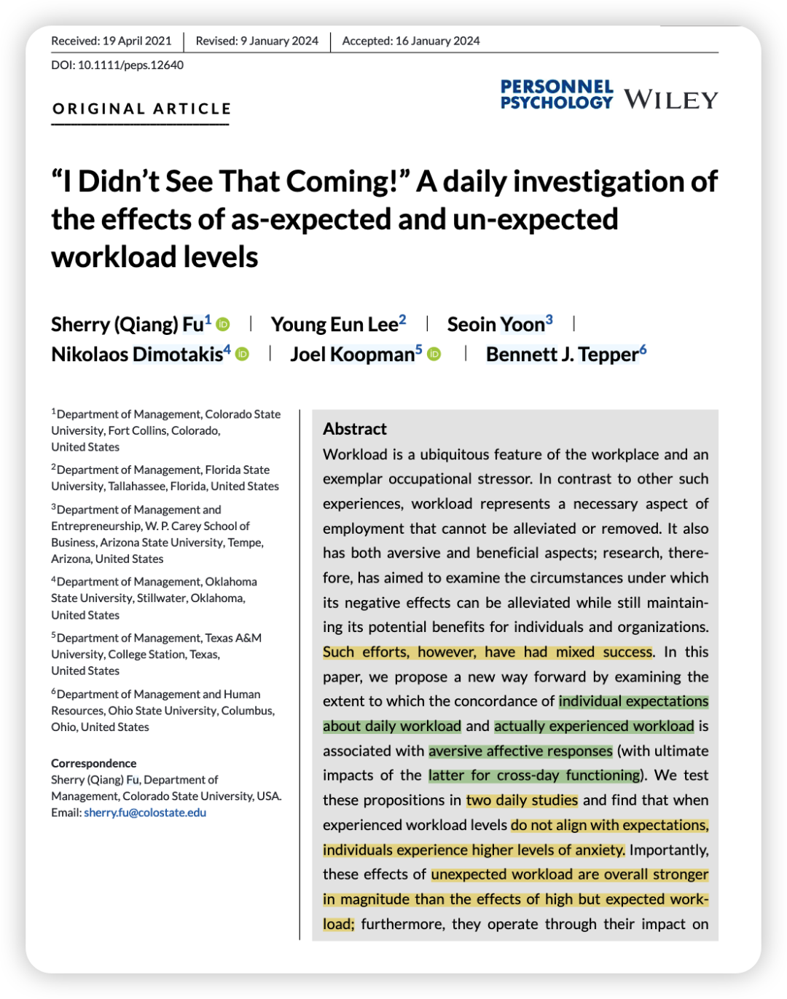
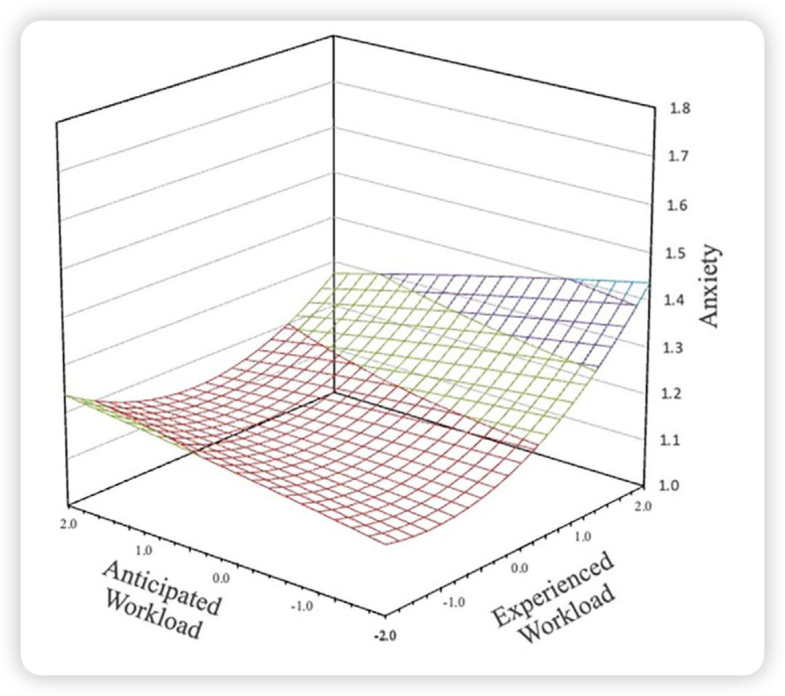
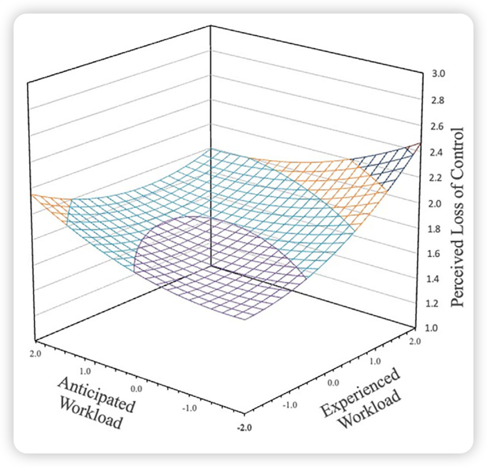
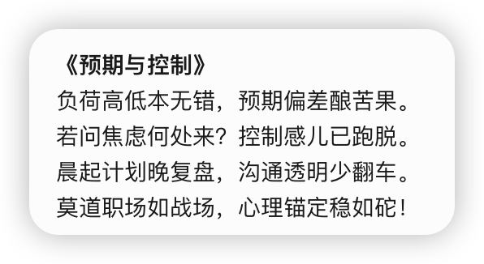
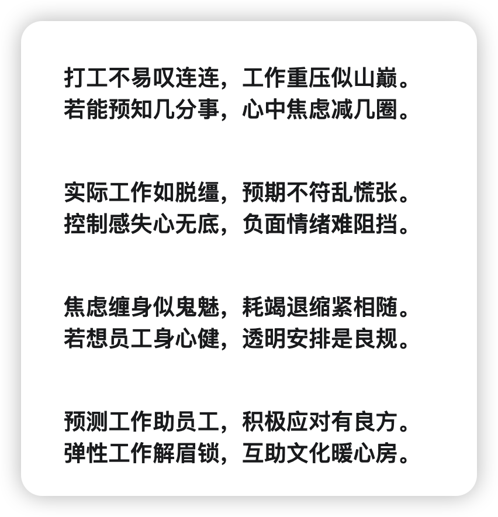

> Reference：Fu, S. (Qiang), Lee, Y. E., Yoon, S., Dimotakis, N., Koopman, J., & Tepper, B. J. (2024). “I Didn’t See That Coming!” A daily investigation of the effects of as‐expected and un‐expected workload levels. Personnel Psychology, 77(3), 1311–1341. https://doi.org/10.1111/peps.12640

**写在前面的碎碎念：**

1、实践意义很大的一篇。总之请领导们不要临时布置工作！就算要让员工加班，也得提前说一下让员工有个心理预期！

当然，即使有了心理预期，工作负荷如果大的话，还是会产生不利效果！

祝愿大家都少收到老板的飞来横“活”！

2、这篇文章虽然结合了两个理论，但这是少有的我看到两个理论连接很紧密，浑然天成的一篇。

### 

### **背景简介：**

职场工作负荷是典型的“双刃剑”压力源，既能引发焦虑，也可能带来成就感。

传统研究聚焦于降低负荷的负面影响，但效果有限。而本研究突破性地提出：**工作负荷是否符合预期**才是关键。

### 

### **为什么要做这个研究？**

目前研究将**应对工作负荷**视为简单的“刺激-反应”模式，而忽略了员工对工作量的“看法”。

作者想强调，员工并非**被动**承受工作负荷，而是通过**主动预判负荷水平**影响压力反应，突破传统“静态/动态负荷管理”视角。

### 

### 理论概述：

用了下面两个理论的结合：

**1、Transactional Stress Model**

**介绍初级评估（是否构成威胁）和次级评估（应对能力）的概念。过往关于工作负荷的研究都是关注次级评估的过程（即应对），而本研究则关注初级评估，探讨何时工作量会被视为威胁。**

**这个理论也有提及个人预期的作用，但并不完善，因此作者又引入了第二个理论。**

**2、Met Expectations Theory**

预期为个体提供认知“锚点”，实际体验偏离锚点时（尤其负面偏离），引发认知失调与情绪波动。

### 

### 研究假设

1、预期与实际工作负荷不一致（vs.一致）导致更高焦虑（H1）。

2、高于预期的工作负荷（vs.低于预期）引发更严重焦虑（H2）。

3、符合预期的高工作负荷（vs.低负荷）依然会增加焦虑（H3），并进而影响情绪衰竭（H5）。

4、预期不符通过焦虑间接影响次日情绪衰竭（H4）和工作退缩（H7）。

5、控制感（perceived loss of control）是中介机制（H6）。

### 

### **方法概述：**

Study 1，ESM，连续3周每日3次问卷，早上测**预期负荷，下班测实际负荷和焦虑，次日早晨测情绪衰竭；**Study 2，同Study 1，只是多测了一些机制变量。

分析采用响应面分析。

### 

### **结果概述：**

1、工作负荷高于或低于预期均导致更高焦虑（H1支持），但**高于预期的影响更显著**（H2支持）。

2、即使符合预期，高负荷仍比低负荷引发更高焦虑（H3支持）。

3、**控制感**部分中介预期不符对焦虑的影响（H6支持）。

4、焦虑进一步导致**次日情绪衰竭**（H4、H5支持）与**工作退缩**（H7支持）。

### 

### **彩蛋：来自Deepseek和Google AI Studio**

新学期**开启顶刊计划**，请大家一起监督——

（日更还是不可能的哈哈，毕竟我自己还有一些项目要推。最近准备一周至少发4篇！可以起床后先读一篇做做笔记，然后到中午或者下午再整理公众号发出。）

我会把文件pdf和文章中的补充材料发在我建的学术群里，懒得自己去下载的朋友可以加我的小号「wechat：Herstory0818 」拉你入群。

因为现在人满了200只能手动拉入 qwq；一般在吃饭或者摸鱼的时候集中处理下 请谅解哟 :)
