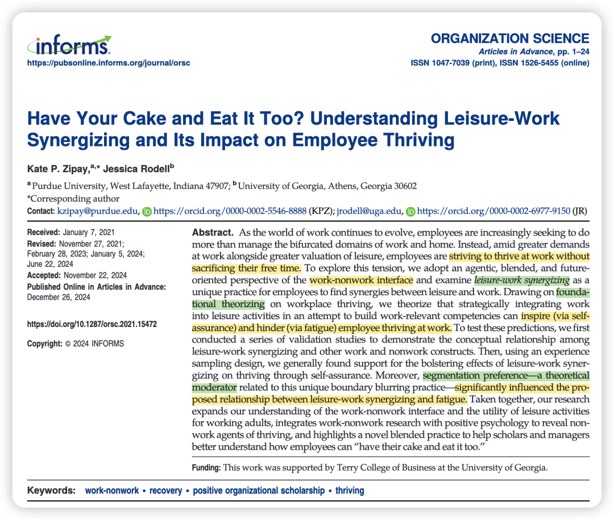
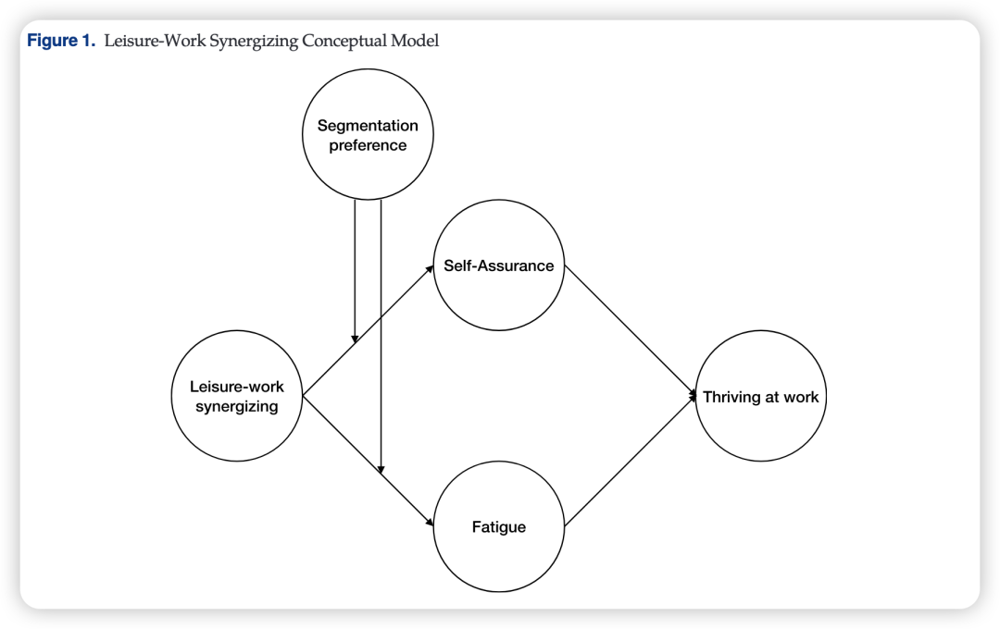
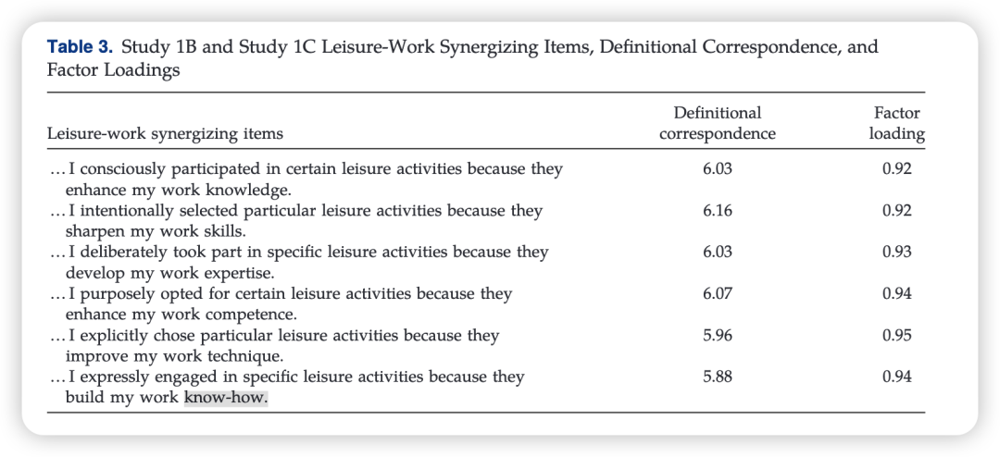
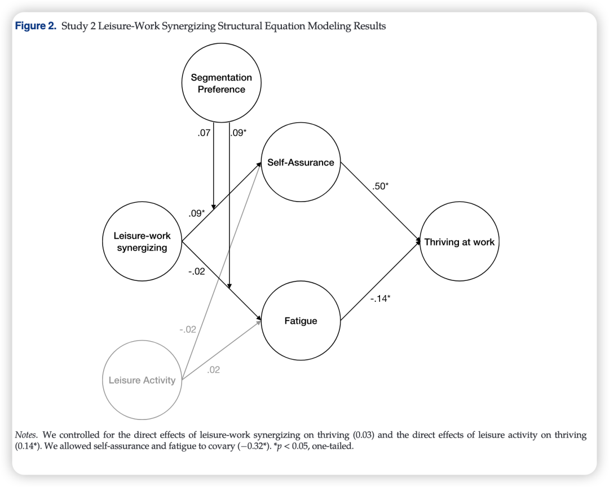
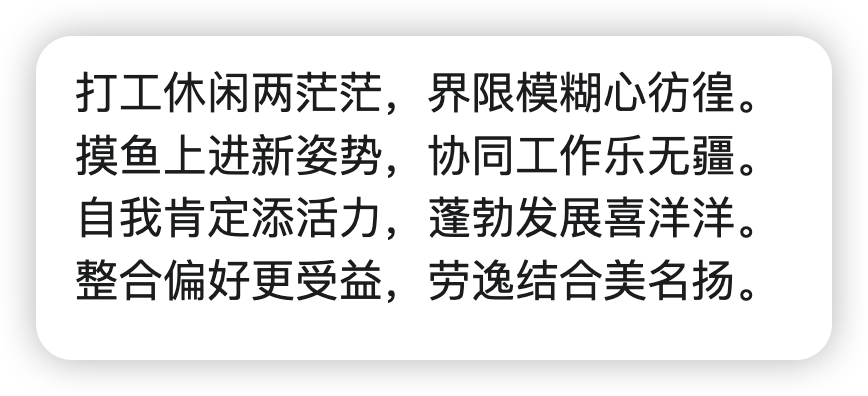

> **Reference：**Zipay, K. P., & Rodell, J. (2024). Have Your Cake and Eat It Too? Understanding Leisure-Work Synergizing and Its Impact on Employee Thriving. *Organization Science*. https://doi.org/10.1287/orsc.2021.15472

**写在前面的碎碎念：**

有点共鸣的一篇文章，毕竟作为科研人，leisure-work重合的部分还是很多的，比如我和zyy总是出门都带着电脑，觉得每天不打开敲几下都不完整了；比如我也会无聊的时候打开linkedin刷一刷，看看国外大家的科研动态；再比如打工人通勤路上会听的播客“生动早咖啡”，这些应该都算是**Leisure-Work Synergizing。**

确实，对我来说，能够保持Leisure-Work Synergizing活动的时候，我的工作状态会比较好；而有时候我看到学术内容都烦、把小红书上推送的学术帖都点“不感兴趣”的时候，一般我的科研就如同一潭死水了… —— 当然我觉得反向因果也成立！是一个正向循环过程！

### 

### **背景简介：**

随着工作环境演变，员工在追求职业发展的同时愈发重视休闲时间。**那么如何在不牺牲休闲时间的情况下，也能取得工作繁荣？**

传统研究多关注工作与生活的“分割”或“被动恢复”，而本文提出一种新型的“**休闲-工作协同（Leisure-Work Synergizing）**”方式，即员工在休闲活动中**主动**融入工作相关元素以提升技能，试图在享受休闲的同时促进工作繁荣（Thriving），如观看TED演讲提升领导力、阅读商业书籍拓展知识，其核心是**以未来为导向的主动行为**，而非被动恢复或补偿工作需求。

### **为什么要做这个研究？**

1、针对目前**理论**：现有工作-生活平衡理论要么将两者彻底分割，要么只强调“被动”的恢复，而忽视“主动”融合的可能性。

2、针对**现有研究缺口：**现有研究大多关注在工作时间融入休闲元素（例如，工作中的小憩、游戏化等），较少反过来关注在休闲时间融入工作元素。

**3、针对现实中的现象：**打工人"学习型摸鱼"现象缺乏科学解释。

**4、机制及结果不明：**这种策略何时会增强个体自信，何时会导致"24小时待机"的疲惫？需要探讨边界条件。

### 

### 理论概述与假设推导：

1、基于Spreitzer等人（2005）的蓬勃发展模型（thriving model），认为“休闲-工作协同”是一种自主行为（agentic behavior）。自主行为能够激发员工的蓬勃发展。并由这个理论推出，情感因素是重要的中介，因此引出本文的两个中介：self- assurance和fatigue。

**正向路径：Leisure-Work Synergizing通过增强员工的自信、自豪感（自我效能感），促进学习与活力（Thriving）。**

**负向路径：Leisure-Work Synergizing可能因模糊工作与休闲界限导致疲劳，削弱活力。**

2、调节变量的提出和前面这个模型没啥关系，作者直接借鉴了boundary theory (Ashforth et al. 2000)提出 Segmentation preference（分割偏好）在理论上是个重要的调节，

**分割偏好的调节作用：偏好整合工作与生活（低分割偏好）的员工更易从Leisure-Work Synergizing中获益（自我效能感更强、疲劳更低）。**

### **贡献点：**

**1、对于work-nonwork interface literature：提出Leisure-Work Synergizing作为主动的“混合实践”，挑战传统分割视角，揭示休闲活动可兼具恢复与技能发展的双重功能。**

2、对于**thriving literature**：挑战以往只关注工作相关的前因变量，引入了主动的非工作行为。

3、实践上：为打工人如何度过自己的休闲时间提供了启示。

### 

### **方法概述：**

**Study 1A-1C开发**Leisure-Work Synergizing量表，并进行信效度检验。共6题：

**Study 2**为ESM，特别的是，为了探索工作日和周末中都有可能存在的Leisure-Work Synergizing现象，这个ESM持续5周，每周收集两批数据（一批是周日晚上/周一早上下午；另一批是周四晚上/周五早上下午）。

### 

### **结果概述：**

1、主要支持“休闲-工作协同”通过→增强自我肯定感→来促进蓬勃发展的假设。

2、没有发现“休闲-工作协同”→疲劳的直接证据。

3、发现“分割偏好”对于下半条路径的调节作用：对于“整合者”，“休闲-工作协同”能减少疲劳；对于“分割者”，则没有显著影响。—— 大白话就是，Leisure-Work Synergizing这件事情，对于喜欢混着工作-休闲的人收益更大，而对于"下班勿扰"型员工效果打折扣。

另外，作者还测了leisure activity，发现无法达到Leisure-Work Synergizing的效果，也就是不是所有的leisure activities都能“获得资源”、进而促进工作繁荣。（这也显示出COR理论对于解释work-nonwork spillover上的粗糙）

### 

### **彩蛋：来自Deepseek和Google AI Studio**

新学期开启**日更计划**，请大家一起监督——

我会把文件pdf和文章中的补充材料发在我建的学术群里，懒得自己去下载的朋友可以加我的小号（wechat：Herstory0818）拉你入群。

（因为现在人满了200只能手动拉入 qwq；一般在吃饭或者摸鱼的时候集中处理下 请谅解）
