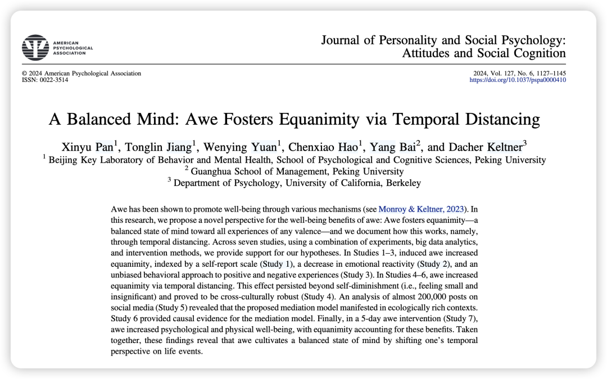
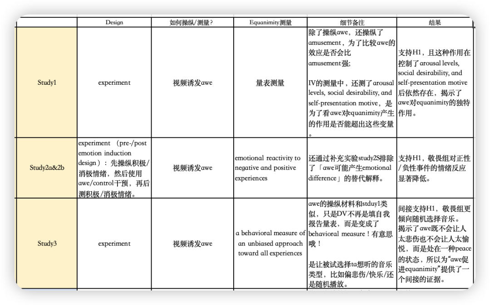
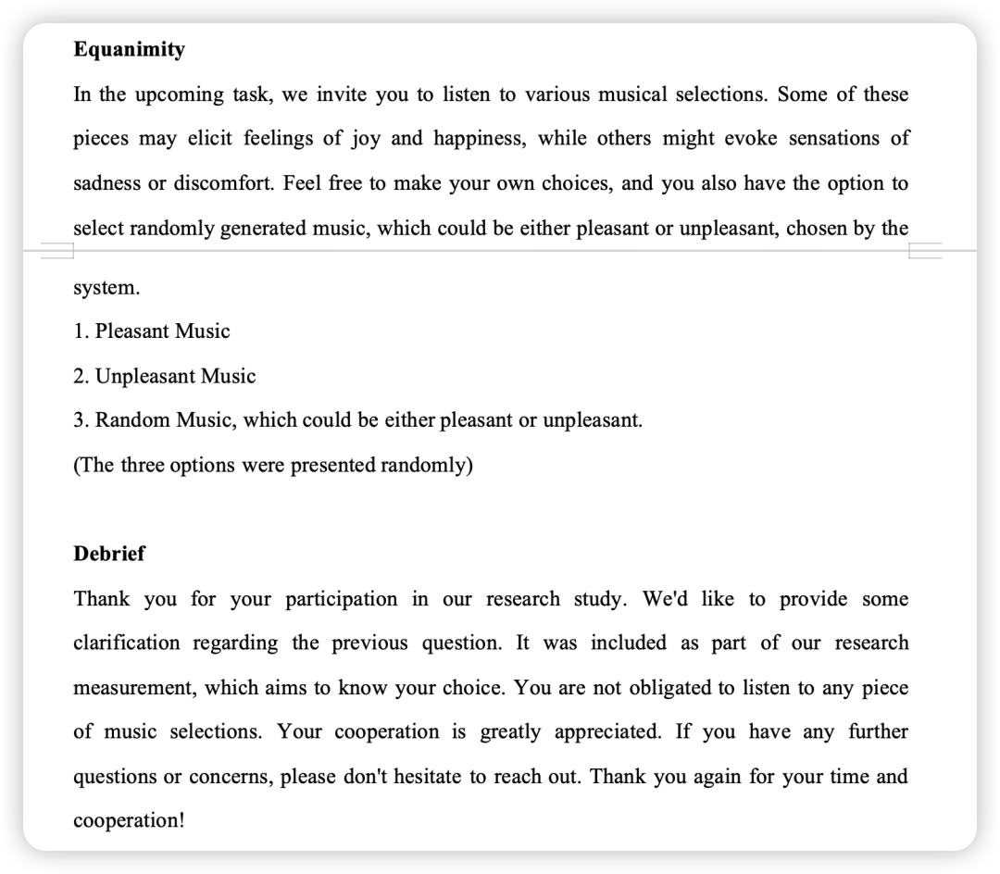
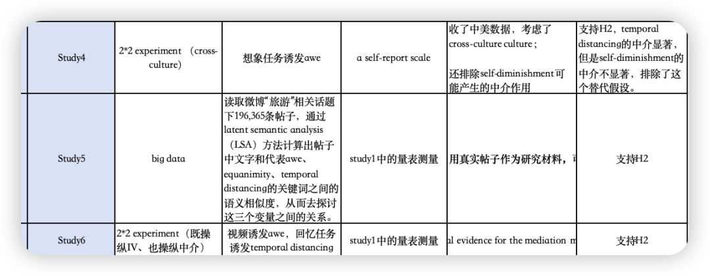
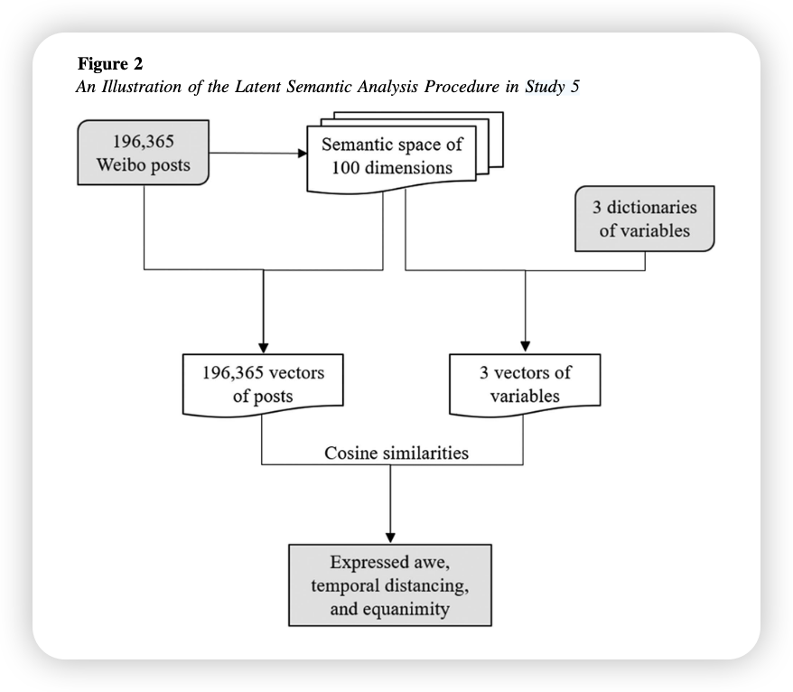
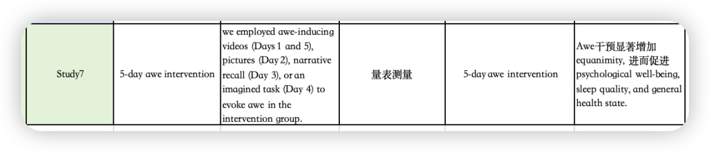
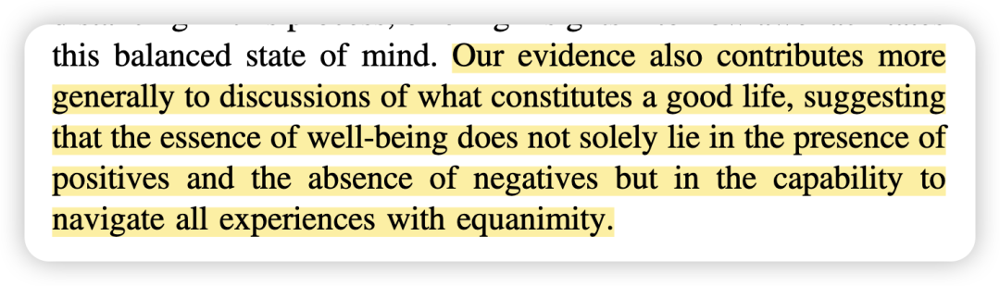
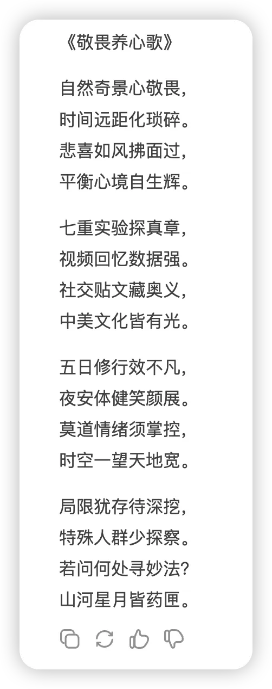

***Reference：Pan, X., Jiang, T., Yuan, W., Hao, C., Bai, Y., & Keltner, D. (2024). A balanced mind: Awe fosters equanimity via temporal distancing.***Journal of Personality and Social Psychology*, *127*(6), 1127–1145. https://doi.org/10.1037/pspa0000410*

**写在前面的碎碎念：**

1、又是我喜欢的Jiang Lab的文章！ 每次读着她们组的文章都会觉得，社心研究者真的在好好思考如何让人更幸福，并用环环相扣的系列研究来检验假设，这真是兼具了浪漫与严谨。

本科的时候我就是读了姜老师在JPSP上的文章才开始感受到了应用心理学之美（毕竟之前都在基础心理学里痛苦挣扎），后来又读了荷心那篇“建立自己的科研坐标系”的采访文章，那是我读到的第一篇「不那么“上纲上线”让大家去追逐时事热点、而是让学者们跟随自己的兴趣、用科学研究来回答自己内心的问题、从而建立自己的identity」的文章，如今再读也还是会有所启发。

这些年来Jiang Lab的文章也真的一直在围绕awe/nostalgia/自我/人生意义等话题，也在各大社心Top Journal上频繁打卡。这样按照自己的passion去努力、最终结果也非常突出的“herstory”真的很鼓舞人心！

2、回到文章本身：比较这篇文章和我经常读的OB文章，我觉得最大的不同是，OB对理论的要求还是巨高的，很多推理必须从theory中来，而不能只靠以往的实证研究。而这篇文章更多的是用过往的研究结论来推出假设，再用多种混合方法研究来提升结论的可信度。

在上研究生课程的时候我也去汇报了一些psychology方向的文章，发现它们的intro都很短，基本上也没太多理论的推导过程，而方法的稳健型才是重要的。所以这可能是我目前觉得OB和psychology很大的一个差别。

### 

### **背景简介：**

过往关于敬畏（awe）相关的研究大多集中在两个方面：

- **增强积极性：**敬畏感可以提升积极情绪、促进社交联系和亲社会行为等。

- **减少消极性：**敬畏感可以缓解压力、减轻社交痛苦等。

然而作者开篇就指出，这样的二元视角（binary approach）可能无法完全捕捉awe对幸福感的益处。

我的感受也是这样，如果一味追求positivity，就会有一种“狂打鸡血”的矫枉过正。同样，一味避免negativity，也会导致情感失调。—— 对我来说，“让万物穿过自己”就是最好的状态。

### **为什么要做这个研究？**

不同于以往的二元视角，平和（equanimity）作为一种对所有经历（积极、消极或中性）都保持平衡和客观的心态，对于幸福感至关重要。

因此这篇文章用多种研究方法来探讨：敬畏是否能促进平和，并探讨时间距离 （temporal distancing）的中介作用，还进一步探讨了敬畏促进平和的downstream effect：是否会影响身心幸福。

### **方法概述：**

研究1-3验证H1 （awe fosters equanimity），用了三种不同的测量平和的方式，且排除了其他可能的替代假设。

敬畏的操纵视频截图（来自作者公开的OSF材料中 大家可以找来视频去操纵一下自己哈哈）

study 3中对于平和的behavioral measure真有意思！

研究4-6验证H2（时间距离的中介作用），用了跨国样本、大数据分析、同时操纵IV和中介的实验等方法。

Big data研究示意图：

最后研究7是一个5天的干预，把结论进一步延伸到对psychological and physical well-being的downstream effects。

作者也在OSF里面给出了每天干预的内容，包括通过视频、回忆、想象等操纵材料，真的可以每天试试看呢！

### **结果概述：**

敬畏感通过促进时间距离的产生，增加平和，进而促进心理和生理健康。

在intro的最后，作者写到：

“幸福的本质，并不仅仅在于去追求积极、或者避免消极，而在于能够有能力对于一切经历都报以平和的心态。”

这真的也是我一直追求的状态，允许一切发生，让万物穿过自己！

就如《加缪手记》写的那样：

“我并不期待人生可以过得很顺利，但我希望碰到人生难关的时候，自己可以是它的对手。”

祝愿大家都能多多感受敬畏，常常拥抱平和～

### 

### **彩蛋：来自Deepseek**

新学期**开启顶刊计划**，请大家一起监督——

（日更还是不可能的哈哈，毕竟我自己还有一些项目要推。最近准备一周至少发4篇！可以起床后先读一篇做做笔记，然后到中午或者下午再整理公众号发出。）

我会把文件pdf和文章中的补充材料发在我建的学术群里，懒得自己去下载的朋友可以加我的小号「wechat：Herstory0818 」拉你入群。

因为现在人满了200只能手动拉入 qwq；一般在吃饭或者摸鱼的时候集中处理下 请谅解哟 :)
