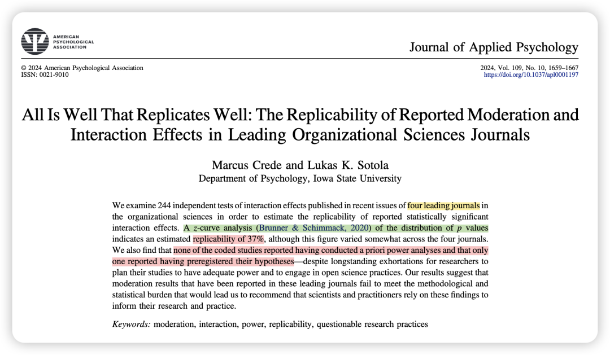
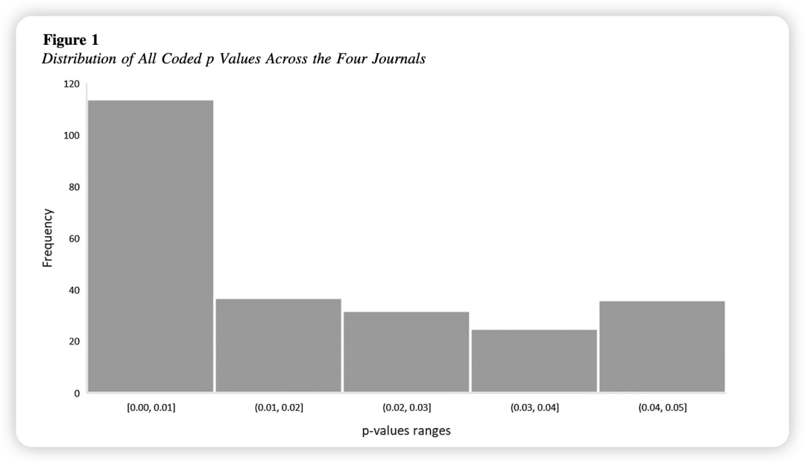
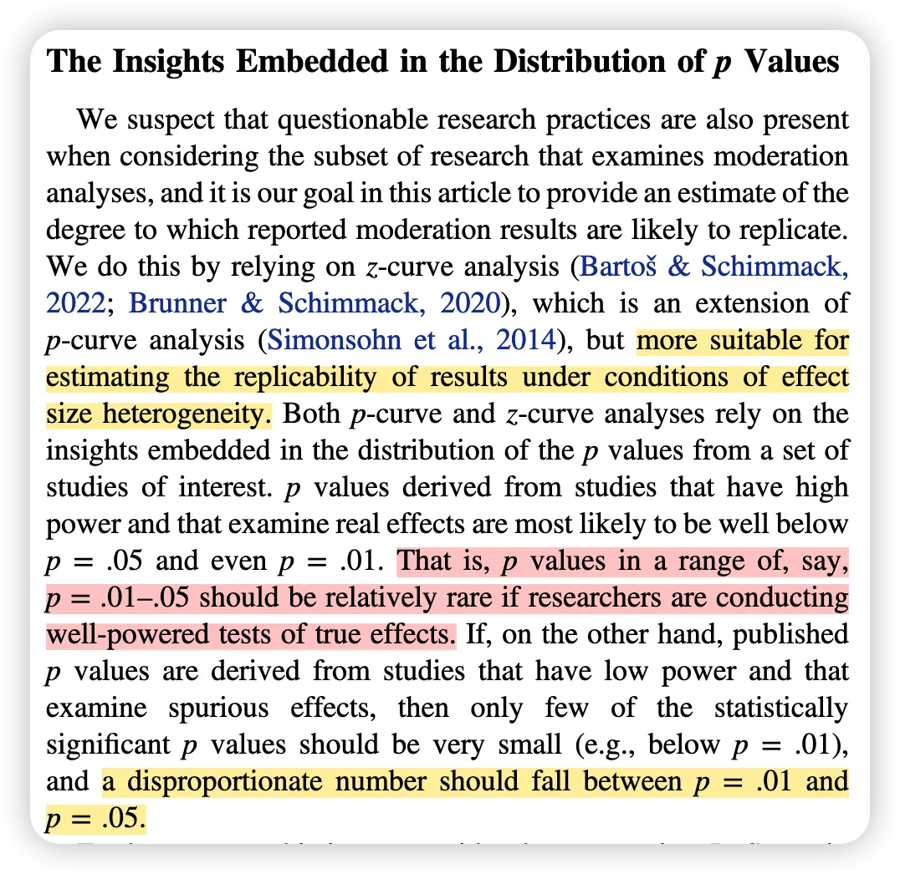
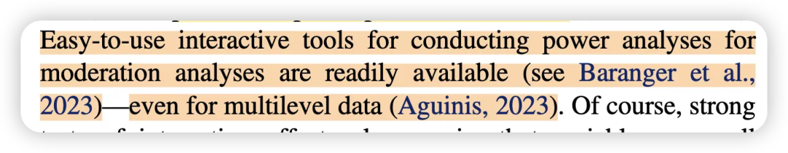
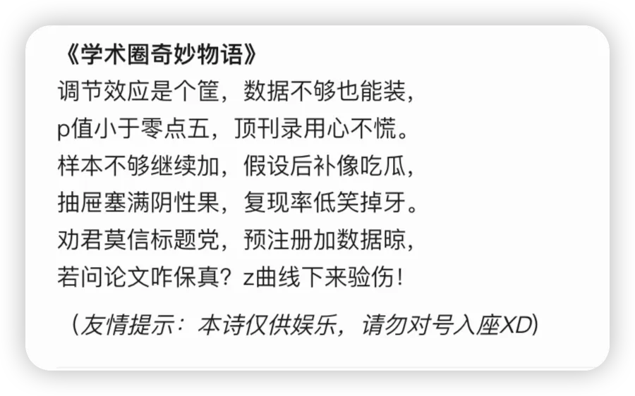

**写在前面的碎碎念：**

一篇让研究者能够**不忘初心、保持严谨**做研究的文章，Intro部分列出的很多过去研究的例子都值得一品，甚至有些触目惊心。印象深刻的是“破茧成蝶现象” —— 说的是研究者发现，把博士毕业论文改成期刊发表后，会出现p值突然显著/样本突然变大/数据突然删除等一系列情况。这种你以为别人不会发现、但确实有研究者就在盯着这些现象。

所以，不要去骗别人，因为总有办法发现的。

当然最重要的是，别骗自己。

### **背景简介：**

在组织科学领域，调节与交互效应的研究对于理解复杂的组织现象至关重要。这些研究试图揭示不同变量之间的关系如何受到其他因素的影响，从而为理论发展和实践应用提供更深入的见解。

然而，这些已发表结果的可重复性究竟如何？它们是否经得起进一步验证？

### 

### **方法概述：**

研究者在JAP、JOM、JOB、PPsych这四本期刊中检索了相关文献，共纳入了 244 项交互效应检验。随后，研究人员对这些研究进行编码，提取了 p 值、样本量、以及是否进行了power分析和预注册等信息。

最后，研究人员运用 z-curve 分析（这是一种基于已发表 p 值分布的元分析方法），计算了以下指标：

- **预期可重复率（ERR）：研究复现成功的概率。**

- **预期发现率（EDR）：基于平均功效的显著结果比例。**

- **Soric错误发现率（FDR）：假阳性结果的最大比例。**

- **文件抽屉比率：未发表的阴性结果与已发表阳性结果的比例。**

### 

### **结果概述：**

### 

**1. P 值分布异常：**

研究发现，大部分 p 值都集中在 0.01 到 0.05 之间，这与预期的高Power研究结果的 p 值分布不符。

根据前文作者所述，理论上来说power高的研究的p值应该小于0.01，所以当你尝试把p=0.08的研究操纵为0.05，其实这种p-hacking是很明显的。

2. 已发表研究的**可重复性估计值（ERR）较低，平均约为 37%**，表明多数调节效应研究难以复现。

**3. 虚假发现率（FDR）为41%，提示近半数显著结果可能是假阳性。**

**4. 文件抽屉比率高达7.82，即每发表1项显著结果，约8项阴性结果未被发表。**

**5. 几乎没有研究在研究前进行过Power分析或预先注册研究假设，表明组织科学领域在提高研究透明度和严谨性方面还有很大的改进空间。**

（但我觉得这两年看的顶刊文章很多都已经有了预注册和power analysis）

### 研究建议

### 

**【对期刊编辑】**

1、鼓励作者预先注册研究假设。

2、鼓励作者进行Power Analysis，确保样本量足够。

3、预注册报告也可以成为一种论文提交形式。

4、拥抱对于之前研究的重复研究。

**【对科研人员】**

1、在研究前进行预注册和Power Analysis。作者也推荐了power analysis的工具：

1. Baranger, D. A. A., Finsaas, M. C., Goldstein, B. L., Vize, C. E., Lynam, D. R., & Olino, T. M. (2023). Tutorial: Power analyses for interaction effects in cross-sectional regressions. Advances in Methods and Practices in Psychological Science, 6(3). https://doi.org/10.1177/25152459231187531

2. Aguinis, H. (2023, November 1). ML power tool. https://hermanaguinis.co m/crosslevel.html

2、避免采用可疑研究实践（questionable research practices：比如选择性报告结果、事后构建假设HARKing等、p-hacking等），提高研究的透明度和严谨性。

### **彩蛋：前者来自Deepseek 后者来自Google AI Studio**

新学期开启**日更计划**，请大家一起监督——

我会把文件pdf和文章中的补充材料发在我建的学术群里，懒得自己去下载的朋友可以加我的小号（wechat：Herstory0818）拉你入群。

（因为现在人满了200只能手动拉入 qwq；一般在吃饭或者摸鱼的时候集中处理下 请谅解）
