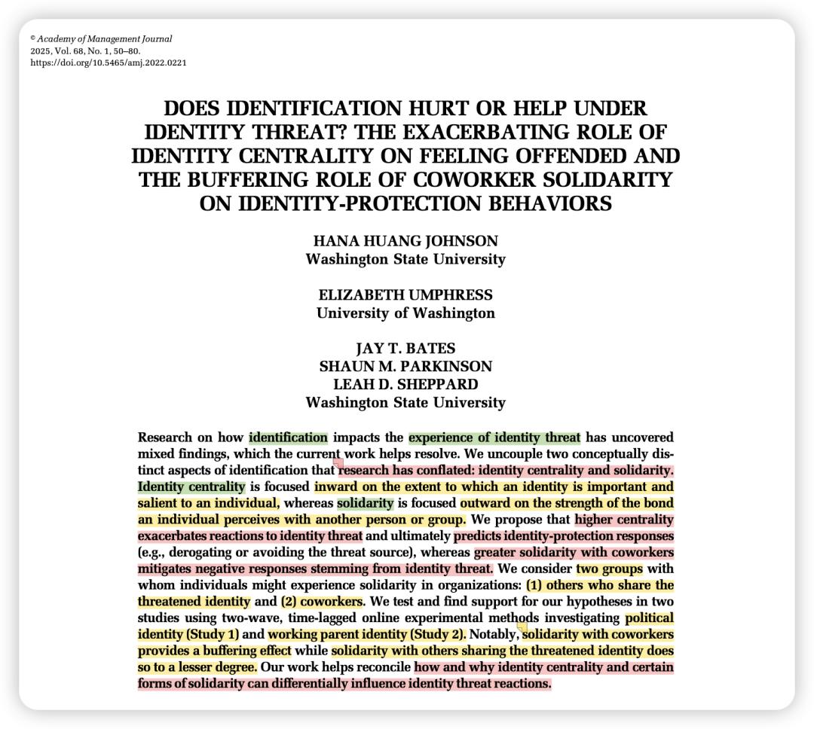

写在前面的碎碎念：

非常值得模仿写作的一篇！

Introduction第一段就零帧起手，告诉我们目前研究存在的不足是什么：

“As such, we are left with a puzzling picture of how and why identification influences reactions to identity threat.”

之后作者就一直围绕着如何“solving this puzzle”展开论述，包括解释目前研究结果出现混乱的原因可能是什么、如何用CMR理论来推导出核心的调节变量等。

### 背景简介：

### 组织中的员工拥有多元化的身份，这些身份可能受到各种威胁，导致负面情绪和行为反应。当个体感知到某一身份的价值、意义或其所代表的行为方式受到潜在损害时，就会产生身份威胁。

### 

### 为什么要做这个研究？

1. 针对上述身份威胁的情况，身份认同（identification）可能是一个重要的调节。然而过往研究中，它有时是加剧了身份威胁、有时又是缓解了身份威胁。

—— 因而目前存在混乱的结果。

2. identification研究主要包括2种，分别是identity centrality和identity solidarity。

-identity centrality（身份中心性）：指某个身份对个人自我定义的重要性。这是一个向内的焦点。

-identity solidarity（团结）：指个人感知到的与他人或群体的联系强度。这是一个向外的焦点。

而这两者产生的作用也不同，比如identity solidarity在以前的研究中往往更多扮演缓冲的作用（也就是团结这种identity比较好！）。

—— 因而作者认为，区分清楚这两者对于身份威胁扮演的不同作用，是“solving the puzzle”的关键。

3. 从获得identification的来源上说，这可能会来自不同的人群。

比如你既可以从那些跟你共享威胁性身份的人那里获得（比如同为亚裔女性的人），也可以从那些虽然没有共享威胁性身份、但是与你相似的人那里获得（比如你的同事）。

—— 因而作者认为，需要通过研究来区分不同identification来源所产生的不同作用。这样就可以去回答：来自同事的团结是否比来自“同类人”的团结更有效？

所以文章是测了两个solitary来源的：

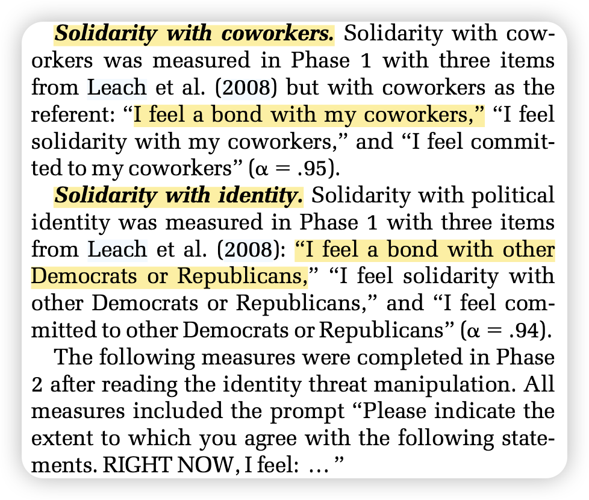

理论视角：

1. **认知-动机-关系情绪理论 (Cognitive-Motivational-Relational Theory of Emotions, CMR)** ：CMR 理论由 Lazarus 提出，主要用于解释压力、情绪和应对之间的关系。该理论认为，个体对环境中的事件进行评估（appraisal），这个评估过程决定了他们会产生什么样的情绪，以及如何应对。

Primary appraisal process：个体评估事件与自身福祉的关系。具体来说，就是评估事件是否对自己构成威胁、挑战或利益。如果个体认为事件与自己无关紧要，就不会产生强烈的情绪反应。如果认为事件对自己有潜在的危害，就会产生负面情绪。—— 这个可以推导模型的前半段。

Secondary appraisal process： 个体评估自己应对威胁或挑战的能力和资源。这包括评估自己是否有能力控制局面、改变现状、获得支持等等。次要评估会影响个体选择什么样的应对策略。—— 这个可以推导模型的后半段。

该理论还提出，拥有高身份中心性的个体（相比于拥有低身份中心性的个体）因更重视威胁事件（primary appraisal），更可能产生消极情绪。 —— 这个可以推导调节作用。

2. 那么这个model的结果变量的3个是怎么定下来的呢？ 作者是借鉴了Petriglieri (2011) 在AMR上的理论文章，这篇文章讲述了个体在面对身份威胁时可能会进行身份保护，进而产生3种行为，包括：

- **贬低 (Derogation):** 通过批评或贬低威胁来源来维护自己的身份。
- **积极区分 (Positive Distinctiveness):** 通过强调自己身份的积极方面来提升身份价值。
- **回避 (Avoidance):** 通过避免与威胁来源互动来减少负面情绪。

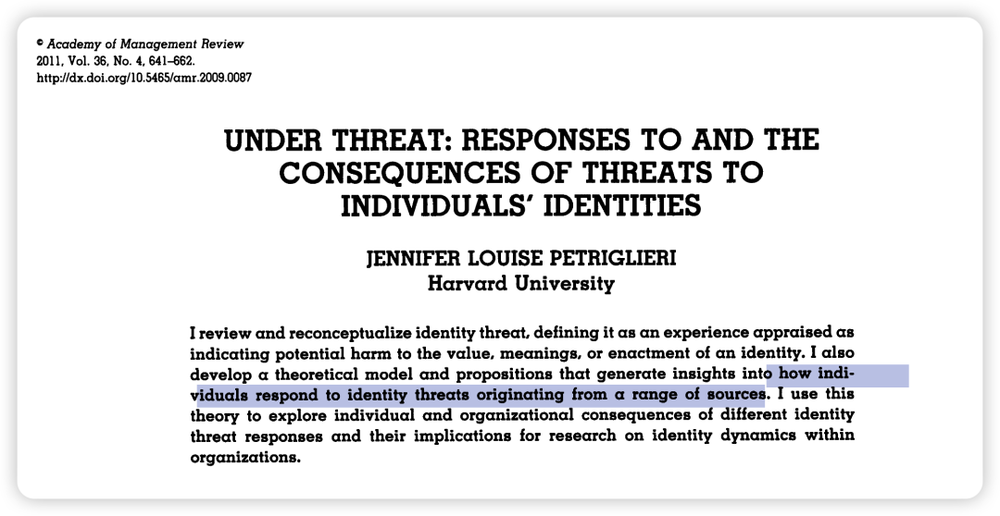

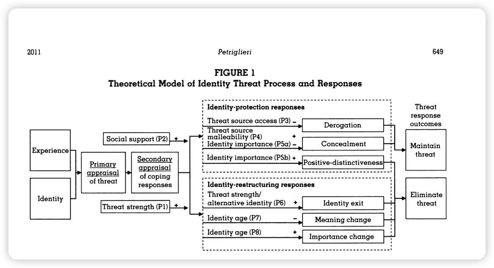

方法概述：

两个two-wave experimental study：

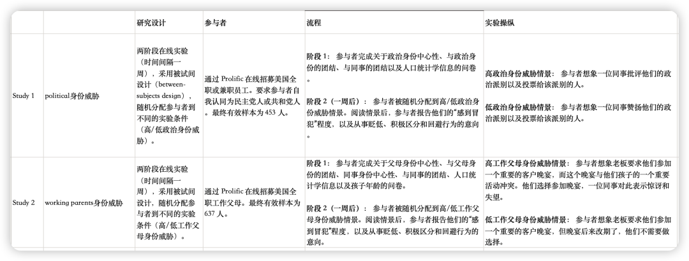

操纵材料示例：

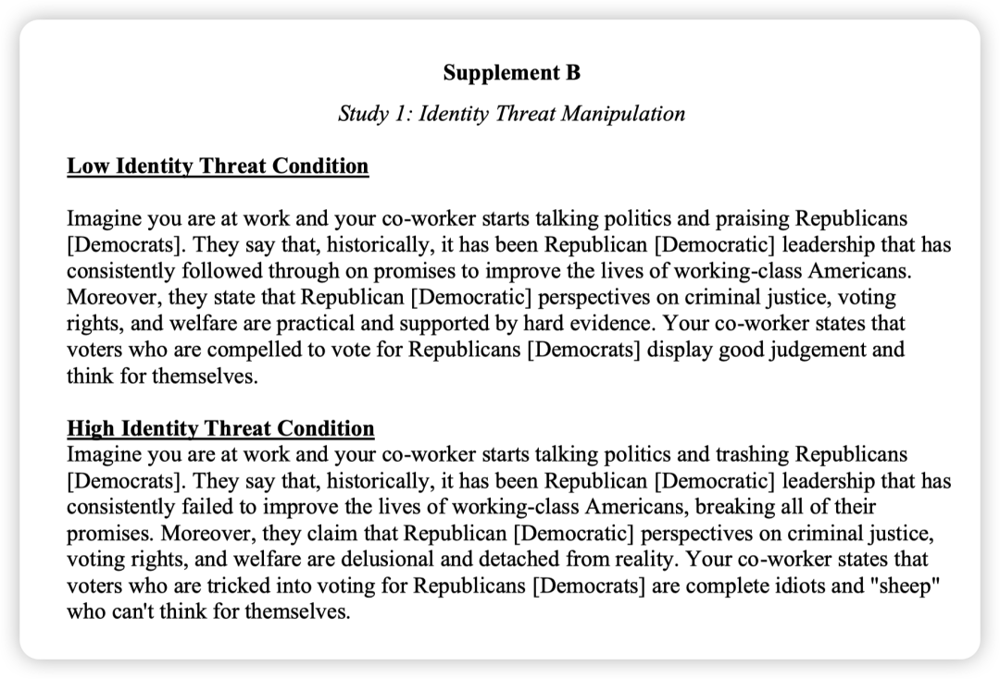

### 结果概述：

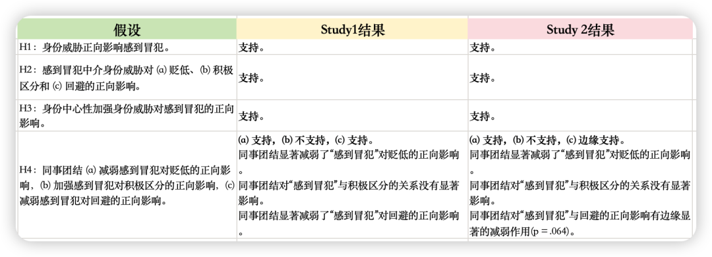

两个研究的路径系数：

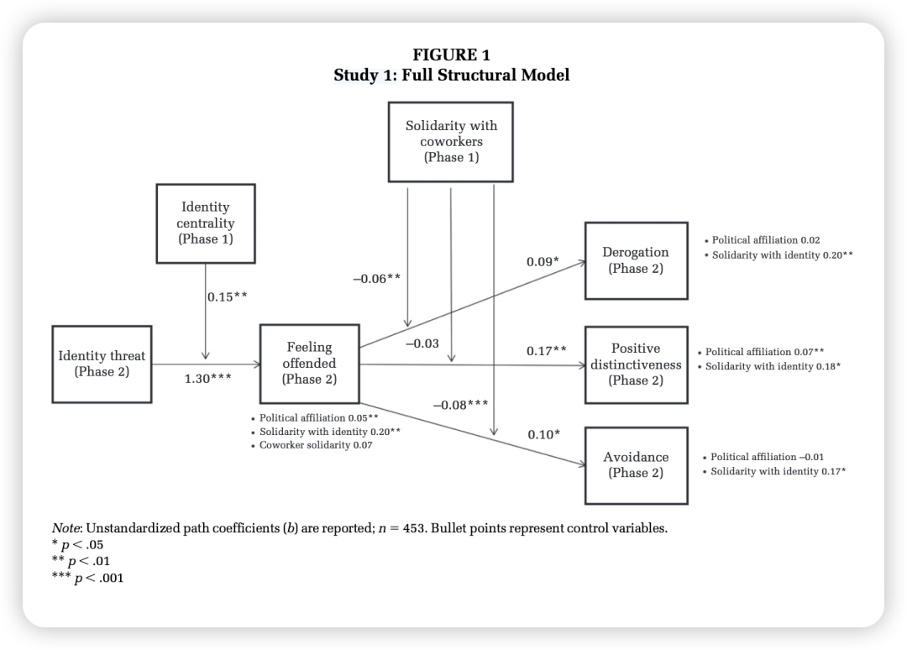

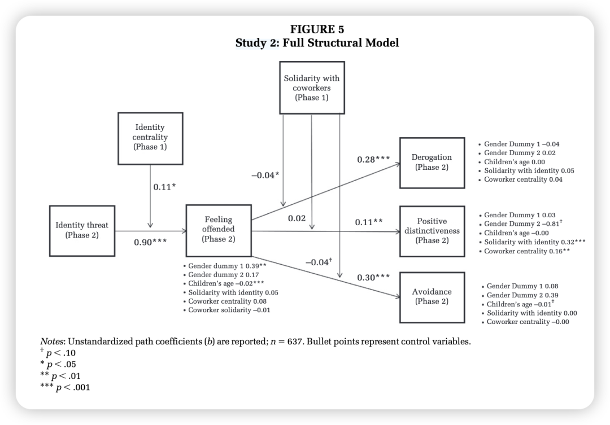

另外，假设5中还根据调节变量的组合又产生了四种条件，这个确实可以学习耶：

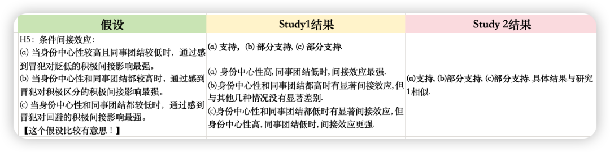

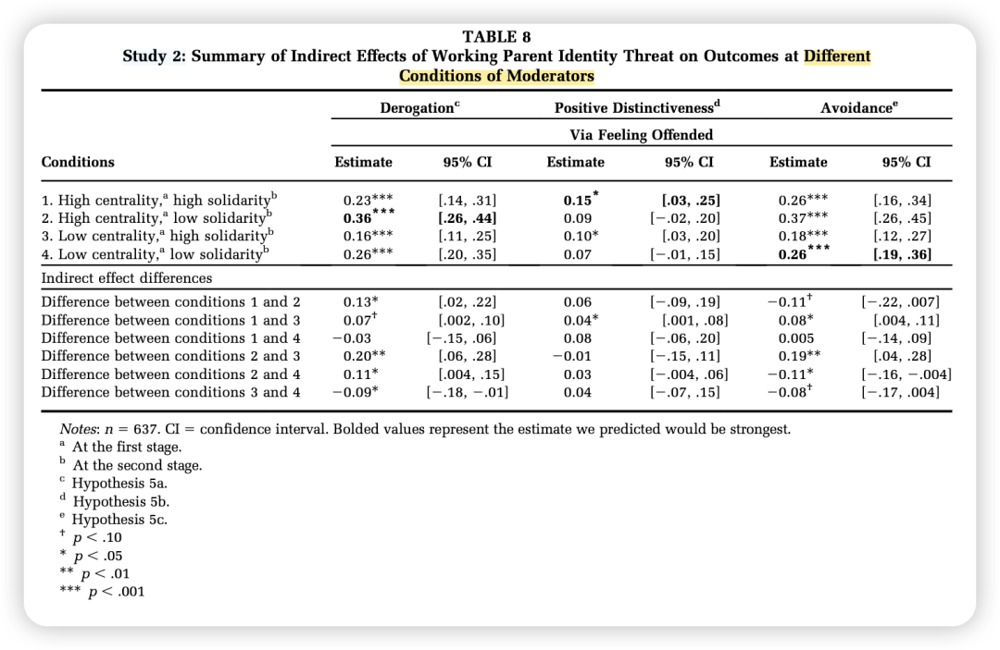

而关于identification来源的问题，该研究的结果也证明，过往研究中发现的共享受威胁身份的群体的团结 在某些时候确实可以带来缓冲，但同事团结 也是一个非常重要的因素，它也可以有效地缓解身份威胁的负面影响，甚至在效应上来看，这比前者效应更大，影响更多！

所以促进同事团结是一个重要的管理启发，无产阶级一起联合起来: )

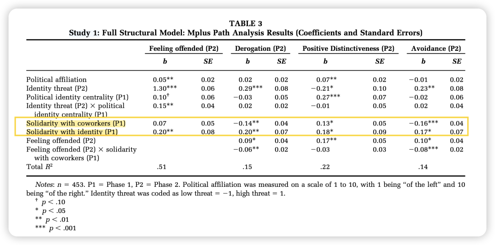

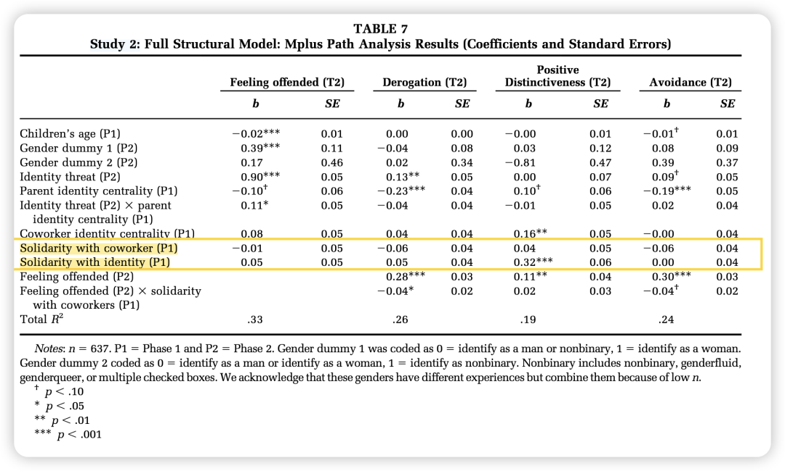

### 彩蛋：来自Google AI Studio （最近发现它真的很好用哦）

### 

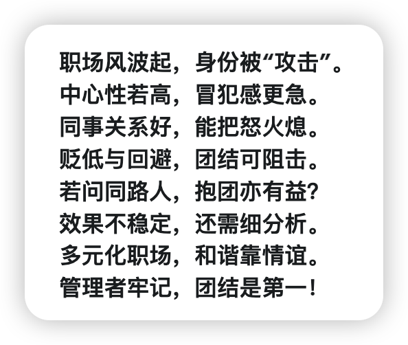

新学期开启日更计划，请大家一起监督——

我会把文件pdf和文章中的补充材料发在我建的学术群里，懒得自己去下载的朋友可以加我的小号（wechat：Herstory0818）拉你入群。

（因为现在人满了200只能手动拉入 qwq；一般在吃饭或者摸鱼的时候集中处理下 请谅解）
