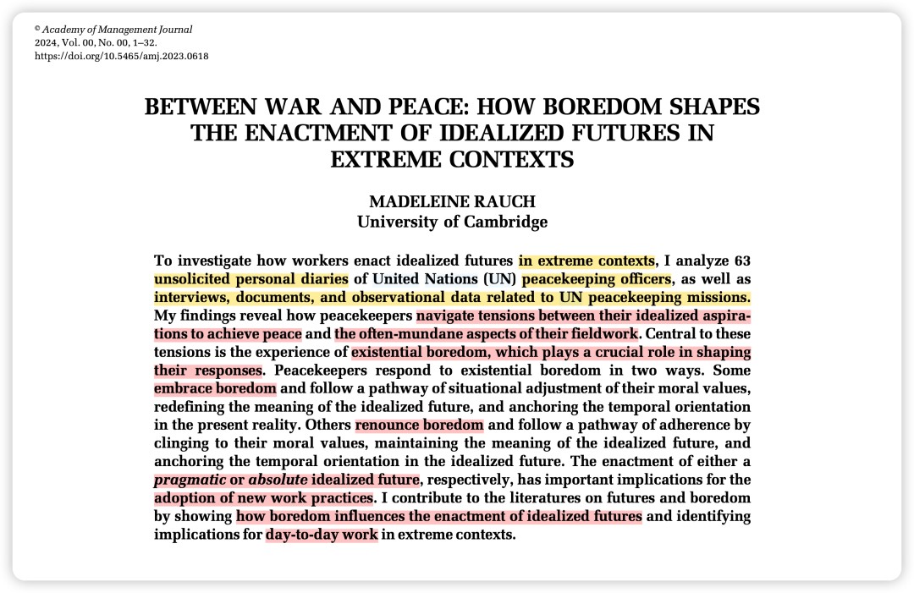

写在前面的碎碎念：

又是一篇狠狠拿捏我的文章...

作者用维和部队的质性数据回答了一个问题，当你的理想和现实冲突的时候，你是选择继续保持崇高理想，还是接受现实活在当下？——这好像也是每一个职场人/科研人都在反复横跳的问题。

阅读体验就像在看和平版《西线无战事》。

### 背景简介：

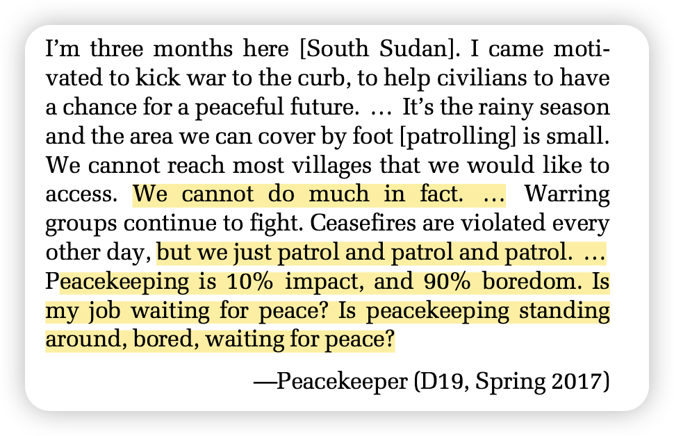

### 如这篇联合国维和部队的日记所述，维和工作是10%产生影响力和90%的无聊。（好吧 真的也是大部分工作的常态）。—— 作者称此为“extreme contexts”，而维和部队也是本文的主要研究场景。

### 面对这种极端冲突环境下的日常工作无聊感，维和部队会如何去应对、又会如何调整他们预期的目标

### —— 我可以用时下的词语概括为，“祛魅”后选择安于现状还是保持幻想？

### 

### 为什么要做这个研究？

1. 对于future literature：之前的研究只探讨了“未来想象”的潜在优势，然而没有探讨这种理想化未来是如何影响个体的认知和行为的。

2.对于boredom literature：之前研究更关注boredom的消极面，这篇研究会探讨其双刃剑效应。比如在极端环境中，无聊可以成为反思与行动转换的催化剂。

3.现实因素：如果维和部队的人都感到无聊，会导致低士气、使命违背，进而影响国家安全。

方法概述：

质性研究，数据包括63份维和人员私人日记，以及访谈、观察、文档记录。

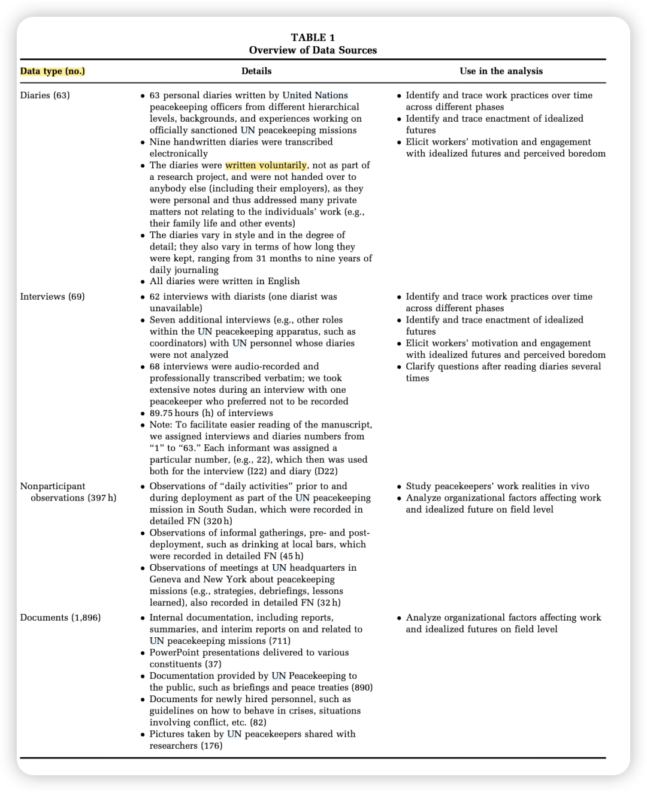

### 结果概述：

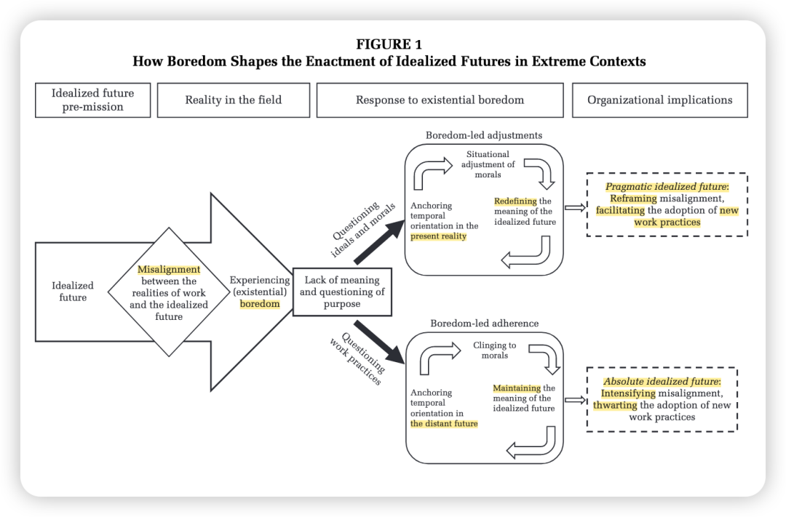

### 左侧箭头部分揭示了：在一开始的时候，所有人都拥有理想化信念，也都被现实狠狠打击，在理想和现实发生冲突后，产生了无聊。（可以看看下方维和人员的小日记 很有意思！）

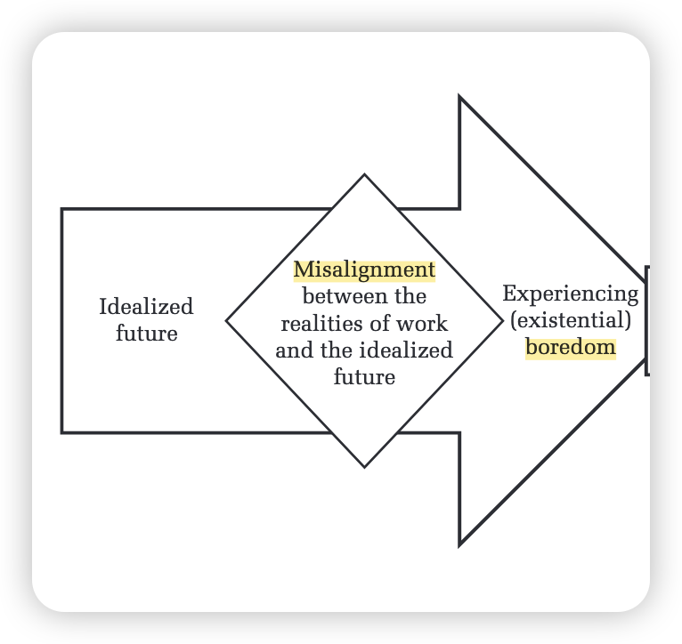

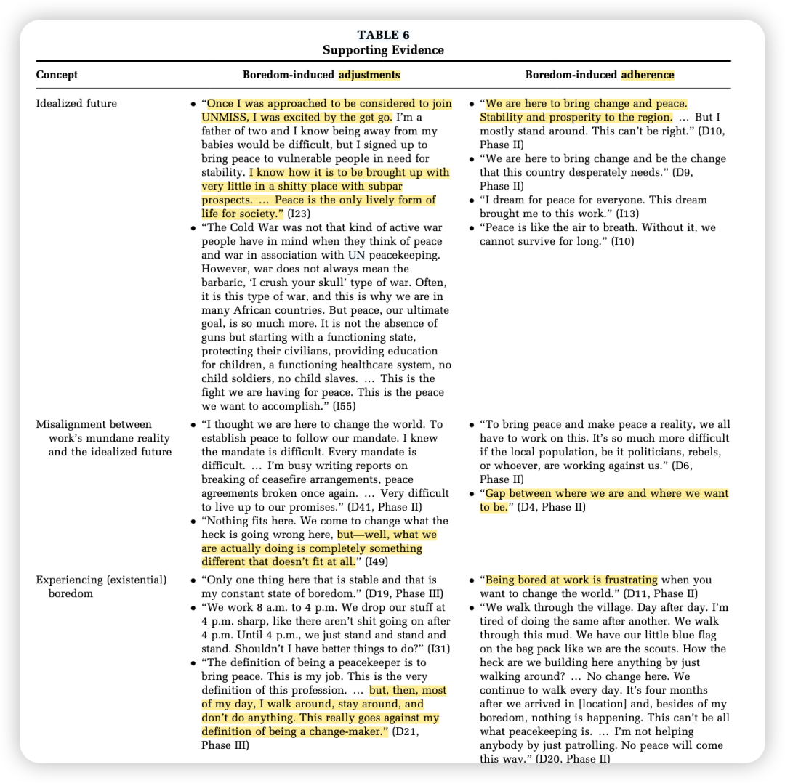

中间两个框揭示了对于这种无聊，会产生两种应对方式（后简称为A人和B人）。

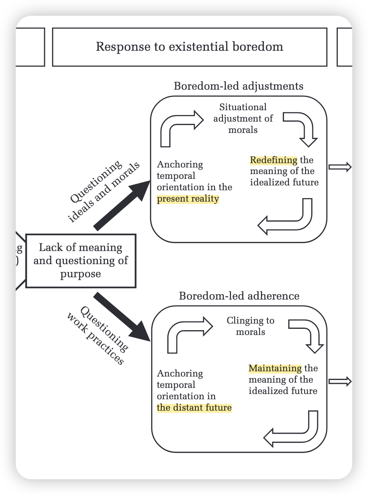

A人会质疑自己的理想信念；

B人会质疑自己的工作任务。

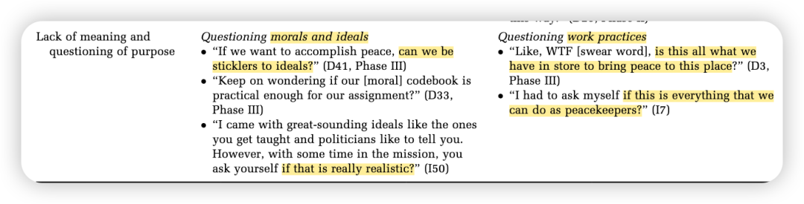

A人根据现实需求灵活调整道德标准，不再幻想；

B人依然保持初心，坚持“和平不容折扣”，认为日常琐事偏离核心使命。

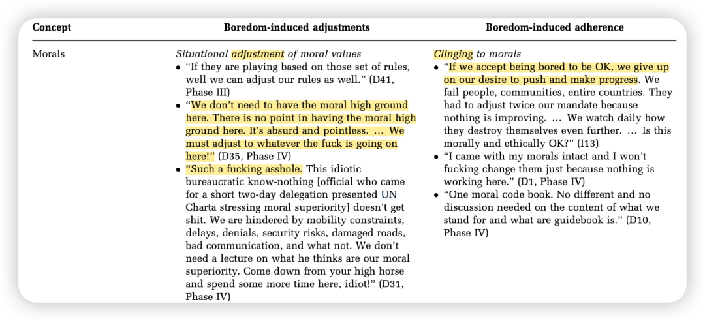

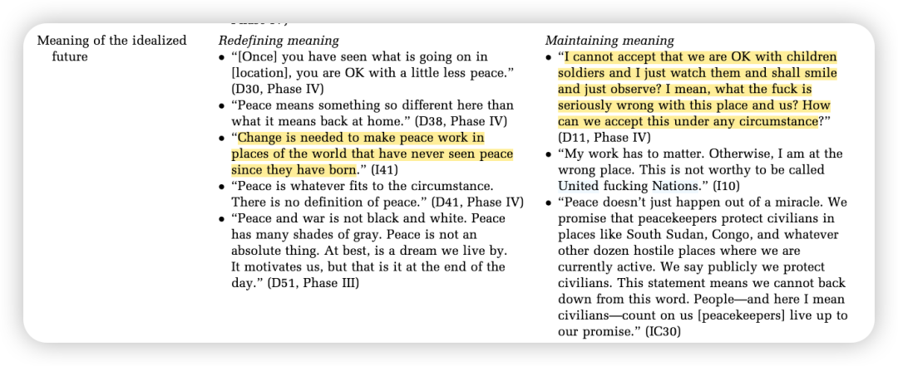

A人选择关注当下行动，而非遥不可及的长期目标；

B人依然畅想未来，将行动锚定于长远目标。

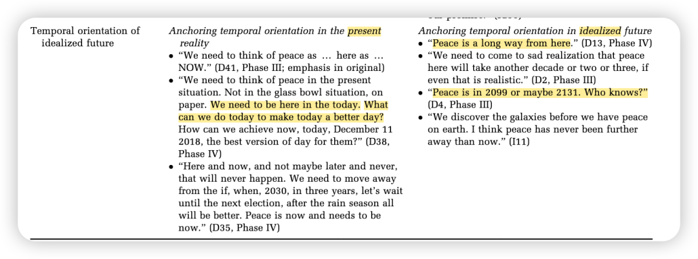

末尾两个框揭示了：

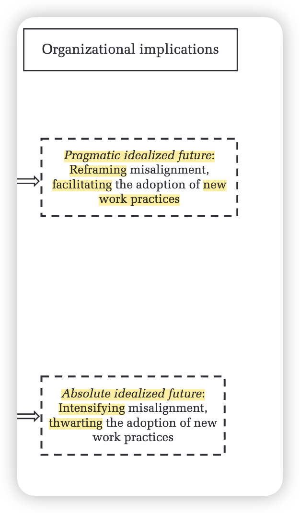

A人接受“无聊是和平进程的一部分”，也因为活在当下而开始享受现在的生活，在无聊中感受到舒适，觉得无聊就是和平的象征，进而减少着理想与现实的冲突；

B人依然不愿意舍弃自己的宏大目标，不断加剧着理想与现实的冲突。

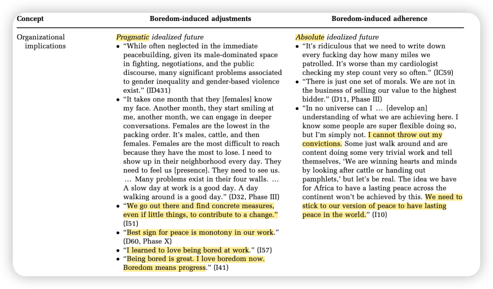

### 彩蛋：来自Deepseek…

这个真的有点太绝了...

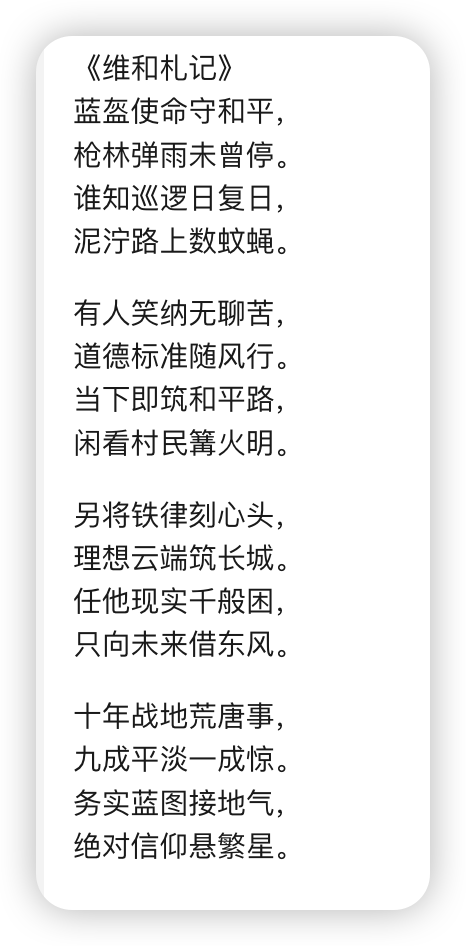

新学期开启日更计划，请大家一起监督——

我会把文件pdf和文章中的补充材料发在我建的学术群里，懒得自己去下载的朋友可以加我的小号（wechat：Herstory0818）拉你入群。

（因为现在人满了200只能手动拉入 qwq；一般在吃饭或者摸鱼的时候集中处理下 请谅解）
