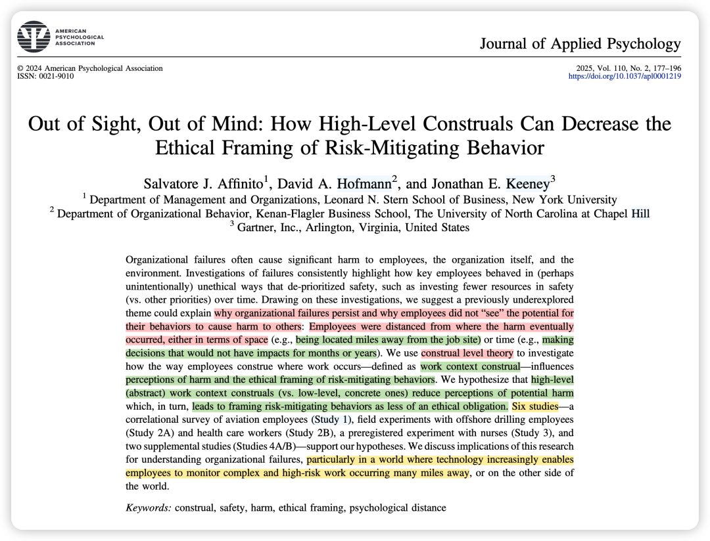
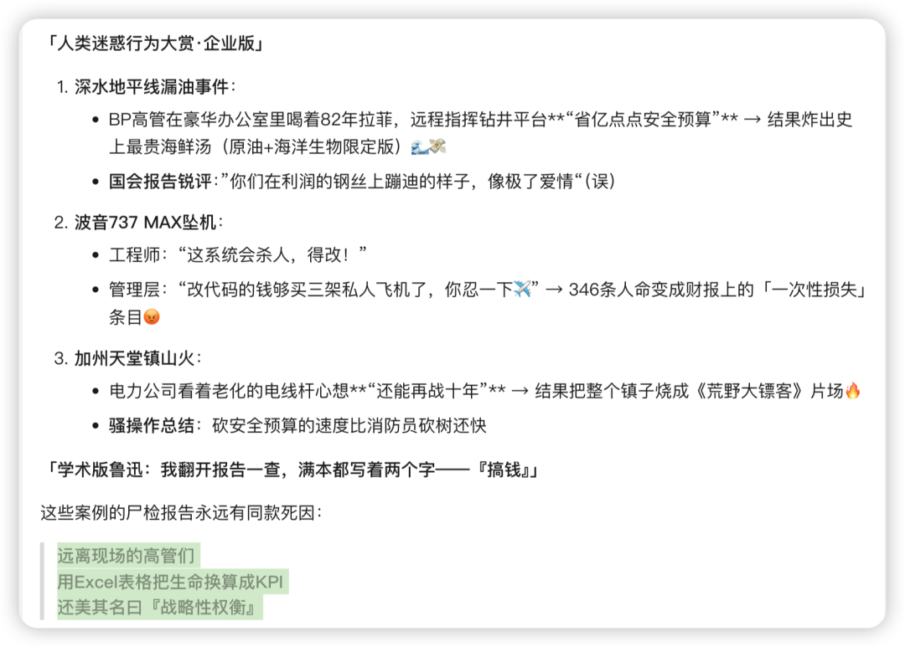
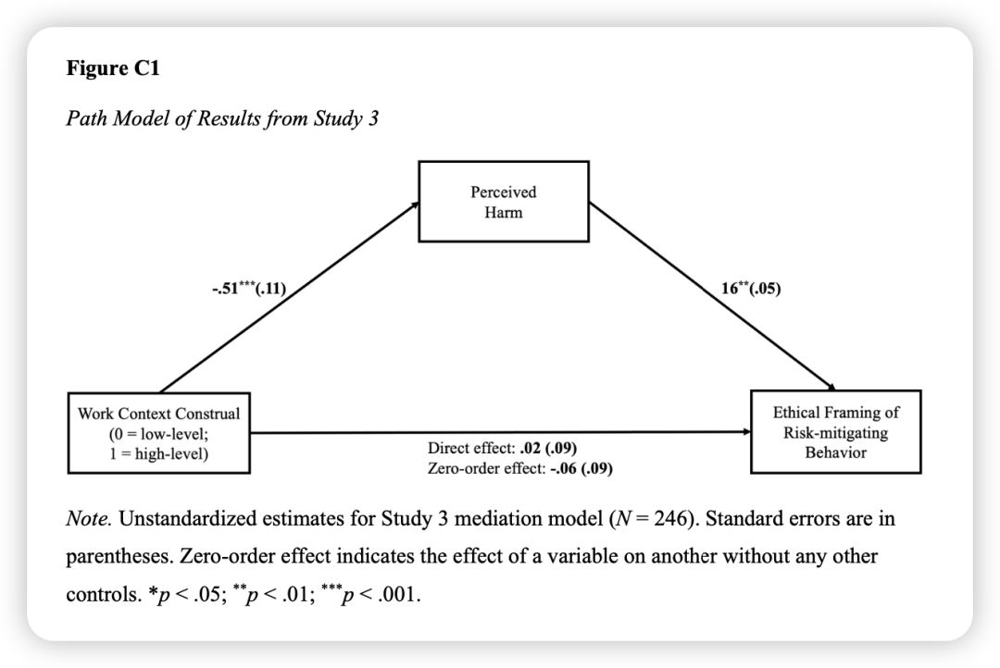
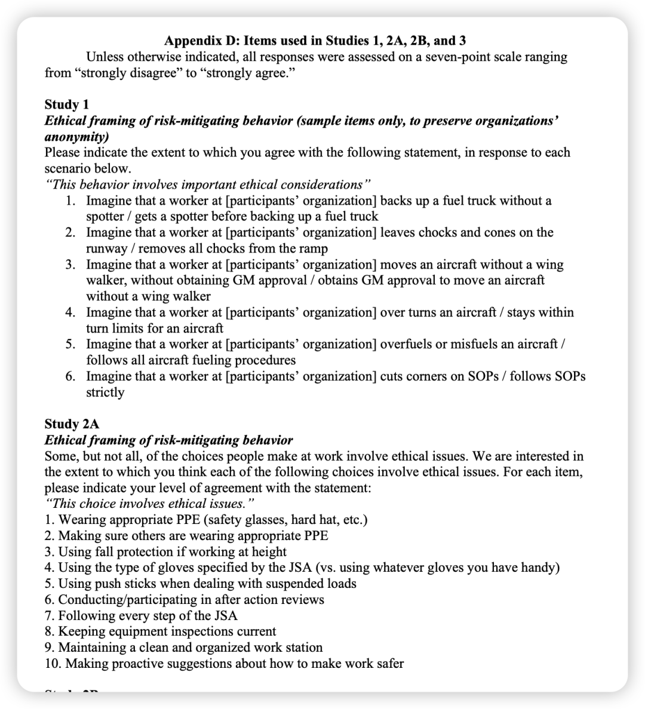
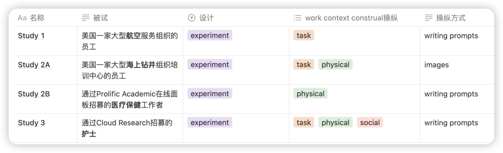
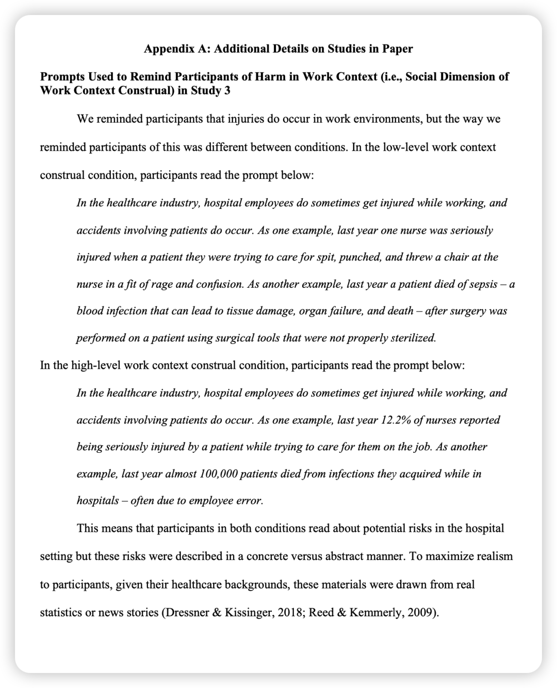
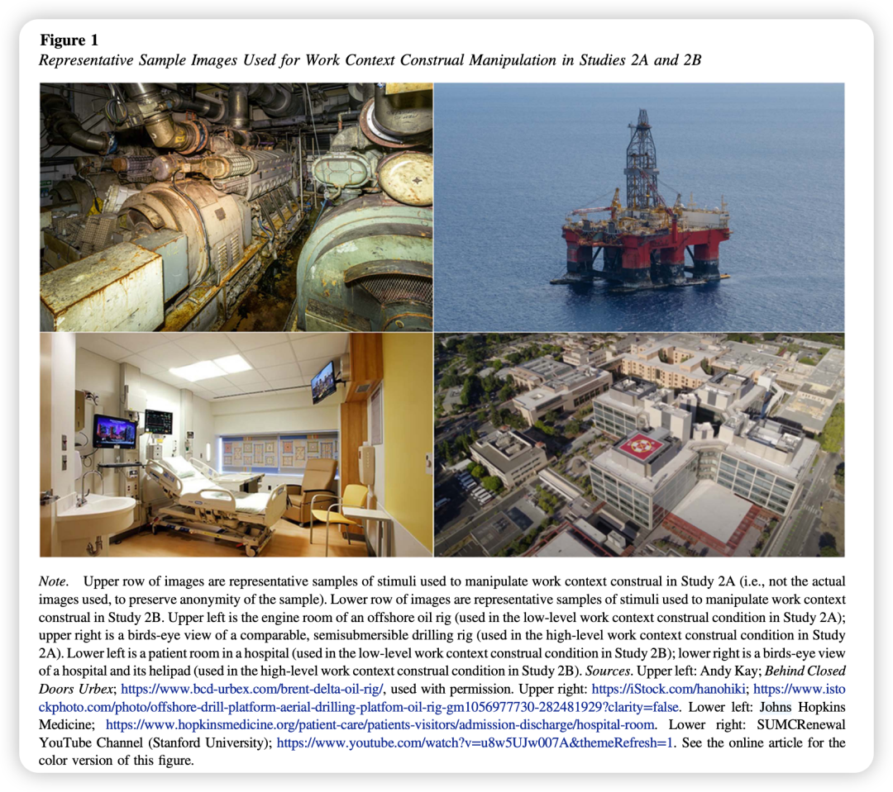
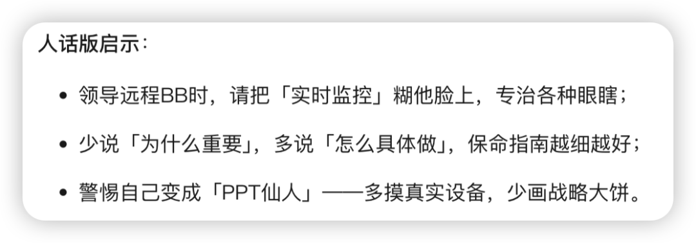

写在前面的碎碎念：

这是一篇久违的很喜欢的文章！没有那种OB设计的八股套路，很新的感觉！

在内在思想上，这和我在2024年的年终总结里的写的“必须出门感受 毕竟Out of Sight才能Out of Mind”和“不要说流利的废话”完美契合。

我从小到大都烦透了在公众演讲中说空话说大话的人，每次在听了个开头后，我的大脑就会自动将其发言视为 high-level construals而屏蔽其之后的发言；近些年我也越活越具体，在意那些 low-level construals：身边的人，微小的美，具体的实施流程，阳光、小狗、树影...  希望少点“远程指挥 净说点抽象话”的人，多点具体可感的“活人 真人 好人”。

在方法上，作者对于测量和操纵的严谨超乎想象，也神通广大地能收到像钻井、航空、医疗等背景下的员工数据。

在理论上，它不是全然用construal level theory来进行推理，而是质疑了这个理论在safety场景中是否适用，并用严谨的结果证明了在特定场景下与这个理论相反的结论，伟大呀！

### 背景简介：

### 近年来多起企业安全事故暴露了一个共性问题：关键决策者（如高层管理者）未能履行其道德责任，可能为降低成本而忽视安全投入。（下图为DS生成的生动版）

### 

基于此，作者提出一个矛盾现象：尽管高危行业（如化工、矿业）普遍宣称“安全至上”，但重大安全事故仍频发。这一矛盾背后的原因是什么？

### 理论：

### 

解释水平理论 （Construal Level Theory；CLT) 提出，个体对目标的认知可分为高解释水平（抽象思维）和低解释水平（具体思维）。

前者关注核心特征与长期意义（如安全是价值观），后者聚焦情境化细节（如具体操作步骤）。

根据CLT，高解释水平可以带来“see the bigger picture”的益处，能够考虑清楚事情背后的价值观，也能高瞻远瞩地思考未来。而研究也表明，增加个体在物理和心理上与目标之间的距离会产生高解释水平。

——按照这个推理，那些离目标远的人-因为有更高的解释水平-因此会产生更好的工作结果。

然而，作者指出这一理论在安全敏感领域可能失效。例如，高层管理者因远离工作现场而采用抽象思维，反而导致低估风险概率（如认为事故不太可能发生或者是可以预料到的），同时削弱对受害者处境的共情（如忽视操作员面临的具体危险）。

### 为什么要做这个研究？

综合理论上的分歧和对现实事件中的分析，这个研究想去探讨解释水平对伤害感知和后续伦理决策的影响。

（文中没有model图，就在补充材料里扒拉了study3的结果图）

这个DV第一次见，他的测量条目如下。（根据不同群体修改了条目）

贡献点：

1. 对于safety literature：发现了被忽视的对于safety behavior的前因-解释水平。

2. 对于CLT理论：发现了抽象思维的消极作用。

3. 对于安全相关的工作设计：虽然提倡远程工作可以带来益处，还是需要警示组织 —— 在设计远程工作时，需权衡效率与安全风险，避免因心理距离扩大而滋生安全隐患。

方法概述：

文字/图片操纵示例：

### 结果概述：

### 

用多种操纵和测量方式稳健地检验了：高解释水平会降低伤害感知，进而降低风险行为的伦理框架。（这个DV太难翻译了！ 大概就是这么个意思...）

### 彩蛋：来自Deepseek…

新学期开启日更计划，请大家一起监督——

我会把文件pdf和文章中的补充材料发在我建的学术群里，懒得自己去下载的朋友可以加我的小号（wechat：Herstory0818）拉你入群。

（因为现在人满了200只能手动拉入 qwq；一般在吃饭或者摸鱼的时候集中处理下 请谅解）
