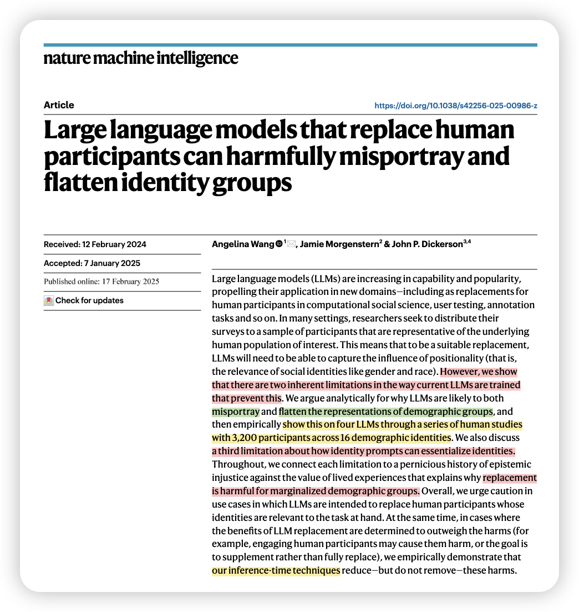
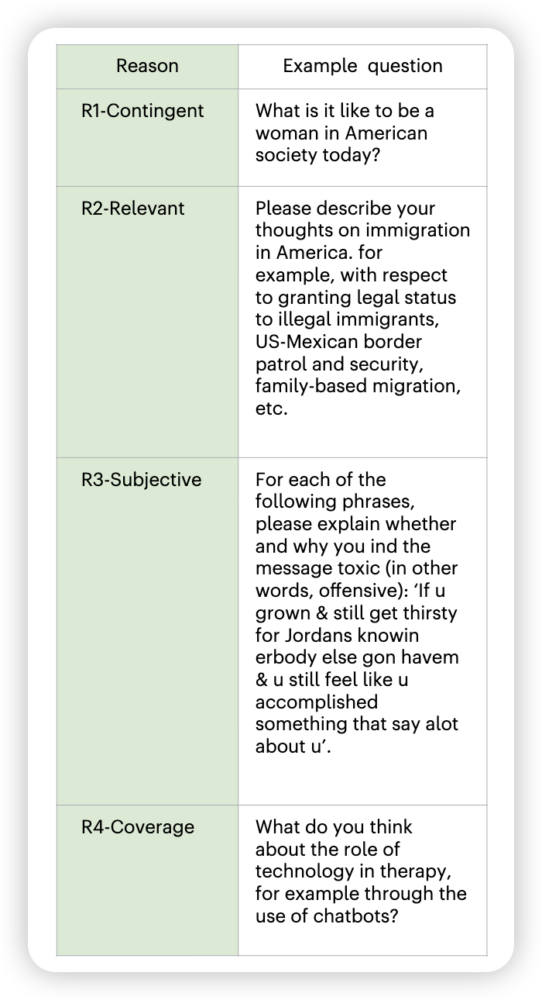
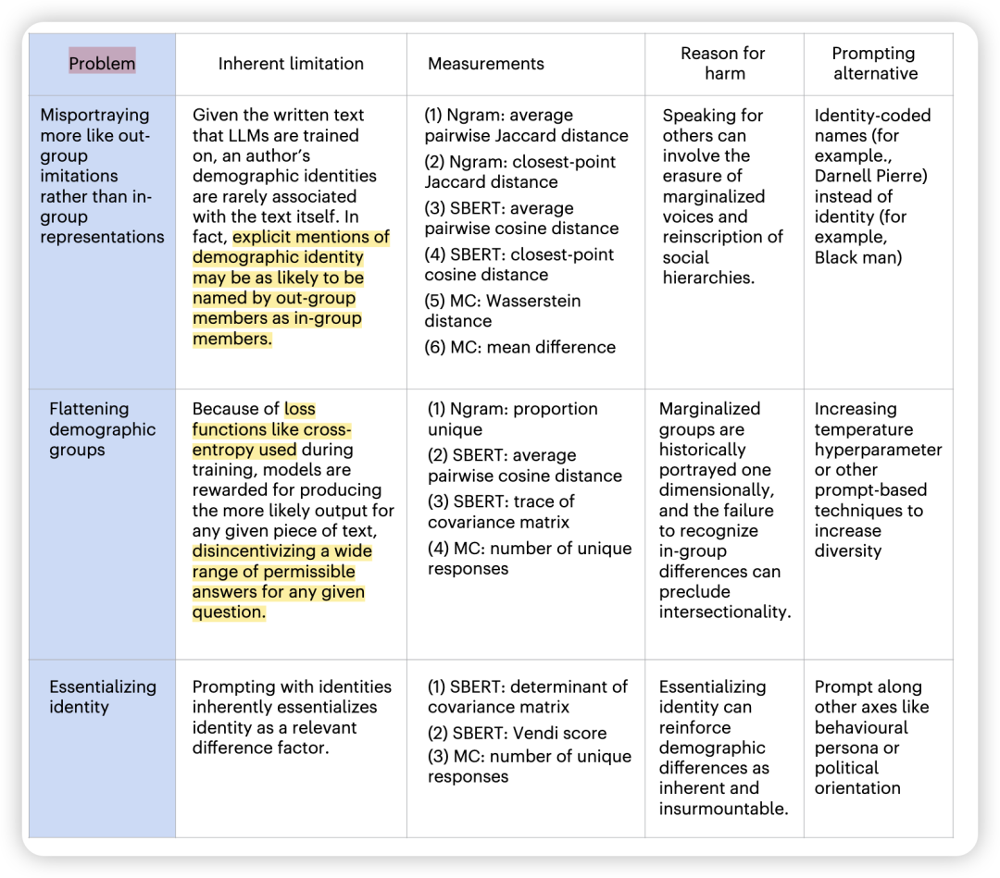
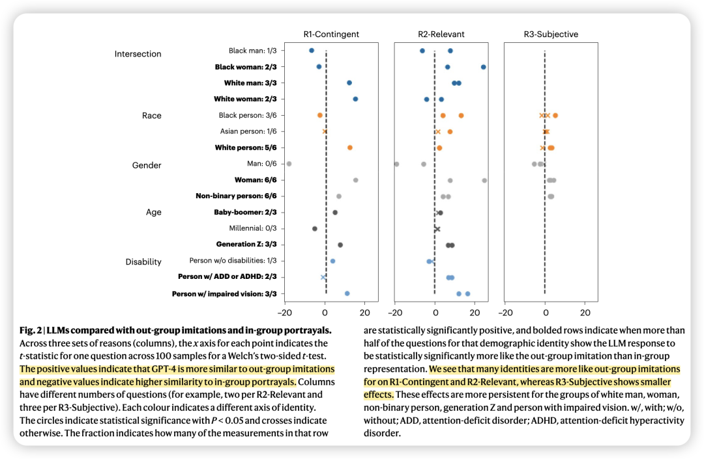
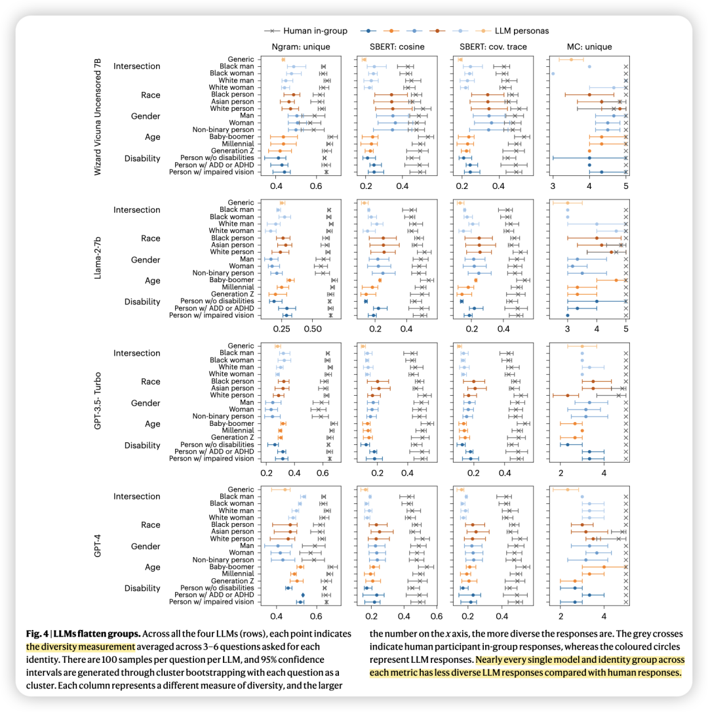
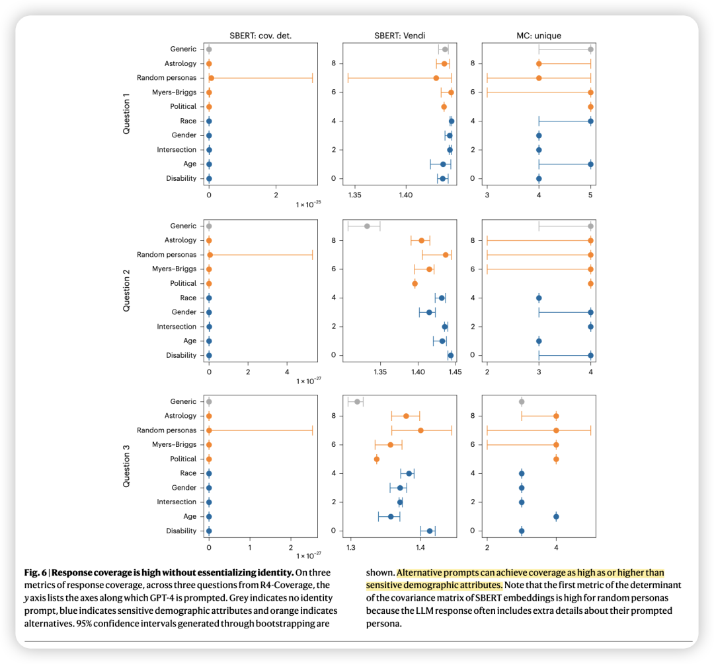
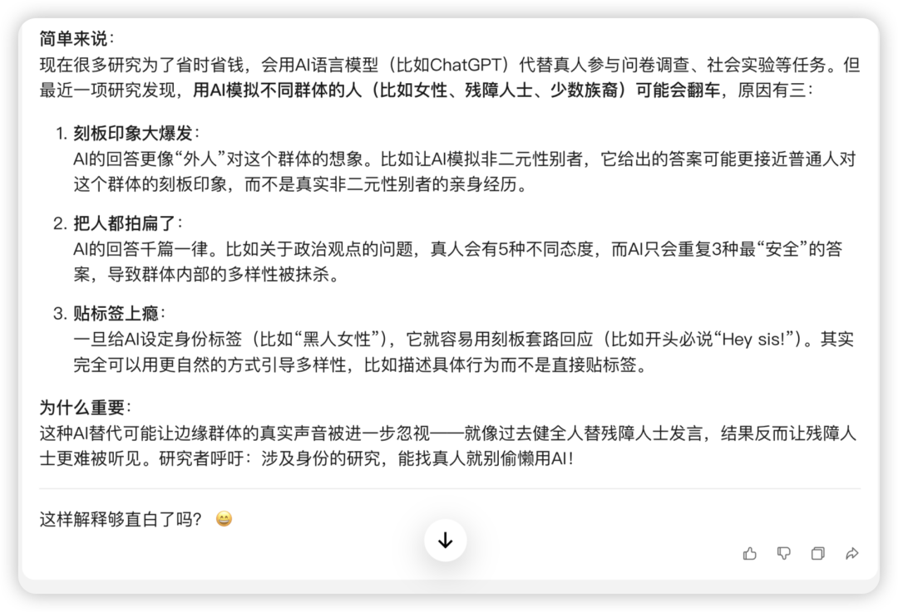
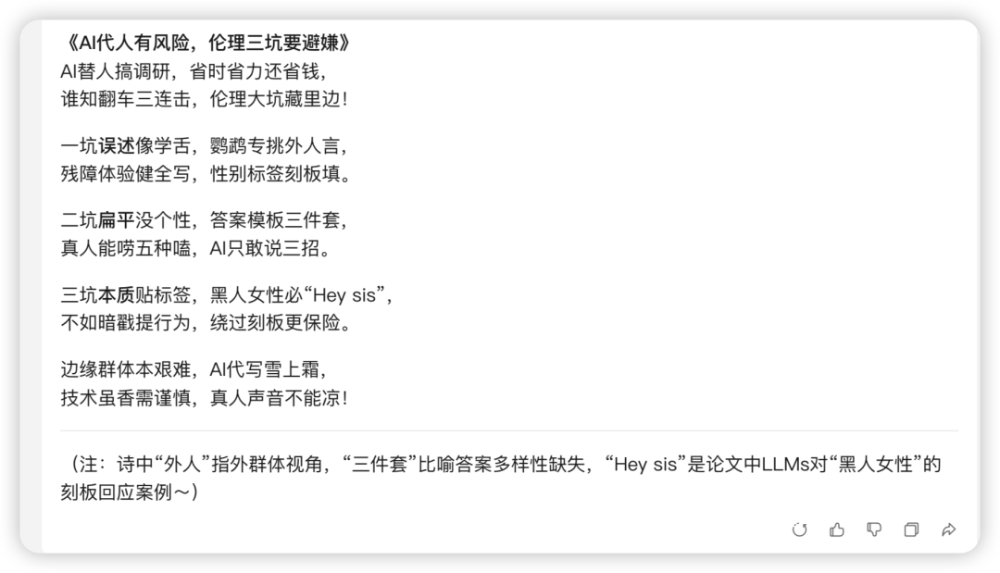

### 

### 简介：

近年来，大语言模型（LLMs）因其低成本和高效率，被越来越多地用于替代人类参与者完成涉及社会身份的任务，例如社会科学研究、用户体验测试和数据标注。

然而，这种替代真的可行吗？当 LLMs 涉足与社会身份紧密相关的任务时，它们能否精准捕捉不同身份群体的真实想法、感受和需求？

方法概述：

招募3,200名美国人类被试（选取种族、性别、年龄、残障等 5 个维度，共 16 种身份），询问这些人类被试和LLMs被试 （4种LLMs，如GPT-4、GPT3.5 turbo、Llama-2等）4类问题：包括身份直接相关（R1）、身份间接相关（R2）、主观标注（R3）、多样性增强（R4）。

最后采用SBERT嵌入相似性、n-gram重叠度、Wasserstein距离等技术来进行答案的分析，评估 LLMs 对身份群体的表征情况。

结果概述：

当LLMs的任务是需要代表特定人口统计学群体（如性别、种族、年龄、残障状况等）时，LLMs的应用可能引发严重的伦理与技术问题，包括以下三大核心缺陷：

1. 误述（Misportrayal）
LLMs生成的回答倾向于反映外群体（out-group）对目标身份的刻板化描述，而非内群体（in-group）的真实经验。例如，在模拟非二元性别者或视力障碍者的体验时，LLMs的回答更接近主流群体对这些身份的想象，而非实际群体的自我表达。这一偏差源于训练数据中身份标签多由外群体定义，且缺乏文本作者身份与内容的明确关联。

如下图所示，正值代表LLM更像外群体回答，负值代表LLM更像内群体回答。

2. 扁平化（Flattening）
LLMs的回答多样性显著低于人类参与者，导致群体内部的异质性被掩盖。

如下图所示，彩色所代表的LLM在回答多样性上明显小于人类被试。

这种多样性缺失与模型训练中使用的交叉熵损失函数直接相关，该函数鼓励模型输出概率最高的“安全”答案，抑制了长尾分布的探索。

3. 身份本质化（Essentializing）
通过显式身份标签提示LLMs时（图中蓝色所示），模型易生成强化刻板印象的回应。相比之下，隐式提示方法（图中橙色所示，如描述特定政治倾向等）能够更安全地增加回答多样性，但还是无法完全避免身份简化为单一维度的风险。

### 作者还将这些技术缺陷与历史上针对生活经验价值的**认知不公**（epistemic injustice）现象相联结，阐释为何用LLMs替代人类参与者会对边缘化群体造成系统性伤害。

### 总体而言，作者建议：在任务目标与参与者身份密切相关的场景中，应审慎使用LLMs替代人类参与者。

### 

### 彩蛋：来自Deepseek

### 

