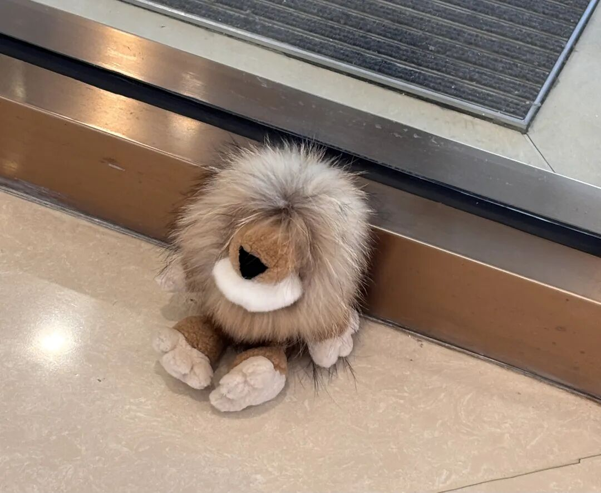

1. 很神奇，突然感觉到现在为止，我能够敏锐地看出哪些稿子是AI写的了。其实很明显，因为很多句子都是车轱辘话来回说，却毫无推理的逻辑与递进，更缺少citation，总是一长段话就一个citation，一看作者就是没有做充足的文献梳理，那唯一一个citation可能还是作者心怀愧疚、放上去凑数的。

2. 本科的时候无法理解人怎么可以写那么长的论文，那时候大家都称写论文是在做“学术裁缝”。而现在，也能一眼就看出哪些文章是“裁缝”出来、哪些文章是作者做了足够的努力的。

以上感悟都是在做了几个“快”的研究后，“慢”悟出来的，感恩OB的学者们总是慷慨地讲述着“如何才能做一个好的研究”。

配图为今天看到的一只躺在路边的可怜小狮子 orz.

