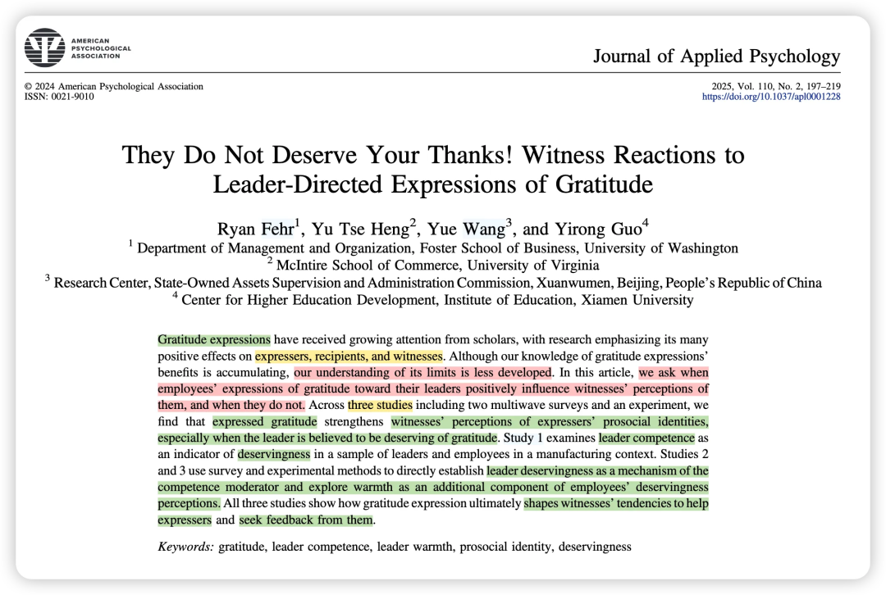
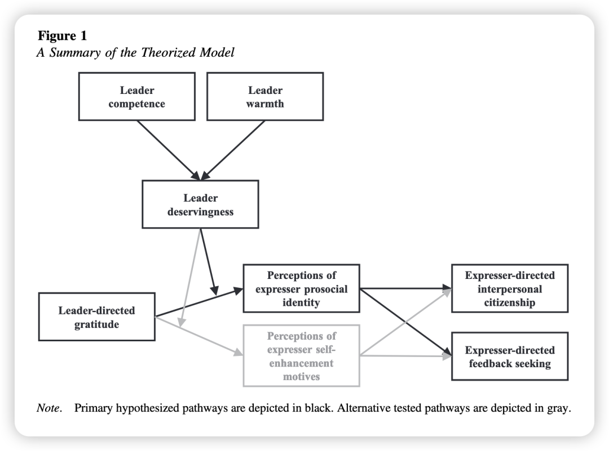
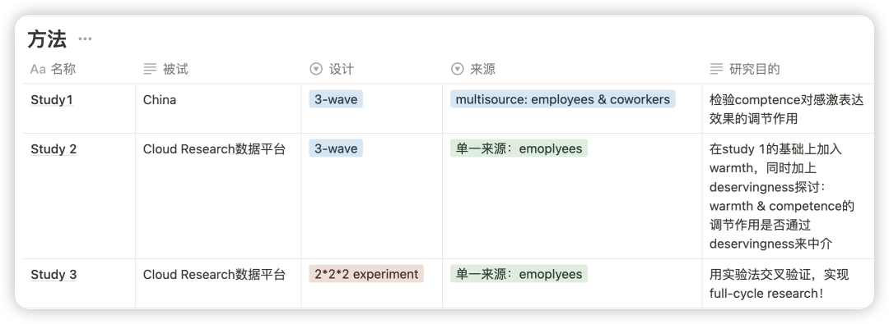
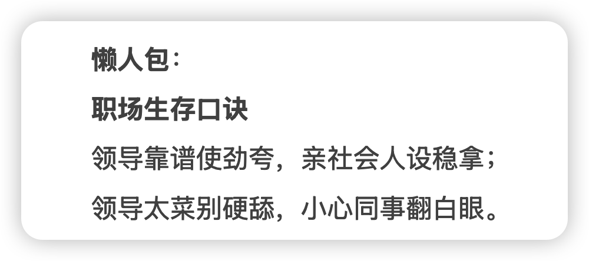

### 

### 简介：

感恩表达在学术研究中受到越来越多的关注，其对表达者、接受者和见证者有诸多积极影响。

然而，感恩表达的效果是否会受到情境因素的影响—— 何时会对见证者的感知产生积极影响，何时不会？

这篇论文研究了员工对领导的感恩表达如何影响第三方（即见证者）对感恩者的归因与后续行为（如帮助行为和反馈寻求倾向），以及领导的特质（如能力与温暖）如何调节这种影响。

### 理论：

1. Find - remind - bind 理论：感恩的社会功能是引导人们寻找良好的社会伙伴，帮助人们发现新的可能亲社会的伙伴，提醒人们现有亲社会伙伴的存在，并通过亲和行为将人们与亲社会伙伴联系在一起，形成亲社会的良性循环。

2. 刻板印象内容模型（Stereotype Content Model）：人们对他人的感知主要基于能力（competence）和温暖（warmth）两个维度。

3. 归因理论：个体在观察他人行为时会进行因果、意图和动机归因。在本研究中，旁观者通过领导特质推断同事感激表达的动机：

若领导值得感激-则将同事的感激表达归因为亲社会身份（prosocial identity），若领导不值得感激-则讲同事的感激表达归因为一种讨好上级的印象管理策略（self-enhancement motive）。

### 为什么要做这个研究？

1. 现有感恩表达研究多关注其积极影响，对何时感恩表达可能产生负面或较弱影响的边界条件研究不足。

2. 以往研究多从表达者 - 接受者的二元视角出发，第三方见证者的视角虽然也有，但还是比较少。

方法概述：

### 结果概述：

- 当领导被认为能力较强时，员工对领导的感恩表达会增强见证者对感恩者的亲社会身份感知，进而促进见证者对感恩者的帮助行为和反馈寻求。然而，当领导能力较弱时，这种积极影响显著减弱。
- 领导warmth的调节作用仅在study 3出现（study3发现，当领导温暖度较低时，感恩表达对见证者的影响也会受到抑制），作者认为这可能因为文化差异（在中国样本中warmth效应不显著，可能与集体主义文化下“服从权威”的默认认知有关）。
- 领导的能力和温暖通过影响对于领导的值得感认知（Deservingness），进而调节感恩表达对见证者感知的影响。即领导的能力和温暖的调节作用是通过Deservingness来中介的。

### 彩蛋：

来自Deepseek的概括…

过了个年感觉脑袋空空！ 所以准备开启日更计划，请大家一起监督——

另外我会把文件pdf和文章中的补充材料发在我建的学术群里，懒得自己去下载的朋友可以加我的小号拉你入群（因为现在人满了200只能手动拉入 qwq；一般在吃饭或者摸鱼的时候集中处理下）

