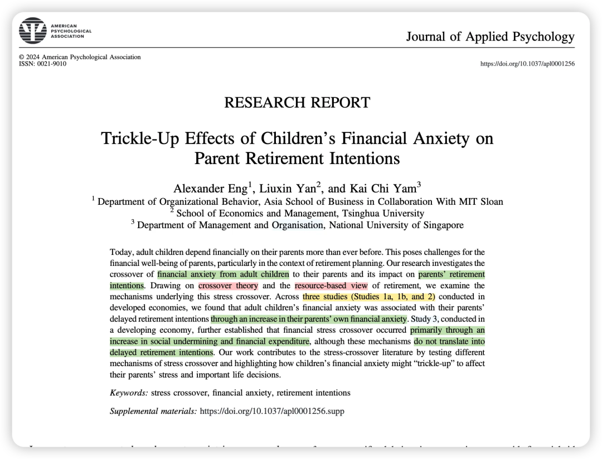
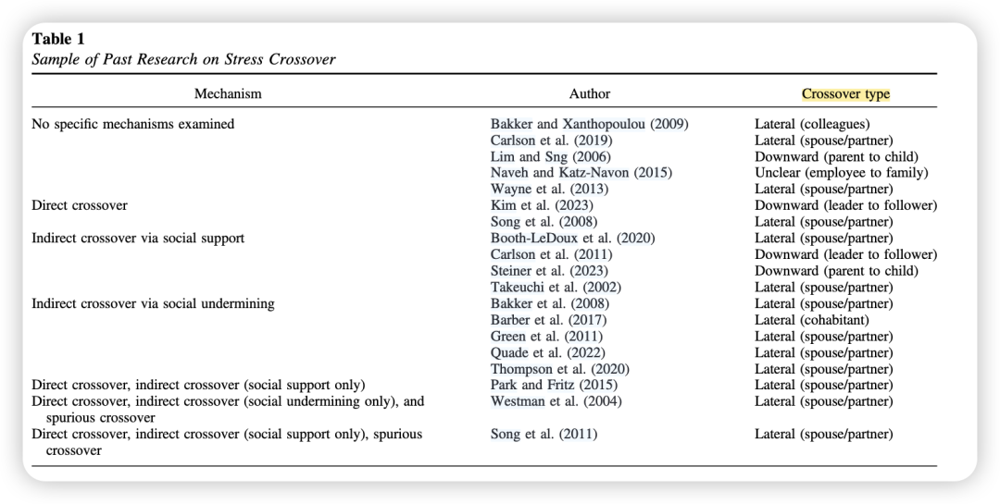
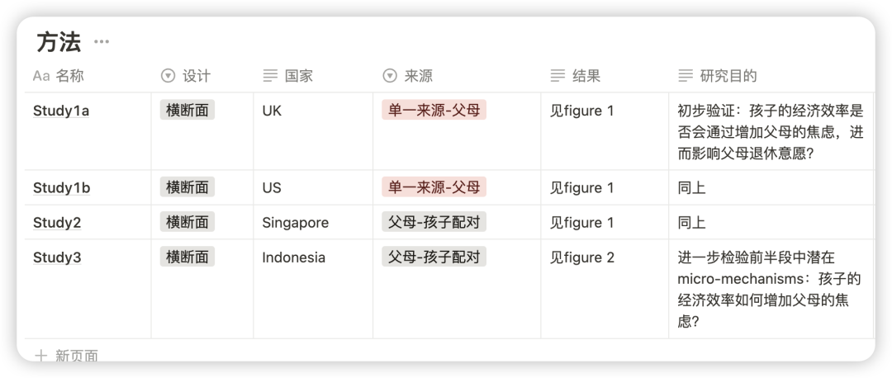
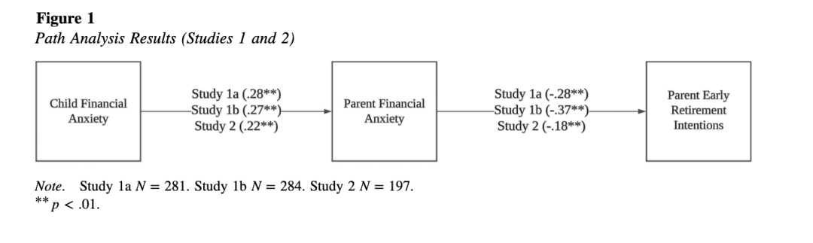
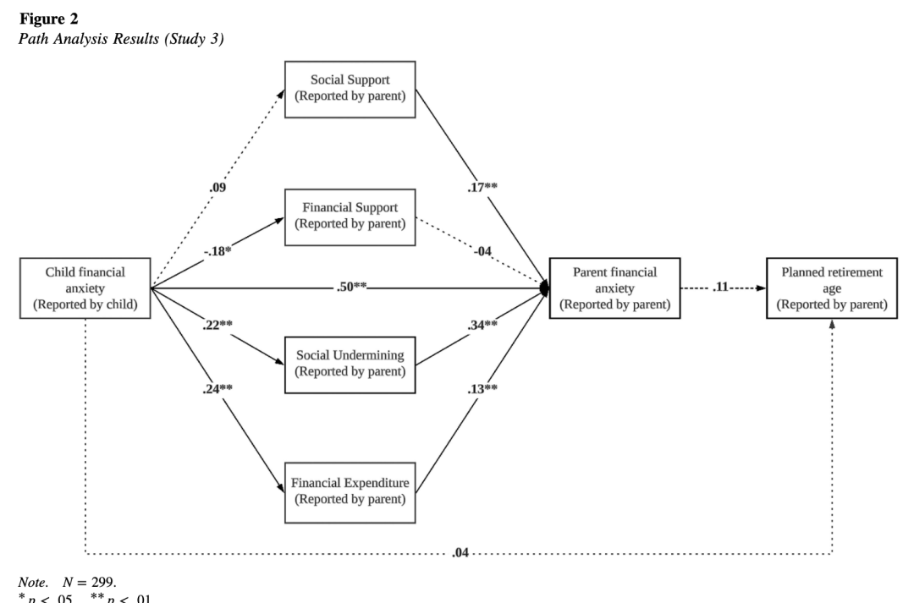

### 

### 简介：

如今，成年子女在经济上对父母的依赖比以往任何时候都更强，这给父母的财务状况、尤其是退休规划带来了难题。这篇论文研究了**成年子女的财务焦虑是如何传递给父母的，以及这种传递对父母退休意愿有什么影响**。

### 理论：

**1、压力交叉理论（stress crossover theory）：**一个人的压力能通过社交互动传递给另一个人，主要通过减少social support、增加social undermining等方式；

2、另一个**视角（resource-based view of retirement）**则指出，人们退休意愿会根据他们拥有的退休相关资源变化，钱是很重要的退休资源。

### 为什么要做这个研究？

- 之前研究crossover都是从lateral（情侣之间）或是downward（从父母到孩子），而没有研究这种upward（从孩子到父母）的流向。——因而这个研究增加了对于crossover理论的补充。

- 压力交叉理论中经常使用的中介（social support和social undermining）是一种social-interactive的机制，作者认为无法捕捉这个理论的全貌。因而提出了另外两条更工具导向（instrumental mechanisms）的机制：financial support and expenditure。——因而增加了对stress crossover theory的补充。

方法概述：

### 结果概述：

研究结果显示，在**发达国家**进行的研究中，成年子女的财务焦虑会让父母的财务焦虑增加，进而导致父母延迟退休的意愿增强。

在**发展中国家**印尼的研究发现，子女的财务焦虑主要通过增加social undermining和经济支出，传递给父母，不过这并没有直接让父母更倾向于延迟退休。

过了个年感觉脑袋空空！ 所以准备开启日更计划，请大家一起监督——

另外我会把文件pdf和文章中的补充材料发在我建的学术群里，懒得自己去下载的朋友可以加我的小号拉你入群（因为现在人满了200只能手动拉入 qwq）

