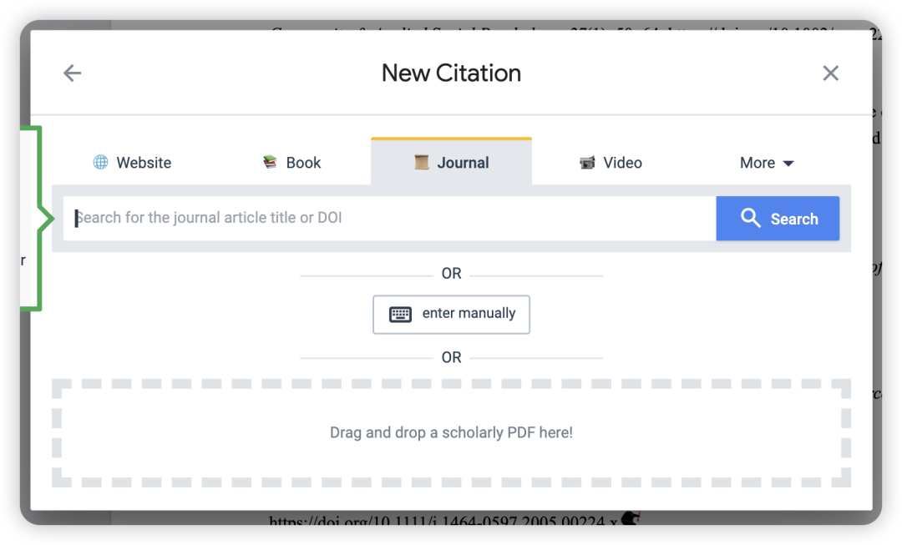
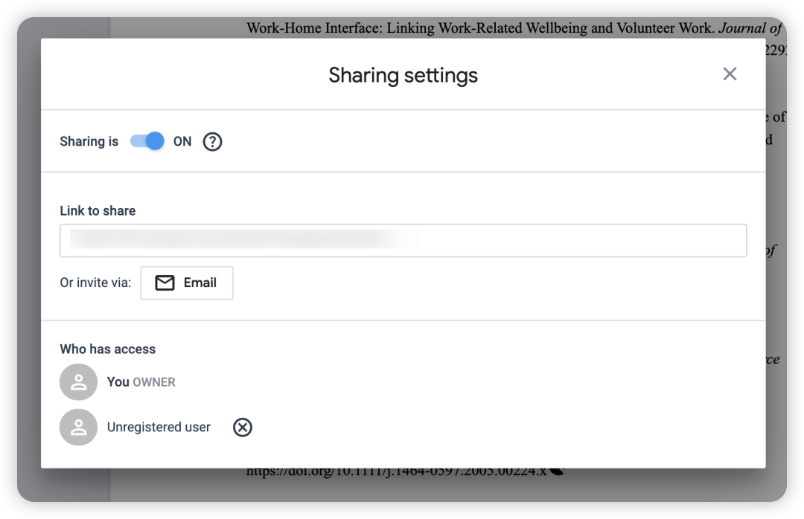
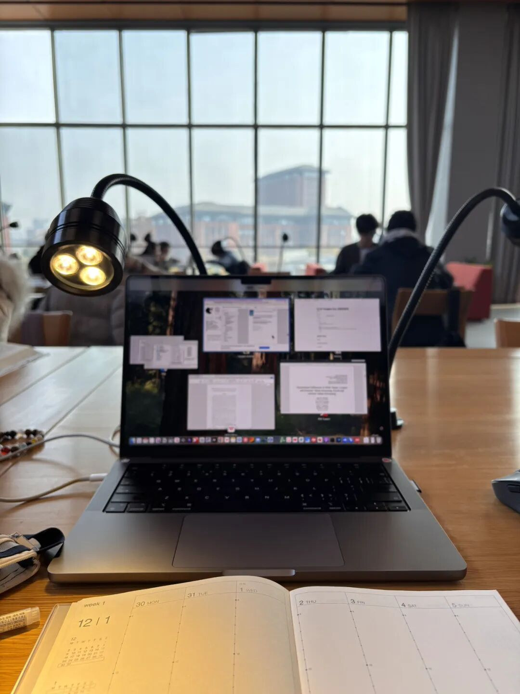

年末冲刺KPI，实在无法深耕长推送，所以随缘写点小bubble～

最近这一周一直在写intro部分，略有些感悟，仅作记录。

【写作语言】

目前是直接上手用英语写，但是不会保证把每个单词敲对、语法读表达对（保证写作的时候不被分心），仅仅是先用英语把我的逻辑flow出来。

等到写了一两段脑子累了，我再把写出来的东西放在GPT润色并确保之修改单词和语法，不要改变我的逻辑。

之后再对着“洁净”版的文字去思考还能怎么更好地进行逻辑衔接。

【写作的时候 参考文献咋整】

因为我在前期梳理文献的时候，就已经用zotero分成了无数个文件夹来分类文献，所以清楚地知道我在写什么部分的时候要引用什么文献，所以每次我就写到相应部分的时候去引用那篇。

但是！我不会直接用zotero加文献，因为这存在两个问题：

（1） zotero经常会错误识别期刊、年份，会造成巨大错误

（2）zotero在结尾生成的bibliography类似于是一个超链接，它是根据你前面插入的in-text citation自动生成的，然而我们经常会把论文发给不同的人进行修改——经常会遇到大家word版本不同的问题，所以最后的超链接很有可能会丢失-直接变成了plain text！（这个情况已经在我身边很多人身上发生过了）  。

总之，通过以上两点，zotero并不是一个很好的参考文献插入工具，同时如果要涉及多人协同添加参考文献（比如你找了一个本科生帮忙的时候），zotero也无法实现多人协同添加。

—— 所以我从研一开始就用mybib这个参考文献管理网站 （准确率高+可以多人协同），用过的人都说好！

而在写作的时候具体的流程是：我会在写到相应文章的时候，还是先把zotero里直接生成的APA参考格式复制出来（相当于仅仅作为一个中间态的记录），然后用word批注的形式放到相应句子后面。

之后再在休息的时候统一把这些批注一条一条解决，即放到mybib里面生成bibliography & in-text citation。

【论文梳理】

Excel是一个非常好的梳理工具！

它除了可以在前期帮助我们以paper为单位去梳理不同文献的结果和视角，更好地了解你研究话题的目前方向。还可以在后期写作的时候，跳出paper这个单位，而是以theoretical perspective等更宏观的视角为单位、对前期零散的paper进行更高维地总结。—— 这样就可以在literature review的部分就可以做到不是以作者、时间为脉络苍白地写作，而是能够从perspective/dimension来进行脉络梳理。 —— 同时，还可以在写作中去配上一些表格增加可视化（我太喜欢做可视化了），这也是很多顶刊研究的做法。

【写+读+写+读… 】

写作并不是一个最终的步骤，也就是并不意味着你得看完所有的相关文献之后才开始，也不意味着你在写作的时候就只“写”、不“看”。

我目前的方式是，因为前期已经积累了不少文献，我已经在脑海里勾勒出了一个picture，所以我先按照这个picture、按照我自己的逻辑去写，这个过程必定是会卡壳的，所以每次我写不出来的时候，就又会去再读：

（1）找写作思路：找一找目标期刊中和我写作逻辑相似的文章（不一定是主题相似的），别人是怎么去frame的，借此来审视一下自己目前的段落与句子衔接；或者是学学别人对与contribution是怎么写的，其实很多表达真的可以套用，会马上把自己文章中苍白的表达上一个高度。

（2）找论证角度：虽然在前期积累了一些自己的视角，但肯定是有局限的，这就会导致写作的匮乏、肚子里没东西了 ——所以这个时候我就会去再读一读这个领域写的最棒的综述（这个就得是跟我的主题密切相关的了），看看他们的梳理框架&future direction里面还有什么倡导，还是有看看顶刊上目前相关的实证文章是如何对这个领域进行综述、提出的future direction是什么、我能否通过我的研究来call back这些。

总之，写与读不断交融，总让我有一种「为有源头活水来」的感觉，匮乏了就去输入一些好东西，脑子里有东西就去写作输出一些，输出地弹尽粮绝了就再去积累。

【写作地点】

不同于之前在咖啡店学习的快乐惬意——动不动就出门晒晒太阳。写作还是一个非常需要专注、安静的时刻。所以写作的还是会去安静的图书馆，跟准备期末周的同学们一起安静学习！

So much for this！今天太阳真好，祝你们周末开心！

希望我下周写完literature review之后再更新一篇写作心得！
