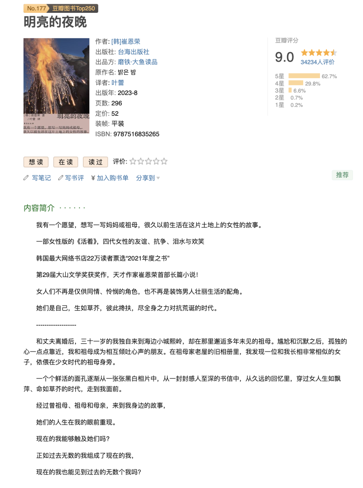

没想到这个系列上次更新已经是快4年前了....

[book思议之《百年孤独》](https://mp.weixin.qq.com/s?__biz=MzU1MzY1MjIxOQ==&mid=2247483686&idx=1&sn=cccd19cee2041479068789b30ce7aa45&scene=21#wechat_redirect)

[book思议之《局外人》](https://mp.weixin.qq.com/s?__biz=MzU1MzY1MjIxOQ==&mid=2247483748&idx=1&sn=905c309bff635a85e4e0d3229b7511f8&scene=21#wechat_redirect)

[book思议之《被讨厌的勇气》](https://mp.weixin.qq.com/s?__biz=MzU1MzY1MjIxOQ==&mid=2247483817&idx=1&sn=63b0017f149220a7f8b25220064ac9ca&scene=21#wechat_redirect)

[book思议｜《82年生的金智英》](https://mp.weixin.qq.com/s?__biz=MzU1MzY1MjIxOQ==&mid=2247483996&idx=1&sn=cd91a95d115cb5db5c2fc152084df36e&scene=21#wechat_redirect)

[book思议｜《黑箱》](https://mp.weixin.qq.com/s?__biz=MzU1MzY1MjIxOQ==&mid=2247483993&idx=1&sn=4a25f87a542fc60683b85e35f0a0f776&scene=21#wechat_redirect)

[book思议之《月童度河》](https://mp.weixin.qq.com/s?__biz=MzU1MzY1MjIxOQ==&mid=2247483693&idx=1&sn=06c9b0ec9dd9229c358fa3d6743bc0e5&scene=21#wechat_redirect)[book思议之《白说》](https://mp.weixin.qq.com/s?__biz=MzU1MzY1MjIxOQ==&mid=2247483777&idx=1&sn=24e0f9bccc9426aa519a687eaad72515&scene=21#wechat_redirect)

年末实在是忙碌，但在忙碌的时候突然看到一本让我爱不释手的书《明亮的夜晚》。上下楼梯读、等地铁读、躺在床上读、一起床就想读… 很久没有的体验了… 上一部让我很想一口气读完的还是《百年孤独》呢，也和百年孤独一样，它描述的也是跨越了百年历史的故事。

这是一本记录曾祖母、祖母、妈妈和我四代人之间的小说，虽然是小说，但描写之细腻真实让人觉得这好像就是一部传记。它讲着韩国跨越百年的关于战争、友情、女性的故事。很少提及男性，但父权制的压迫时刻压在这些善良的女性身上。

同样是韩女的作品，比起读《植物妻子》的压抑、时不时就想合上书喘一口气，《明亮的夜晚》虽然也讲了很多离别与不幸，但总体基调是如此温暖、坚韧、有一股涌动在这群女性中的暖流一直萦绕着。

阅读过程中，我对她们有一种信任感，我相信她们一定会渡过黑夜的。就如书名一样，书中四代女性走过的长达百年的时间就像漫漫的长夜，但是，那不是伸手不见五指的漆黑的夜，而是充满隐隐光辉的明亮的夜。

虽然有人会把它描述为女性版韩国版的《活着》，但它并不只是讲述苦难与爱，它还会描述广阔的宇宙、深邃的星系、浩瀚的大海，在自然中，每个女性都展现出了生命最原初的样貌。—— 就如译者补充道，这其实是生态女性主义浪潮的一个写照，女性与自然的关系总是亲密的、密切的。

"地球之外还存在一个人类无法测量的无限的世界，这一事实安慰了我的有限感。和宇宙相比，我就像是挂在草叶上的水滴或没有嘴、生命短暂的小虫子。"

"在这种想法当中，一直倍感沉重的自身的存在也变得轻盈起来，那种感觉我一直都记得。夜空中看似成群的星星也完全是孤独的，凝结成一个点的物质在膨胀的宇宙中也会迅速地远离彼此."

"直到亲眼看到大海，她才明白，原来大海存在于一个非亲眼所见则不可想象的领域。大海是祖母在那之前所看到的一切事物中最为庞大的。起初，祖母为海的广阔而震撼，但时间久了，就对大海细微的部分产生了感情。下雨第二天的大海的味道，涌上白沙滩的海水的声音，白色的泡沫，薄薄的贝壳内侧那光滑的手感，被冲上沙滩的成堆海草，走在沙滩上的感觉，日落时海平线上方不停变换的颜色……"

"发射于一九七七年九月的“旅行者一号”是迄今为止离地球最远的探测器。探测器离开地球以后，于一九七九年三月飞越木星，一九八〇年十一月掠过土星，二〇〇四年十二月抵达太阳系的边缘——日鞘，二〇一二年，它离开太阳系进入星际空间。现在，“旅行者一号”依然靠惯性，在几乎不存在重力和摩擦力的宇宙空间中滑行。"
“旅行者一号”的内部装有一张三十厘米大小的黄金唱片。这张镀金的唱片包含来自地球的一百一十五张图像和来自地球的各种声音，加密储存。鲸的叫声、风声、狗吠声、人的心跳声、孩子的哭声、贝多芬的《第五交响乐》的前两节、五十五个国家语言的问候语……

它讲友情：

> 祖母枕着的新雨大婶的裙子上散发出季节的气息——艾草的味道，水芹菜的味道，西瓜的味道，干辣椒的味道，生火的灶台的味道……祖母一直记得枕着新雨大婶的腿，在温暖的阳光下睡觉时的平静。
> 三川啊，新雨现在金达莱开得正旺呢。开城也是吗？我想起和你一起采花吃花蜜的时候了，还有摘了花做煎饼吃，采艾草做打糕吃。现在我看到花也好，看到草也好，都会想起你。看到星星和月亮，也会想起你仰起脸看它们的样子。记得你望着夜空，对我说：“新雨啊，你不觉得很新奇吗？”这也新奇，那也新奇，好怀念我们的三川啊。三川啊，保重身体。

它讲东亚母女之间复杂的情感：

> 但我也希望，我们的关系不要太亲近、太亲密，不要彼此毫无保留、纠缠不休。
> 我陶醉于自己的残忍，毫无怜悯地看着妈妈。是因为说出了被禁止的话语而感到自由吗？还是享受着复仇的快感？但那只是一瞬间。待清醒过来，我开始越来越怕，不知道怎样才能得到妈妈的原谅。
> 孩子不是妈妈用来展示的纪念品！脑海里这样呐喊着，心里却非常清楚，妈妈的愿望并非只是向大家展示自己的女儿，正因如此，我感到非常难过。
> 可是，为什么我愤怒的箭头总是指向妈妈呢？为什么不是向着那些让妈妈选择屈服的人呢？

它讲自我：

> 我走近在空荡荡的家里准备独自上学的十岁的我、吊在单杠上忍住眼泪的上中学时的我、和伤害自己身体的冲动做斗争的二十岁的我、原谅了随意对待我的配偶的我，以及无法原谅这样的自己而忍不住自我攻击的我，倾听着她们的声音。是我，我在听。把你长久以来想说的话都告诉我吧。
> 为什么我不能像自己希望的那样坚强呢？我已经如此努力，为什么还是没有好转呢？在那个哭了很久的夜晚，我想着这些，直视着自己的软弱，还有渺小。
> 是从什么时候开始，总感觉生活不是应该用来享受的，而是用以执行的呢？

怕写太多破坏大家的阅读体验，写太少又难以抒发我对这本书的喜欢。

总之现在真的会有一种冲动， 像淳宝看完《出走的决心》想知道“妈妈想要的是什么”一样，我也想在寒假回家后去跟我的妈妈聊聊她人生中想逃离的瞬间、她感受到那种无形的压在身上的重力是什么，我也想去问问外婆的童年、问问她经历的年代里有没有遇到同样互相支持的女性朋友呢。

而看着天上的星星，我总觉得最亮的那颗是奶奶，有时候想着，奶奶印象中的我和现在的我一定不一样了，她应该也会因为现在的我而自豪吧。有时候我突然会想起童年时候奶奶陪伴在我身边的场景，可太久了，我也分不清那是真实的、还是自己构建出的了。

写到这里突然眼泪就流下来了，因为我突然想到，在我还没有那种”觉知“去了解一下奶奶是一个什么样的人的时候，她就离开了我。

—— 对于亲人，我们总以母亲、外婆、奶奶的身份理解她们、感受着这个社会身份下她们的爱，而不是作为1976年出身的女性、经历了战乱的女性等更完整的身份了解她们。不过现在意识到也不算晚，我依然有时间再去和还在的她们聊聊天。

在这样的一个寒冷的冬日清晨读完了这本书，今天杭州久违地又升起了明媚的太阳。
走在校园里，恰巧看到了两位银发老奶奶正在手牵手逛着校园，真好呢，她们也一定有属于自己的明亮的夜晚，希望她们一直相互陪伴吧～

希望我们也一直互相陪伴吧——
