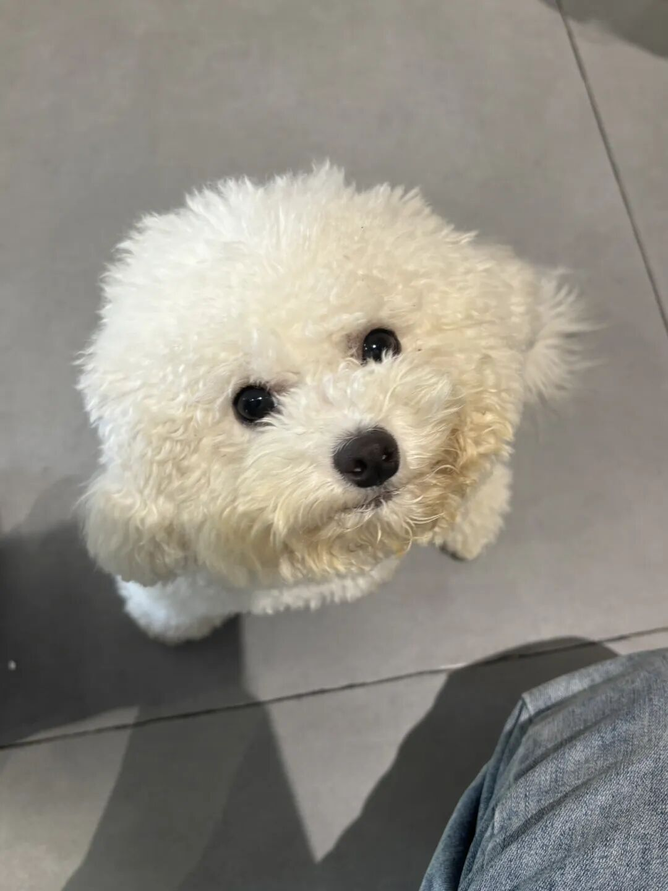
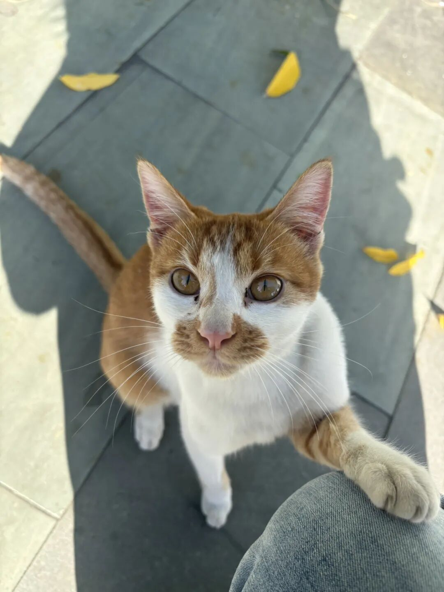

1. 最近想模型、读论文，总是从最初的一篇不断读着里面提到的参考文献，然后再滚雪球地读，滚着滚着就有产生了一些新的灵感，又发现和之前读过的文献的结合。—— 对于知识「connecting the dots」的感受是我最爱学习的瞬间。

2. 这学期随着对于理论理解的越发深入，在找一个合适理论来解释的时候总是会回到最早的原始论文。其中对于机制解释之清楚、分类之清晰让人震撼。

于是想到，之前总建议说，不会写论文的时候就去模仿别人的论文写法，看一段别人的逻辑，然后依葫芦画瓢自己写一段。

—— 但今天想到，也许并不全然如此。

因为你们用的理论不同，逻辑必然也不同。

而就算是用了相同的理论，很有可能别人只截取了其中的一部分，如果仿写这种断章取义的论文，不利于对于理论的全面了解。

—— 于是得出结论，仿写其他部分可以，但理论部分依然需要回到原始文章，找到自己研究契合的部分，把原始逻辑用自己的话演绎出来，且不改变原来的大意。

温馨提示：以上仅为一个研二学生的日常学习感慨，不可当真！仅是一个冒出的 bubble 🫧

ps： 今天看了很可爱的小狗儿小猫！

