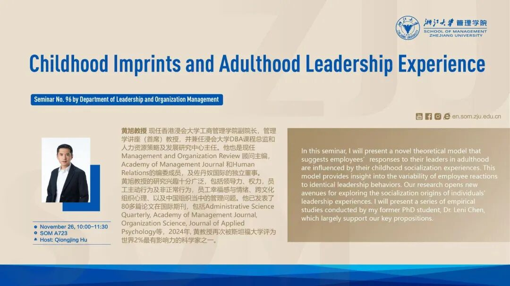
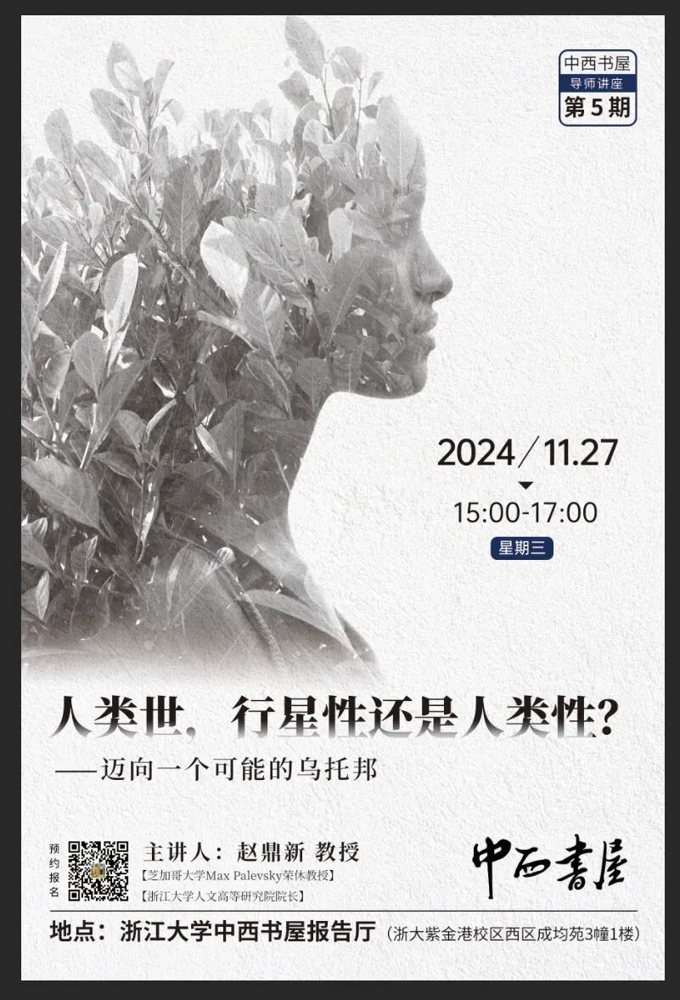
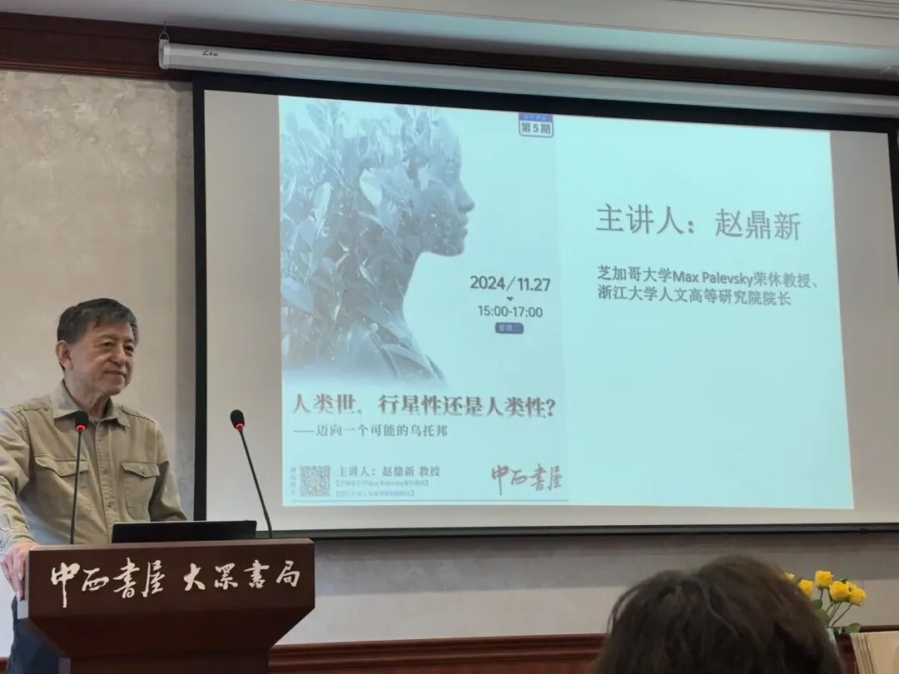
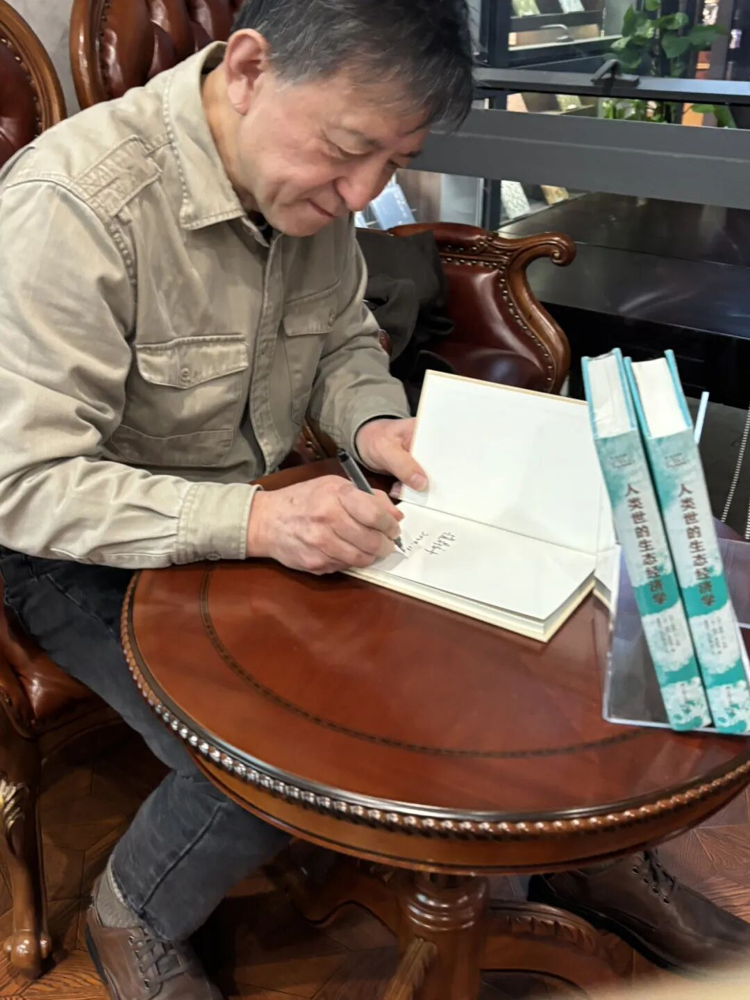
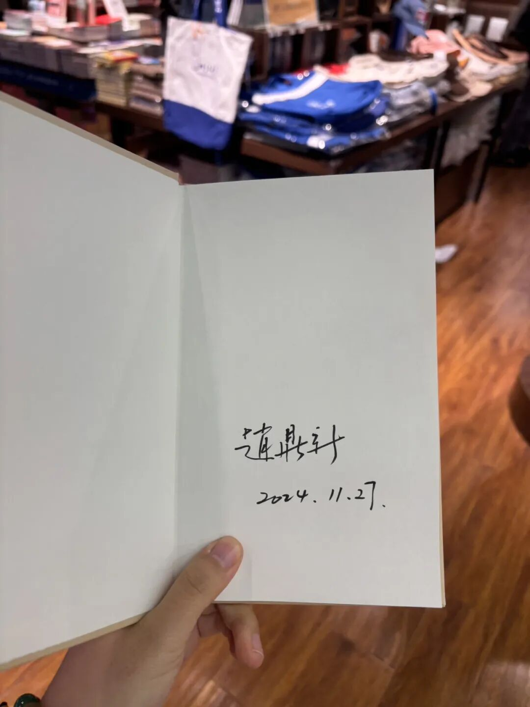

这两天听了OB理论大家黄旭老师的2场研究分享，沉浸式瞻仰了他在theorizing上的深厚功底；

还有幸再次遇到赵鼎新老师回到浙大做讲座，分享他最新提出的宏大的社会学理论。

感悟良多，在此分享一些讲座笔记。

若有问题，均是我的笔记错误，与讲者无关。

### Inspiration from 黄旭：

### 

对于黄旭老师的敬仰我已经在《[Chicago回忆 | 迟来的SIOP参会小心得](https://mp.weixin.qq.com/s?__biz=MzU1MzY1MjIxOQ==&mid=2247485033&idx=1&sn=da71685d1f5b30dd1365472b7e854f3e&scene=21#wechat_redirect)》这一篇写过，除了当时SIOP独自present poster的亲力亲为，现在的他也是亲自改论文、做项目、联系收数据、在presentation的时候兼具理论深度与演讲趣味性，并能精准每一个观众提出的问题，实在是我们领域偶像级的人物了。

**【理论的power】**

- 只要根据理论，一定能找出很有力的解释——理论是指路的明灯 要跟理论做朋友！

- 虽然听众会提出一些基于ta的观察提出的其他情况，但他说“永远要相信理论的prediction！”。  说这么多年来，精心theorizing的研究都没有测不出来的，都是非常符合理论假设的。
-

**【模型构建】**

- 有时候研究会被观众argue说模型中两个相对应的变量并不代表现实中的所有情况。Huang Xu老师回答说，social science的意义是把现实问题抽象化，去反应某种趋势。就像是正态分布一样，我们更关注两端的趋势，但并不否认中间还存在着其他情况。

- 他模型中的变量都是从理论中来。也可以结合2个理论一起。

- theorizing 搭建模型的过程花费了1年，看遍相关论文、理论源起、书籍著作等。
-

**【写作】**

- 顶刊的editor都是老文青，喜欢优美的文字。所以写作很重要。

- 一篇文章至少改30遍。
-

**【其他】**

- 1. out of side，out of mind  多出去，不能宅！（不仅是出去玩、还有出去开会、社交等等 看看外面的世界！）
-

- 2. American economic review

AER上面的OB文章做的很严谨，值得品读。
-

- 3. PHD学生需要具备理论和收数据的能力。（我看《有影响力的研究是怎么练成的》讲到Qin Xin第一篇JAP就全是他自己收的数据）
-

- 4. 做Presentation的时候，「讲」的时间应该短，更多的留给「提问」的时间。
-

- 5. 要和不同背景的人合作，比如CS的、认知神经的。
-

- 6. “我是一个女权主义者。但即使这样，我还是发现我说的有些话在真正的女权主义者面前还是有错。” （并且在今天关于gender的talk时刻注意自己的用词）
（实在令人动容… 🥹 有一部分对女性主义一无所知、上来就是一整个抵触的男性实在是要好好反思…）
-

### Inspiration from 赵鼎新：

### 

赵老师的理论就更超前了，他认为目前的社会学理论都是human-centered，所以在哥白尼的第一次去（地球）中心化、达尔文的第二次去（上帝）中心化后，而“行星性”是第三次去（人类）中心化，“人类性”是更彻底去人类中心化。

**【人和其他生物的根本性区别】**

- 1. 人类是效率&正反馈导向
-

- 2. 人类具有串联机制（looping effect；这个Huang Xu也提到了！）：人的内在想法和认知可以直接影响并产生相应的行为，有时候一些事情莫名其妙就发生了 （像是集体无意识）
-

- 3. 存在特殊因果关系 「ad-hoc」 （这里指一种负面行为）
- 绝大多数特殊机制集中在末端，形成了「末梢重」。

- 人类具有根据具体情况制定特殊解决方案的能力，而不是遵循固定的模式：比如有一些很钻营的人会处处动用小聪明；有一些狭隘的人会用ad-hoc来把他人的行为归因、并通过打小报告来为自己谋利  ——赵老师说：为什么要把人类的大脑用在这些地方？
-

- 4. 社会权力的高度不均匀分布。而这会使得上述三点给人类社会的不确定性和危害性变大。
-

**【特殊因果关系 「ad-hoc」 肆虐的后果】**

- 1. 特殊性因果关系在社会中越多，该社会中的个体就越缺乏超越精神，缺乏科学与艺术想象力。

- 2. 一个组织制定的规则越多，越繁琐，个体为在这些规则下获取支配而发展出来的特殊性因果关系就会越多，越复杂，对规则的尊重就越少，规则也就越起不了作用。

- 3. 在一个特性因果关系越多，越繁琐和重要的地方，个体就越会产生一种内部性的自信，而创造出来的概念和“话语体系”也就越难被其他地方的人所理解。

- 4. 特殊性因果关系在社会中越重要，行政、政治和学术语言就越花俏、复杂、不实事求是；产生这些机制的结构与其预定的功能就越会脱节。
-

**【话语与权利】**

- 1. “不要给自己的话语以任何权力 。”
-

- 2. “我很希望我的思想没有人听。如果社会中开始以某一种思想独大，出现「大思想精英」，那是有问题的。”
-

- 3. “我的观点都只是一种「观察」，而不是「评价」。「评价」是没有道理的 ，把自己的地位搞高了。“
-

【洒脱】

- 1. "吃亏之后，有时候我们能以更宽广的心态看待得失，就不会陷入这些小算计中。未来我们就不会进入「这种游戏」中“。
（想到陈晓萍老师说的：委屈导致胸怀；
以及《好东西》里说的，
如果游戏规则是这样的话，那我们就不玩这个游戏了。）
-

- 2. “把现实的东西看的太重反而会导致「末梢重」，抑制了creativity。把东西看假了，心量才大，结果也会好。“

由于今日还有其他任务，暂且整理到这里。

最大的感受是，卓越的人文社科学者往往具有广博的学问视野。他们不仅深谙哲学与政治的脉络，还能在数理化的微观世界中窥见宏大问题的起源与演化。

正如whole person的视角一样，我们的认知也应该是whole-discipline的、在文理交汇中不断建构更为完整的思想体系。

总之，从自然的进化之路到形而上的哲学思辨，一切都蕴含着值得探索与融合的深邃维度。

愿自己能广泛涉猎，多听不同学科的讲座，多看书，不断向这些博学多才的学者看齐。全面！

甚至买了一本《什么是社会学》还要了签名！

第一次见这么端正的签名✍️

读了几页感觉其中思想和我们的研究真的很相关 太酷了！！

