上周六瞎发的征集真的有一些好心人填写了，感人，谢谢大家陪我玩！里面的建议我也会考虑一下用什么样的形式达成，之后再写一期跟大家讨论啦。

昨天还刚收到一条新的，说的是建议我一周或者两周 bubble 一次哈哈哈，每次写的垃圾话还有人真的会认真看也有点太感人了。—— 于是开始本周 bubble ——

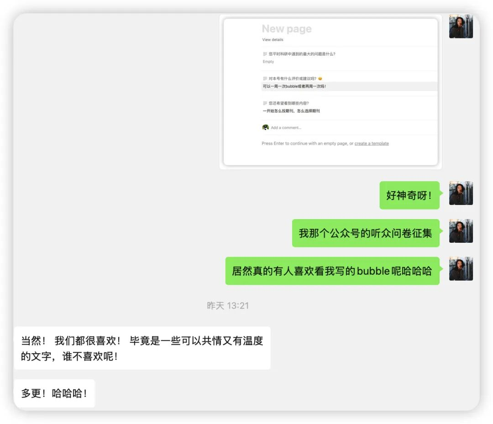

**#1 参与者与旁观者**

周一到周五我大多数时候是生活的参与者，热情地跟人说话、跟姐妹贴贴、和朋友们讨论研究、在组会上发言、和咖啡店的老板娘唠嗑等等。做什么都很迅速，走路很快，对时间的使用虽然不过多算计、但心里始终有个花时间的尺度。

而到周末，我就彻底变成了生活的旁观者。用龟速行走、10 秒爬一级楼梯、吃一两个小时的饭…观察植物、光影、行人，时不时转头看看身后的风景、一个人散步探店听播客…很少说话。

似乎在以7 天为尺度，循环着达到着某种动与静的能量平衡。

oh，更神奇的是我已经从稳定的INFJ-A 变成了两次结果都是 ENTJ-A，这么多次下来居然一直不变的就是这个-A 了，一直很坚定，从不内耗。。。

**#2 再见爱人**

最近大家都在看再见爱人，前几期还看了挺乐呵，还能嘲笑一下杨子的可笑...

但到后面越来越觉得，再见爱人这个综艺本身就像是心理学实验中的视频操纵材料，并且可以顺利地通过 manipulation check—— 这意味着如果仅仅看过这些视频，那人们大概率就是会产生消极情绪，比如生气、愤怒、厌恶等。

所以如果网友们因此产生了消极情绪，那并没有什么好苛责网友的，只能说节目组的操纵材料很成功。

- 只是更可怕的是，这种操纵材料除了激发了消极情绪，还激发了一部分人的恶，于是单纯的消极情绪发酵成了指责、控诉、讨伐，并进而通过群体的情绪传染变成了网暴。

而作为一个心理学人，稍微学过一点点的心理咨询，我对麦麦的态度很复杂。

一方面，我也是被视频片段成功操纵出了消极情绪的被试。事实上，生活中若存在这样的人我也会敬而远之，我不想自己的能量被吸尽。

另一方面，我又在想，如果我用咨询师的角色听到她目前的故事，我一定还会追问她，之前发生了什么，她是怎么样肉眼可见地状态、甚至面相都发生了变化，她经历了哪些很大的人生实践、她和她的伴侣如何应对，她的家庭等等。我想背后一定有很多原因。

第二季的时候张婉婷也是同样被全网痛骂的角色，可后来也有一部分人能慢慢理解张婉婷的处境。我想张婉婷「表达的清晰度」可能是一个原因。她当然有很多让人排斥的不讲理的发言，但有时候她也会口齿清楚、表达流畅地梳理过往到现在发生了什么、她的需求是什么、她的动机是什么，以及她的家庭、她的童年经历了什么、她和母亲的模式是如何，总之她是立体的。

麦麦相比之下，她的表达力是欠缺的，深层原因可能是她的认知能力并没有带领着她去思索自己人生的瞬间、过往的经历——所以她的人物形象很扁平。所以大家确实只能从那些极具操纵性的视频画面中感知她，而没有其他的信息来试着去了解一下她如此行为的内在根源。再加上，从李行亮的角度所传达的关于麦麦的信息也大多是负面的，没有爱，没有珍惜，没有过去的温情瞬间。

如果节目组的目的是操纵大众情绪，那它确实完美、且超过过去任何一季地达到了目的。

可如果像节目组在最开始宣称地那样、要在旅途中引导嘉宾剖析深层原因，我希望他们能在后面的几期中多体现一些善意的引导。

—— 尽管我对此持怀疑态度。现在节目组给人的观感就像是看客、在看热闹，整点一定会出效果的综艺任务、剪点一定能出话题的片段…总之，挺冷漠的...

哎呀 #2太沉闷了 #3说点儿温情的！

**#3 传递一些治愈**

最近我们系里在征集一些奖学金获得者给学弟学妹的话，提前分享一下其中几位的寄语跟大家共勉。

看着这些都要泪目了，是因为觉得好像只有在心理系，大家才会像这样表达一些活人的话语、一些体制内人士未必会喜欢的不那么排比/正确/激昂的话。

大家在说，开出一朵小花也很好呀、follow your own path 也很好、种花看天空晒太阳也很好呀、不用觉得自己非得比别人优秀也很好、多点善行善举也很好… 总之，放下过大的ego、做一个平凡的好人就很好！

而且，或许，在这样的时代下，这样的心态才能让人一直积攒着能量、稳步推进呢。

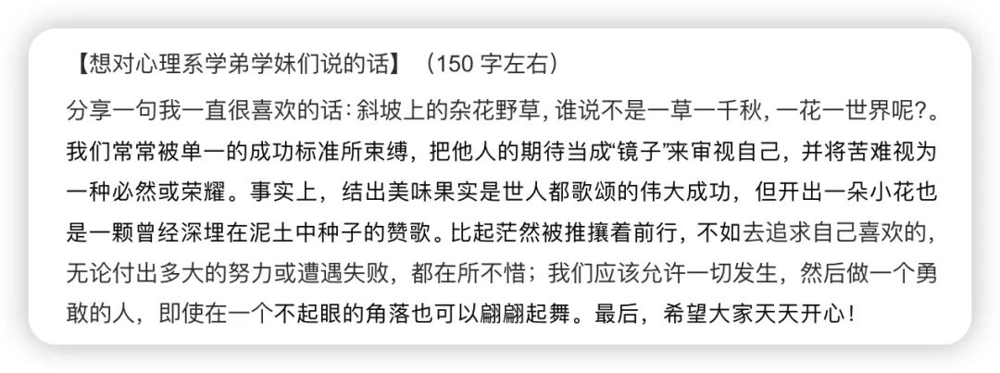

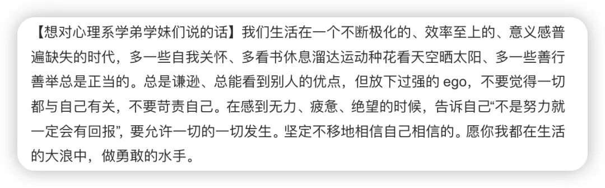

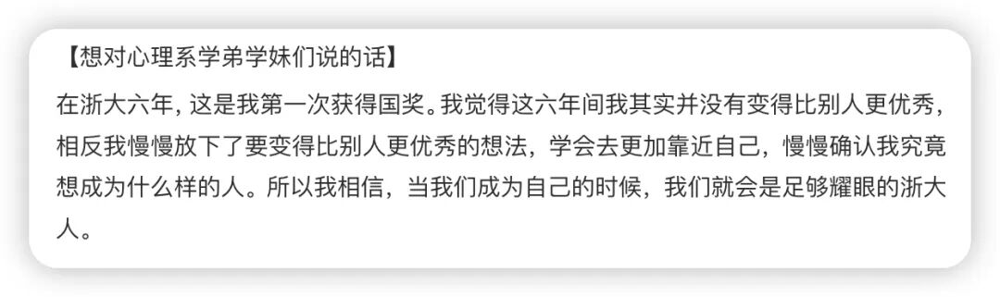

我写的是：

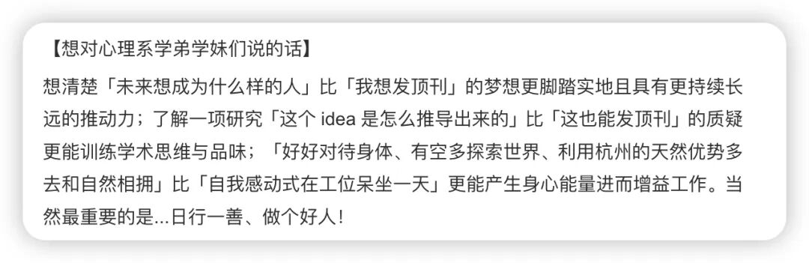

**# 4 晓萍老师的随笔**

大家都知道晓萍老师有很多书，上学期我读了两本偏学术的《有影响力的学问是怎么炼成的》和《组织与管理研究的实证方法》。

这学期我又在读她的随笔，比如《心在焉》《随心所欲》，我在她的学术、随笔、朋友圈中逐渐感知到了她的立体、她的美好、松弛、高效、对生活/世界/人类/研究的满腔的热情。

这也是我第一次对于「看书就是最具信价比地、和厉害的人对话的方式」这句话有切身的体会。以前看的书总是觉得和作者存在距离，但读晓萍老师的书，是因为见过她、听过她的很多次讲座和点评，而现在又在书籍中把她的深度思考和我对她的印象链接了。实在是神奇。

在此放一些印象深刻的划线，来自《心在焉》一书中一篇访谈的记录：

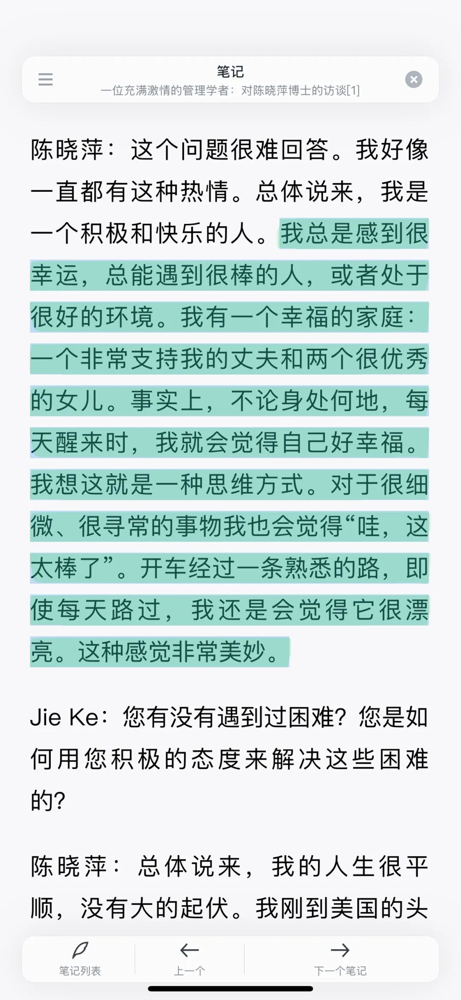

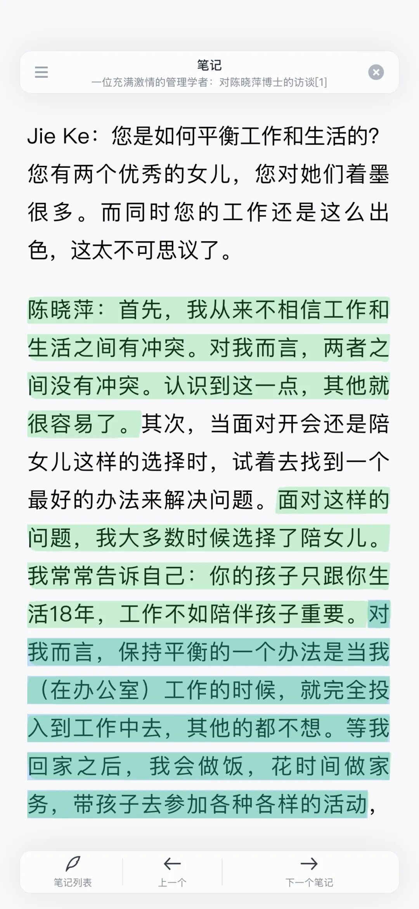

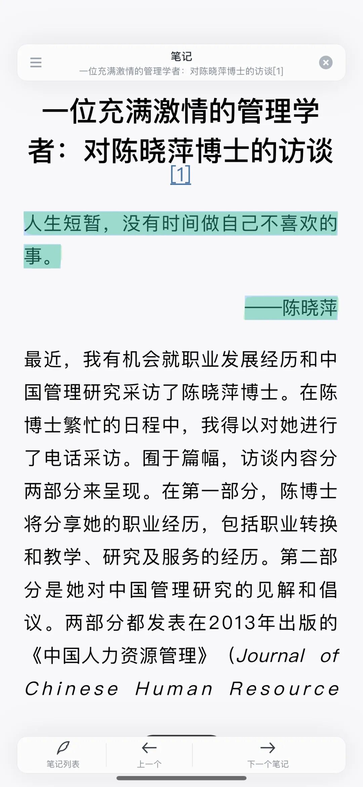

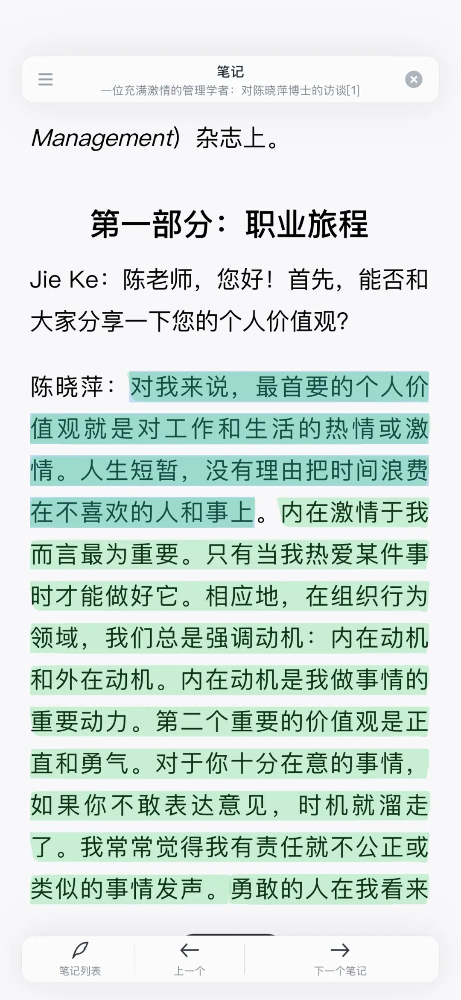

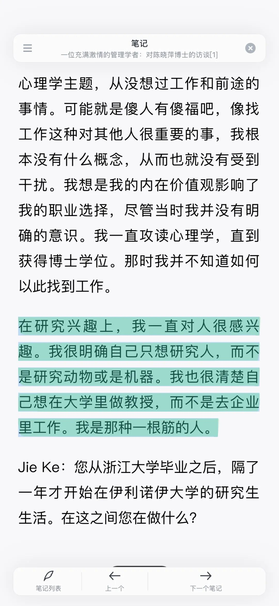

**#5 Hayd**

这周我还继大一后、时隔 5 年去看了 livehouse，是我经常听的治愈系美国歌手 Hayd，耳机里的歌突然变成现场一模一样的声音还是很温情很恍惚，而现场最大的不同在于我可以了解到他每首歌的创作故事、然后带着这种认知再去更好地共情情感。

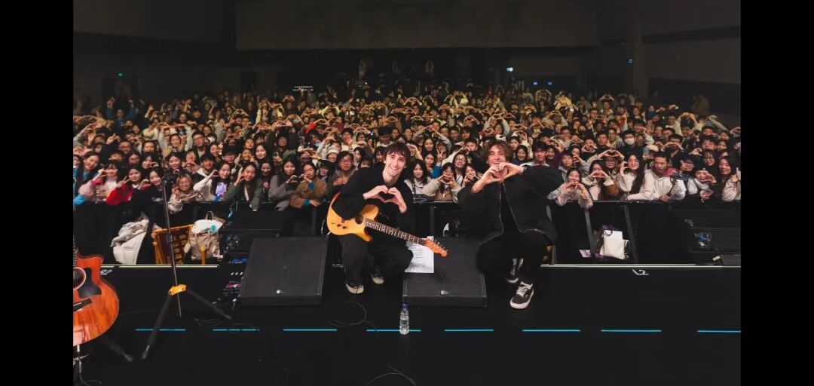

他说，曾经一度想放弃音乐，是因为好像身边总有人在「write big OR write for others or the world」，别人总是立意那么高、那么宏大、去为世界发声，可他却只是在讲自己的故事、 是很小的事情、没有意义。

可在听到听众们不断地说「your songs really comfort us」的时候，他又重新找到了意义，如果能有人因此而开心，如果他自己也同样开心，那就可以继续写下去唱下去。

就像我的这些啰啰嗦嗦的 bubble 时刻，我喜欢把我脑海里的 bubble 用相对书面的形式保留一部分。如果这些部分也能有人看了觉得开心或治愈，那就是「好东西」！ —— 写到这儿—— 顺便，推荐大家都去看《好东西》这部电影，这真的是我今年看过很好很好的东西！

也欢迎你们分享自己的 bubble 时刻，任何开心的、感慨的都可以。祝你们周末开心！
