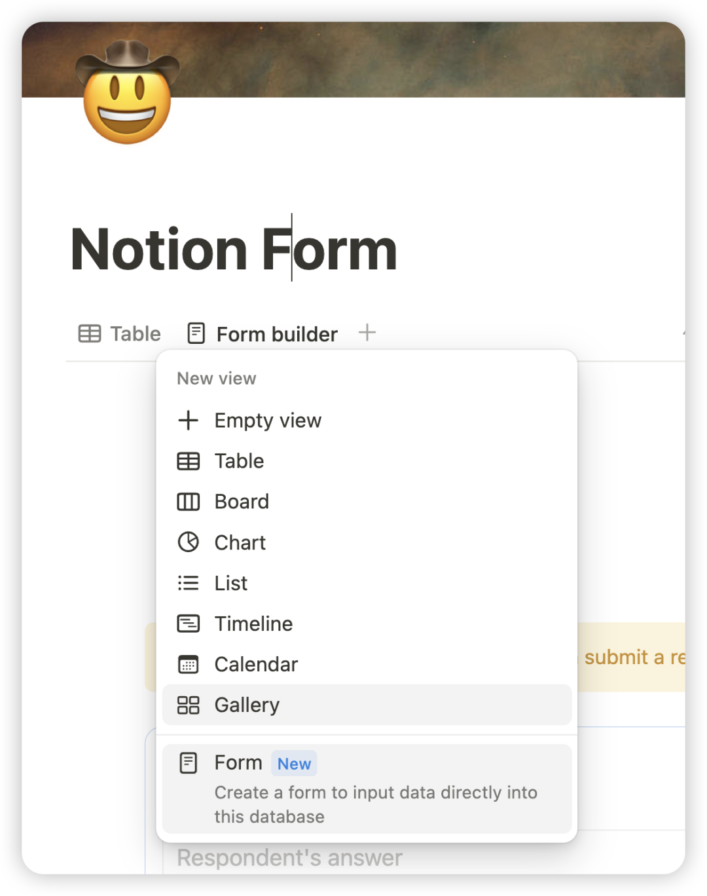
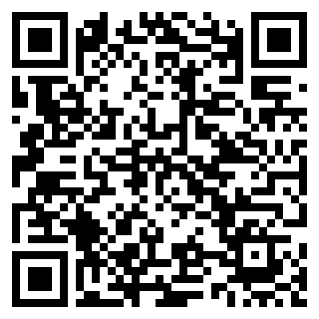

周六我一般就离自己的项目远远的，好好地detachment一下 换换脑子！

今天终于有时间开始研究notion新功能了！开心开心！

前段时间太忙，用的还都是notion最初始的功能，新出的自动化啥的还没研究。

刚才玩着玩着，突然发现了database view 里面居然多出了一个问卷功能，太神奇了！

正好用这个新功能来调查一下我这个号的关注者们，顺便跟大家一起看看这个功能用起来体验怎么样。

如果可以的话，就可以跟大家有更多地互动方式，说不定还能收集大家对于一些现象的初步观察用于之后的研究呢！

大家有空可填🤓 如果收到的数据多的话，我之后再出一期follow up的调查情况 : )

链接：https://bwjzju.notion.site/14089978c0ae800cb66dce4660a4cbd7?pvs=105

二维码：

爱你们！
