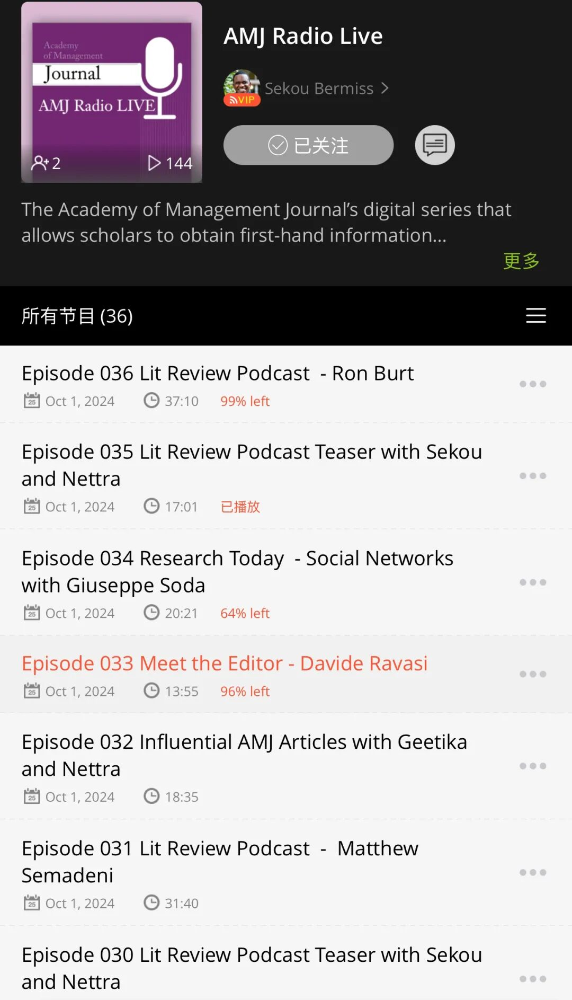

这篇写个短的，主要是Share一些AMJ编辑部提供的资源：

🔹资源1: LinkedIN每周三直播

🔹资源2: AMJ 播客

🔹资源3: AMJ视频

其中这个直播因为有时差，基本上我们也无缘看。但贴心的编辑部也会把音频资源再上传到播客里。

（其实大家也可以多看Marc的linkedin账号 有很多新的资讯）

播客的打开方式是用美区appleID（tb可买）下载Podbean这个播客软件：

然后搜索下面两个栏目就能听到资源1和资源2啦：

视频资源当时并没有说具体在哪里，但我在YouTube上有看到一些定期更新的视频，可以没事儿了看看：

Let's enjoy the academic feast!😋
