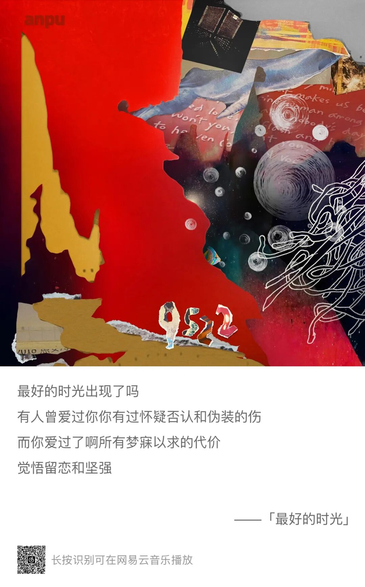
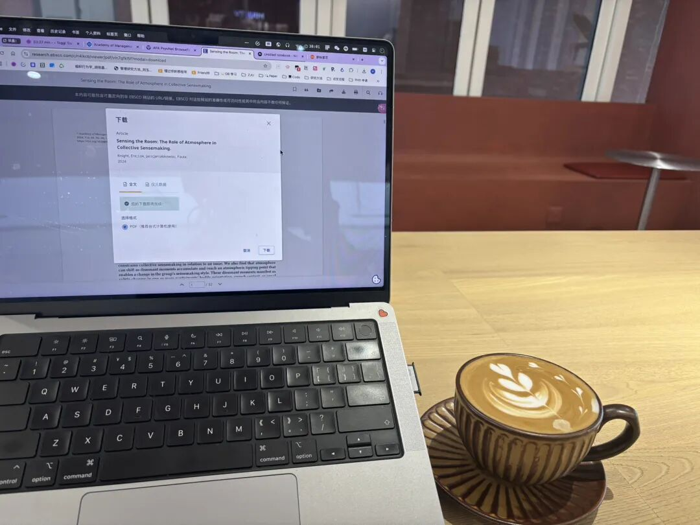
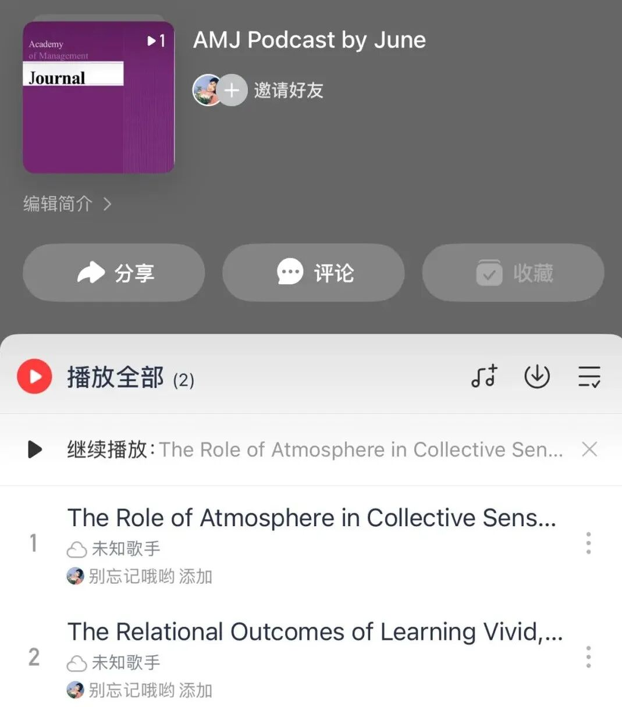
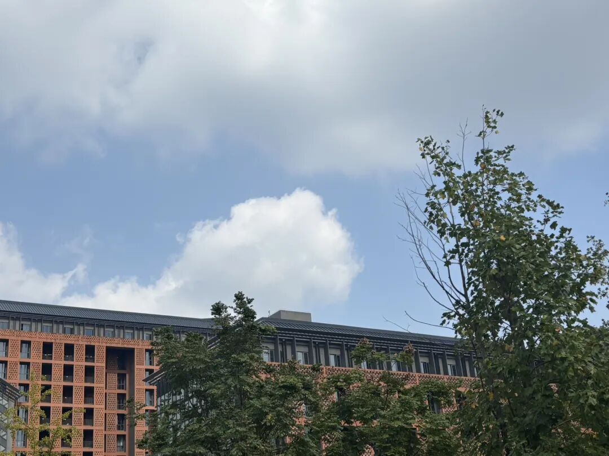
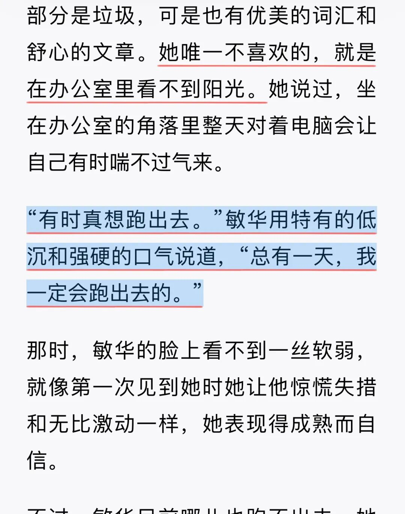
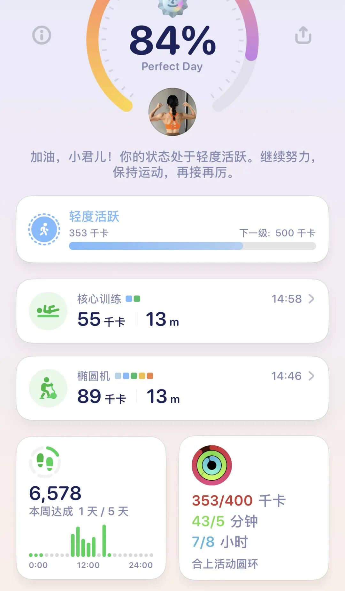
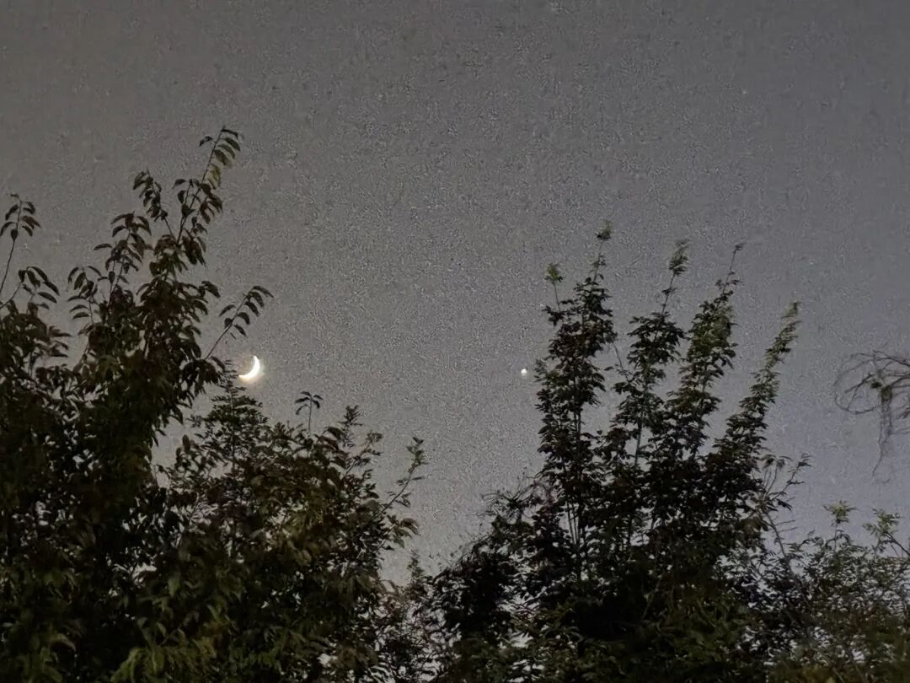
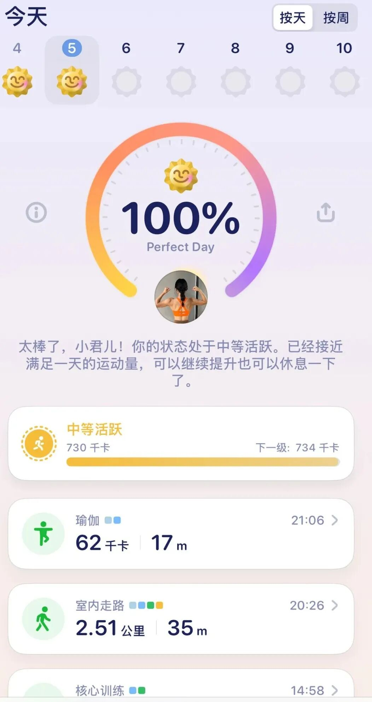
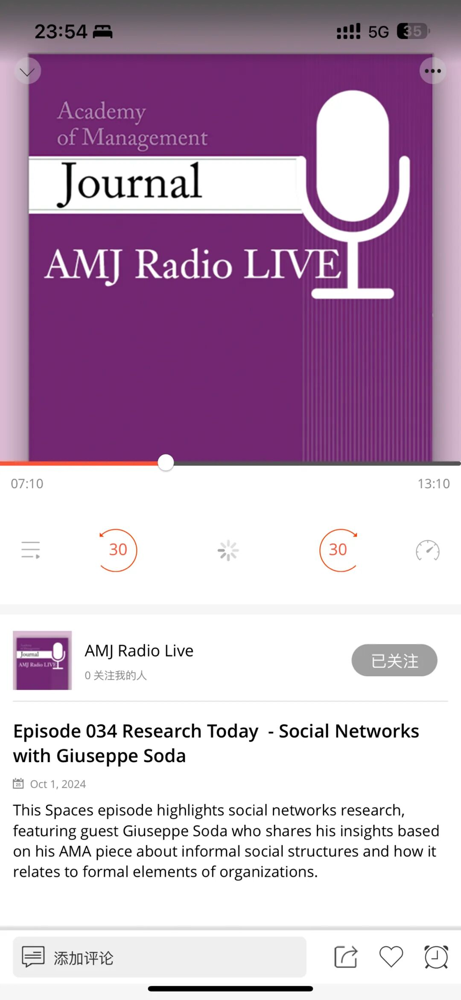

这几天高产似母猪，连上这篇简直是2天更新了4篇公众号...突然感觉公众号就像我生活的支点，只有在生活很有秩序感的时候我才会快乐更新。

最近这周确实就是最好的时光！没有组会汇报的压力、没有论文ddl，每天就是优哉游哉看看论文、想想模型，真的太peace了，所以只想多写点、珍藏一下这段时光。

这两天：

·8点起床 （上周团建询问了我们组一个每天五点多起床的人如何做到的】 他说就是慢慢来 所以准备这周8点 下周7点半 我要慢慢养成早起体质！真的好想拥有早起后时间充裕的感觉！

·最近天气很好，我每天像一颗向日葵🌻一样，看见阳光就只想冲出去晒晒。所以一般洗漱完我就直接出门去我的老据点咖啡店（一个离食堂、健身房、卫生间、古茗星巴克罗森一鸣、电动车充电桩都很近的地方 我可太爱了）。

·点杯咖啡，开始固定时间的daily reading（还是刚训练自己做的呢 还是得固定时间做这件事）：下载最新的文章-导入Notebook LM - 生成音频后去咖啡店旁边  边晨间遛弯 边听音频 —— 然后大概大脑也就清醒了。

·然后开始上午的深度科研工作。

午饭时间到！在食堂吃点清淡的，边吃饭边看看b站的旅游视频；今天是预约了我们系老师的lunch time meeting，结果我们在愉快地聊《再见爱人》哈哈哈哈，她说太好看了！难得为芒果充个会员。

吃完饭开始边午后晒太阳、边读会儿书。终于开始看《植物妻子》了，写的太细腻也太真实了。谢谢韩江。

·差不多看了会儿，做点科研工作里不费脑子的dirty work，毕竟吃饱了脑子也不咋转

·到了三点多差不多已经灵魂升天。—— 这时候，去运动！出出汗就可以感觉活过来了！

·用最新鲜活跃的脑子开始下午的深度科研工作了！

晚饭时间到！也继续清淡食堂。吃完后带着耳机听歌散步吹晚风、早的话还能看看落日: )

今天有很明显的“星星伴月亮”（虽然苹果拍不出来）

·晚上感觉脑子也不太好使，只能进行一些简单的科研工作，整理整理文件\代码\数据结果\看看项目进展情况 安排安排之后还有哪些没。

·到晚上8：30再去健身房运动一下子！一般是爬坡+瑜伽拉伸，让老胳膊老腿伸展伸展！

（排版不知道为啥这样了 不管了orz）

美美回宿舍！我的宿舍太高了在7楼，这个时候一般就开始打开vpn，边看linkedin上有没有什么有意思的学术讯息，边慢慢渡过这个爬楼时光。一般到宿舍的时候我的科研脑又会被linkedin短暂激活一下，所以就打开podbean听听AMJ Podcast，边听边收拾宿舍、去洗澡。然后边洗澡边回顾这一天~

之后可以继续看看书、然后再看会儿再见爱人，就睡啦！

哎呀 真是开心！家人们晚安！

PS：不固定工位真的很好！如果有什么研究生导师在看这条，请允许你们的学生们开心地多切换切换吧，有利于脑子恢复、可以之后更好地科研呢🤠
