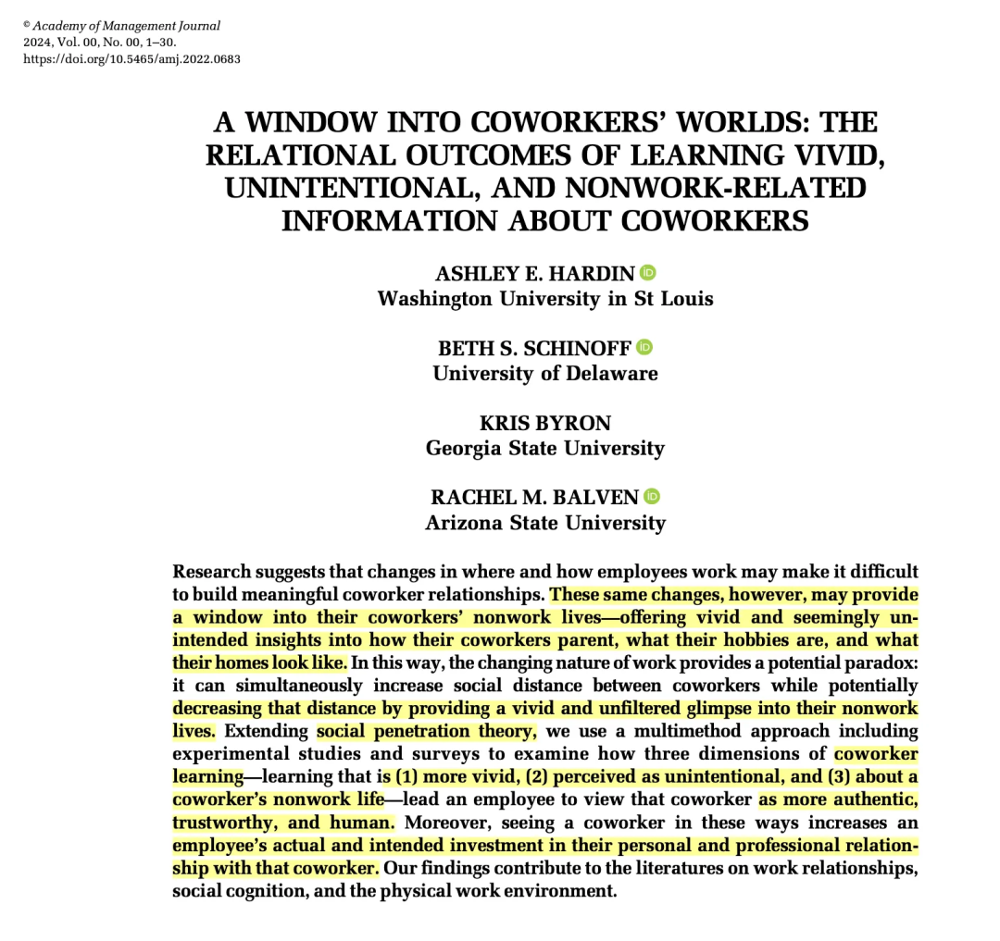
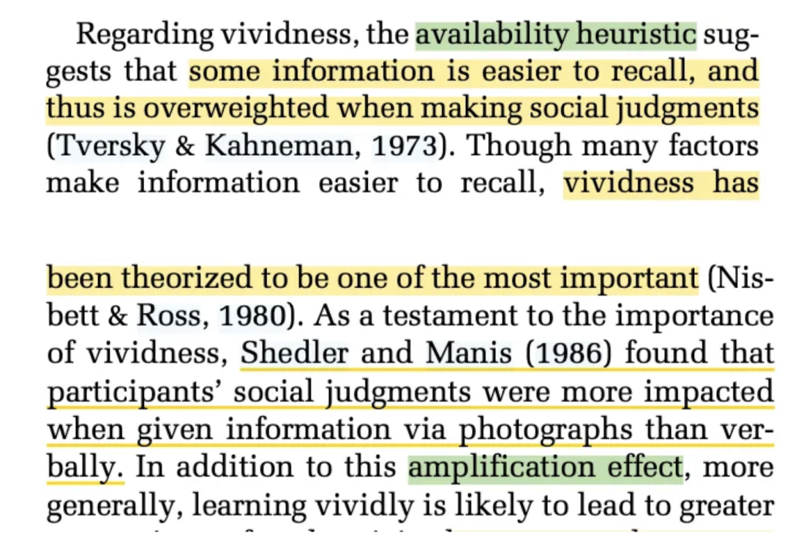
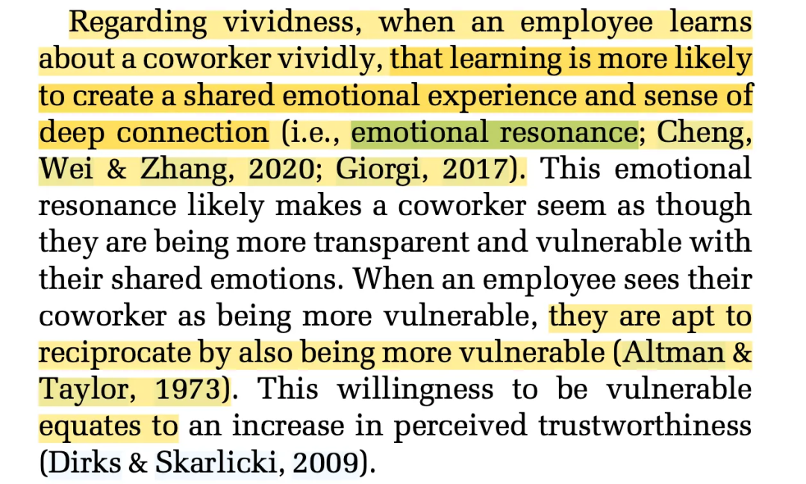

陆续更新一下在AMJ PDW的收获～

**第一个点想聊的是，Mechanism到底是什么？**

如果问参加PDW前的我，我可能会回答，Mechanism就是X-Y之间更细致的关系，比如通过什么Mediators、又有什么Moderators作为边界。

而参加完PDW后，我意识到以前仅仅把Mediator/Moderator就称为“机制”是不全面的。

我所在的小组分到的AE是Georg von Krogh，虽然他是分管Macro的Deputy Editor，但对于Micro的theory/hypothesis/mechanism却都有非常深厚的理解，让人敬佩。

总之，Georg强调：

- Mechanism 是 Hypothesis背后的逻辑，而Hypothesis是mechanism的整合和总结。
- **Mechanism 需要足够细致具体**，它不单单是X-M-Y的关系，而是为什么X会影响M、背后的逻辑是什么、X满足了什么样的特点因而会影响M等等。
- 管理学的很多Top研究，**不太会把机制本身作为模型的一个构念**（比如仅仅把“resource”作为一个变量是不太好的 事实上我们也真的很少在AMJ上看到这样简单粗暴的Mediator）。好的研究采用的构念往往更具体、可感。

光看这些可能有些抽象，我就随便打开一篇最近看的AMJ论文 ，用其中的一些论证思路来解释一下（当然仅仅是我的个人理解 & 且这个思路肯定不是写作的最好的 之后如果找到一些逻辑惊为天人的就再来分享一次！）：

这篇文章做的是：对于同事个人信息了解的vivid/unintentional/non-work information这三个属性，会影响我们对该同事的社会感知（觉知ta更真实、更可信、更像人）。

我随便找其中一个论证，比如这段想论证：Vivid Learning Increases Coworker Authenticity Assessments

**深入剖析：**

这段论证的X是vivid learning，Y是Coworker Authenticity Assessments。

作者论证的方式是：

- 思考Coworker Authenticity Assessments的“上位概念” —— social judgment。
- 对于social judgment来说，一些显性的、容易回忆的信息对于social judgment是非常重要的 —— 作者借用availability heuristic的相关文献来论证。
- 而vivid learning就符合social judgment所需要的“显性的、容易回忆”特点 —— 作者举了“照片信息比言语信息更能影响social judgment”来论证。

**总结：**

这段进行进行Mechanism阐述的方式是：

提炼出Y的上位概念（比如说是K） —— 寻找要达成K的核心要素（比如说是a b c） —— 论证：X中就包含这些a b c （可以通过一些实证研究论证） —— 之后就可以论出：X可以影响Y

同样的，我们再看另一种论证方式：

作者想论证Vivid Learning Increases Coworker Trustworthiness Assessments：

**深入剖析：**

这段论证的X是vivid learning，Y是Coworker Trustworthiness Assessments。

作者论证的方式是：

- 首先对于vivid learning的过程进行详细解释：vivid learning往往会创造一个共享的情感空间、产生深入链接
- 在这样的空间中，觉得对方更脆弱、而后会相应的reciprocate同样的脆弱
- 这种reciprocate的过程就体现了一种Trustworthiness。

**总结：**

这段进行进行Mechanism阐述的方式是：

X本身具有什么特点 —— 它会产生一种什么样的状态 —— 而这种状态可以体现出Y。

这个逻辑就好像，如果我们要阐述X对Y的影响，就可以思考X通过什么来影响了Y，可以简单理解为找到一个小小的“中介”，只是表达的时候表达要更自然一些。

写到这里，我突然顿悟，作为本科的时候也接触了一些心理咨询课程的人，我感觉论证X-Y之间mechanism的过程，就好像我们在给一位同学进行心理咨询，ta会告诉你ta目前有X，并产生了Y，作为心理咨询师的你需要用不同的“思想工具”来对X-Y之间的联系论证 —— 在心理咨询里这些思想工具可能是精神分析、人本主义、CBT等等，而在我们的学术写作中，这就是不同的literature、不同的theory！

所以，下次在进行学术写作的时候，试着把自己代入心理咨询师的角色！尝试从多个角度来给出X-Y内部Mechanism的解释！

总之，最后我的感受就是：X-Y的关系就像是冰山上的30%，论证冰山下的70%就需要通过广博的literature去思考，这些literature不仅仅是和X Y本身相关，还可能是X Y的上位概念，总之还是得多看文献！

PS：感觉这样拆解逻辑对写作也很有帮助哦！
