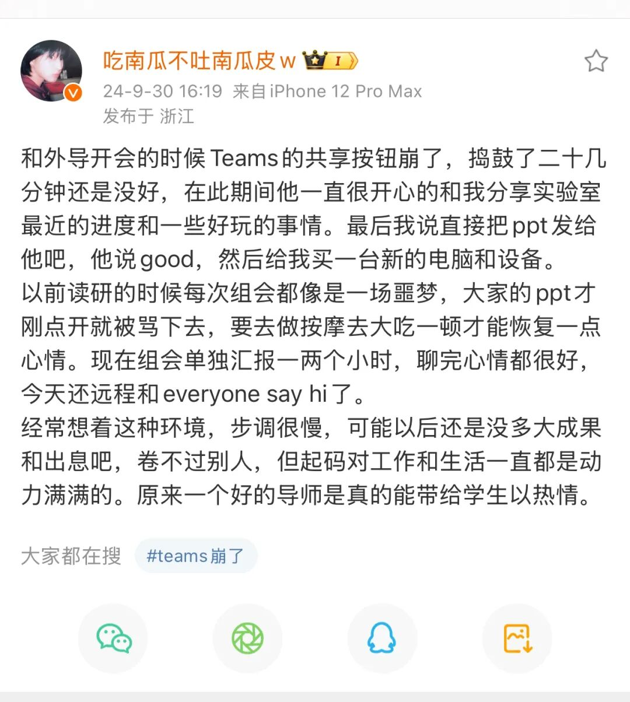
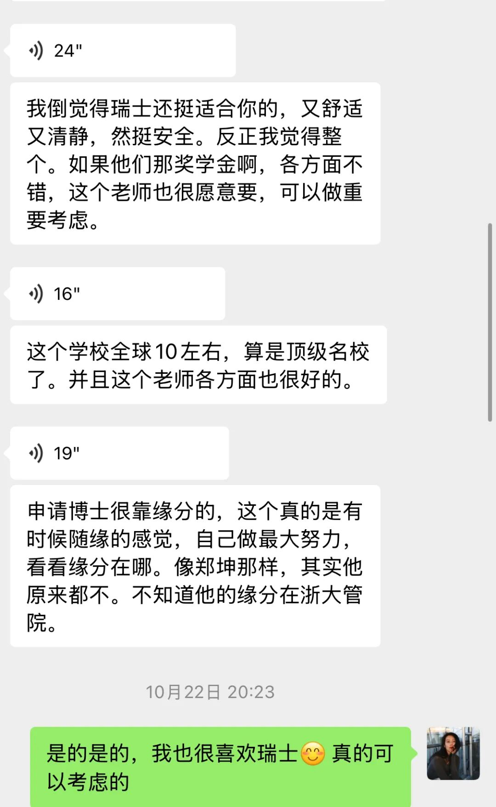
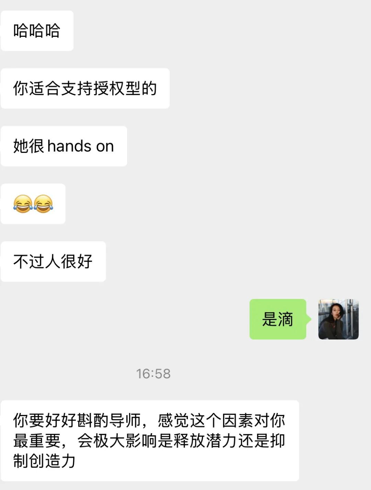
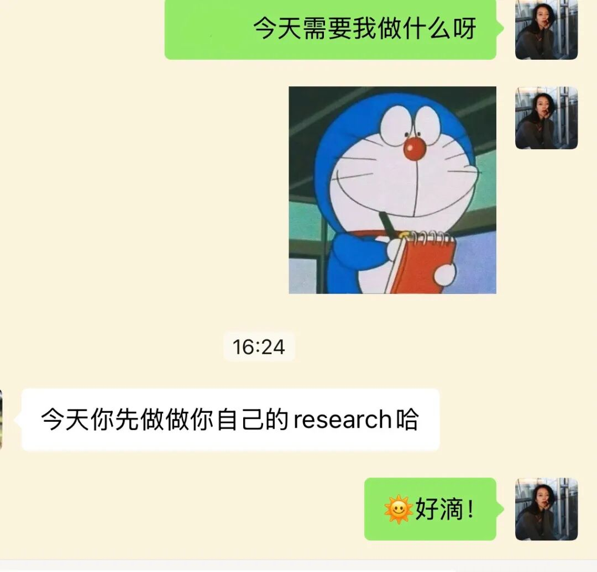

看到这条微博，感慨其实我一路走来已经拥有很好很好很好的导师们了！

研究生开始我就在放飞自我、勇敢表达，一进组就进行了很多“叛逆”发言，比如我觉得天天打卡、固定工位是不科学的，比如今天我又建言说组会安排太多太累了🥲 比如在一些上价值的时刻，我都在表达着“这辈子就平平淡淡健健康康过 做个好人”的朴素愿望、看起来完全胸无大志的。

然而导儿却已经完全接纳了我这般反骨又peace的性格，甚至品出了像瑞士这样的国家对我的极致吸引力（虽然大概率是去不了的哈哈哈），也能知道未来我会适合怎么样的博导。

同时RA那儿的导师也会在没有必须要做的任务的时候让我去做做自己的研究，真的感受到了独立平等的对待。

想想实在感人🥹

以后如果真的走上了学术路，也要成为这样的好导师们！

上上周和系里另一个很好很好的女老师聊天时她说，她就是遇到了世界上最好的博导，所以她现在也对学生超级好！

感谢每一个好人🫰

传递每一份善意和恩情🌻
