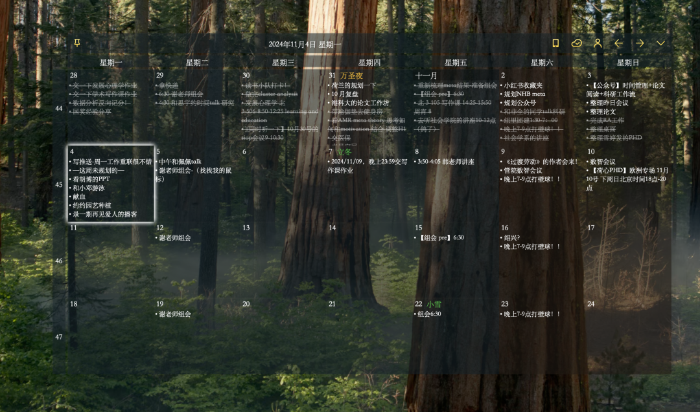
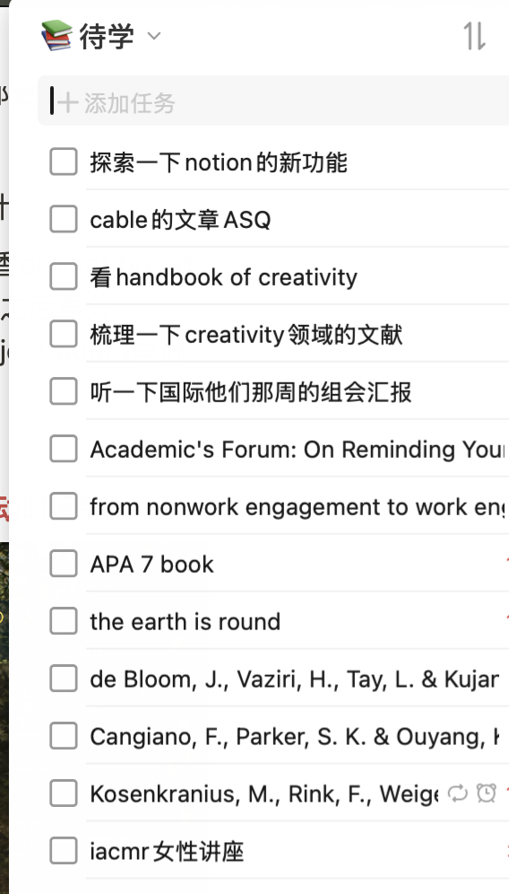
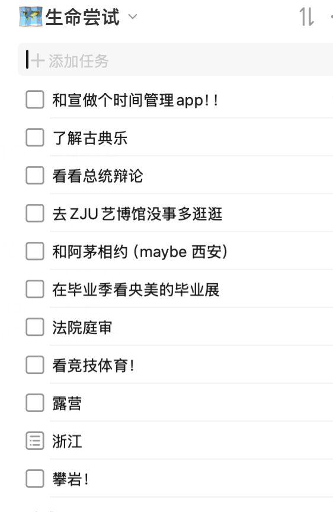
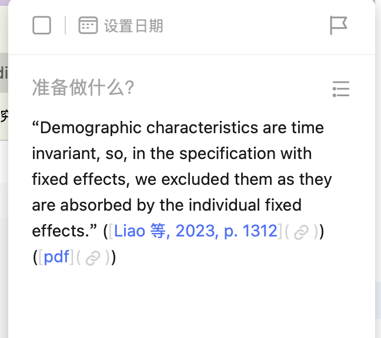
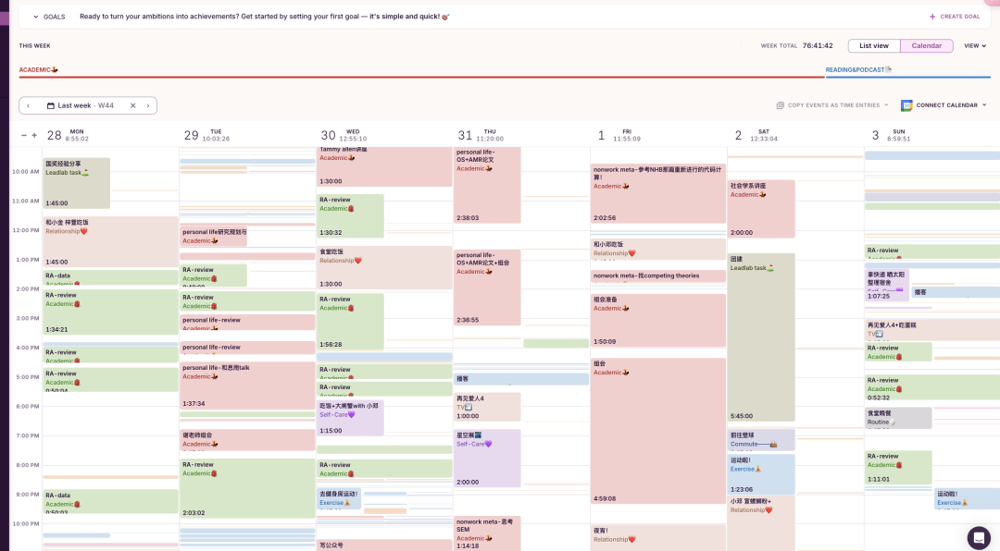
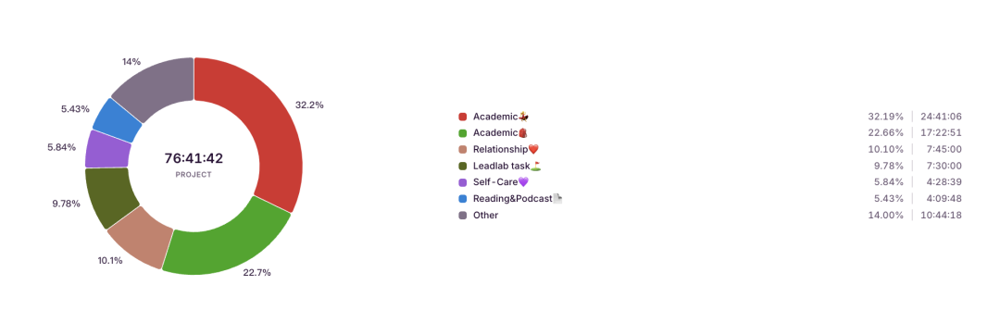

发现周一早上是一个很适合发公众号的时间，可以有效建立起nonwork to work的工作重联！希望之后每周一大家都能看到我的更新😇

上一期发出后，大家更感兴趣的还是「Topic 4」的时间管理和科研工作流，正好我上次也给系里分享过，可以速速先写一期关于时间管理的🫰

# ⏲时间管理

> **Become a whole person!**科研+养生+娱乐都会安排
> **最新感悟：**先安排nonwork，再安排work —— 这样会让自己充满“盼头”，感觉学习都更有动力了！

相比于小红书上复杂详细的Todo安排，我现在的时间管理特简单，也没有过多的精细化设计。—— which is P人也可以轻松用起来的时间管理方法！！

—— 事实上关于科研任务上的todo都心知肚明、当我打开Notion里面project board的时候就知道自己今天要处理什么（可以参考这一期：[科研工具 | 我如何用Notion来管理科研项目？](http://mp.weixin.qq.com/s?__biz=MzU1MzY1MjIxOQ==&mid=2247485183&idx=1&sn=46b4cc67e58304876f85abd8d6a0539a&chksm=fbeedc6bcc99557d2138ac91aa6618b9c5de6e808355fb5eff423d40aa1545a6581d26504792&scene=21#wechat_redirect)   当然当时分享的还是最原始版本的。现在又已改进了一下这个board  之后再分享！）。

所以现在的时间管理形成了日历清单、滴答清单、Toggl三足鼎立的局面：

### 

### **日历清单**

**—— 必做之事的Todo备忘 （如组会、感兴趣的学术会议、安排好的运动时间等）**

- 这个软件可谓是大道至简，我最喜欢的点在于：

- 可以固定在桌面！- 增加exposure！很适合我这种容易忘记事儿的老年人
- 极简设置！点一下当日格子就可以写todo 也不用设置具体时间啥的 - 减少做计划时的资源损耗
- 规划很久之后的行程，不会错过想听的会议和行程 （比如IACMR经常会发1个月之后的会议  我就会用日历清单提前安排上那一天的行程；还有一些会议的DDL啥的）
- 手机电脑同步

### **滴答清单**

**—— 安排**不是特别重要和紧急的事儿

- 同样可以手机电脑同步、有“清脆”的滴答一声 听着很开心😆
- 因为无法像日历清单那样悬浮钉在桌面，所以我总是忘记查看计划😢 所以我用滴答清单就是存放一些碎片化的、未来todo。

- 大家应该都体会过一种「“要做的事情”太多、“能做的事情”太多」的感受—— 这些事儿可能包括要看一下某位学者的讲座视频、下载一下老师推荐的书、把某部电影放进豆瓣。但是很多事情又不是当下就可以做、并且马上安排进我们的日常生活的。——所以我的滴答清单就是给这些todo先暂时“存档”一下，然后每周再抽出一个特定时间来“读档”，思考如何把这些事儿计划到我的日常routine中。

- 还有一些“滴答清单” 其他用法：

- 书影音、生命尝试list…

- 看论文过程中的某句话 你想记录下来之后探索 -

Deeplink功能可能直接跳转回那句话所在的PDF，比如：

- 无意间了解到的可以学习的材料/论文
- 突然飞来的研究灵感

### 

### **Toggl**

### **—— 时间记录&复盘**

- 没想到我已经用了这个软件快半年了！第一次用一个记时软件用这么久呢，也成为了我和宣每次发现新功能都会感慨「人类对toggl的开发只有1%」的神仙软件。

- 总之，我觉得用客观的时间记录可以帮助我们构建主观，有一种觉知和掌控的感觉 —— 比如这周在哪个项目上花了多长时间、是不是看《再见爱人》的时间太长了🌝、运动了多久等等，都可以帮助我们更好地了解自己、并对之后的时间管理进行调整，不至于迷失在时间的海洋。

- 最近宣还发现可以把Toggl的记录导出来，让GPT帮忙分析我们的时间利用情况，她真是一个天才！

点到为止！抛砖引玉！

欢迎大家留言分享你们时间管理的好方法！

AND 我这个也是无数次磨合后形成的结果。其实适合自己的就是最好的！
