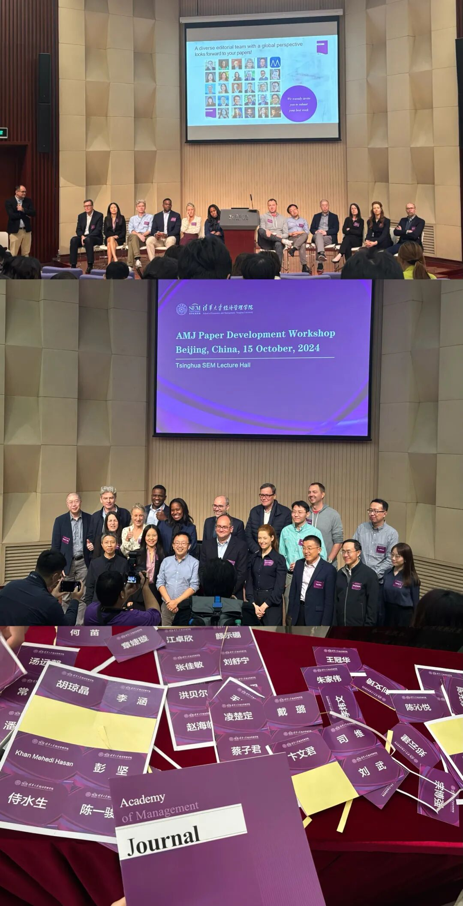
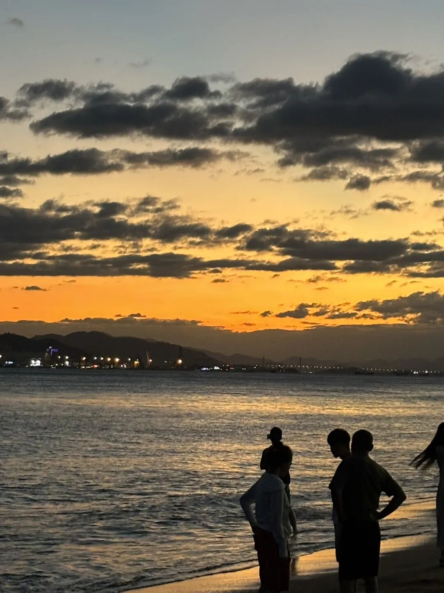
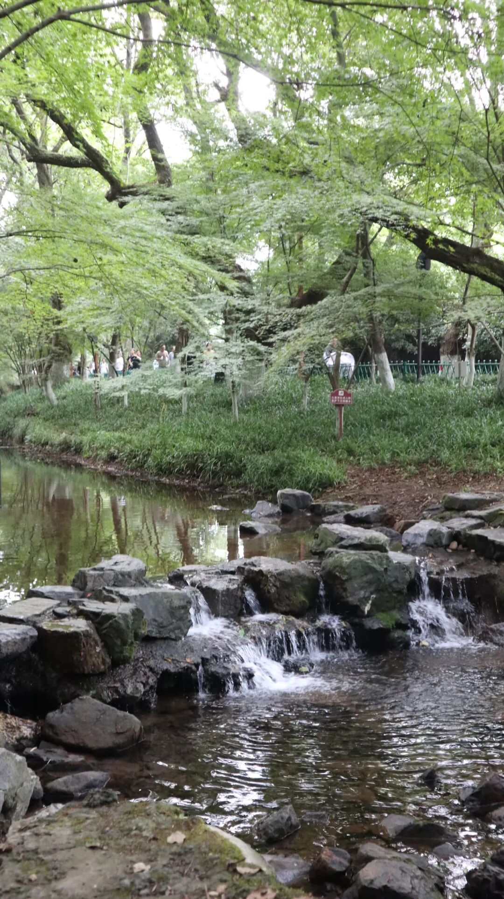
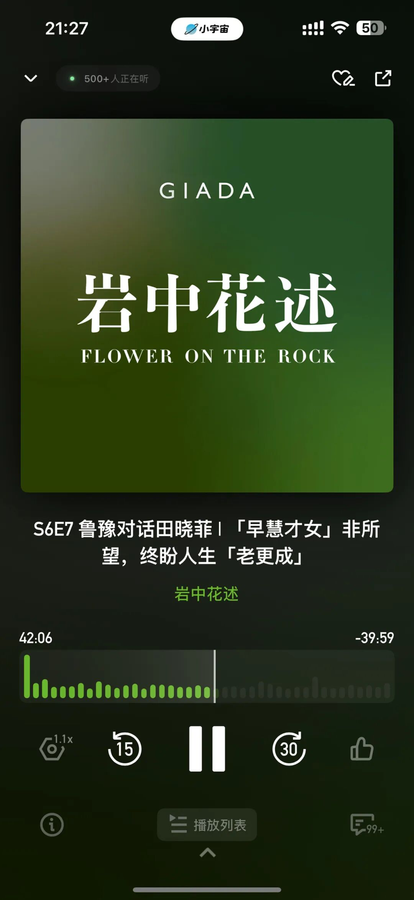
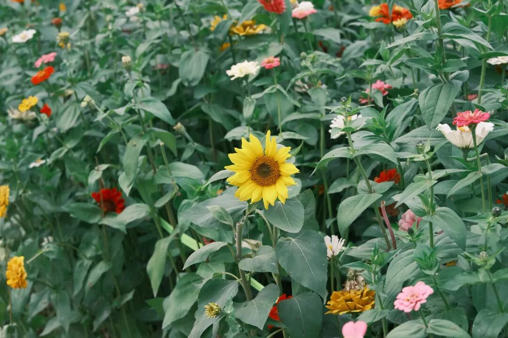

Hi 又是好久不见...

今天小邓说我怎么好久没更新公众号了，于是翻了翻上一条真的是一个月之前了…

看了看我10月的done-list：

10.1-10.6 在厦门边工作边旅游 （看夕阳吹海风吃沙茶面海蛎煎… 永远怀念）

10.7-10.11 准备组会汇报（项目汇报+新文献）+准备国奖答辩

10.13 去九溪徒步了！被蚊子咬了十几个包。

10.14-10.21 在北京 边参加AMJ PDW 边准备学校的课程汇报 边远程工作 边旅游 边见朋友们

10.22-10.26 紧急收尾另一个项目 从零开始起草论文 DDL前一分钟投了IACMR （太粗糙了感觉希望不大）+ 周五还准备了一个简短的组会分享

10.26-10.27 看了《莲花楼》的话剧 和哈利波特的重映！

10.28到现在：项目1重新literature review 思路调整+ 项目2进行逻辑梳理 准备组会汇报 （也得review）+ 组外的review工作  所以这周简直是从早到晚看文献Orz

实在是work- related tasks过多，闲下来的时候就完全让自己奔走在外充能，因而就失去了把自己的能量通过公众号分享给大家的心力。

好在到本周五的组会汇报结束后（很难想象这一个月我已组会汇报3次），我应该可以稍微松弛地渡过一段时间，同时在上周「work-nonwork-work-nonwork」不断switch后，到现在我也几乎恢复到了基线的能量水平，最终也并没有感觉这个十月太suffering。

So 11月还是会好好更新的！我想了想可能会有这几个内容想跟大家分享：

1. 我在AMJ PDW的收获

2. 听Sharon Parker讲座的一些收获

3. （11.9-11.10 在ZJU管院还有一个大佬云集的会议 我想应该也有一些收获！）

4. 目前的时间管理+科研工作流

5. AMR 2024 的domain switch theory

6. 过去1个月略读到的一些好玩论文 做个合集 （可能只有摘要+1个结论 目的是抛砖引玉 让感兴趣的同学自行阅读）

…

先立这么多Flag 希望能一一更新哦！

今天听「岩中花述」，田晓菲教授分享了一句她喜欢的一句、陶渊明的不那么知名的诗句：

“虽未量岁功，即事多所欣。”

意思是：虽然没有计算今年的收成，但是眼前的的一切就已经让心中充满了喜悦。

同样的，我10月所做的这些看起来很忙碌的事情，其实根本无法量化为有什么成果，甚至在这个月里有很多思路需要大规模的调整、重新进行literature review和story telling。

但好在，我依然在这般极限的生活中找到了自己淡然松弛的节奏，可以较为平静地度过、渡过。

过程便是意义，既事多所欣。

祝你也淡淡地开心着吧！

AND 健康最重要 晚安大家！

