这个系列终于开始更新了… 因为上个学期还在一个 OB 入门状态，以实证为主；这个学期就有在慢慢看一些理论和综述文章了，也真的能 get 一些理论的美感。

今天分享一篇Murray 等大佬在**AMR** 最新的**Purposeful Working Behavior**的理论文章，是对 2013 年提出这个理论时初步框架的补充。这也是因为他们获得了AMR Decade Reward奖项，所以有幸可以再 free 写一篇！

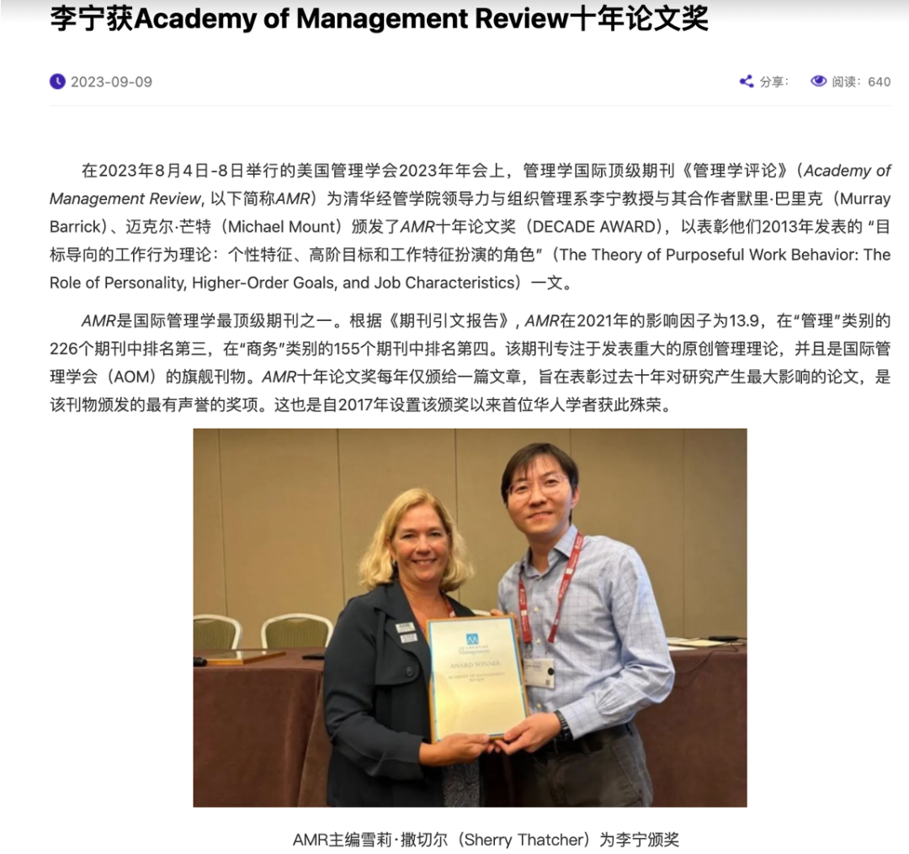

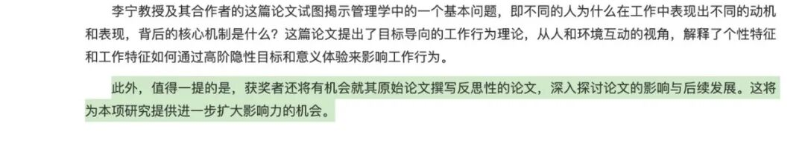

这个理论还是非常清晰简单也很实用的， 2013 年的原始理论主要从人格与工作任务属性交互的视角回答了***“Why people do what they do at work？”***的问题。作者团队提出，不同的人格会对应一个 implicit high-order goals（内隐高阶目标），我们是为了追寻这个目标而去做出一些行动，而在一些匹配的环境（工作特征）中，则更有利于促进这一过程，以下表格就呈现了**人格-高阶目标-任务属性**这三者的对应关系：

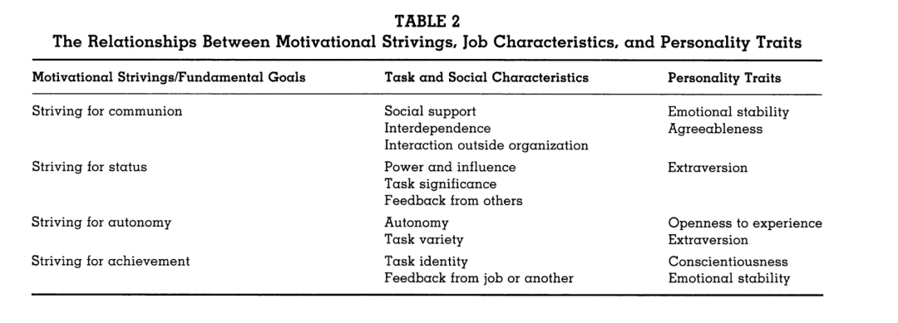

而这张图则以 agreeableness 和emotional stability这两种人格举例，刻画了上述过程：

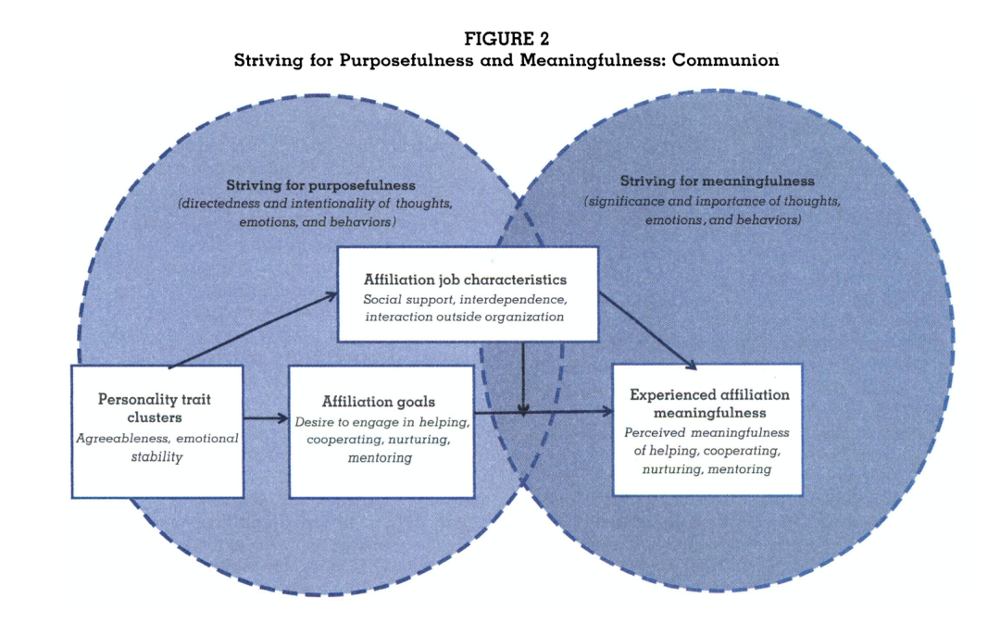

宜人性和稳定性人格会去追寻这样的目标：参与帮助、合作、培养、指导，这会让他们感受到意义感。

此外，在一个具有社会支持、工作互倚性等特征的工作任务中更有可能加强上述积极过程；

并且，一个拥有宜人性或稳定性人格的人在找工作时，更会去寻找符合Ta 高阶目标的工作。

如蓝圈所示，前半段是为了寻找目标，后半段是去体验意义。

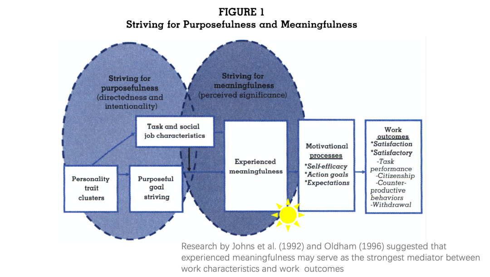

意义感也被认为是在工作特征和工作结果之间最重要的中介，因此作者在这个理论中也将其定为核心的中介。意义感之后则是如自我效能、目标实现等动机过程，最后影响工作结果。

而 2024 年的理论则结合近10年来用了这个理论的研究，在原有理论基础上进行了反思、迭代、升级。

**改变 1：**增加除了人格外的个人差异维度：新增个人兴趣与价值观

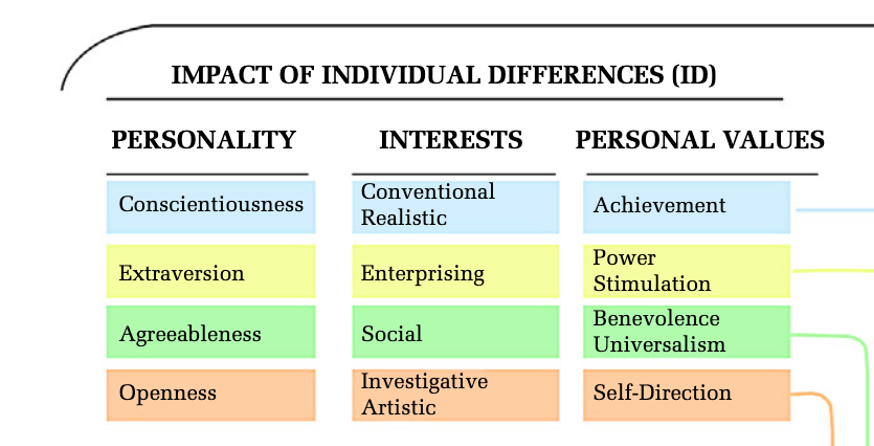

**改变 2：**增加除任务属性外的工作特征维度：新增领导力和组织文化

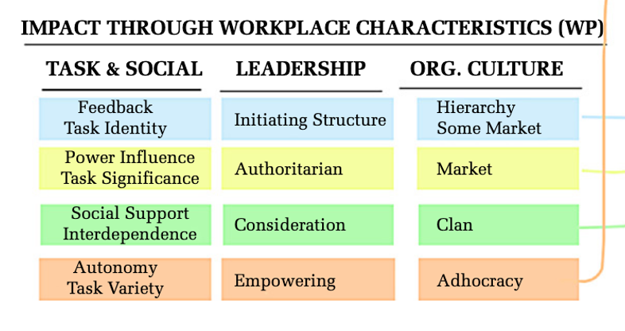

**改变 3：**细化个人特征与工作特征的交互类型：替代 or 协同 （最喜欢的一个部分）

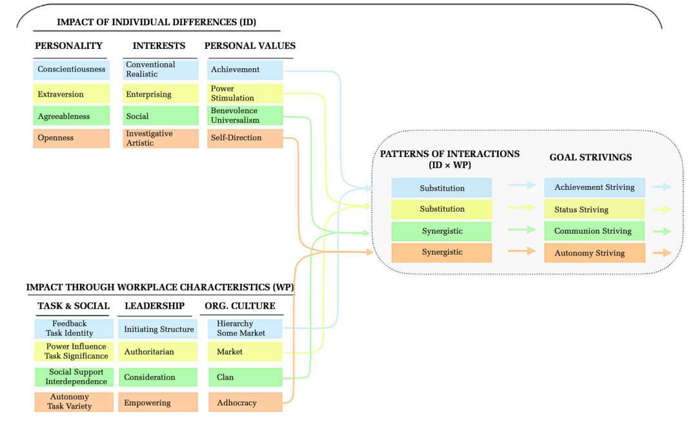

作者根据是内隐高阶目标是 other-driven 还是 self-driven 来区分了这两种不同的交互作用，比如图中蓝色和黄色所示的achievement striving 和 status striving 都是更关注自我相关的成就 or 地位，作者认为对这两类来说，环境的作用是没有那么强的、而是替代性的角色；

相反，下方两个communion striving和 autonomy striving 是更关注环境的。对于这两种类型，环境与个人协同互惠。（我觉得这两个区分真的太妙了，可以解释很多之前研究中发现对于不同类型人格调节效应存在差异的 mixed effects!  很牛的思辨力！）

**改变 4：**进一步将结果变量细分：区分为feeling well的工作态度和 doing well的工作行为，并进一步将其也与前面的类型一一对应

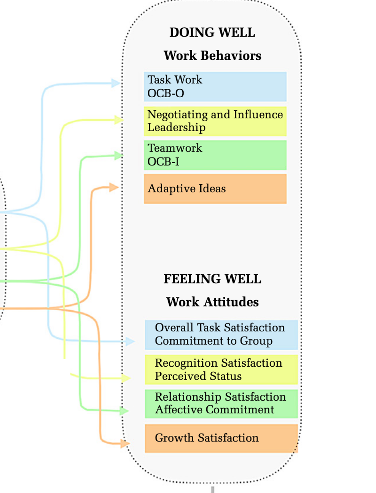

**改变 5：**增加反馈回路：经历意义和产生相应工作结果会进一步增加目标追寻，从而促进良性循环

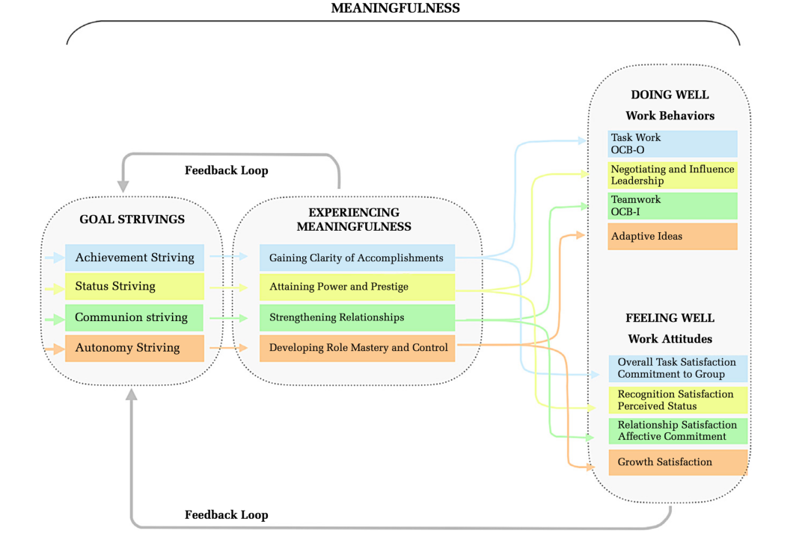

That‘s all! 总之是一个非常具有“一一对应”之美的、也非常精细的理论，对一些相关研究领域的研究者会很有帮助。

而从我个人的角度，我觉得（1）实践上，能在职业选择的时候进行更多角度的思考，比如从人格类型出发，看看自己的高阶目标、价值观、兴趣，再看看对应的任务类型、领导风格、组织文化，从而做出更好的判断 （2）理论上，虽然不一定是人格相关领域，但理论中所强调的 meaningfulness、feedback loop、以及非常创新性的关于 interaction 的差别，都是对于我们在写作时很好的切入角度。

祝你周一快乐！看了看我的压力分布，上班期间一整个压力慢慢，下班则是快乐放飞… 好真实…

但秋天真舒服，多走走！祝你也秋天快乐！

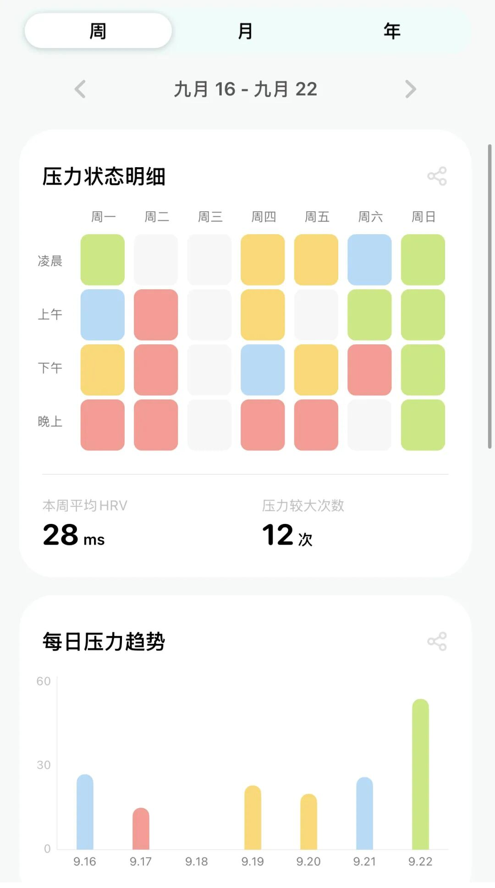

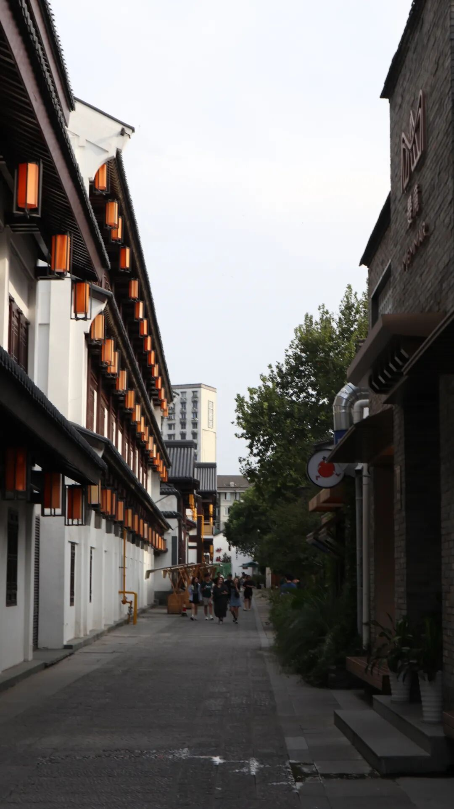

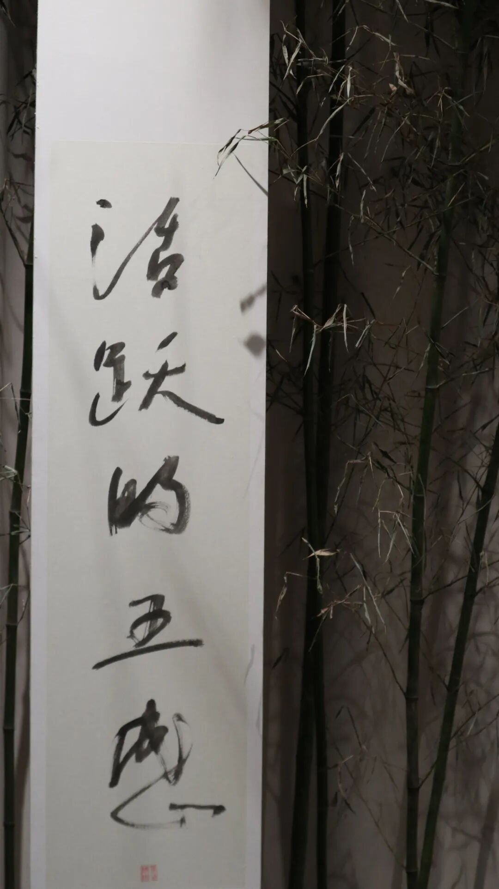

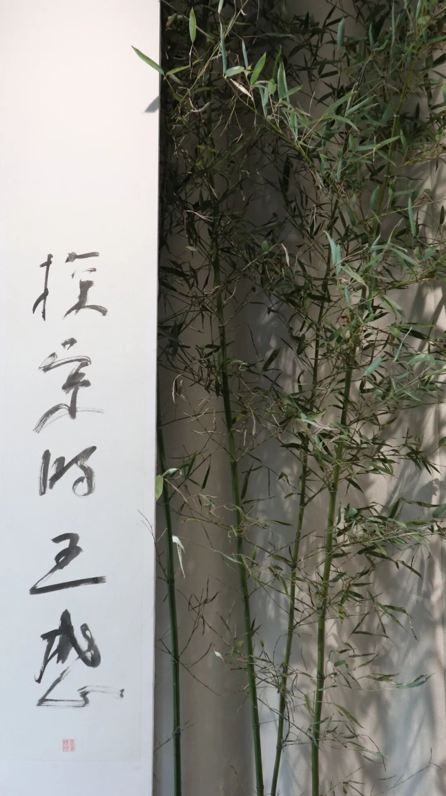
