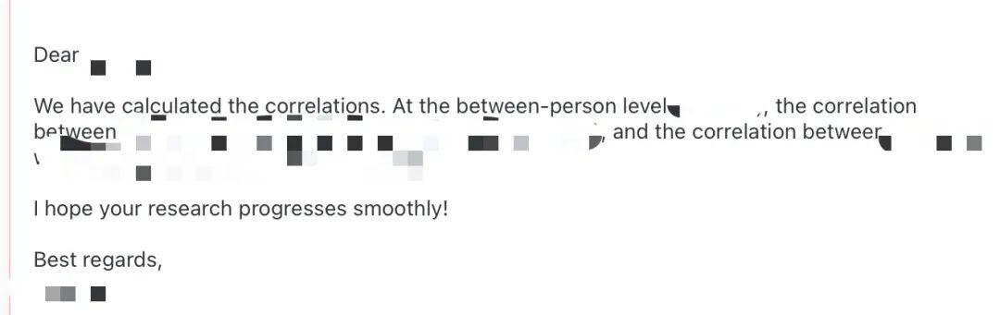
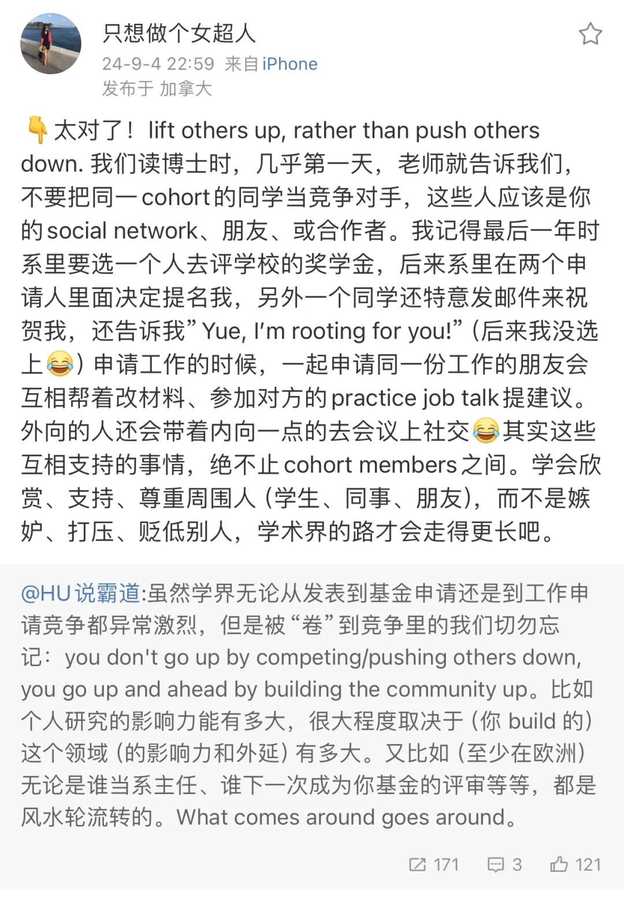

Hi 好久不见！

前段时间我在做一个元分析。大约两周前，我们编码完后发现有些paper 没有提供相关系数、或是只提供了 within-level 而没有我们想要的 between-level effect size。所以我抽时间给大约十几位学者发送了邮件，告知元分析的来意并询问他们是否可以提供相应的effect size。

这种邮件我也知道大概率是没有人回复的，毕竟大佬们都很忙。或者我想，有人收到后也会担心自己的数据是不是遭到了质疑，恶意揣测我的来意，而选择置之不理。

事实确实如此，大部分邮件都石沉大海。

所有人中只有一位学者回复了我，是一位香港浸会大学的PhD Candidate，也是一个中国人。ta说正在准备 exam，会在考完后为我们再次计算具体数值；然后过了 5 天，ta就发邮件提供了 between-level 的效应量，并说“hope your research progresses smoothly!”

这个response真的给我带来了很多感动！一方面觉得，还是中国人 help 中国人哈哈；另一方面，在个人忙碌之际还能抽空回复我的邮件，并在之后还花费时间重新计算、给我的研究提供数据支持，这真是一种利他的、为整个学术场域贡献价值的过程。

前段时间看到胡传鹏老师把自己的贝叶斯课程同步开放给校外的同学，每周在 zoom 进行直播；后来又看到他在自己公众号写的：

> 从开放科学到开放的学术（open scholarship），还是逐渐做自己觉得有意义的事情。目前开始做的是课程的开放。上了两三年课之后，基本上有一些信心能把自己比较想推广的东西开放了，虽然仍然能够看到加群的人远多于实际上会上线听课的人，这本就是互联网的常态。但凡能有一个校外的人受益，这些开放的课程就没有白费，所以我对这个现象已经是完全接受的状态。

太敬佩了，也是我一直想做的事情。

某种程度上，也是符合我自己对“做学术” 的 sensemaking：

其实我是没有那么“崇高”的理想的——我总觉得，做的研究但凡能让一个陌生人受益，无论这个人是一个被研究中观点启发的读者、还是之后会用到这个数据做元分析的学者、还在再到实践场景中的管理者，再或者，只是会成为他人论文中一个小小的 citation、小小的脚注来支撑 ta 的 bigger picture。这些都是可以让我感受到学术意义的。我想这些过程并不全是关于认知的传递，这也伴随着情感层面的传递——对于一些和谐的、温情的、共享的、美的追求。

我又想到 UBC  社会学的钱岳老师（我的女神）和另一位兰卡斯特大学老师的微博：

you don't go up by competing/pushing others down, you go up and ahead by building the community up.

So let's lift others up, rather than push others down！

总之，去思考，去表达，去传播，去传递认知与情感，向宇宙发出讯号，这样也可以收到他人的信号啦。然后一起 build up a better community！

（话虽如此，本号干货越来越少，bubbles 却越来越多，只想关注 OB 学术内容的可取关可取关💧

——这个问题之前我也拷问了自己。因为前段时间觉得很久不更新我会 guilty，但实际上确实没有这心力。

后来我劝自己回到开这个号的初衷，确实也是记录自己的成长，这包含一些学术上的成长，但也必然包含很多非学术的insights记录。

so 我就随意点啦～ ）
