### Hi！

奥运结束了！真是感谢奥运这两周的陪伴，又了解了很多运动员的故事，有了新的偶像（郑钦文！），经历了很多肾上腺素飙升的瞬间。祝贺伟大的运动员们！分享一期很生动的邀请了 Queen Wen的播客～

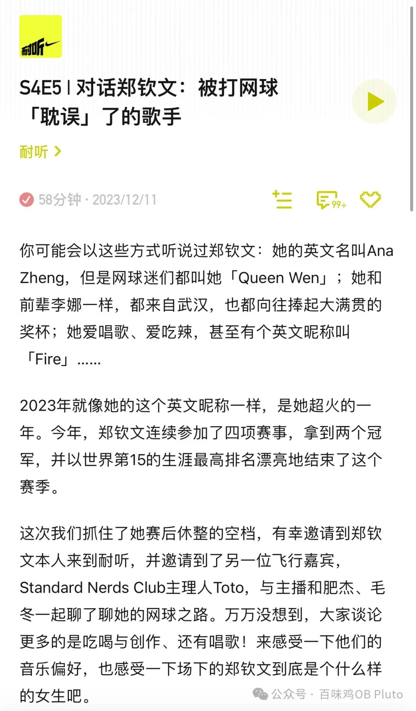

那么奥运专题的第二期，就来分享一篇上学期就看过的一篇 AMJ印象深刻的文章。主要是关注**“得奖”**这个现象背后的一类常被忽略的人群—— 被提名但是没有获奖的人，并关注这一事件对他们后续合作的影响。

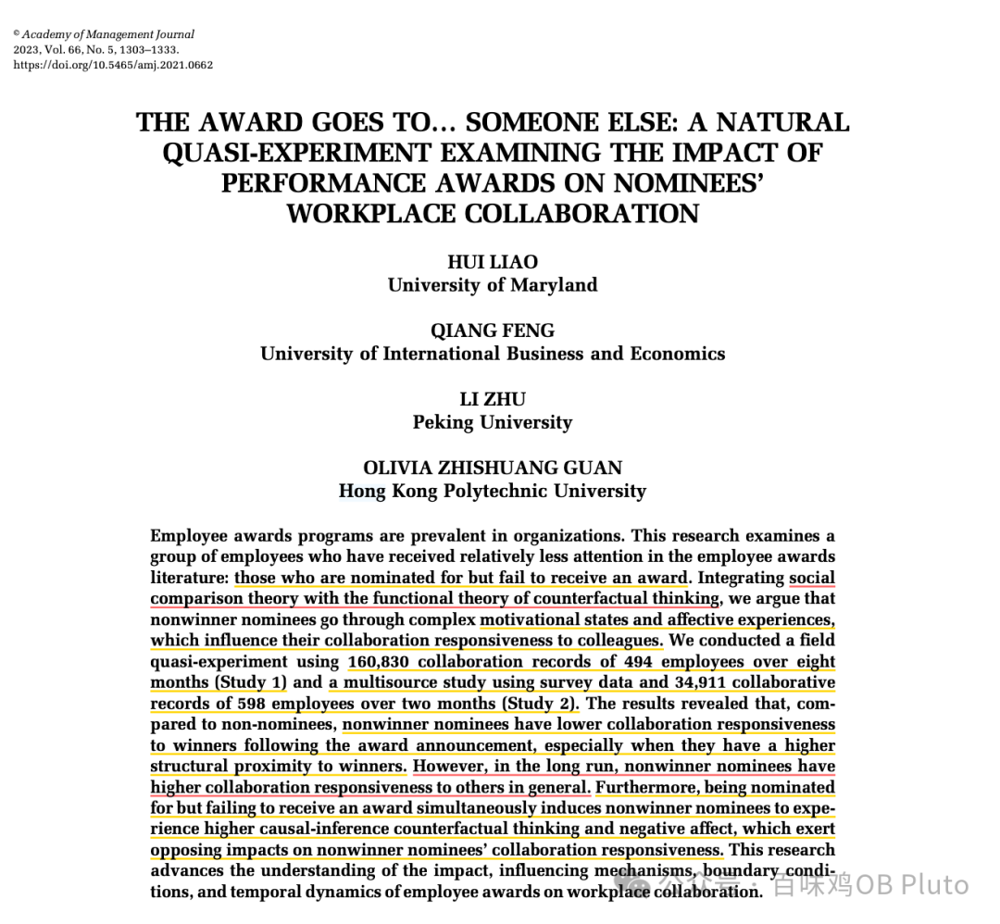

Reference: Liao, H., Feng, Q., Zhu, L., & Guan, O. Z. (2023). The Award Goes to… Someone Else: A Natural Quasi-Experiment Examining the Impact of Performance Awards on Nominees’ Workplace Collaboration. *Academy of Management Journal, 66*(5), 1303-1333.

### **作者团队：**

这篇文章的一作是大家应该都很熟悉的廖卉老师，马里兰大学史密斯商学院院长席教授，北京大学光华管理学院特聘访问讲席教授。二作是来自对外经贸、具有经济学背景的合作者，估计这篇文章 study 1 中复杂的计量内容由他负责；三作来自北京大学；四作是廖卉老师在 maryland 的学生，现在在 PolyU 做 AP（自己找的一些资料，如有错误，欢迎指正！）

### **核心问题：**

提名未获奖的人（nonwinner nominees；后文偶尔用“落寞小王🥺”代替）在得知结果后，这一事件对他们对于得奖者（winners；后文偶尔用“开心小李🥳”来代替）及其他人（others）**合作响应度（collaboration responsiveness）**的短期和长期影响。(补充：合作响应度意思是对于他人发出合作需求的回应程度，比如回复的时间、质量等）

### **引言：**

给员工设置奖项是很多公司会投资去做的事情，因此值得对其进行进一步研究。

而过往研究的结果较为 mixed：**对于获奖者**而言，获奖既可以带来积极结果（如个人绩效提升、满足个人需求），又可能产生消极结果（如让获奖者过度自信）；**而对于未获奖**者而言，该事件既可能促使他们奋起直追，又可能让他们觉得离获奖遥不可及、emo 摆烂。

然而**这些研究却忽略了一类人群：提名而未获奖的人**，也就是上述两类中间的地带。

关注这一人群为何重要？是因为这一类人群往往具有高潜力，比如小李子在 3 次提名奥斯卡未获奖后，终于在第 4 次获得；这一类人对于公司来说具有高能力、高价值，因而研究需要关注他们在获奖后的心理与行为反应。

### **核心理论：**

社会比较理论(social comparison theory) 和 反事实思维功能理论(functional theory of counterfactual thinking)

### **假设推理：**

根据社会比较理论，人会根据对比他人来建立自我认知，这种对比可分为向上比较和向下比较。而研究表明向上比较更普遍，被认为是一种个体天生的内驱力。

当提名却未获奖的人**🥺**将自己跟获奖者🥳比较时，会产生一种**“near-miss” experience**（我翻译为 “差一点”效应），这种感受会激发两种反事实思考的机制：**（a）因果推断效应** causal-inference effect：这种效应会让个体觉得，如果自己再努力一点，是有可能在未来获奖的，因此可以激发他们的进步动机。**(b) 差异效应contrast effect**：这种效应会让个体产生心理落差，从而激发强烈的消极情绪。

这两种反事实思考的机制中，**causal-inference effect属于动机（motivational）**，如果产生这种效应，那么就会让人产生强烈的“做些什么”的动机，因而作者猜测这会导致更高的合作响应度；而**contrast effect属于情感（affective）**，消极情绪个体会产生一种回避和撤退的想法，从而会降低合作响应度。

同时作者认为，这两者并不是冲突的，而是可能**同时存在**。因为一正一负，所以**总体效应抵消**后可能并不显著，即提名未获奖并不会对其之后的总体合作响应度产生显著影响。

根据上述三条，我画了一张图来更好地说明：

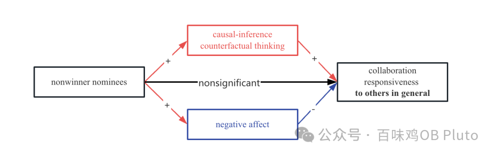

然而，如果说，这种合作是来自获奖者发出的呢？—— 也就是，提名但未获奖的落寞小王**🥺**面对获奖后春风得意的快乐小李🥳给出的合作请求，会产生什么不同的反应吗？

作者认为，在这种情况下，**negative affect 的消极作用会超过 causal-inference 的积极作用**，从而产生总体消极的影响。因为面对快乐小李，落寞小王**🥺**会产生两层的负面心理：

第一层来自于“我本可以” 和自己“我居然就这样了”之间的落差；

第二层来自 “他小李居然可以” 和“ 我小王咋就不行” 的落差。

因此，对于 winners，nonwinner nominees 呈现出下图的模型：

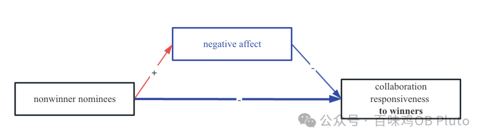

此后，作者进一步探讨了**边界条件。**根据社会比较理论，个体更会被**经常交流、经常可以看到的人所威胁**—— 也就是那句：又怕兄弟苦，又怕兄弟开路虎—— 所以身边人的成功相比于陌生人的成功更能激发负面反应。而对接到职场情境中，这个变量称为**结构临近性（Structural Proximity）**，比如可以落寞小王和快乐小李如果来自于一个部门、一个办公室，那么小王的悲伤将加倍😭。

这篇文章更绝的一点是，作者还进一步探讨了**时间上的动态效应（Temporal Dynamics）**，也就是这种效应在短期和长期的变化。

根据反事实思维功能理论(functional theory of counterfactual thinking)，**动机性效应较为持久，而情感性效应较为短暂、易消失** —— 比如就是，多年之后，我依然记得当初努力的动机，但我已忘了为何要恨你 （这篇推送有好多我的抽风语句💧… 供大家更好的理解）—— 所以作者猜测，即使落寞小王**🥺**短期内会经历一下消极情绪，甚至可能懒得回应小李的合作；但**长期来看**，小王的合作响应度还是会增加的😋，即提名未获奖的经历还是对于合作响应度是正面影响的，如下图：

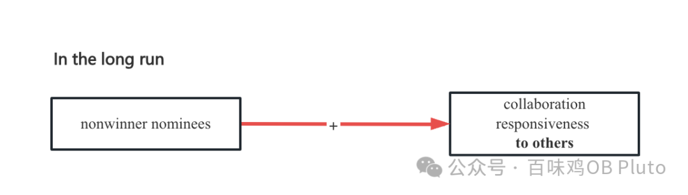

### **数据与方法：**

这篇的数据来源就非常牛了，都是与企业合作收的数据（甚至可以拿到系统中每一次合作信息响应的时长…）一共分成两个Study：其中**Study 1**利用了 **DID** （双重差分法；Difference-in-Differences）这种**准实验设计**，以颁奖作为一个分界点，探讨颁奖前两个月和颁奖后两个月、及后六个月的结果，来验证自变量、因变量、调节变量的关系；**Study 2**则用了基础的多元回归来**探索中介机制**。—— 数据分析部分太复杂，而且作为完全没学过计量经济学的人，确实不咋看得懂，就不写这部分了... 就放一放结果喽。

### **Study 1 研究发现：**

短期内，即颁奖前后两个月中，（a）提名但未获奖的落寞小王**总体的合作响应度没有显著的变化😌**。（b）然而，落寞小王对于快乐小李的合作请求呈现出较低的合作响应度🙄，也就是「提名未获奖」这件事情对「小王对小李的合作响应度」产生负面影响。

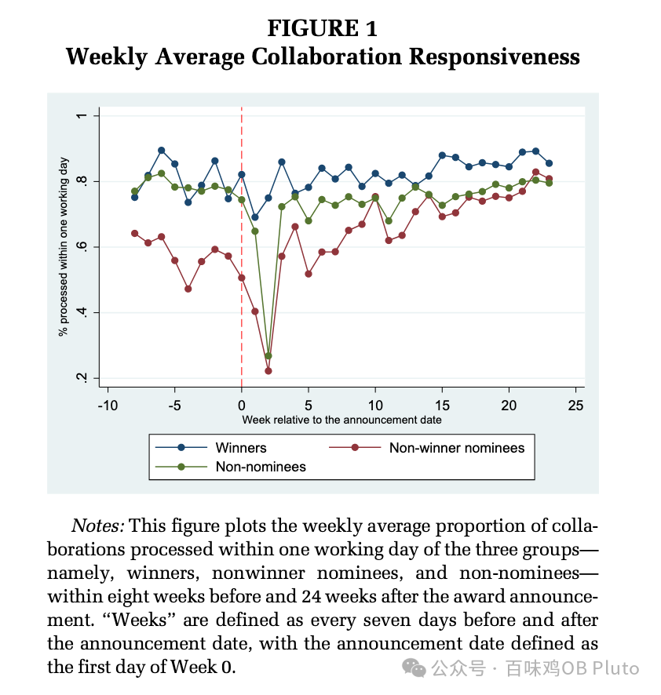

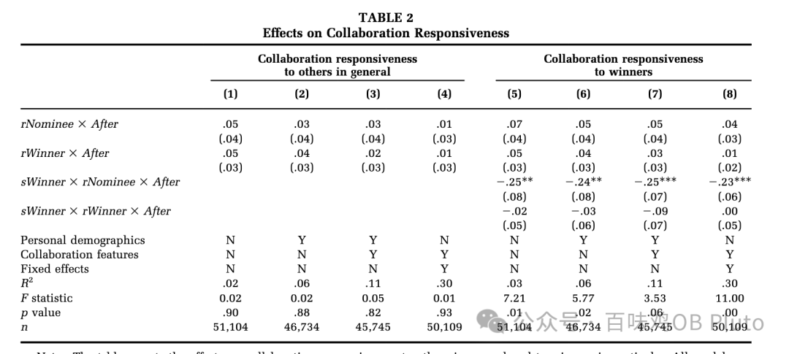

（c）调节效应分析表明，**结构临近性的边界作用显著**，即当获奖者来自于同一个部门或同一个办公室时🤮，「提名未获奖」这件事情对「小王对小李的合作响应度」的负面效应更强。

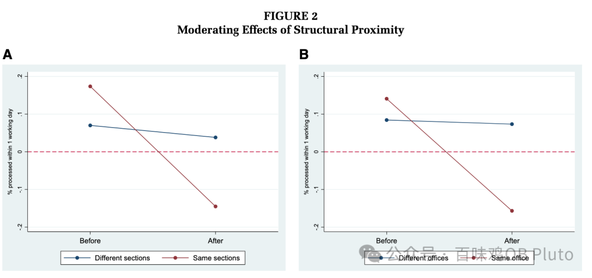

**长期来看，即颁奖后 6 个月**（d） 小王对小李合作响应度降低的效应由**负值转正值🤗（但不显著）**，而小王**对所有其他人的合作响应度由不显著转为显著正值😆** —— 预示着小王痛定思痛，在消化了一段时间后，又和大家一起快乐合作了 ♪٩(´ω`)و♪

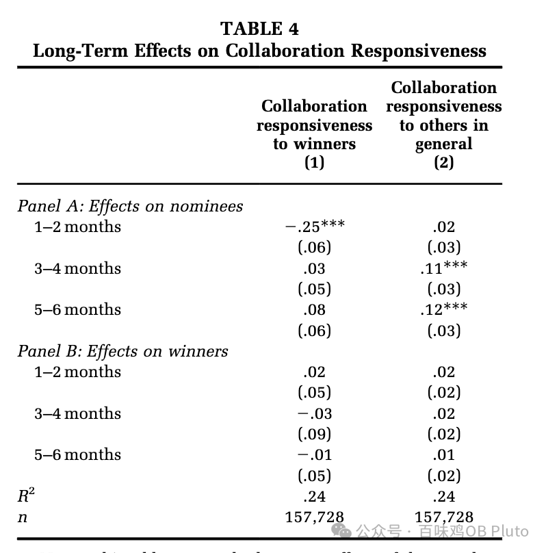

### 

### **Study2：**

验证中介的研究结果就较为直接：落寞小王对其他人的合作响应度会通过两条路径（情感路径-消极情感；动机路径-因果推断反事实思考）传递；而小王对于小李的合作响应度，则是通过增加小王的消极情感而降低🥹。

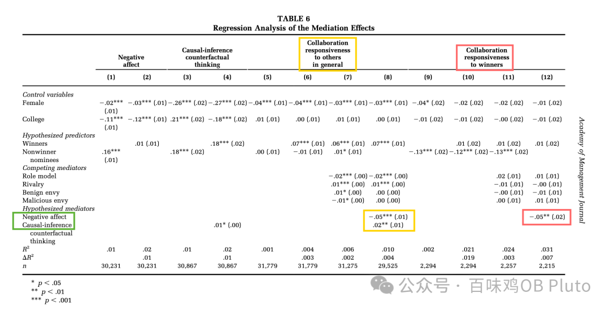

### **理论贡献：**

（1）第一点我觉得是起到了**consensus creation （创建共识）** 的结果：之前研究发现获奖会产生 mixed 的结果，而这篇文章进一步将群体分开，发现对于获奖者的总体影响不大，但对于提名但未获奖的个体有较大影响。

（2）从合作响应度的角度对“员工获奖”这一领域产生贡献，精细化地揭示了虽然短期内提名未获奖者会对获奖者降低合作响应度，但长期来看对于其他人的总体合作响应度还是增加的。

（3）用反事实思维理论来揭示了双重中介。（真的很喜欢这个！不是那么俗套的用什么情感事件理论啥的～ 这个理论包含了情感和动机，和研究问题好贴合！）

（4）调节变量进一步验证了社会比较理论、情绪调节相关研究。

（5）短期效应和长期效应的检验拓展了对于「时间如何影响现象」的认知。

### **实践贡献：**

（1）总体来说，设置奖项🏆还是会产生积极影响的✅。

（2）管理者需要关注到提名但未获奖的这类人群，并适当将他们与获奖者分开，或可以其他不同的方式来减少他们消极情绪的产生。

### **未来方向：**

这篇文章提出了9 点未来方向，包括因变量除了可以从**响应合作**的角度，也可以从**主动提出合作**的角度、中介变量的其他选择、因变量除了合作还有绩效等方面、个体内部随时间的变化也可能影响结果等等… 就不再赘述了。

### **百味鸡感想：**

总之真是一篇 impressive 的好文章，引言和假设演绎部分对于**问题提出的视角和理论的 theorizing 都写的非常好**，**讨论部分也非常充分**，完全做到了 **AMJ《PUBLISHING IN AMJ—PART 6: DISCUSSING THE IMPLICATIONS》**这篇文章对于implication 部分所提出的要求：不仅说做了什么，更要有**a reflection after an act**，以及**你提供了什么 new and valuable ideas —— a beginning。**

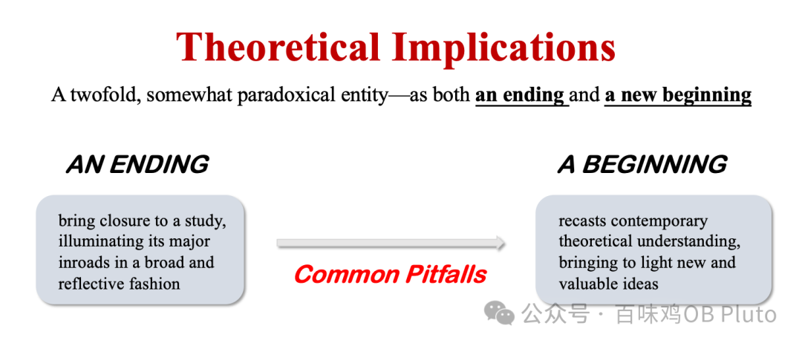

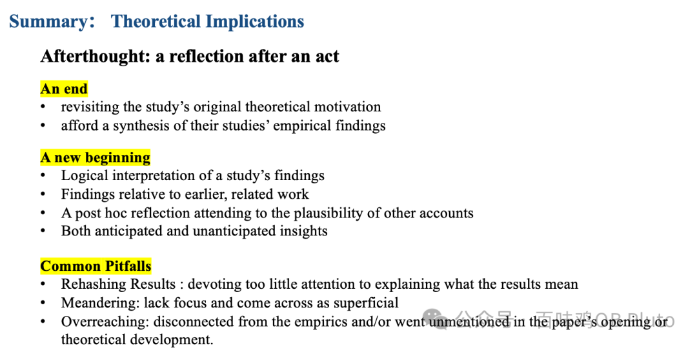

So much for today, 祝你们都开心、平安！
