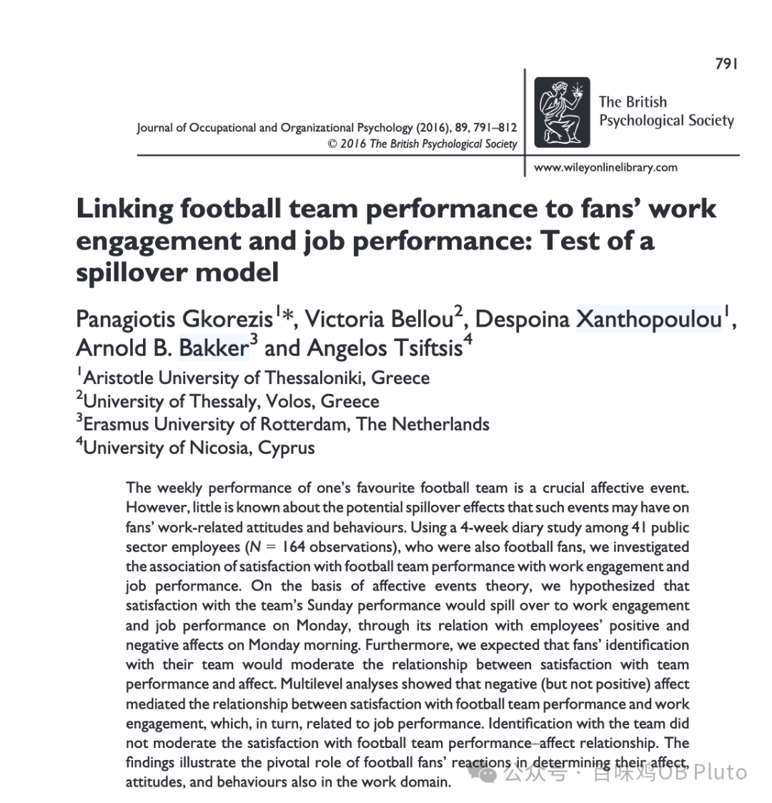
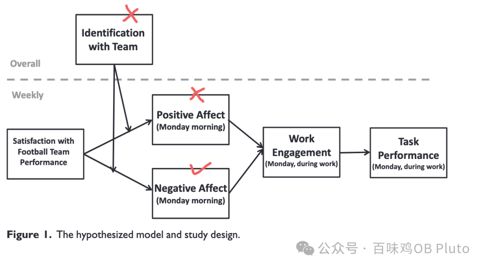

最近一周都是奥运赛事陪伴，在竞技体育中感受一些波涛汹涌，在宏大叙事中又升腾一些爱国情怀。

所以这次的合集就围绕着比赛/获奖等展开喽。

另外，以前的合集所整理的文章都太泛泛了 —— 以后准备这类的可以每次短小精悍发一篇 （就和小红书差不多，但是每次在小红书上刷到学术文章后很容易又被其他讯息分心。所以感觉还是公众号的平台安静一些）。而合集里面的还是剖析地更深入一些。

**JOOP 2016**

**球队比赛成绩满意度和球迷工作绩效的关系**

**作者团队：**均来自欧洲，其中三作是我的偶像 Bakker：JDR 模型创始人、work engagement等众多知名量表的开发者、非常提倡应该关注员工的“能量” —— 和我所关注的 nonwork-to-work非常贴合！可自行观摩Bakker的主页：https://www.arnoldbakker.com/aboutme）

**核心问题：**喜欢的球队的表现作为一个情感事件（affect event），其效应如何溢出（spillover）到工作相关变量。

**核心理论：**情感事件理论 （AET; affect event theory）、溢出理论（spillover theory）

**故事背景及推理：**以往研究表明，体育赛事的结果对于体育粉丝的情感状态会产生显著影响，这甚至会影响到后续的团队工作态度及行为。本研究用 AET 来推出情感是个重要的中介变量，用 spillover theory 推出自变量(属于life domain) 和因变量(属于work domain)的关系，用 social identity theory推出粉丝对球队的身份认同（team identification）是调节变量。对领域核心的贡献是，发现了 work engagement 和 performance 的前因：工作外的事件，丰富并扩展了 spillover theory。

**方法：** 4 周的日记法；41 个男性被试

**研究发现：**对球队表现的不满意，会通过增加消极情绪，影响工作投入，进而影响工作绩效；然而对球队的满意并不会通过产生积极情绪而向后传递；此外，球队认同的调节作用不显著：

**自行理解：**比赛看的心满意足不会让你奋起工作；但比赛看的垂头丧气则会让你工作时也觉得尸体凉凉。—— 即使你对球队再爱，也暖不回来了。

**现象解释：**下半条路径能走通是用了角色稀缺理论(role scarcity hypothesis)进一步解释，不满意的观赛体验让员工减少了 energy 和 affect，进而影响到工作；而研究表明，相比于积极情绪，消极情绪有更长期和持久的影响，这也就解释了效应为啥只能通过 negative affect传递；对于调节效应不显著的解释，作者也说，其一可能是测量的问题（被试都是球队认同超高的人），其二则可能是作者在这里把球队认同当成一个特质变量，然而在具体情境中这可能是一个会改变的状态变量。比如，球迷防止自己看比赛失望（毕竟人都损失厌恶），会增加自己和球队的心理距离 （我不爱 就不会受伤害），这也就会导致球队认同产生波动，因为将其作为一个稳定不变的特质变量可能并不准确。

—— 之前的研究我只喜欢看前半部分，对于结果中 unexpected 的解释总是忽略。因此在茶余饭后突然谈起一个研究的时候，只能说起它有趣的结论，当别人问起有趣结果的解释则哑口无言。所以之后也要有意识地看一看作者的解释部分，也是另一种开脑洞！

‍‍‍‍哎呀！4 点还有一场男乒的铜牌赛，准备去看一下可怜的张本智和… （前几天还在对他无语  但看他昨天的东亚属性大爆发 又属实怜爱了一下...）

其实本来这篇推送准备了 3篇的，先放个一篇，明天继续～

祝你们开心！‍‍‍‍
