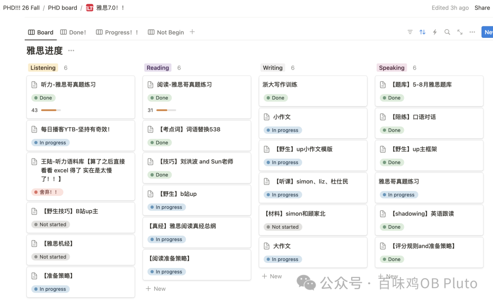
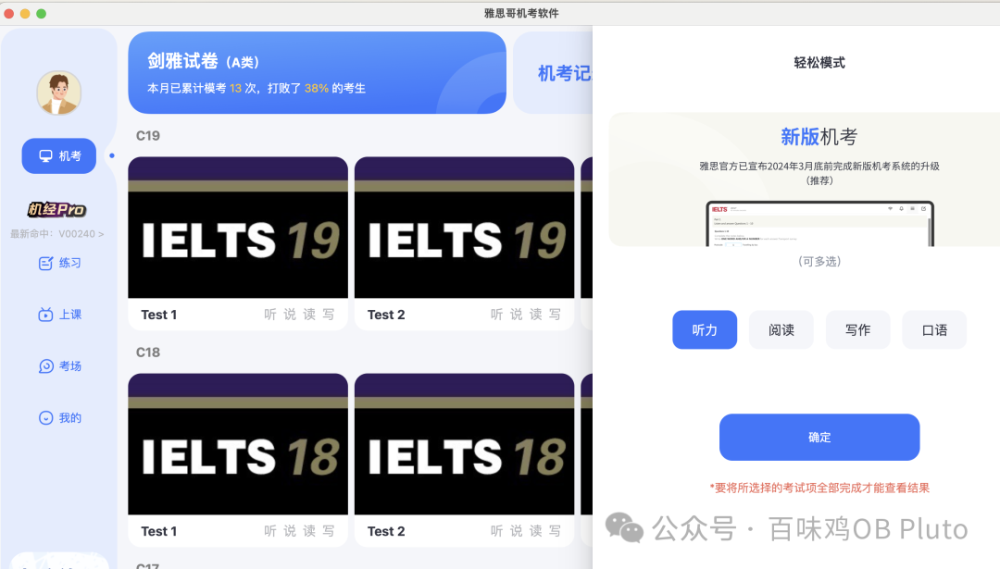
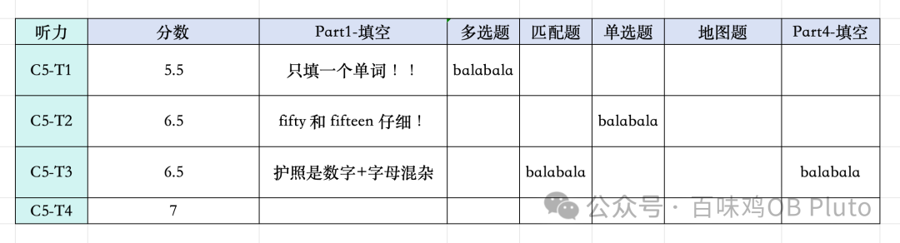
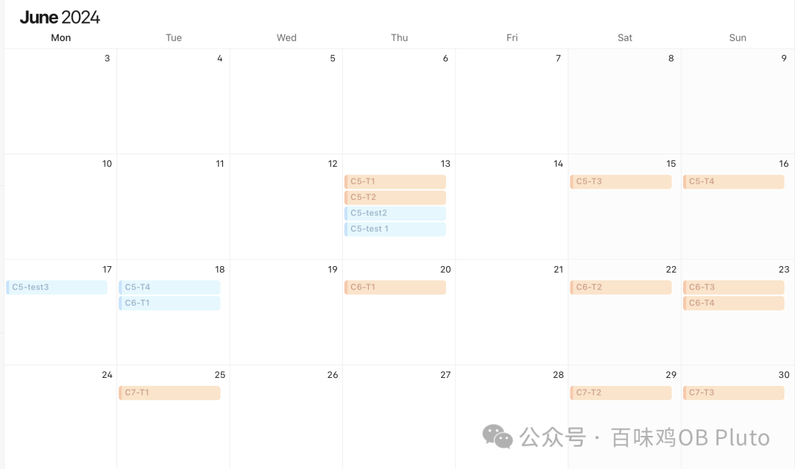
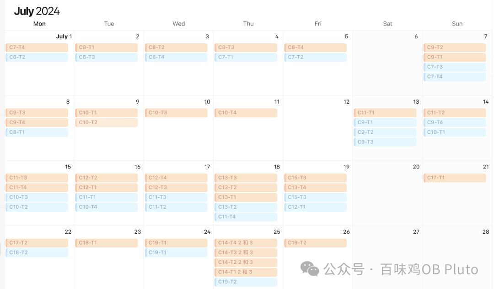

# | Tags | 雅思考试 |
| --- | --- |
| Date | @July 29, 2024 |

好久没更新小破号，因为在受雅思之苦… 哎，其实我还有 1 年的时间可以准备，但是还是想快刀斩乱麻早点了却一桩心事。

为了让过去这段时间不要白费，还是准备写下一些经验教训。如果之后真的因为卡小分而要再刷一次，也可以再参考一下。

注意注意！都是我个人的备考感悟哦！仅供参考～

### 

### 成绩：

总分 7 （阅读 8  听力 7  口语 6.5  写作6）

### 

### 考场复盘：

口语：年龄略大的白男，稍有些气泡音，但是交流的时候会给反馈（微笑 惊讶啥的）。每个问题基本上都可以快速想到答案，但之前提醒自己用的什么高级的表达、句式、collocation都忘了！就是之前输出的不够多，没有进行肌肉记忆。最后只在用最基础、最舒适区的一些语言balabala。但聊完之后我甚至觉得意犹未尽… 所以当时出考场觉得 6.5 还是有的。

听力：当时应该就3个不确定的，其他自己最不会的地图题、匹配题都是超级简单，考完觉得至少有 8，结果只有7 😭  但听力就是有很多坑，自我感觉确实不等于真实成绩… （而且确实会根据试卷难度调分）

阅读：第一篇10分钟就做完了巨简单，感觉巨好！第二篇做了30分钟还有5道题不确定，直接晕晕。直接影响第三篇心态，所以甚至有 5 道题来不及做 都是凭感觉瞎蒙。考完出来感觉自己阅读只有 5-6 分了… 没想到出来有 8 分，真的是老天保佑了我蒙题的正确率。以及可能是根据试卷难度调分的。

写作：写得是一整个丝滑！感觉自己又是同义替换、又是前后逻辑、又是副词修饰和高级词汇。好啊 结果只有6…   其实考前最焦虑的就是写作，考前还在痛苦地像参加高考一样背一些好词好句（毕竟最后只练手了两三篇让GPT修改 ）  哎… 但因为当时写完自我感觉太好 还是准备复议一下吧…这样就不会被卡小分了！

## 

## 阅读与听力

准备步骤大概是下面这样，之后一一展开讲：

1. Pretest

2.学技巧

3.刷题 在真题中运用技巧

4.复盘 不断把自己的思路调整到“正统”的思路上

ps 1 - 中间可以再穿插看一些小红书/b 站上的技巧（很简短的那种） 来帮自己纠正思路  比如当时我的匹配题做的不好 就会针对性地找这部分的经验分享

ps 2 - 个人认为的比重：阅读20%技巧80%刷题 与复盘；听力10%技巧90%刷题

### 

### 第一步：Pretest

在所有准备开始之前，其实可以从 b 站或小红书看一下各部分介绍，然后直接上手做1-2套剑雅真题感受一下，也就是我说的 pretest 的过程 —— 对我来说，带着这种“啥也不会”的略微焦虑感才能让我听得进去网课，否则网课听得会很无聊且毫无头绪。

### 第二步：学技巧

**阅读技巧：**一开始在b 站尝试看一些网课，但都是又臭又长。后来就买了一本【刘洪波雅思阅读真经总纲】的书（很简短），直接一个下午在图书馆全都看完，确实有一种醍醐灌顶的感觉！—— 建议把刘洪波那3 本都买了，配套使用。之后我所用的大部分技巧都来自于这本书了。

听力技巧：我怕也是觉得其他课程太长 太啰嗦！（有些老师还要跟学生频繁互动吹水 i 人真的受不了一点这种）有些视频还会涉及最基础的部分（比如那些连读、吞音等。其实我都知道，我只是需要针对于雅思的应试技巧）

后来找到了 B 站一个 up主 【Sun 老师教雅思】，语言表达清晰简练，很能听进去，且总课程就 4 小时，倍速一下 一两个下午也可以刷完！

ps. 有很多人推荐王陆语料库，我在 6 月初还尝试了一下，但是太多太多 太麻烦！！不适合短期备考，就是性价比不够高，可能会更适合于一些听力基础真的很差的同学。

### 

### 第三步：刷题

刷题是一个【运用技巧】+【寻找题感】+【调整思路】的过程。同时，也是很痛苦的心理过程：需要经历低分的打击、无法理解思路的无奈，但偶尔也会有一些自己总结思路后、顿悟的成就感。

### 阅读刷题

阅读刷题前期用【雅思哥】机考软件刷，但是那个解析太水了！所以对我的思路矫正没有太多提升，我总是看一眼答案然后就 “嗯嗯 OK Fine 好吧 也有道理” 就过去了，所以感觉那些刷的题都废了。—— 总之，没有深度复盘、反复思考后调整思路的刷套题真的毫无意义！还不如就做一篇阅读 然后认真复盘来的好。

后期用了【新东方雅思】的网站刷，解析清晰仔细，还会跟你说这道题的做题顺序应该是什么、坑在哪里、是不是难题（如果是难题 自己错了 就狠心理安慰）。用了这个解析后，我一般无论是做对的还是错的都会看一眼它的解析，make sure 一下我的思路没有问题，不然很多题目都可能是蒙对的。（这个过程只用雅思哥就无法实现）

不过确实是雅思哥的界面更像真实机考场景，所以其实也可以这两者搭配使用，用雅思哥刷题，用新东方看解析。

昨天也看到有人推荐说，对完答案后可以先不看解析，而是自己努力回原文找答案、再思考出正确答案的逻辑，这样提升更快！是有道理的，这个可以在自己基础思路没问题后，进阶使用。

### 

### 听力刷题：

前期好傻！用了【雅思哥】的“听力板块”进行练习（那个就是会4 篇听力分别练习 做一篇出了答案再点击下一篇）—— 缺少做套题的连贯性，且前一篇的分数还会影响你下一篇。

后面才发现，完全可以用雅思哥的**“机考模式“**，直接**只选听力那一项**就行了。这样就完全模拟考试场景，比如可以在最前面冗长的录音的时候先看 part2 的选择题，开始说“请看part1”的时候再开始看填空题。

个人觉得，听力的解析相比与阅读就没有那么重要了，还是靠反复听原音频来定位答案，再揣摩选项和原文的思路，比如是什么同义替换、是不是没有听到否定、是不是漏听了过去式。（当时觉得浪费时间，没有用精听的方法—— 这可能是我听力总是达不到8 分的原因）

最后，在纠正完错题后，再把全文 1.2 倍速播放，确定一下答案句在全文中的位置。（当然这个步骤我总是跳过 因为我做完听力要是错太多 就根本没心情再听一遍了 55  但如果想高分 这个步骤包括精听还是很有必要的）

相比于阅读，听力的解析就没有那么重要了。但是如果有些不理解的，还是可以再去其他网站上看看解析的。

ps. 听力更是一个可以融入日常生活的备考，平时我吃饭的时候就看美剧或者听英语播客，以及起床后就放英语播客醒脑，虽然听不懂但是可以创造一个英语环境… 之后可以整理一下那些我还能理解一下的英语播客！

### 

### 第四步：听力阅读自我复盘

这个环节其实很关键！

可以创建一个 excel 或者用 notion 表格来记录。就像下面这样（我只是举个例子 大家可以根据自己的使用情况再修改）。

需要注意的是，应该根据题型去复盘，而不是在那套题内部复盘 （因为之后也不会点开的… 我的教训）

哦哦 最后一列还可以积累一下同义替换！修炼一下同义替换脑！

让自己多一些 paraphrase 的意识，毕竟大家都说：雅思是一场巨大的同义替换。

### 

### 我的刷题情况

用 notion calendar 合并了一下我的刷题情况：

可以看出是从 6.13 开始了第一次试水（当时就听力 5.5，阅读 7），之后因为是期末月，也有一大堆事情要处理，所以也是有一茬没一茬地划水准备… （悔恨）

总之我的 6.13-6.30 是一个摸索的阶段，看了很多经验贴、自我摸索、看了听力和阅读的网课 —— 其实走了不少弯路、也被一些事耽搁，我觉得这个过程如果找对路，可以一周内解决！

7 月份感觉自己要 g 了，才开始给自己制定一些每日规定，基本也能保持一天一套听阅（但中间还是摸了几天鱼… ）

最后大概是刷了 40 套听力，30 套阅读。

Overall，用 1 周时间探索熟悉，然后用 2-3 周每天刷 1-2 套+认真复盘，听阅应该没问题！

### 

### 口语：

感觉自己稍微有点小基础？毕竟也是去了一趟 chicago 直面过外国人的… （但是也不能很快速地把脑袋里的复杂感受表达出来，只能说一些最简单的 -  这也是我上不了 7 的原因）

口语备考其实是我最快乐的一个部分，当时题库啥的都没过，一直在看【只讲干货的 Steve】。这哥真的贼搞笑，且有很多底层逻辑，比如用一个【放松】其实就可以回答很多个问题！有些表达甚至也可以用在写作中！

ps. 其实还有很多类似的博主，比如：

B 站-lisha学姐、托福雅思满分的genda、雅思托福教书匠Keesha、刘黑眼圈子

xhs-愚一样 （这姐还有英语角 可以连麦让她纠正你的发言和逻辑 ！但我没时间看 55 如果有空的话 感觉真的可以每次都进去学习！）、fredie口语宝典

大家可以找一个自己喜欢的风格，然后点进主页刷他们的视频！找一个人就够了，这样才能把他们常用的逻辑全都学过来！不要一下子看不同的人～

结果看的太乐呵，最后根本没时间准备题库了，只给每道题串了串故事！part 2 到考前的早上才勉强整理完所有题目回答的点，甚至有些题目都没有完整的练过。part 1 就完全是随缘看了几题。所以基本上就挺靠自己之前的功底的。

所以下次的话，还是要提前准备一下题库。同时就是多说多说多说，把积累的东西用顺口才行！

口语是真的很看肌肉记忆！不然光积累，到考场的应激状态也是用不出来的！

哦哦 听了 nxy 的建议，我在考前 5 天每天都预约了模考，虽然题库都没整理完，但就是一整个轻装模考，感受一下和老外交流的氛围！

我把同桌雅思、趴趴雅思等平台的羊毛都薅了过去。还有的是在淘宝上买了一些，一般 10-30 一节课，贼便宜！

而且有些外教真的很 nice 情绪价值拉满了！当时他就说我的口语 6.5 是没问题的，再努力一下可以上 7！

### 

### 写作：

惭愧惭愧… 不知道自己在干嘛的一门…

好像很早之前用几个晚上迅速刷完了【Simon 大小作文】，这个应该就是人人必刷！了解一下最基础的逻辑。

之后看了一些经验帖推荐 Vince，但我看完之后感觉完全不适合我…. 首先，他说的从宏观-中观-微观的写作步骤其实要求还挺难的，并不是所有题/所有人 都能找到上层视角切入的 （就需要积累很多这方面的语料！要求好高！—— 不过这就是他 9 分的理由）；其次，他的视频也是很多重复和废话，不够简洁...受不了🤦‍♀️

后面根据一些小红书姐妹推荐，开始看b 站【Yuqi脑丝爱写作】的大小作文范文写作，思路清晰、看得进去、没有废话，可以帮助建立写作框架，很推荐！

我觉得最好就是：根据她视频的题目自己暂停写一篇，然后再结合她的讲解+GPT修改来调整思路。

可惜可惜！我最后真的没有时间了，就只是考前看了她的几个视频…

考试的时候小作文抽到地图题，大作文是家庭教育还是学校教育更重要。我想这简直就是专业对口，咔咔一顿写，写完还自我陶醉了一下。没想到出来只有 6… 只能出 1400 开彩票复议一下了 哎！！

### 

### 作息篇

最集中备考的一段备考作息：

上午：7-8 点起床，起床后播放英语播客，练习 1h 口语醒脑，之后听阅做一套 （困了就练习一会儿正念）

下午：听阅一套+口语看视频积累素材 并 shadowing

晚上：写作 （但晚上总是看着看着突然开始和姐妹们聊天）

### 

### 心态篇

正念是真的很不错！每次burnout 了就听这个正念补充一些能量：

默念“我是重要的 珍贵的 我是上天的礼物 我是恩赐 我是奇迹 我独一无二”

积极的心理暗示真的很不错 希望心理学人都能把 mindfulness用到生活中 就会发现：嘿这玩意儿还真是有用 怪不得能发文章呢！

### 

### 最后的话

语言考试真的很折磨人，有一种「一把年纪了还要受这应试的苦」的感觉。

但正如 Y老师所说，标化确实是解锁世界大门的钥匙。有了它才能去看更广阔的天地哦！

祝大家都能和雅思快乐分手！

祈祷自己 1 个月后复议成功🙏
