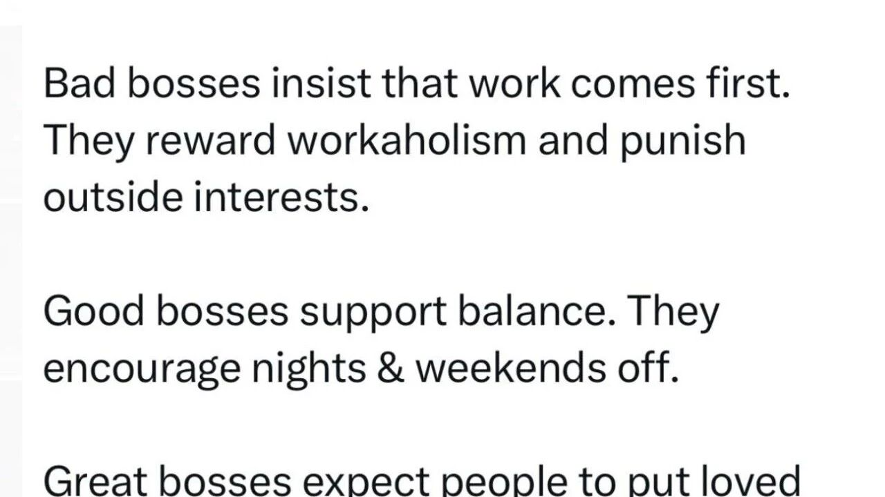

Bad bosses insist that work comes first.
They reward workaholism and punish outside interests.🥲

Good bosses support balance. They encourage nights & weekends off.🍻

Great bosses expect people to put loved ones above their jobs. They forbid missing important family events for work.❤️

