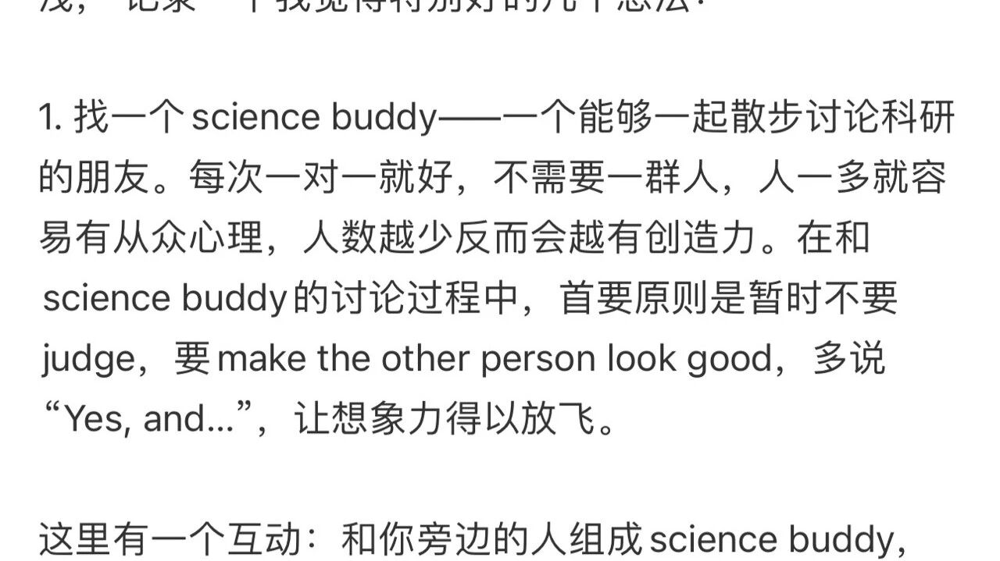

转发一则。

第一点的 science buddy 真的很重要。找到合适的人去讨论 idea 可以不仅获得 emotional support ，还可以获得 construction feedback。同时在对话时允许对方沉默地思考、允许提出质疑（而不是连连夸奖），这都会让讨论迸发更多的自由联想和 inspiration！有时候突然脑子里蹦出一篇之前看过的综述，然后突然沿着综述的思路去想到合适的变量，在讨论中感受逻辑连接顺畅的感觉实在是太好了！

第二点的话。我第一次听到 day science 和 night science 这两个概念。翻了翻 Itai 教授的官网，发现他原来已经用这两个概念发了不少生物学的顶刊。
不过真的，我确实会在白天的时候会更通过以往的研究来 frame model，但到晚上就开始天马行空自由联想（就像作者说的 interdisciplinary creativity）（因为晚上我就看不进去任何论文了，猪脑已过载）
所以根据这个，真的可以把自己的时间分成 day science 和 night science  找不同的时间用不同的方式去提升科研创造力！

