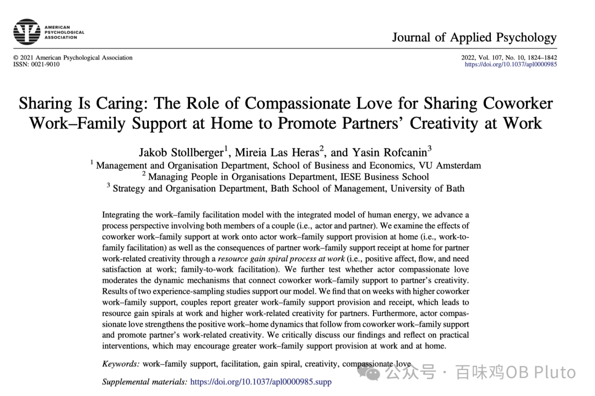
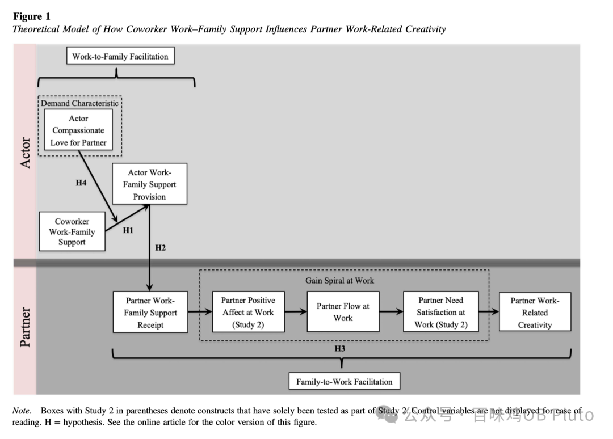

**JAP 2022**

第一次看到用“爱”作为调节变量的论文。

这个故事讲的是：同事（Coworker）的工作家庭支持，会 增加个体（Actor）的工作家庭支持提供，从而增加伴侣（Partner）的工作家庭支持接收，进而促进伴侣(Partner)在工作中的心流，以及伴侣(Partner)工作相关的创造力。—— 一些奇妙的资源流淌

而调节变量的故事是：在看到同事的工作家庭支持时，需要什么条件/怎么样的人 才能将这种积极资源用到自己的生活中去？

作者找了“爱”这个变量。Hendrick在 1986 年的定义是，爱是一种为了他人而积极地思考、感受和表现的一种倾向。它包含三种：

- 陪伴之爱（companionate love）：信任与承诺
- 浪漫之爱（romantic love）：美与身体吸引
- 同情之爱（compassionate love）：对重要他人的共情与感激

> Love can be defined as a predisposition to think, feel, and behave in positive ways toward another (Hendrick & Hendrick, 1986), and scholars typically distinguish between three different love styles: companionate, romantic, and compassionate love (Berscheid, 2010; Tasselli, 2019). Whereas companionate love involves high levels of trust and commitment more akin to a friendship, romantic love emphasizes beauty and physical attraction, and compassionate love incorporates compassion and gratuity for significant others (Berscheid, 2010; Tasselli, 2019).

之所以选择这个调节变量是因为：

相比于romantic love更多的是为了自己的利益，compassionate love则更有可能去caring、concern、supporting、and helping other；

而相比于companionate love所体现出的互惠交换（reciprocal exchange），compassionate love形成了一种积极回应的关系，可以无私地照顾伴侣的需求和幸福，而不需要交换条件（oh🥹 so sweet）

因此，作者认为，对伴侣有更高的compassionate love的个体，更有可能去识别伴侣的需求，也更愿意去提供工作家庭支持，他们更能从同事所表现出的工作家庭支持中寻找到 resource，然后转化到自己的家庭场景中。

That'it！只是简单分享一下这篇文章中神奇又浪漫的调节变量啦！

继续看论文去了，祝大家都有 compassionate love🥰
