Hi！

相信最近大家都看到了**Nature**上携程ceo梁建章等人发表的关于居家办公的文章。所以本期就来整合一些发在Nature、Science上有关心理学的相关研究。

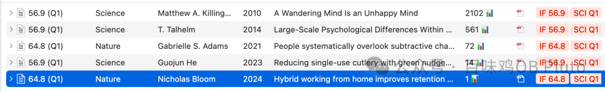

**Paper 1**

**2024 Nature- Hybrid working from home improves  retention without damaging performance**

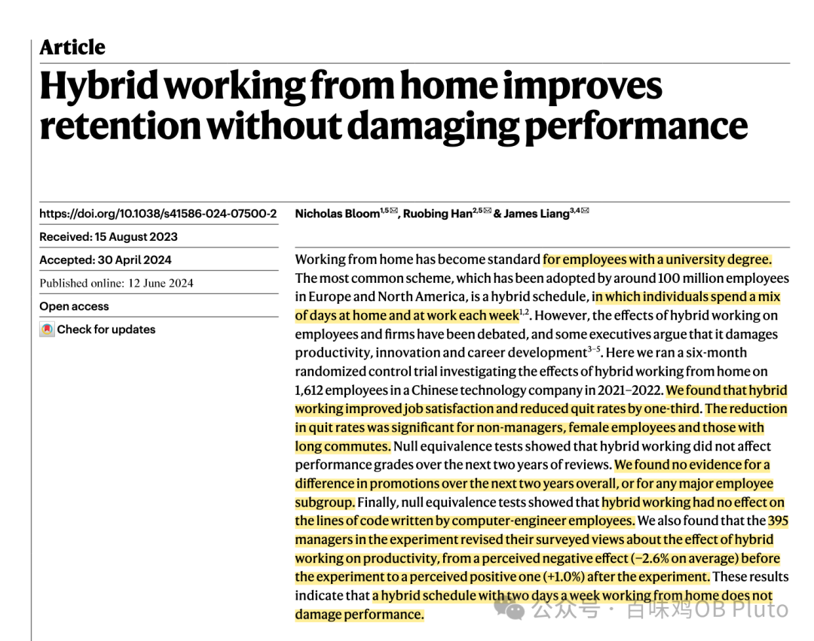

欧洲和北美约有1亿员工采用的最常见的计划是**混合办公(hybird schedule)**，即每个人把work from home和去公司上班混合在一起，比如在家工作2天，在公司到岗3天。

然而，混合工作对员工和公司的影响一直存在争议，**一些高管认为它会损害生产力、创新和职业发展**。

这篇研究发现混合工作（研究采用的设计是公司3天，在家2天）可以在不影响工作表现的情况下提高员工的绩效。

该研究进行了一项为期六个月的随机对照试验（RCT），调查了2021-2022年间携程1612名员工在家混合办公的影响。

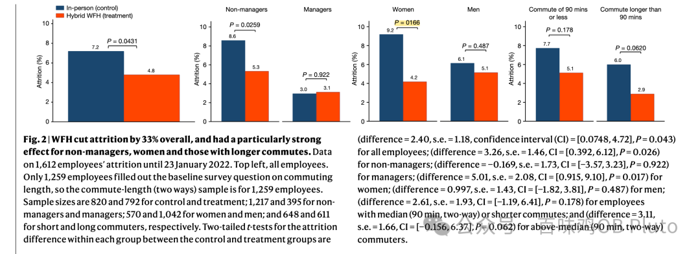

结果表明混合工作**提高了工作满意度**，并**将辞职率降低了三分之一**。这一效应对于非管理人员、女性员工和通勤时间较长的人来说，辞职率的下降非常显著。

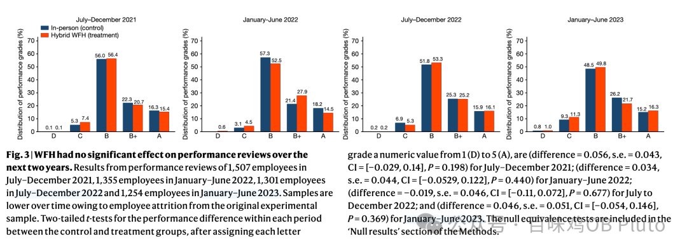

此外，在接下来的两年里，无论是在总体上，还是在任何主要的员工群体中，**晋升方面都不存在差异**，对**计算机工程师员工编写的代码行**没有影响。

在实验中，395位管理者改变了他们对混合工作对生产力影响的调查看法，**从实验前感知到的负面影响(平均为-2.6%)到实验后感知到的积极影响(+1.0%**)。这些结果表明，每周在家工作两天的混合计划**不会损害员工的表现。**

**Paper 2**

**2023 Science - Reducing single-use cutlery with green nudges: Evidence from China’s food-delivery industry**

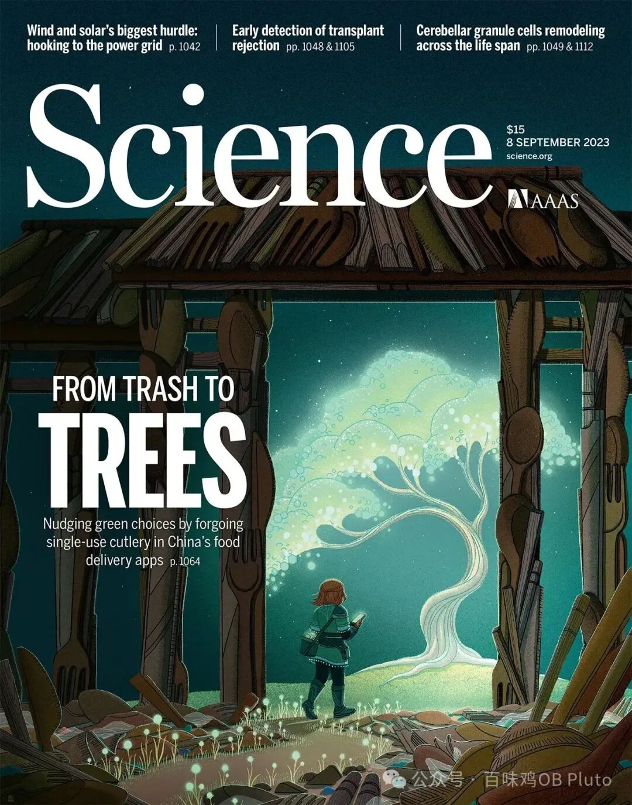

**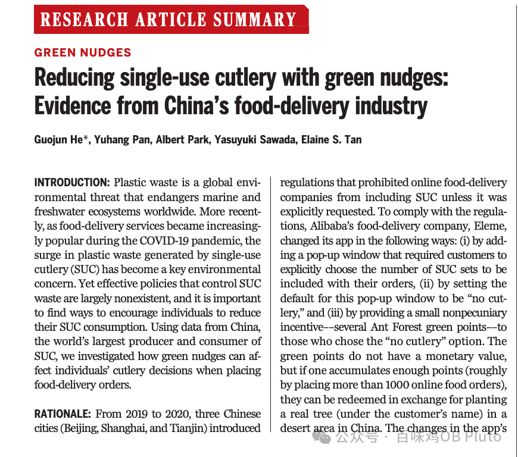**

这是一篇和消费心理学相关的论文，该论文利用**饿了么**平台，发现了“绿色助推”的用户界面设置（**将默认设置改为不使用餐具，并奖励蚂蚁森林能量）**会让**不使用餐具的订单增加648%**，且**不会影响平台的订单数量和用户消费。**

研究者进一步估算，如果将该绿色助推从试点城市推广至全国，**每年可以减少217.5亿套一次性餐具消费，相当于减少326万吨塑料垃圾以及促使544万棵树木免于砍伐。**

此外，研究结果表明 女性顾客、年长顾客、经常使用外卖配送服务的顾客和收入较高群体的顾客对绿色助推的响应更积极。

**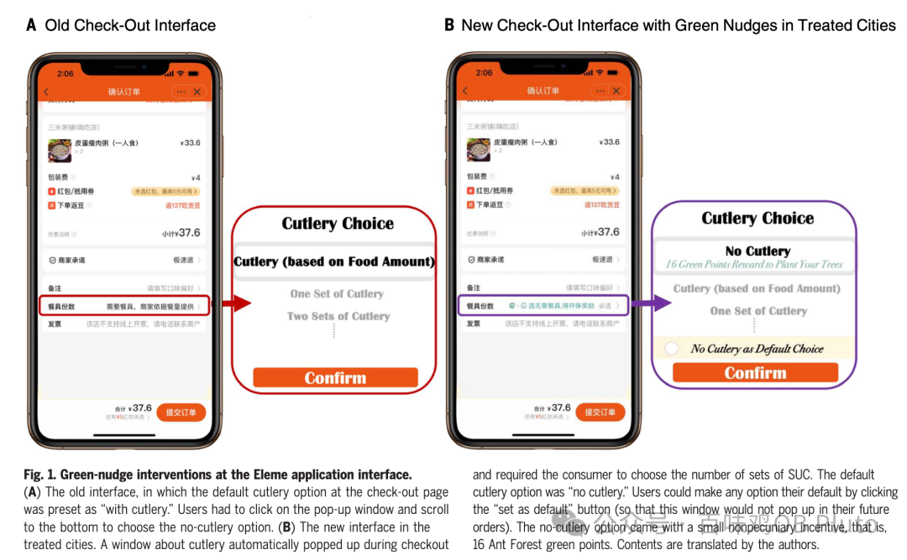**

**Paper 3**

**2021 Nature - People systematically overlook subtractive changes**

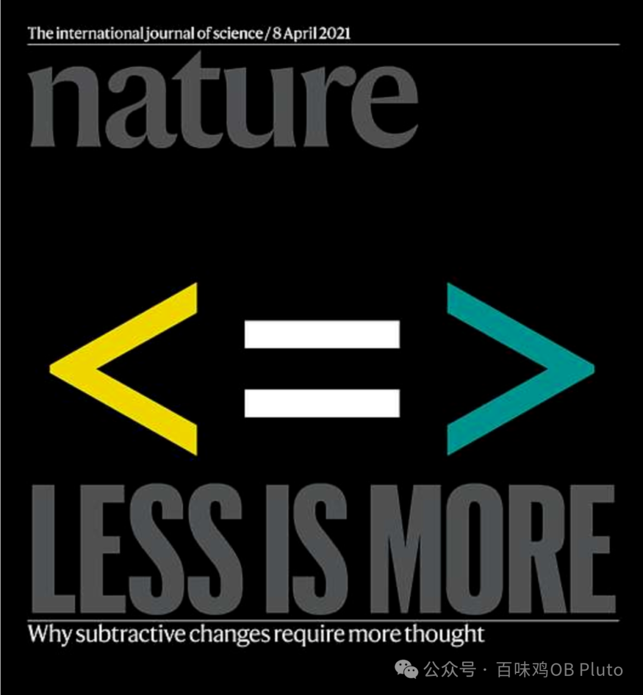

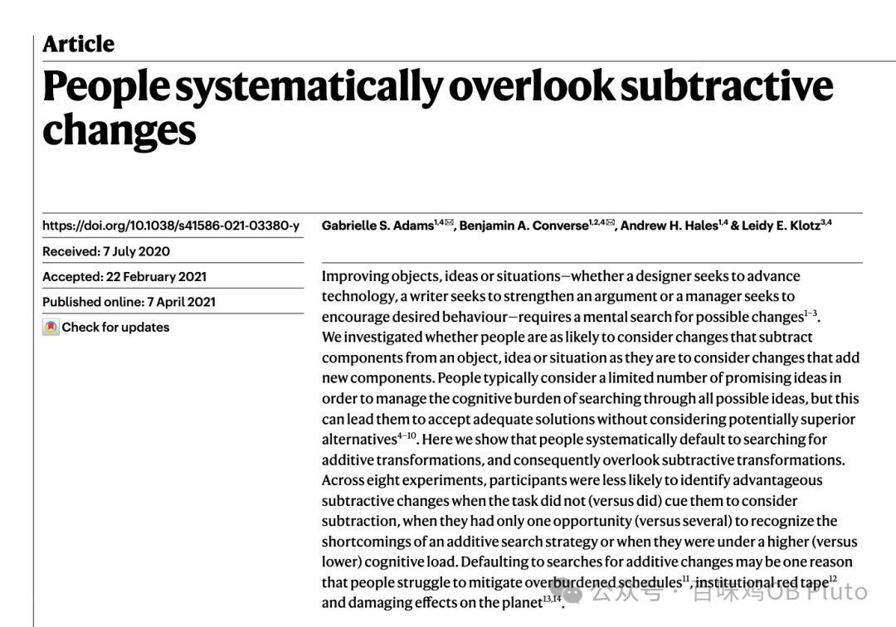

这是一篇逻辑非常简单、完全从现象观察中产生的、非常心理学的文章，关于问题解决中的加法思维和减法思维。

无论是设计师想要推动技术进步，作家想要强化论点，还是管理者想要鼓励期望的行为，都需要在心理上寻找可能的**变化**。

该研究设计了一系列的**问题解决实验**，通过这些实验观察人们对不同问题的处理方式，**发现人们在解决问题时更喜欢做加法**（通过增加元素来解决问题），**即使做减法（通过删除一些元素来解决问题）的效率更高。**

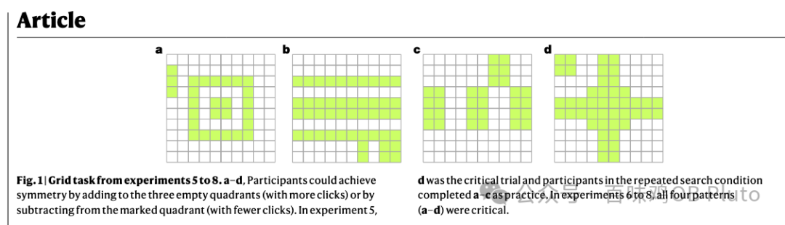

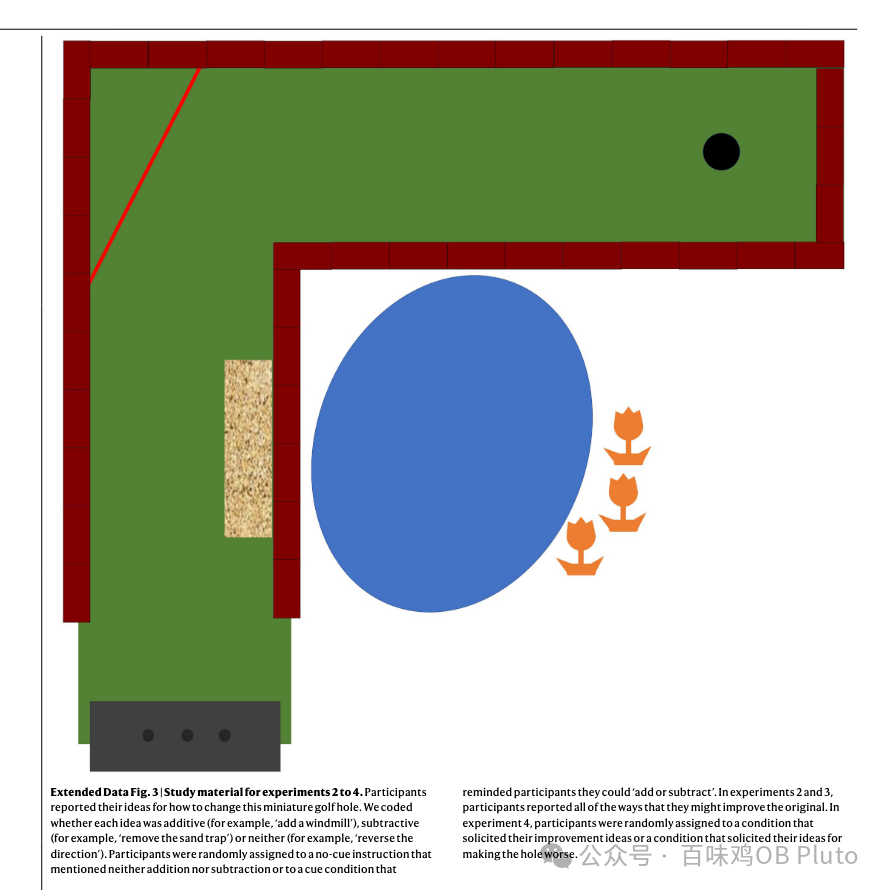

只有人们在**能够且愿意投入更多认知资源**的时候，才可能选择减法策略。换言之，要克服这样的默认策略，则需要付出更多的认知资源和努力，这需要外界环境和主观意识两方面的条件都很充分。

**Paper 4**

**2014 Science - Large-Scale Psychological  Differences Within China Explained by  Rice Versus Wheat Agriculture**

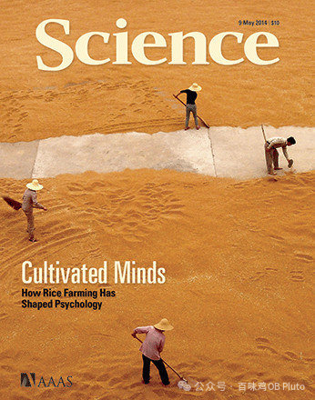

**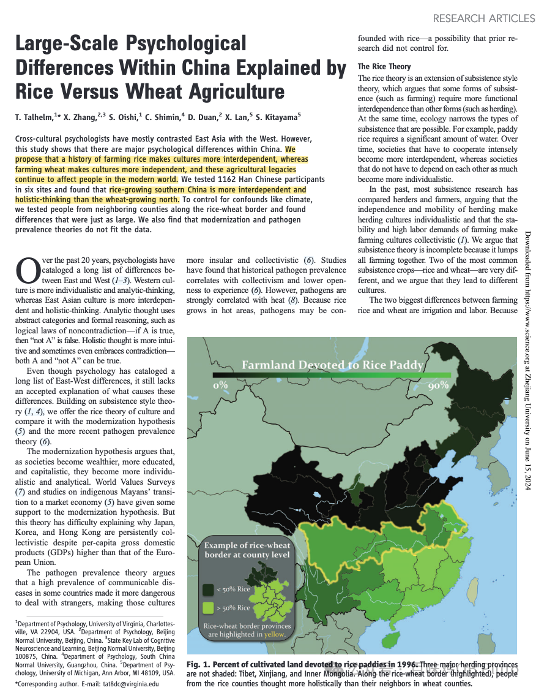**

这篇**rice theory**就更有名了！作者talhelm在中国生活多年，他的rice Theory说的是这么一回事：
**南方以水稻种植为主的省份的人群更倾向于整体性思维**，而且更倾向于**相互依赖和集体主义**，以**小麦种植为主的北方省份的人群更倾向于分析性思维和个体主义**。

他认为，种植水稻劳动量大，而且需要大量的水，灌溉系统是种植水稻必不可少的，因此不仅在灌溉时要与邻居协调用水时间等问题，而且修建、维护灌溉系统也不是一个家庭能够完成的，促使人们相互依赖与合作。长期的水稻种植史导致生活在水稻区的人们更倾向于整体思维和集体主义，水稻文化塑造了人的相互依赖性。

而小麦易于栽培，不需人工灌溉 ( 仅靠降水即可),播种和收割小麦的劳动量仅为水稻的一半, 所需劳动量小,不需与人合作也可独立完成，种植小麦让人们彼此独立，小麦文化塑造了人的独立性, 长期的小麦种植史导致生活在小麦区的人们更倾向于分析思维和个体主义。

研究通过来自北京、福建、广东、云南、四川和辽宁六个地域的1162名汉族大学生进行调查，包括测量其思维方式（分析性or整体性）、社会关系、个人主义水平等变量。 

研究结果显示：来自**水稻区的被试比来自小麦区的被试更多地显示了集体主义**，**小麦区的被试的显示了一定程度的自我膨胀**，**水稻区的被试更倾向于裙带关系**。本文研究显示中国的主要种植水稻和小麦地区存在较大的思维差异和文化差异。水稻种植地区有类似东亚的文化，更加有合作意识，具有全局思维方式和更低的离婚率，而种植小麦的北方有类似西亚的文化，更讲究个人主义，分析性思维方式和较高的离婚率。

**Paper 5**

**2010 Science - A Wandering Mind Is an  Unhappy Mind**

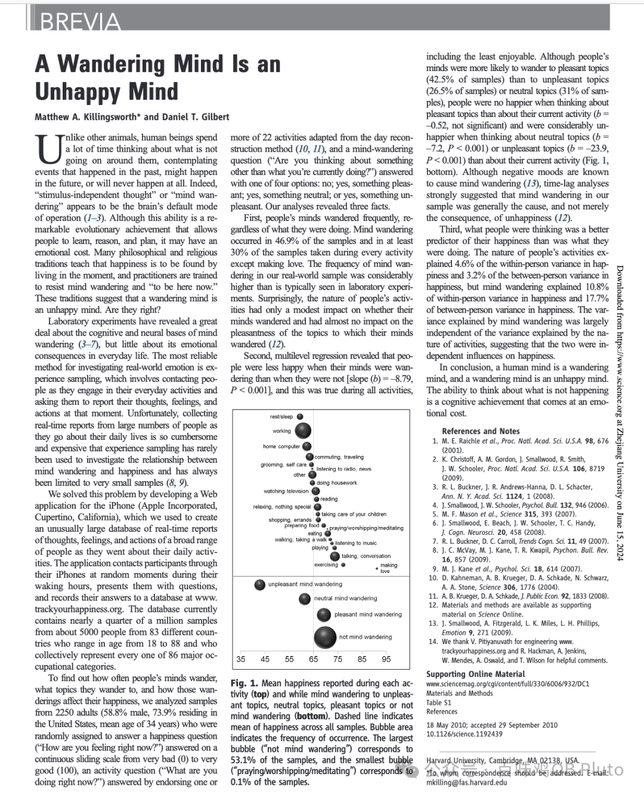

短小精悍但非常有趣的一篇文章，也是我了解ESM这种方法的第一篇文章。这篇文章通俗的说就是，走神儿的人是不快乐的。

与其他动物不同，人类花了很多时间思考身边没有发生的、过去发生的、未来可能发生的或永远不会发生事情。事实上，这种任务无关思维或心智游移似乎是大脑的默认操作模式。人们已经发现，这种能力是一种可以帮助人们学习、推理和计划的进化成就，**但它也可能会付出情感代价。**

研究者对2250个成年人开展研究，他们发现：

1、人类的大脑经常走神、漫游（数据表明，人们在上下班的路上时的分心指数最高：占65%！在工作的时候，也有一半时间在分心！包括阅读的时候，也有45%的时间在走神，很多人分心严重到根本无法安心下来看一本书。人们在交谈的时候，也有三分之一的时间在走神。**总结下来，人们有46.9%的时间是处在手边做着一件事，脑子里却在想着另外一件事情的情况**）

2、与保持专注相比，**人们在心智游移时的幸福感明显降低**，**即使漫游的内容是让人愉悦的**

3、第三、**负面情绪可能会引发心智游移，但心智游移也是不快乐的原因。**

Lastly,

好的研究，确实一句话就可以讲清楚了。但同时，看这些文章中用到的数据也知道，不是咱们人一般能收到的。

所以,希望手里有资源的人能稍微有些科研热忱hh，多用数据发一些真正能推动实践改变、认知改变的文章上顶刊，推动心理学、社会科学再向前进步一点点。

希望慢慢地，心理学不再被诟病为学者的颅内高潮，而是能真正增加一些人们理解世界的角度、让打工人也能靠着这些实证的武器来提升幸福感、让理工农医所创造的“硬核”也能被“柔软”的真实的人所接住。

Science和Art并不矛盾，没有谁比谁更高贵，他们共同构成了这个美好的世界。
