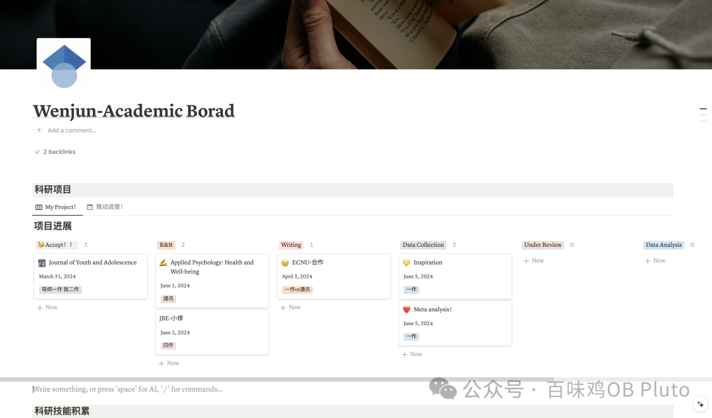
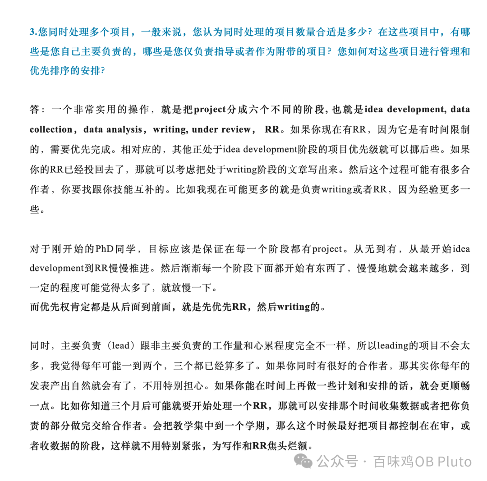
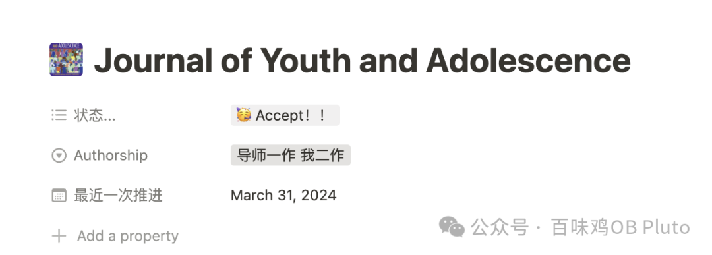
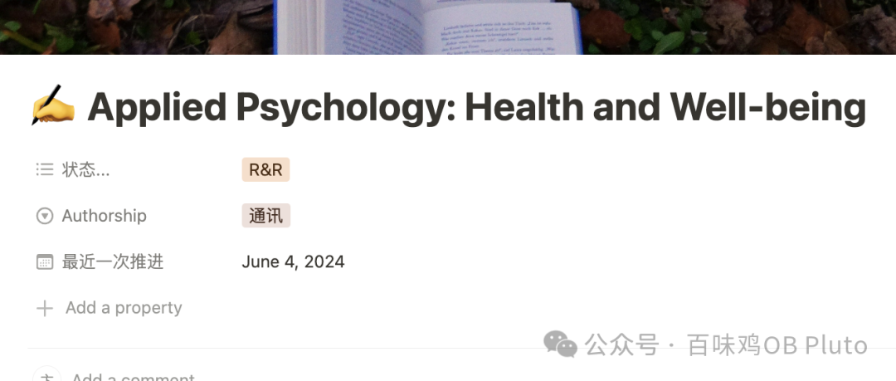
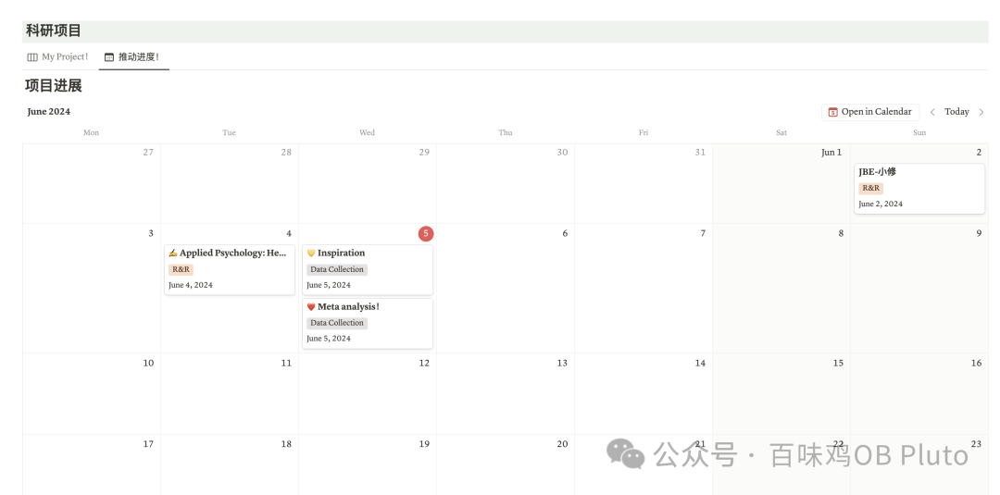
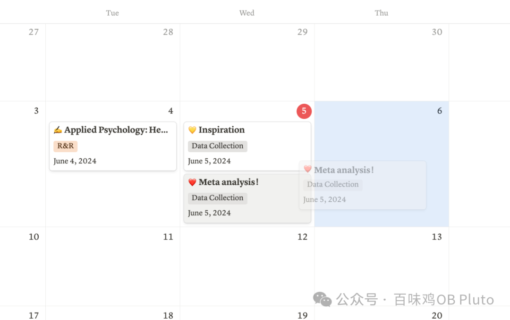
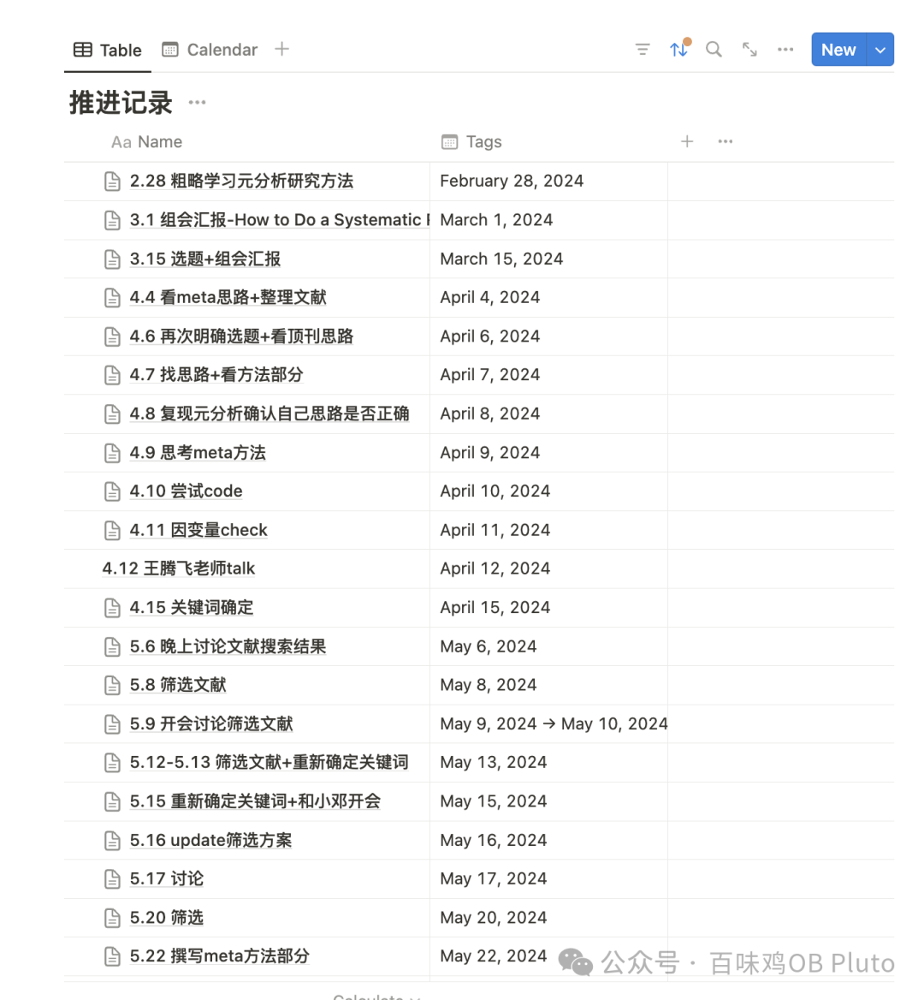
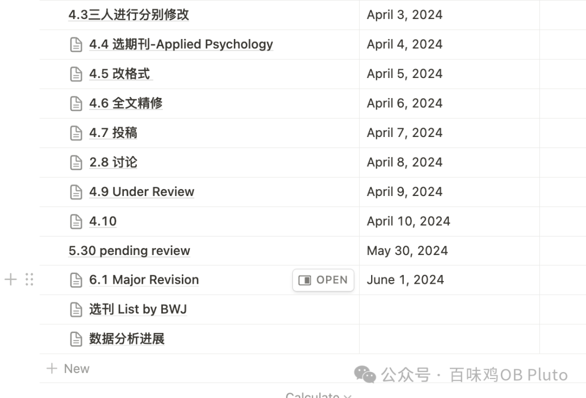
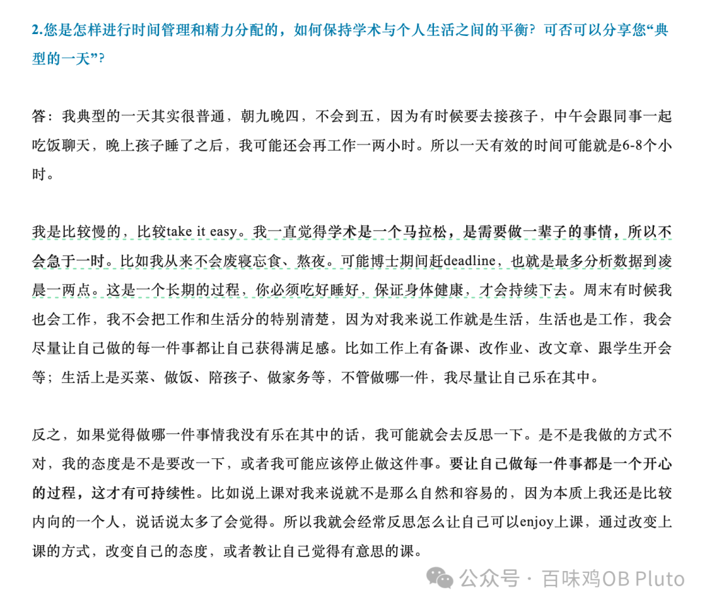

Beginning

🌧阴雨天... 懒得学习...  所以就来分享一下这个学期研究出来的notion管理科研项目大法！可以有效地提升我科研上的「节奏感」。

我向来不太喜欢太复杂的notion设计，很多时候把网络上别的博主非常fancy的模版复制过来，用了3天就不行了。

所以现在很多自己在用的页面，也都是非常简单的一些标题+表格排列的形式，没有太多花里胡哨的东西。

我的学术相关页面大概就是这样，只会放科研项目+科研技能的一些资料。所以是两个标题+两个database的简单形式。（对了！今天我发现，notion终于出了类似目录索引的功能，就是右侧那几道小横线！）

今天主要介绍科研项目的database。因为我感觉这学期我并没有在「科研技能」有太大的提升，比如有很多好的资源还没有花时间进行学习，所以等到我自己真正地在定期提升的时候再来分享。

在科研项目database中，我只放了两个视图：👁看板视图和📅日历视图

**👁看板视图：**

这个的设计思路主要是借鉴了荷兰心理对于「连汇文」老师的采访，大家可以仔细阅读这篇（[内卷时代，如何不焦虑地做学术 | 连汇文教授科研经验分享](http://mp.weixin.qq.com/s?__biz=MzU5MjEwODg1OA==&mid=2247498394&idx=1&sn=1e774dd693e4b24efc38cb4da4d5d0a2&chksm=fe2676cfc951ffd9c144485aa9e5e45a9b4286c58d11f47488d0c2b572a0ff6b90e2d47d8095&scene=21#wechat_redirect)），非常值得反复阅读！！

所以，根据以上这6个阶段，我就在将看板视图分成了这样的6类：idea development, data collection，data analysis，writing, under review， RR。

然后在每个类别下面填上相应的项目名字、作者排序。

除此之外，我还设定了一个“最近一次推进”的时间。

这个的好处其实是在📅**日历视图**中才会体现出：

像这样！

因为多个项目并行，总是会导致有些项目进展推得很慢。

但是用日历视图就可以清楚地看到，哪些项目一直在“伴随”着我，而哪些已经“掉队”了。（对不起飙哥 我会在暑假把掉队的项目赶上orz）

并且！每次在日历视图里面把项目往前移动，就会有一种快感！感觉真的有一种“推进”的感觉了！！

**页面内部：**

内部我也是放了一个非常简单的表格，梳理做这个项目的时间线，以及每次修改、讨论、灵感、注意点、代码的存档。

这样可以清晰地感受到这个项目的变化，也可以在项目做完之后进行复盘！这对于下次再去开展一个新项目也很有帮助，主要在之前流程的基础上不断改进即可~

所以，基于这个notion面板，我的习惯是：

当我每天开始科研的时候，我首先会用toggl开始记录时间，之后我再打开notion找到对应项目，创建日期和标题，之后再打开google scholar等开始探索，在此过程中，我有任何的想法都可以记在notion中，而不会让想法“飘走”。

这样做还有一个好处是，当你的老板问你的进度时，你只要打开这个表就可以知道自己过去做了点什么。

比如这学期做的meta！ 看到这个推进记录就可以感受到这学期在上在上面付出的心血...

还可以记录论文的审稿进展，以及每一次的修改变化，这个会很方便之后文章的投稿！

Ending

So much for this！

最后再放放连汇文老师里面提到的，吃好喝好，身体健康，才能可持续发展！

比如今天下雨懒得学习，我就快乐摸鱼一会，学术戒断一下，学学别的东西hhh~

