本文是基于以下论文改编的图文科普版本（为便于阅读，省略了一些细节）。

若您想在学术中使用，请务必参阅原文：

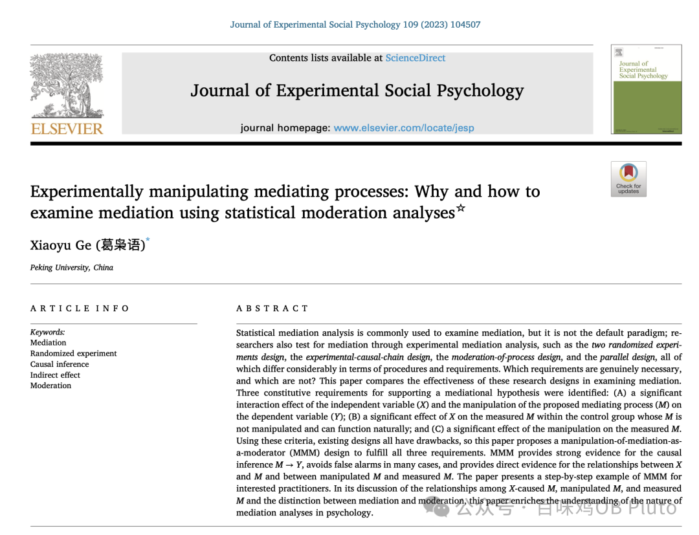

葛枭语. (2023). **Experimentally manipulating mediating processes: Why and how to examine mediation using statistical moderation analyses**. Journal of Experimental Social Psychology, 109, 104507. https://doi.org/10.1016/j.jesp.2023.104507

微博@心理学情报局 已将论文原文翻译为**中文版**，希望有助于减轻方法论文章的阅读成本。如您有需要，可私信发送“**MMM**”至**微博@心理学情报局** 免费获取PDF。

我也已经下载了，可以后来私信我领取（回复：学术交流）。

另外，若有基于本文想讨论的，也可以后台回复「学术交流」加入本公众号的群聊一起聊聊~

作为一个“好心公众号”，必须为这位呕心沥血的作者宣传转载！今天下午花了2个小时拜读了一下文章，真的被作者美妙的逻辑推理和“思想实验”而折服。

好在这个良心微博做出了图文的排版，造福大众。我直接搬运~

以下内容均来源于@心理学情报局 的微博。

**在本文中您将看到**

★ 中介统计分析有何局限？

★ 为何要做实验性的中介分析？

★ 以往实验性的中介分析设计有何局限？

★ 想要用实验性的中介分析来支持中介假设，需要满足哪些要件？

★ 如何设计实验，可以满足这些要件？（附分步拆解的实验流程和结果分析表）

******此文缘起：******

******从学报一次退稿说起******

一些朋友或许听说过《心理学报》2021年的一篇文章《君子不忧不惧：君子人格与心理健康——自我控制与真实性的链式中介》。除了测量中介的常用方法外，在该文中，我运用了「**操纵中介**」的方法，对中介变量做出实验操纵，然后运行了**调节统计分析：自变量 × 对中介的操纵 → 因变量**。

后来，我的另一篇投稿运用了同样的研究设计，《心理学报》在同行评审后决定退稿。

第一位审稿人指出：“（操纵中介的）研究四和（测量中介的）研究二是完全不同的逻辑，**研究二中的中介变成了研究四的调节**，这在同一个研究中不应出现逻辑不统一。”

第二位审稿人并未对操纵中介的研究设计提出质疑。

第三位审稿人指出：操纵中介的研究四“呈现的是一个关于M的补偿效应的结果（调节效应），即无论是否操纵M，高X的都具有高的Y，而低X的个体的Y可以通过操纵M得到提升。因此，这个研究本上是说明的是M在X与Y之间的**调节作用，而非中介作用**”。

此外，第一位审稿人还对《君子不忧不惧》一文做出了补充评论：“当我看见研究生课堂上其他老师讲此文作为范文让学生学习时，我意识到了我的错误，那篇文章不值得学习，至少很多做法（比如**调节和中介混用**，此文也一样）是**不常见的**。我发现学报的论文应该更审慎一些，因为它可能决定很多年轻研究生的学术审美。”

令人不免惊讶的是，资深的审稿专家将操纵中介的研究方法描述为“**不常见的**”。事实是，假如审稿专家拨冗阅读近十年发表的论文，不难发现，这种研究方法在国内外重要期刊上**已经几乎随处可见**。作为文献阅读量不大的人（因为已告别学术机构多年），我甚至都能从日常读到的文献中随手举出一串例子：

-心理学报：10.3724/SP.J.1041.2017.00513

-人格与社会心理学杂志JPSP：10.1037/a0031999；10.1037/a0029366

-情绪：10.1037/emo0000928

-人格与社会心理学公报PSPB：10.1177/0146167214529800；10.1177/0146167220936480；10.1177/0146167214524444

-实验社会心理学杂志JESP：10.1016/j.jesp.2019.103914；10.1016/j.jesp.2022.104397

-英国社会心理学杂志：10.1111/bjso.12695

-心理医学：10.1017/S0033291718002106

-管理学会杂志：10.5465/amj.2014.1142

-领导力季刊：10.1016/j.leaqua.2019.05.002

-攻击行为：10.1002/ab.21904

操纵中介的研究方法，最迟不晚于2005年已被方法论文章专门提出；在此之前已经有具体实践尝试。早在2012年，Eliot R. Smith就任《人格与社会心理学杂志JPSP》主编时，所发表的就职社论，就曾明确**呼吁采用实验方法检验中介**：在合适的地方，作者**应当**采取实验方法来检验中介。

十数年后，在此类研究文章已经这样多的情况下，部分审稿专家仍报告称自己“不常见”到此类研究方法，并认为其混淆了中介与调节，这种现状稍有些令人不易理解，至少说明该研究方法的传播方面仍有进一步努力的空间。

当然，不能因为国外期刊常用某种研究方法，就认定它必然是对的。为此，我决定自己从头就这个议题开展分析，搞清楚该研究方法到底是调节分析的误用、还是确实可以检验中介。若误用，则须从自己做起、并呼吁同行停用这种方法；若非误用，则有必要进一步传播该方法，使研究者寻求更严格的方法学创新的努力不会反而被视为一项研究的污点。

在分析中，我不仅找到了这个问题的答案——**操纵中介的研究方法确实是可以检验中介假设的**，而且还找到了以往研究设计的一些局限、并总结了新的研究设计——MMM设计。这使得这次分析的结果不仅可以变成一篇科普文章、还可以产出具有一定创新发现的期刊论文。

‍**‍中介分析，**

**为何要操纵中介？**

‍

‍

在检验中介假设的时候，人们常常使用**中介统计分析**，典型的做法是测量中介、然后用SPSS的PROCESS插件（或其它类似工具）运行一下中介分析。但是，它并不是中介检验的默认范式。

中介统计分析用得好好的，为什么非要操纵中介呢？这是因为，中介统计分析存在一些局限性。

为便于描述，让我们思考这样一个比喻。如下图所示，我们想知道：**水源地的水**之所以能够进入**水池子**，是不是通过了**水管A**的中介作用？

这时，一个直接的想法是：让我们在水管A上设置一个**透明观察点**，把该处的管道替换成透明管道。这样一来，如果当我们开启或关闭水源地的供水时，能够观察到“透明观察点”和水池子的流量随之变化，可以推测，水源地的水流确实是**经由水管A**注入水池子的。

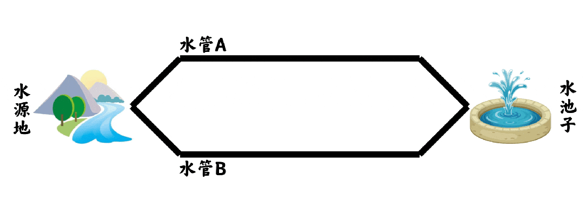

这种思路其实就是「**中介统计分析**」的思路。研究者瞄准他们假设的中介过程，想办法设置一个“透明观察点”来测量该心理过程M。这样一来，如果当自变量X发生变化时，能够观察到受测量的M、因变量Y随之发生变化，可以推测，X经由M的中介作用对Y施加影响。

然而，有没有这样一种可能性，水管A或许根本走不通，水流实际上是按下面这种方式走的（即**Y→M而非M→Y**）。请注意，这时，我们同样可以观察到“透明观察点”和水池子的流量随水源地开关而发生变化：

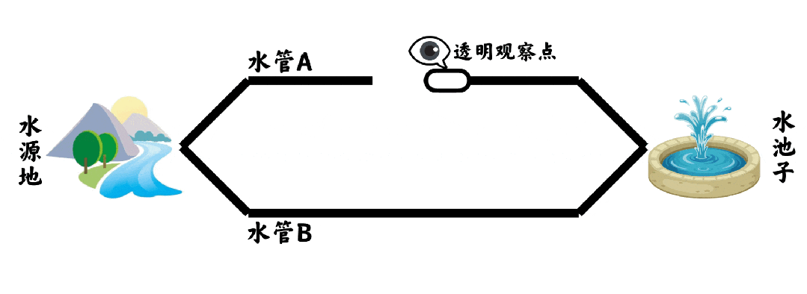

又或者，更离谱一点，或许M和Y之间并无因果关系，而是**第三方因素同时影响了二者**，例如，可能附近下雨了，“透明观察点”和水池子正好同时发生了流量变化：

特别地，这里所说的“第三方因素”还可能**正好就是X**，或许水源地同时向“透明观察点”和水池子供水，但“透明观察点”和水池子之间的通道是断开的：

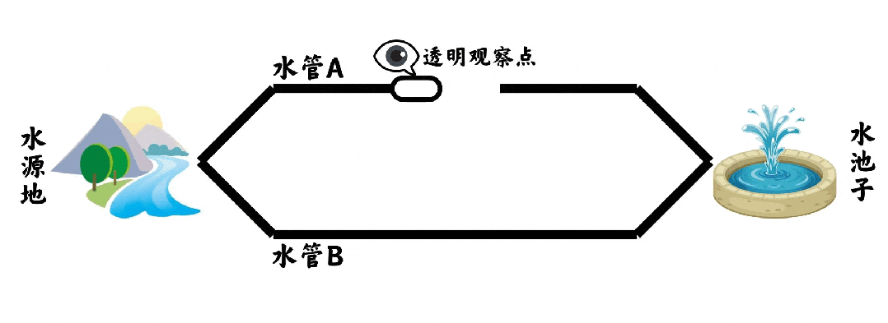

回到心理学的语言，这些比喻实际上想要说明的是：中介统计分析**无法判断M和Y到底哪个是中介、哪个是结果**；而且，由于参与者是自己选择进入M的某个水平（而非被随机分配），**无法判断到底是M影响了Y，还是驱使参与者做出这种选择、但未被研究者捕捉和量化的潜藏因素影响了Y**。

那么，**如何证明M和Y的因果关系呢？**

这个问题其实不难回答，我们只要看看如何证明X和Y的因果关系就好了。研究者会将实验参与者随机分配到X的不同水平，并观察这种实验操纵是否会改变参与者的Y。这就好比，我们开启或关闭水源地供水，看看水池子的水流量会不会发生改变。

类似地，**为何我们不对M也做一下这种操纵呢？**比如，我们在水管A上的某个位置安装一个水闸：

当水闸开启时，水源地的水流自然地、自由地注入水池子；但当水闸被人为关闭时，水源地的水流不再能够通过水管A进入水池子，因此水池子的水流量就不会再像平时正常状态那样。（不一定水池子就不再有新水注入，因为可能有别的管道，但是水池子的流量不会像平时正常状态那样。）

相反，如果人为关闭水管A上的水闸后，水源地仍旧**一如寻常地**向水池子注入水流，没有发生丝毫改变，那么，我们就更有信心做出推论，水管A并非水源地得以向水池子注入水流所经由的中介管道：

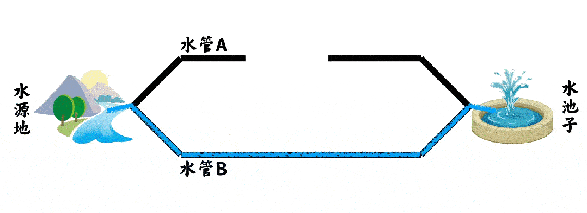

这就是为什么我们要对中介开展实验操纵，因为其能够**为M和Y的因果关系提供更加强有力的证据**。（当然，M和Y的因果关系并非只能通过实验得到支持，还有别的方法，但不在本文讨论范围内。）

**以往研究者**

**如何操纵中介？**

相信对于熟悉较新文献的朋友们来说，上面说到的“操纵中介”早已不是新鲜事。然而，不同于中介统计分析已经发展出相对共识性的流程和要求，以往方法论研究者为实验性的中介分析提出了多种多样的设计：

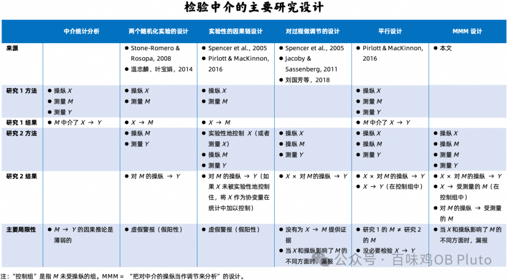

这些设计在流程和要求上都存在着极大的差异。这使得有心实践「实验性的中介分析」的研究者非常迷惑：到底哪些要求是实验性地检验中介所必不可少的，而哪些其实大可不必？到底哪一种研究设计可以满足中介检验的要求？

经过详细对比中介检验的目标和不同研究设计的做法，我得出结论，**以往实验性中介分析的研究设计均难以有效地满足中介检验的全部要求**，在某些情形下可能存在虚假警报（假阳性）的风险。我在文章中指出了这一点，并且给出了详细理由。

然而，在本文投稿至《心理学报》时，匿名编委评论称：“**站位和表述有问题**。正确的做法应当是说明在何种条件（或情形）下，应当如何建模、使用什么样的方法进行中介效应分析，而不是笼统地反驳这个反驳哪个（见自检报告和文献综述），那会给读者一种错觉，以为以前的方法都是错误的。”最终该文并未被送往同行评审，在编委初审阶段就得到了退稿决定。

匿名编委专家似乎忘记评估一种可能性，即万一以前方法确实存在错误，并非错觉。尽管并不清楚为什么不可以反驳以前的错误方法，但仍须提醒读者注意，我在原文中和在以下部分对于以往方法局限性的分析，仅代表我自己的看法，**读者应自主鉴别是否有理**。

温忠麟和叶宝娟（2014）发表在《心理科学进展》的文章**《中介效应分析：方法和模型发展》**指出：“再说实验设计，通常认为是验证因果关系最有效的一种做法。……如果第一个实验能验证X是导致M的原因，第二个实验能验证M是导致Y的原因，那么间接路径的因果链就得到了验证（Spencer et al., 2005）。”

尽管我本人也从两位老师的系列方法论文章中获益良多，而且该文的其它方面也具有很大的价值，但是，经过慎重考虑，我仍然要坚持我的看法：**我所直接引用的这句话是存在错误的**。理由如下：

一方面，这可能涉及**错误引用**，因为这句话不是对其所引文献“Spencer等人（2005）”的恰当描述。Spencer等人提出的“实验性的因果链设计”，对第二个实验的要求是，在控制X的条件下验证M对Y的影响。此处描述存在出入。

当然，引用者有时只是引用一篇文章作为一种注脚，在行文中确实不必然需要完全精确地复述被引文献。但是，另一方面，即便不管被引文献，仅看此处的方法论描述，仍是有问题的，**不能帮助研究者实现检验中介的目标**。

接下来的详细分析可能稍微有点长。。。只想看最终结论的朋友们可以直接划到“**方法论指南：到底如何操纵中介**”这一节~

为了详细分析这个问题，在此，请您随我进入一段**思想实验**。

容我举一个例子，这个例子将贯穿全文：假设，数学教材难度（X）通过学生数学焦虑（M）的中介来提升学生的努力（Y）。

首先，让我们从上帝视角来对这个例子添加一些额外的设定。

**第一条设定：**参与者并不同质，而是混融了两类人。其中，有m位参与者属于优秀学生，而有n位参与者属于后进学生，m和n均大于0，且总样本量（N）正好等于m + n。

**第二条设定：**困难教材（X）并非均等地影响着每位参与者的数学焦虑（M）。对于优秀学生来说，所谓的困难教材实际上不过是小菜一碟，根本不会诱发焦虑；然而，对于后进学生来说，困难教材将焦虑提升了p个单位（p > 0）。

**第三条设定：**面对焦虑，不同的人采取了风格迥异的应对方式。对于优秀学生来说，焦虑每增加1个单位，努力就增加r个单位（r > 0）；然而，对于后进学生来说，无论焦虑是多一点还是少一点，他们的努力都不会发生任何改变。因此，在这个例子当中，研究者提议的中介实际上并不真的存在，因为，那些会受到焦点X的影响而诱发焦虑的学生（即后进学生）并不会付出更多的努力。

这时，致力于开展实验性的中介分析的研究者，将选择他们的操纵方式，针对焦虑施加影响。

然而，**第四条设定：**研究者选出的操纵手段并非均等地影响着每位参与者的数学焦虑。例如，研究者告诉受到操纵的那组学生：在筛选谁可以获得顶尖大学的录取推荐时，这本教材的考试分数将影响到校方的决定。对于一名优秀学生来说，这个机会至关重要，因此，其焦虑提升了q个单位（q > 0）；然而，对于一名后进学生来说，可能压根儿没考虑过自己有进入顶尖大学的可能性，因此，这段操纵信息根本不会诱发焦虑。

请注意，这些设定都是从上帝视角做的，人类研究者对此毫不知情。（这里讨论的例子完全是捏造的，没有任何实际证据。）

回到人类视角，现在让我们想像一下：**采用温忠麟和叶宝娟（2014）在上述引文中所描述的研究设计，研究者将遇到什么。**

使用该设计的流程如下：（A）在实验1中，操纵教材难度（X），然后检验一下被随机分配到困难教材组的参与者是否比被分配到容易教材组的参与者感到更加焦虑（M）；（B）在实验2中，操纵数学焦虑（M），然后检验一下被分配到焦虑信息组的参与者是否比被分配到无关信息组的参与者付出了更多努力（Y）。

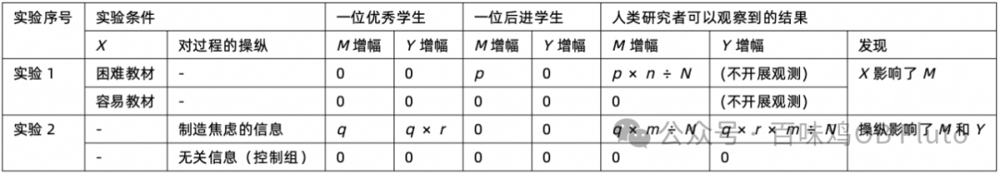

如上表所示，研究者将在实验1中观察到，困难教材组的焦虑程度（M）高于容易教材组，高出p × n ÷ N个单位，这支持了X影响M的想法。

研究者将在实验2的操纵之后开展一项操纵检查，使用的量表与研究1测量焦虑（M）的量表保持一致。他们将观察到，受操纵组的焦虑程度（M）高于控制组，高出q × m ÷ N个单位，这意味着操纵是成功的。

最终，研究者将在实验2中观察到，受操纵组的努力程度（Y）高于控制组，高出q × r × m ÷ N个单位，这说明M影响Y。

把这些发现摆到一起，研究者将会得出结论，数学焦虑确实在教材难度对努力的效应中扮演着中介的角色。**这是虚假警报，因为中介明明就根本不存在**。

**那如果用**

**Spencer的方法呢？**

假如该文准确地描述了Spencer等人（2005）提出的“实验性的因果链设计”（experimental–causal-chain design），虚假警报是可以被避免的吗？

这种研究设计的不同之处在于，在实验2中，检验受操纵的M是否影响Y时需要额外控制一下X。例如，实验1对比了困难教材组和容易教材组，在此之后，研究者要求实验2招募的所有学生都学习困难教材（即，实验性地控制了X），将他们随机分配到焦虑信息或无关信息，然后对比一下焦虑信息组和困难信息组的努力程度；或者，研究者对实验2学生们的教材难度进行测量，然后在检验受操纵的焦虑对努力的效应时将教材难度添加为协变量加以控制。

然而，**上节提到的虚假警报风险，在“实验性的因果链设计”中也同样存在**，减不了半点儿。

如上表所示，操纵是成功的，受操纵组与控制组的努力增幅也被观测到了差异。

若我们回到上帝视角，我们将对研究者使用这两种设计所得出的结论感到遗憾。**被假设的中介明明就并不真的存在，但这两种设计所提供的证据却误导了研究者。**更进一步，这段思想实验暗中假定了实验1和实验2的参与者是相同的或至少同质的；然而，在现实研究中，更可能的情况是，研究者将在两项实验中招募不同的参与者，这将掺入更多混杂因素。

**这两种设计**

**为何存在这一陷阱？**

三种视角有助于回答这个问题，而且还能丰富我们对于中介本质的理解。

**第一个视角**

让我们回到中介假设的起点：数学教材难度（X）通过学生数学焦虑（M）的中介来提升学生的努力（Y）。

我们可以用**反证法**来理解这句话，也就是说，我们先列举出这个假设的所有反论题，如果所有反论题都被证明是假的，那么，原假设则得到支持。

为此，容我穷举出反论题为真（即，原论题为假）的所有情形：

**情形1：**教材难度（X）的变化不会引起数学焦虑（M）的变化。

**情形2：**数学焦虑（M）的变化不会引起学生努力（Y）的变化。

**情形3：**虽然X影响M、且M影响Y，但是，由X变化所引起的M变化，不会引起Y变化。换句话说，M对Y的影响独立于X对Y的影响。

如果我们要对原假设做检验，当且仅当以上三种情形全部被拒斥时，中介假设才能够得到支持。

在这里，对于研究者来说至关重要的是：在中介命题「自变量通过中介来影响因变量」中注意**「通过」（through）二字**。也就是说，要分辨清楚情形2和情形3的不同。「X通过M影响Y」的命题，不仅意味着M会影响Y，而且意味着**由X引起的M**会影响Y。（如下图左）

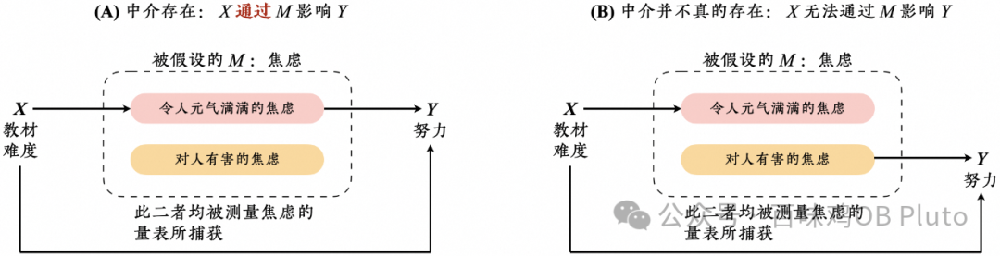

证明X对M的效应、M对Y的效应**无法提供关于「通过」的信息**，不足以支持中介假设。这是因为，类似于“上图右”的情况是可能存在的。例如，可能有两种迥然相异的焦虑类型，一种是令人元气满满的焦虑，另一种是对人有害的焦虑，量表所捕获的焦虑实际上包含了这二者。（注：这两种类型是本文为便于讨论而虚构的，我还假定，研究者不知道世界上存在这两种不同类型的焦虑、或者不知道如何分别测量二者。）教材难度（X）可以诱发令人元气满满的焦虑，但这种焦虑对努力（Y）毫无影响；相反，教材难度不会影响对人有害的焦虑，但这种焦虑却会影响到学生的努力程度。

在这种情况下，被假设的中介实际上并不真的存在，因此，一种理想的设计应当有能力拒斥中介假设。换句话说，一种理想的设计不仅应检验情形2，还应当对情形3做出检验，证明**M对Y的影响是否独立于X对Y的影响**。

然而，如“下图右”所示，上述两种研究设计所要求的分析（即，检验一下制造焦虑的信息是否影响努力）无法对情形3做出拒斥，尽管它确有能力对情形2做出拒斥。即使我们发现，阅读了焦虑信息的参与者，显著增加了努力（Y），但是，我们仍然不清楚这到底是由于令人元气满满的焦虑（这种焦虑是可以受到X影响的）、还是由于对人有害的焦虑（X无法影响这种焦虑、但操纵手段却诱发了这种焦虑）。因此，上述两种研究设计可能导致错误。

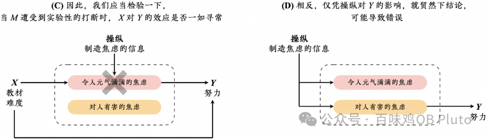

回到咱们的水管比喻上，我们应该检验的并不是，开关水闸是否改变水池流量，而是，**开关水闸是否干扰了水源地向水池子的正常注水过程**。也就是说，我们要检验的不是「对M的操纵 → Y」，而是「**X × 对M的操纵 → Y**」。（基本逻辑如“上图左”）

我们需要检验的是，焦虑信息是否调节了教材难度（X）对努力（Y）的效应。这样做的逻辑是，如果焦虑是X对Y施加影响所经由的中介过程，那么，当研究者用焦虑信息来实验性地打断这个过程时，X就**不再能像寻常一样**对Y施加影响了。

因此，我们可以比较X对Y的效应在两种条件之间是否存在差异：一种条件是，被假设的中介过程可以自由地、自然地运作；另一种条件是，被假设的中介过程遭受到了限制或甚至被完全堵塞。如果在这两种条件下X对Y的效应存在显著差异，那么，被假设的中介过程确实扮演着连接X和Y的中介过程。

“打断”“限制”“堵塞”这几个词语，可能令您想当然地以为，我们应当削弱或根除焦虑；然而，它们在这里实际上是指，想办法让我们所聚焦的中介过程偏离它的自然状态、不再能够自由地运作。因此，只要操纵能够促使参与者的焦虑不同于没有被操纵的条件，无论是实验性地增加或减少焦虑，都是可以接受的。

现在，就让我们回过头来看一下我们的思想实验吧，看看这里所说的**交互效应检验**，能不能避免上面提到的虚假警报风险。

研究者将参与者随机分配为2（容易教材 vs. 困难教材） × 2（制造焦虑的信息 vs. 无关信息）组，测量他们的努力程度（Y），然后检验一下交互效应是否显著。

如上表所示，当M受到操纵时，困难教材组和容易教材组的努力差异为(q × r × m) ÷ N − (q × r × m) ÷ N个单位（这一长串的运算结果是0个单位）；而当M未受操纵时，两组的努力差异为0 − 0个单位。这意味着研究者将无法观测到显著的交互效应，无法得出中介结论。这一发现**有效地保护研究者免受虚假警报的误导**。

**第二个视角**

上述两种研究设计忽视了一个心理学研究者必须要解决的问题：**心理学研究所谓的「因」不可能是必要充分条件**。假如X变化是M变化的充分条件、M变化是Y变化的充分条件，这意味着，教材难度的改变将不可避免地导致焦虑的变化、焦虑的改变将不可避免地导致努力的变化，那么，上述两种研究设计是可行的。

然而，在心理学中，只要教材难度的改变**有可能**导致焦虑的变化，那么，研究者就会将教材难度视为焦虑的「因」。但在个体层面，甭管教材难度是高是低，某些参与者的焦虑可能丝毫不会发生变化；还有可能，某些参与者的变化方向跟全体参与者的变化方向根本就是完全相反的。而且，即使教材难度不变，个体的焦虑也可能随着其它条件的改变而改变。上述两种研究设计忽视了心理学研究的这种特性，即，心理学研究所谓的「因」不可能是必要充分条件。

一些读者可能会反驳前述思想实验，认为，研究者应当在模型里添入一个哑变量，以表征学生是优秀的、还是后进的，将其作为**协变量或调节变量**。

例如，《心理学报》《心理科学进展》在编委初审的退稿信中就提出了这样的质疑。

**——《心理学报》匿名编委评论称：**“因为这个虚构实验人为制造了两个调节变量，这种情形用简单中介模型处理不了很正常，是否应当用有调节的中介模型来分析？ ”

**——《心理科学进展》匿名编委评论称：**“该文通过一个X-M-Y(数学教材难度→数学焦虑→努力行为)的中介模型，人为加入两个调节变量（学生能力和实验干预），用来批评文献上的中介模型或者对应的实验有问题，说服力不足。任何模型都有其假设和适用范围，就像不能人为模拟一个二次曲线关系，用来批评做直线回归有问题，因为发现直线关系拟合不足的时候，可以增加平方项去改进模型。”

匿名编委专家的这些质疑仿佛是在说，**只要个别研究者不故意“人为加入”对于学生能力异质性的考虑，就不必费心去担忧上述研究设计可能存在的误报风险**。然而，我想，在心理学研究者所能获取的几乎任何一个学生样本中，学生能力的个体差异都是天然存在的，不是所谓“人为制造”的，也不是把自己眼睛蒙起来就可以假定其不存在的。上文所做的努力只是把藏在水下的隐忧摆到台面上而已，并非蓄意制造调节变量。

事实上，我在原文中就已经对这种潜在挑战做出了提前回应。我同意，在开展实验前竭尽全力地把尽可能多的混淆变量纳入考虑是有帮助的。然而，**这种考虑绝不可能是无限的，但参与者的异质性是趋于无限的**。

因此，本文所使用的优秀学生和后进学生（或令人元气满满的焦虑和对人有害的焦虑）之区分仅仅是为了简化描述和讨论。在真实世界中，找到能够均等影响所有参与者的一个变量或一种干预，几乎绝无可能。某些异质性现象甚至不是人类既有语言所能够描述的。因此，**建议研究者把一切异质性现象统统作为协变量或调节变量纳入分析，是不现实的，除非研究者假装他们已经考虑了一切**。只要研究者的考虑范畴尚未覆盖一切，那么，上述两种研究设计就可能导致错误。

**第三个视角**

中介统计分析的任务是，检验一下等式M = aX + e2中的a和等式Y = c'X + bM + e3中的b是否均不为零。

表面上看，温忠麟和叶宝娟（2014）的上述引文所描述的研究设计，似乎用两个实验分别检验了a和b；然而，实际上，实验2检验的不是b，而是等式Y = b'M + e4中的b'是否不为零。该研究设计之所以是错误的，就在于其**误将b'看成了b**。不同于b'所在的等式，b所在的等式将X的效应纳入考虑。换句话说，该研究设计只关注到了操纵对Y的效应，却忽视了X对Y也存在着效应。

表面上看，“实验性的因果链设计”所测试的似乎终于是b了，因为X已经被（实验性地或统计性地）控制住了；然而，“实验性的因果链设计”也被迷惑了，因为，等式Y = c'X + bM + e3实际上只是一种被简化的表达，真正的等式应该是Y = c'X + bM + iXM + e3，只不过研究者通常假定i为零，所以**顺手把iXM省略了**。

**小结**

X × 对M的操纵 → Y，能够同时为情形2和情形3提供信息。如果情形2为真（即，焦虑不影响努力），那么，无法观察到调节效应；如果情形3为真（即，教材难度对努力的效应彻底独立于焦虑信息对努力的效应，也就是说，二者是累加的关系、不是交互的关系），那么，无法观察到调节效应。然而，如果观察到了显著的调节效应，那么，情形2、情形3都可以得到拒斥。因此，相较于检验操纵对Y的效应而言，检验**对过程的操纵是否调节了X对Y的效应**，可以更有效地实现中介检验的目标。

**那，检验一下调节**

**就够了吗？**

答案是否定的。虽然对中介的实验操纵使我们得以对M→Y做出严格的检验，但是，光靠显著的调节效应，我们仍无从得知**X和M之间究竟是何关系**（无法拒斥上文提到的情形1）。

为了解决这个问题，在操纵M时，研究者可以设置一个控制组，不对控制组的过程做操纵、而是任由其自由自然地运作，这样就可以在控制组中对焦点中介变量进行测量。这种办法使我们能够检验一下，**在控制组内，X是否影响受测量的中介变量**。

例如，除了设置一个或多个阅读焦虑信息的组外，研究者还可以再设置一组，该组参与者阅读一段不影响焦虑的无关信息，然后报告自己在多大程度上感到焦虑。这样一来，研究者就可以在这个阅读了无关信息的控制组内，检验一下X是否影响受测量的焦虑。

此外，跟其它实验设计一样，实验性的中介分析通常也需要检验一下，**操纵是否真的像研究者所预期的那样对受测量的中介产生了影响**。如果未能证明这一点，那么，我们完全不知道，我们所采取的操纵，到底是真的命中了我们所瞄准的过程，还是实际上与我们所宣称的过程无涉。

这里的一个例外，是将外部过程作为焦点M的中介模型，因为在这类研究中，操纵手段直接等价于中介过程本身（稍后进一步展开）。

对于将内部过程作为焦点M的中介模型来说，研究者可以要求所有组别的参与者都填写一下焦点M的量表（例如焦虑），然后对比一下该分数在过程受到操纵的组（例如焦虑信息）、过程未受操纵的组（例如无关信息）之间是否存在差异。

**实验性的中介分析要件小结**！

总而言之，当实验性地检验中介时，研究者应当检验他们的实证数据是否满足以下三要件：

**要件1：**X × 对M的操纵，对Y产生了显著的交互效应。

**要件2：**在过程未受操纵的控制组内，X对受测量的M产生了显著的效应。

**要件3：**对过程的操纵是有效的。即，在过程受操纵、未受操纵的组之间，受测量的M存在显著差异。

如果以上三要件得到全部满足，那么，中介假设的反论题的三种情形可以全部得到拒斥，由此，假设的中介模型可以得到支持。

**方法论指南：**

**到底如何操纵中介**

在以上分析的基础上，我提出「把对中介的操纵当作调节来分析」的设计（manipulation-of-mediation-as-a-moderator design；简称**MMM设计**），它能够有效满足实验性的中介分析的全部三要件。

**方法**

采用MMM设计的典型研究遵循以下流程：

**1**

**第一步**

研究者基于理论推导提出假设的因果模型，在模型中，X通过中介机制或过程得以影响Y。

**2**

**第二步**

研究者招募一批参与者，将他们随机分配到X的不同水平、对假设的M进行操纵的不同水平。其中一定要包含一个控制组，该组参与者的中介过程不受操纵。

**如何处理X？**

推荐的方式当然是实验性地操纵一下X，例如，把参与者随机分配到不同难度的教材条件下，因为这样做可以使我们在对X和M之间的因果关系得出结论时更有信心。

然而，操纵X并不总是可行的，例如，当焦点自变量是永久的个体特征或社会环境，例如国籍、人格特质、抑郁症、性别、客观的社会经济地位、COVID-19。在单个研究的范畴内，研究者几乎不可能实验性地改变这些X，或者，实验性地改变这些X可能有悖于伦理原则。这种情况下，研究者别无选择，只能测量X。尽管MMM设计加强了M和Y之间的因果推论，但它在X → M上并不会比中介统计分析提供更多信息。因此，研究者必须采取其它方法来额外证明X影响M，或者，他们必须承认局限性，即X和M之间的结果是相关性的，就好比他们在使用受测量的、未受操纵的X去做中介统计分析时所需要做的事情一样。

**如何操纵M？**

应当将参与者随机分配到操纵的两个或以上水平，其中应包含参与者的中介过程不受操纵的水平。例如，为了操纵数学焦虑，我们告诉两组学生中的一组，即将到来的数学考试至关重要、将招致关键后果；但却不给另一组学生提供任何信息，或者只给他们提供无关信息。因此，前一组学生的假设中介过程被打断了（即，X无法自由地影响Y），而后一组学生的中介过程未被打断、可以自然运作。

**3**

第三步

研究者测量M和Y。

**4**

第四步

研究者开展统计分析，检验一下实证数据是否满足三要件。

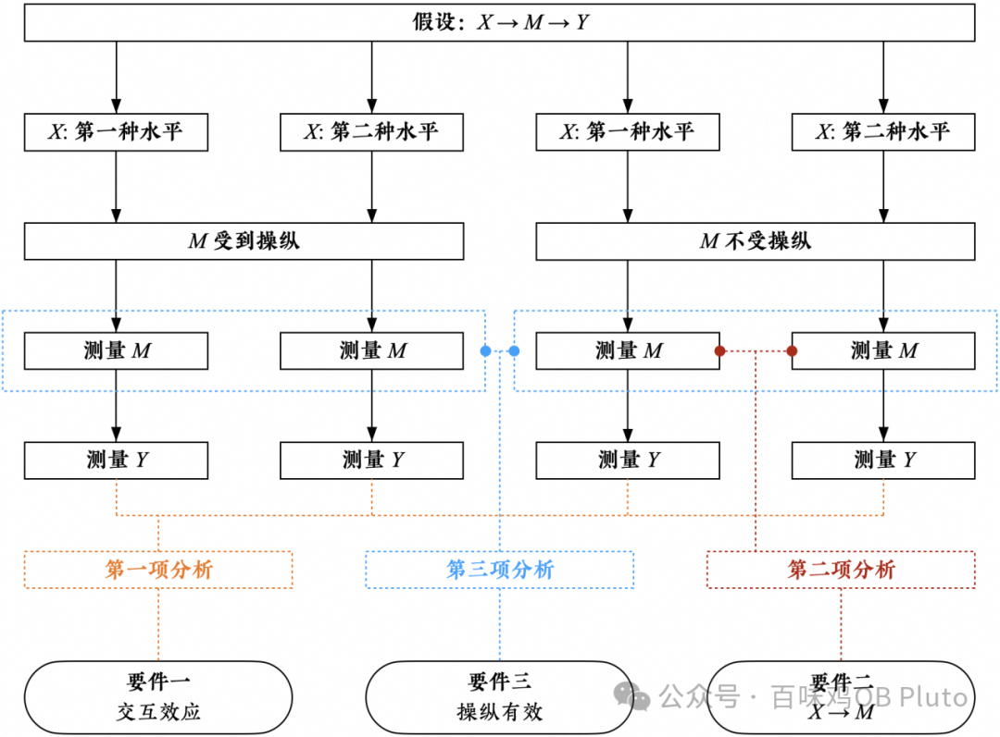

**结果**

研究者应当开展三项分析，分别对应上文提到的三要件：

**1**

**第一项分析**

以教材难度（X）为自变量，以焦虑信息 vs. 无关信息的分组为调节变量，以努力（Y）为因变量，运行一下2 × 2方差分析；如果X是连续变量，则运行一下回归分析。目标是检验一下交互效应是否显著（即要件1）。

**2**

**第二项分析**

在中介过程未受操纵的控制组内，运行一下独立样本t检验；如果X有不止两个水平，则运行一下单因素方差分析；如果X是连续变量，则运行一下回归分析。目标是检验一下，在中介过程可以自然运作、不受打断的条件下，教材难度（X）对受测量的数学焦虑（M）是否存在显著效应（即要件2）。

**3**

**第三项分析**

运行一下独立样本t检验；如果对M的操纵有不止两个水平，则运行一下单因素方差分析。目标是检验一下，中介过程受到操纵的参与者，比起中介过程不受操纵的参与者，受测量的数学焦虑（M）是否存在显著差异（即要件3）。

**讨论**

为了让采用MMM设计的研究者更好地解释结果，我在下表中列出了以上三项分析的所有可能结果，并提供了每种结果对应的意涵。（请注意，表中的解释仅聚焦于MMM设计的特性；对于实验研究中广泛存在的通用问题，未做讨论。例如，如果X对M没有显著效应，其它解释还可能包括天花板效应、样本选择偏倚、或未能排除潜在混淆因素等。）

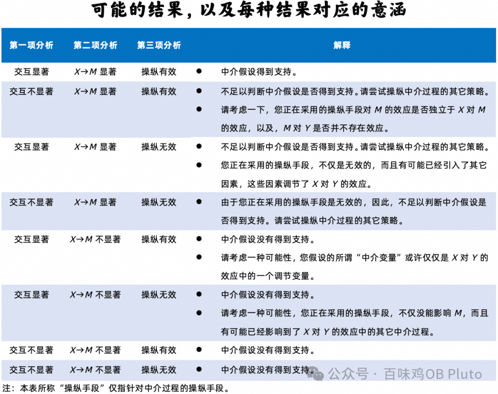

上表中最值得一提的要点是，我建议研究者**在观察到第一项分析中的交互效应不显著时，不要径直拒斥中介假设**。这是因为，即使假设的中介在事实上真的存在，如果「M当中受到X影响的部分」完全不同于「M当中受到操纵影响的部分」，那么，研究者同样无法在第一项分析中观测到显著的交互效应。换句话说，第一项分析中的交互效应不显著，既有可能是因为假设的中介实际上并不存在，也有可能是因为当前的操纵策略未能模拟X对M的效应，还有可能是二者兼而有之。这需要通过更换其它操纵策略来做进一步检验。

**MMM设计到底有没有**

**将中介调节混为一谈？**

经过了以上详细介绍后，现在，是时候回到本文最开头提到的、**《心理学报》两位匿名审稿专家提出的不解**：为什么这样一种包含了统计调节分析的设计可以被用于检验中介？为什么显著的交互作用可以被用来支持中介假设？MMM设计到底有没有将中介和调节混为一谈？

如果不回答这些问题，以后有意使用实验方法来检验中介的研究者可能仍会遭遇不被部分审稿人理解的尴尬。因此，有必要详细讨论一下，**MMM设计所包含的「调节」到底意味着什么**。这样的讨论也有助于改善我们对于**中介与调节之区别**的理解。

Spencer等人（2005）强调了应当分清楚**作为理论分析的中介**和**作为统计分析的中介**有何区别。「理论性的中介分析」起源于研究者渴望解释为什么X影响Y，例如，为什么困难教材增进了学生的努力。而「中介统计分析」只是实证检验这种理论解释的众多方法之一。

通常而言，心理学研究者会提出一个**特定于有机体内部的转化过程**（例如焦虑），假设困难教材是经由这一心理过程才得以影响努力的（Baron & Kenny, 1986）。换句说话，假如没有了被假设的这一过程（例如，使用焦虑信息来打断该过程），困难教材对努力的影响将不再能像其在自然状态下对努力的影响了。

使用MMM设计，研究者在第一项分析中观察到的显著的交互效应，并不是X与M产生了交互效应，而是X与**对M的操纵**产生了交互效应。也就是说，结果仅表明，困难教材对努力的影响受到了焦虑信息的调节；并非表明，其受到了焦虑的调节。

这是因为，当被假设的M是在有机体内部时，**不能将对中介的操纵手段等同于中介变量本身**。因此，被观察到的调节效应与研究者所提议的中介效应**并不存在任何冲突**；相反，它们恰好代表着同一枚硬币的两面。

不过，虽然交互结果可以告诉我们对焦虑的操纵扮演了怎样的角色，但是，焦虑本身扮演了怎样的角色，我们仍一无所知，**这取决于X与M究竟是何关系**。

——假如X影响着M，那么，这里头的逻辑就是，咱们使用了一个外部刺激（即焦虑信息）来打断连接X与Y的内部过程：

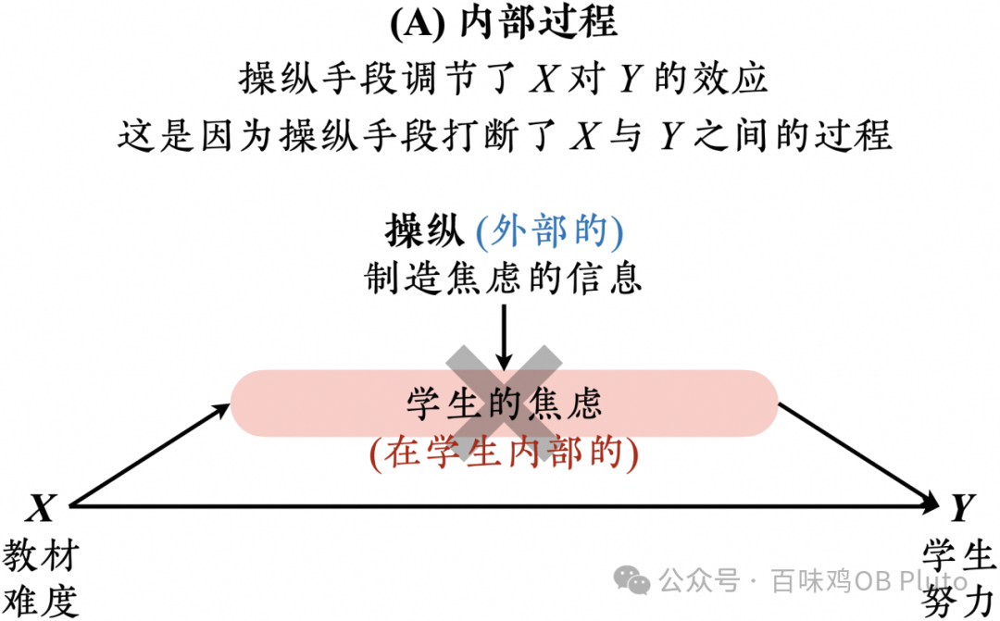

——相反，假如X并不影响M，那么，焦虑信息对X → Y的调节作用，无非是模拟了焦虑本身对X → Y的调节作用：

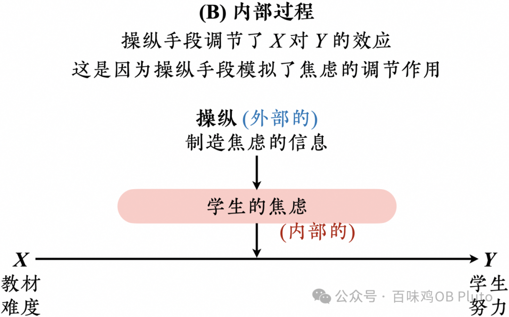

换句话说，假如缺失了X与M之关系的证据，我们所能确认的仅仅是，在不同焦虑程度的学生中，X对Y的影响并不相同；即，焦虑可能仅仅是调节变量罢了，没有理由支持它是中介过程的假设。

不同于将**内部过程**作为焦点M的研究，如果研究者在研究中将**外部过程**作为焦点M，那么就可以使用操纵手段直接设置外部因素的具体水平（即，操纵手段等于过程本身）。

例如，为了解释为什么困难教材影响学生努力，或许可以测试一下教学方法是否在其中扮演着中介变量的角色（如下图）。一种可能性是，困难教材导致老师们更多地采用变革性的教学方法，这鼓励了学生们付出更多的努力。不同于学生自己的焦虑或恐惧，教学方法在这里是一个存在于学生外部的因素。在这种研究中，研究者可以直接将学生们分配到采用不同教学方法的组中。

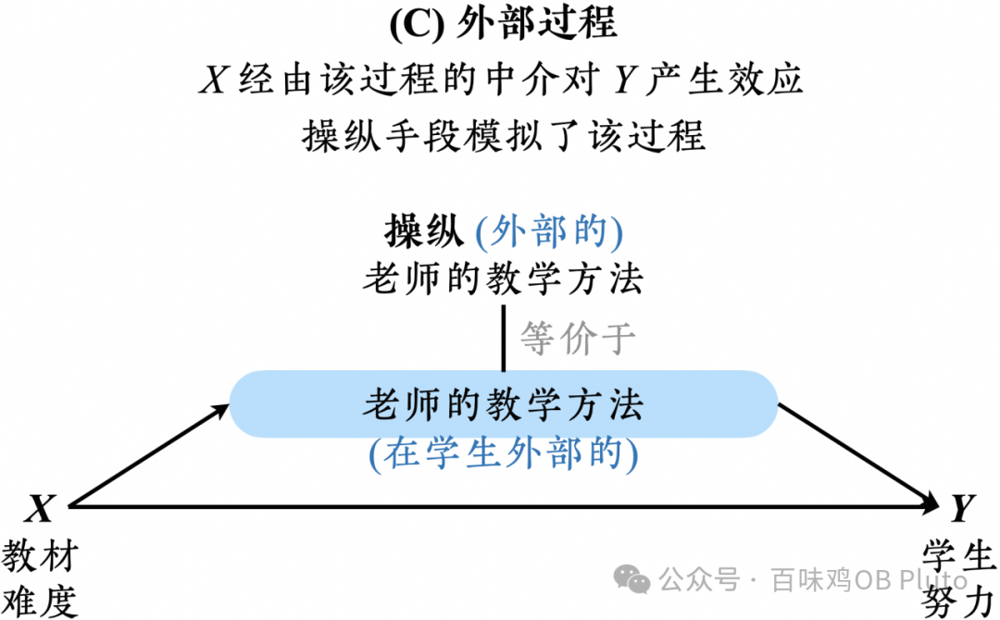

又如，如果研究者想要检验一个假设，COVID-19大流行通过死亡病例的新闻报道影响了个体的消极情绪，那么，他们可以在遵循伦理准则的前提下要求参与者阅读较少或较多的死亡病例新闻。

对于这种研究，那种认为**调节统计分析被误用来检验中介**的论调，同样是站不住脚的。恰恰相反，明明是绝大部分宣称“自己想要检验调节”的研究忘记了要去排除一种可能性：**他们所谓的调节归根结底不过是一个中介模型罢了**。

根据Baron和Kenny（1986）的说法，调节模型期待着它的调节变量可以与X毫不相关。而且，在绝大多数调节模型的图表中（例如下图），研究者都假定了X与调节变量不相关；然而，绝大多数研究都忘记了要为这一点提供证据。

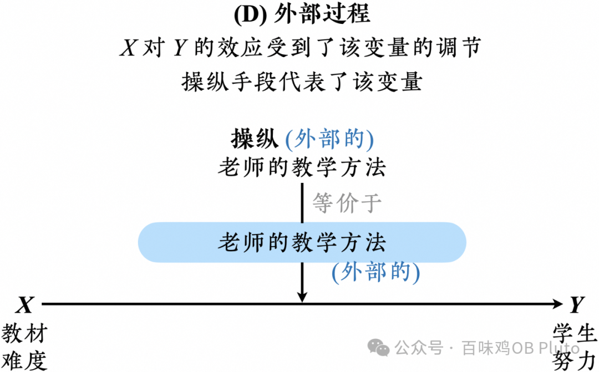

当然，本文绝非呼吁研究者每当开展调节研究的时候总去检验一下X与调节变量的关系。统计方法是服务于研究假设的检验目标的，多数调节研究只不过假设了X对Y的影响在调节变量的不同水平之间有所不同而已，因此没有必要检验X与调节变量之间到底有没有因果关系。

然而，严格地讲，只要研究者既没有开展这一检验、又未能提供令人信服的理论推导，**所谓调节模型其实是一个中介模型**的可能性就是存在的。

如果两个外部因素对个体产生了交互效应（即要件1），且这两个外部因素之间还存在着因果关系（即要件2），那么，**这个模型其实是一个中介模型**。不需要为要件3提供检验，因为，当研究者所假设的过程是存在于有机体外部的过程时，该过程可以被研究者直接设置成不同水平，而研究者的这种操纵其实就是过程本身。

例如，假如研究者发现，相较于死亡病例新闻较少的条件而言，在死亡病例新闻较多的条件下，COVID-19对于人们消极情绪的影响显著更加强劲，那么，研究者或许会得出结论，对死亡病例的新闻报道**调节了**COVID-19对人们消极情绪的影响。

然而，有没有一种可能性：正是COVID-19的爆发导致了更多的死亡新闻？

如果研究者额外增设一个检验，表明，**X的变化导致了调节变量的改变**，那么，研究者应当重新考虑一种可能性：被他们称呼为调节变量的那个因素，其实是COVID-19得以对人们的消极情绪施加影响所经由的**中介过程**。

更宽泛地说，MMM设计传承了Baron和Kenny（1986）所提出的**从中介变量到调节变量的设计**（mediator-to-moderator design）和**从调节变量到中介变量的设计**（moderator-to-mediator design），避免以僵化的视角来看待中介与调节之间的区分。

它反映了一种观点：中介的和调节的方法学手段，其实都**瞄准了同样的心理机制**。

“在这一点上，你可以从调节方法开始你的研究，最终阐明了一个中介过程；也可以从中介方法开始你的研究，最终衍生出了以调节为形式的干预手段。”

——Baron & Kenny, 1986

**写在最后**

这项研究的初衷是增强实验性的中介分析在国内的传播（因为国外这个领域的方法学论文其实已经很多了，但在国内还比较少），以期能使以后采用这种方法做更严格的中介检验的研究者，不会反而因这种创新而被误解。遗憾的是，尽管做出了一些努力，该文最终仍以英文形式面世，可能使本就不易读的方法学论文更添语言方面的理解成本。（其实写起来也相当头疼。。。）在收到一些微信公众号的婉拒后，**衷心****感谢@心理学情报局 愿意发布这篇稿件（并为论文原文制作了汉译版本）**，为实验性的中介分析提供传播与交流的机会。

当然，以上内容均仅代表一己之见，欢迎读者朋友们提出质疑与挑战。我想，后来者对于已发表的方法论提出挑战，或许并非总是坏事，不必一见到挑战就先担心读者会误解、一见到新方法就担心会伤害年轻人的“学术审美”（况且早已不是新方法），说不定年轻研究者有自己的判断力也未可知。很难说这样的挑战一定可以推动中介分析“前进”；但若不这样做，中介永远只能“回归”。

本文是基于论文原文所改编的图文科普版本（为便于阅读，省略了一些细节）。

如果您对以下话题感兴趣的话，或许可以在论文原文中找到进一步的信息：

★ 以往实验性的中介分析所提出的要求，有哪些其实大可不必？为什么？

★ MMM设计的优势和局限性分别有哪些？

★ MMM设计与其它某些著名的设计存在哪些区别？例如“对过程做调节的设计”（the moderation-of-process design）和“平行设计”（parallel design）等。

★ 由X引起的M、受到操纵的M、受到测量的M三者之间到底是什么关系？

★ 当操纵虽然影响了M但却也意外打断了其它心理过程时，或者当X和操纵分别影响了M的不同方面时，MMM设计会不会出现错误？

**原文信息：**

Ge, X. (2023). **Experimentally manipulating mediating processes: Why and how to examine mediation using statistical moderation analyses**. Journal of Experimental Social Psychology, 109, 104507. https://doi.org/10.1016/j.jesp.2023.104507

微博@心理学情报局 已将论文原文翻译为**中文版**，希望有助于减轻方法论文章的阅读成本。如您有需要，可私信发送“**MMM**”至**微博@心理学情报局** 免费获取PDF。

我也已经下载了，可以后来私信我领取（回复「学术交流」）。另外，若有基于本文想讨论的，也可以后台回复「学术交流」加入本公众号的群聊一起聊聊~
