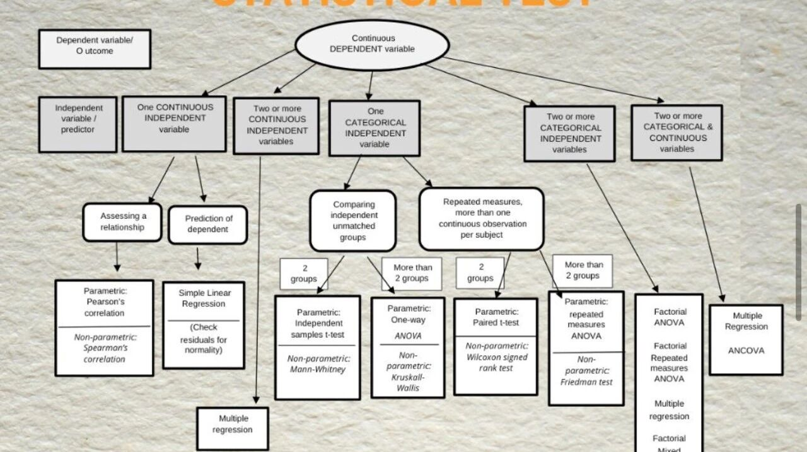

大家可以不要再看一些垃圾公众号啦！（有很多都是像我这样的研究生瞎写的哈哈哈🤣 ）
其实像linkedin这样的平台就有很多大佬的简单分享，我也会尝试搬运一些🫡

让GPT介绍了一下这位LinkedIn账号的拥有者：

阿萨德·纳维德（Asad Naveed）是一位拥有医学学士（MBChB）和公共卫生硕士（MPH）学位的专业人士，专注于研究、学术和人工智能（AI）。他是富布赖特学者和QES学者，目前担任多伦多大学创伤研究所（UofT Trauma）和Unity Health Toronto的创伤博士后研究员。阿萨德·纳维德在LinkedIn上拥有超过17.2万的粉丝。

