Hi！

这期来分享三篇Big-name期刊上的最新论文，话不多说，直接开始！

**Paper 1**

**Nature Mental Health - 敬畏促进对于独处的积极情绪**

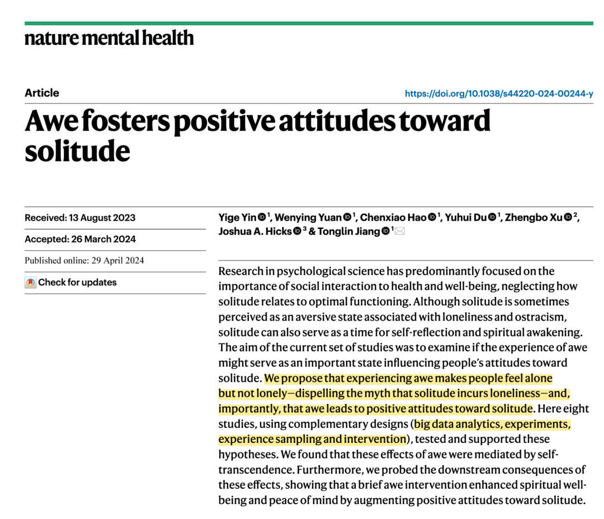

人是社会性动物，因此社会互动总被认为非常重要。然而，**人们独处（solitude）的时间其实也占据一天中的大部分**，比如American Time Use Survey表示，美国人2021年的每日独处时间大约有50.5%。

尽管独处的时间占大部分，但过往人们总是把独处视为一种消极事件——比如会导致孤独、更低的生活满意度、更低的生命意义感。

但显然，这样的消极视角并不全面。我想，用MBTI的例子就足以表明：i人的数量并不比e人少多少，**i人们非常享受独处的时间，在独处的时间里反而可以迸发出很多灵感、对生命的感悟等等。**

而这篇文章就从“如何促进对于独处的积极态度”出发，探讨敬畏（Awe）的促进作用，并且探讨人们如何从这种经历中获益，比如是否有更高的内心平和等。

研究通过8个研究、用混合方法进行了多重验证：

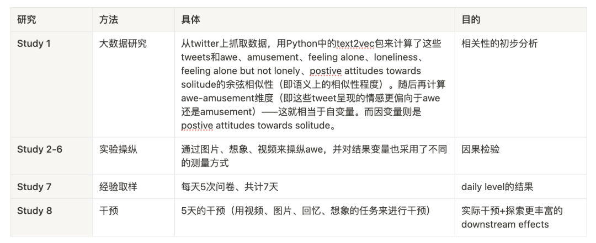

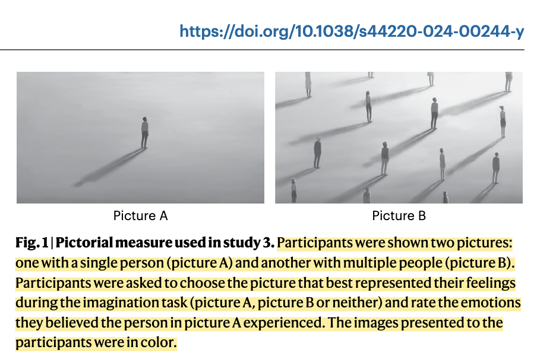

综合发现，**敬畏能让人们觉得“独处但并不孤独” (feel alone but no lonely的表述我真的太喜欢了！)，会促进对于独处的积极情感，并且经过敬畏干预人们会产生精神上的幸福感和内心的平和。**

真是一篇兼具美感（话题美）和质感（方法严谨）的文章！

这篇文章也来自于上次推送中提到的课题组([Bubble | 看到流星的瞬间，突然懂得了 Awe 相关研究的意义。](http://mp.weixin.qq.com/s?__biz=MzU1MzY1MjIxOQ==&mid=2247484884&idx=1&sn=6381ec5b321d0fb396c61647c42c73e2&chksm=fbeedf40cc9956563cc90a1e8bb37e1ca4ce2507e04e1e9f7a44f54b0797f00f0fbc2a39fda1&scene=21#wechat_redirect))，而这位一作的Yige学姐的朋友圈也是充满了艺术与浪漫，和这篇文章的调性太匹配了。

真心祝愿她们Lab越来越好！

**Paper 2**

**JAP-在家庭中反思感激对于领导工作的增益**

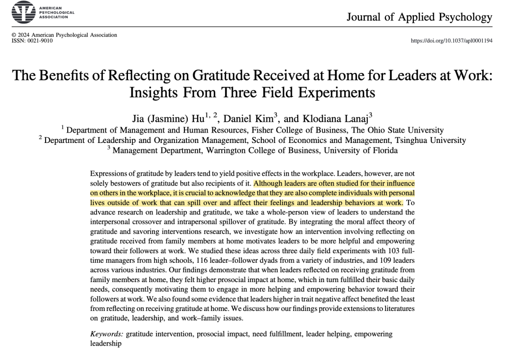

之前的研究已经对领导在工作场所中感激表达的积极影响探讨很多了。而领导除了作为感激表达的**发出者**，其实也是一个**接收方**，而他们在家庭中的收到的感激表达也会溢出到工作中，从而影响他们工作中的情感与行为 。

整合了moral affect theory of gratitude以及savoring intervention相关研究，这篇研究通过3个研究进行了家庭中反思感激的干预，并最终发现了其对于工作中帮助行为和授权行为的帮助。

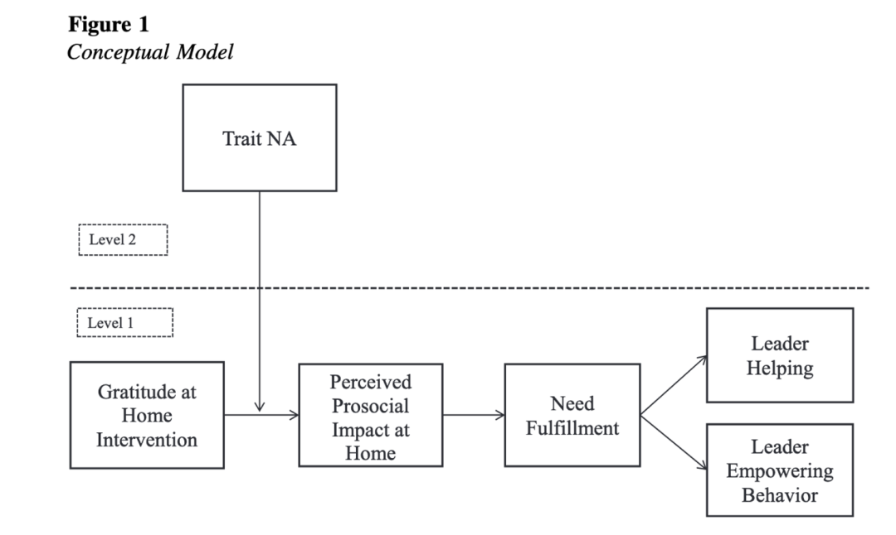

由于这个model的假设推演比较make sense，所以我没有细看。但之后在写「**干预+链式中介结合」**的时候可以再观摩学习这篇！

同时，这毕竟是一个很积极的干预。咱们也可以在日常生活中多去表达感恩，也多去觉知接收到感恩后的心理状态！把心理学的研究用到实际中去！

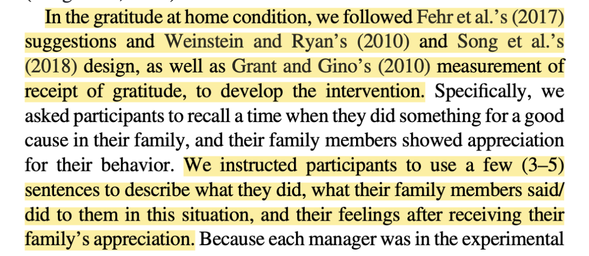

另外，这篇可以和胡佳老师2022年在PPsych这篇谦逊领导干预放在一起读。方法层面的逻辑是很相似的。

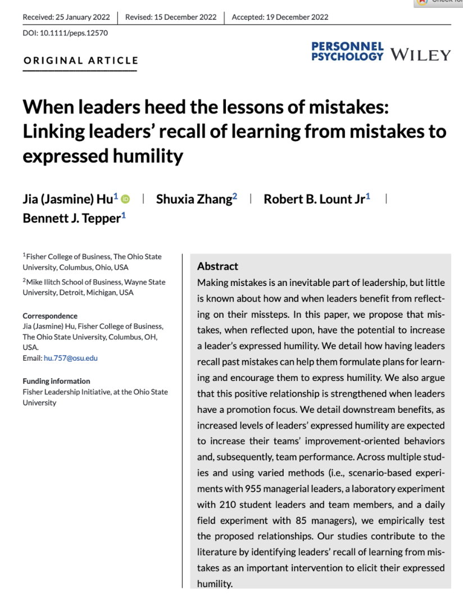

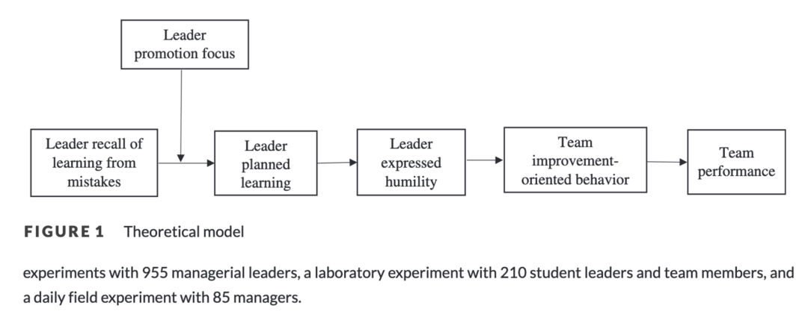

**Paper 3**

**AMJ-政治舞台的社会化: 从多主体互动的角度理解政治技巧和新员工社会化率**

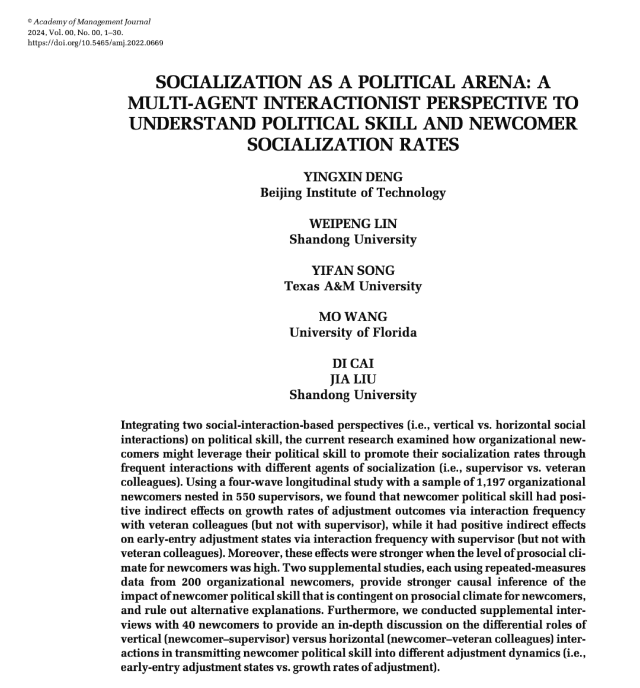

通过整合两种社会互动的角度（垂直的or水平的；对应这篇文章就是指 来自于领导or同事的），目前的研究检验了组织中新人如何用他们的政治技能来促进他们的社会化，而他们与不同层级的个体（领导or职场老鸟同事(即 veteran colleagues （实在是不会优雅的翻译））的互动又如何起到中介作用。

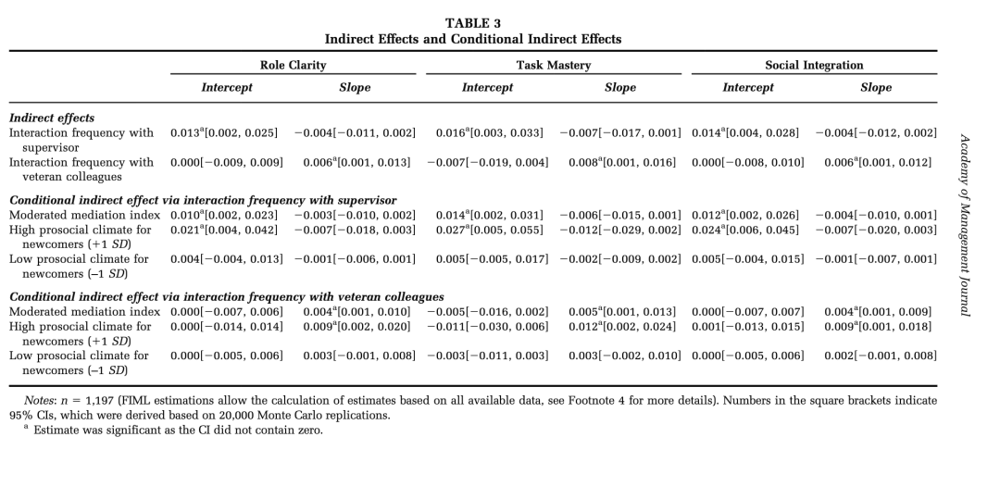

用了4波纵向数据，发现新员工的政治技能确实会通过对Veteran的互动来增加他们**社会化的增长率**，然而并不会通过与Supervisor互动增加。

不过，刚才说的是**增长率**，以线段为例，这相当于是**斜率**，但线段的另一个属性是**截距**，在这个情境中可以理解为新员工刚进入公司的初始状态。

那么针对于这个**初始状态**，与Supervisor的互动在“新员工政治技能与新员工社会化之间”扮演中介作用的。相反，与Veteran的互动不会。

（这个结果真的很巧妙，是那种初看有点困惑、但细想又很合理的结论，比如当新员工进入时，他们与supervisor交流时用政治技能是较多的，因此这会影响社会化的**初始状态**；而之后的日常中，则与团队中的veteran接触较多较密切，因而这就会影响他们的社会化的**变化率了**。）

当团队中**对于新员工的亲社会氛围**越高的时候，上述效应则越强。

最后，该研究还通过了访谈来让新员工阐述他们对于其与supervisor以及其与veteran交流差别的理解，也为最初的量化研究结果提供了很好的质性解释。

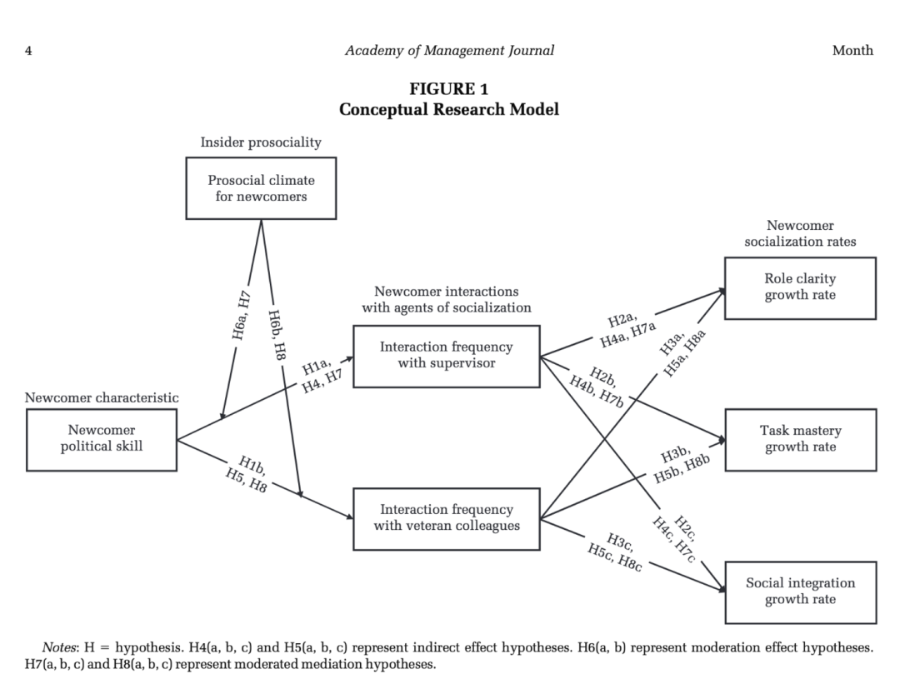

这篇文章很大的启示是用**Latent Growth Model**方法**分离出了Intercept和Slope**，进而来解释了与领导or职场老鸟之间交流作用的差别——给了我们对于挖掘纵向数据的启发。

另外这篇文章最后的质性研究也是刚刚好、不累赘、恰到好处地解释了量化研究有趣结果的原因——这样丝滑的mix-methods的逻辑也值得学习。

Bye！

只是稍微介绍一下这些文章抛砖引玉啦！

可怜百味鸡还有很多自己Project的相关论文要去精读，所以只能忍痛给以上这些好论文打个标记，日后有相应内容需要借鉴时再去精读。

最后，再次祝大家身体健康！劳逸结合！我想这就是最好的祝福了。

最后的最后，放一下学校里快乐游泳、在jijiji叫的小鸭子。夏夜晚风就是最美妙的！

（虽然蚊子很多 可恶！
