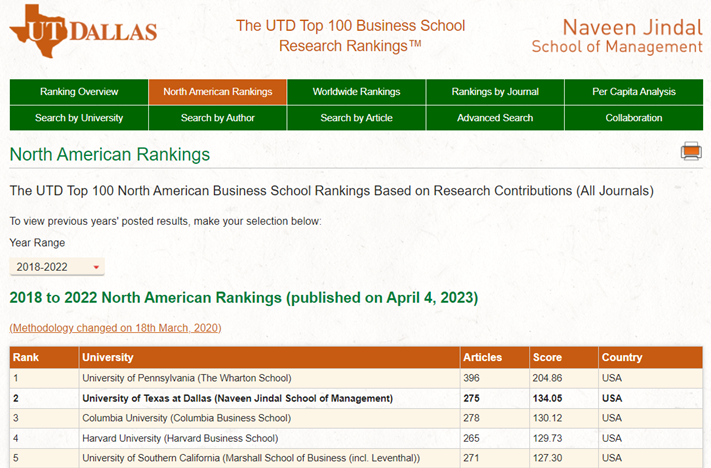
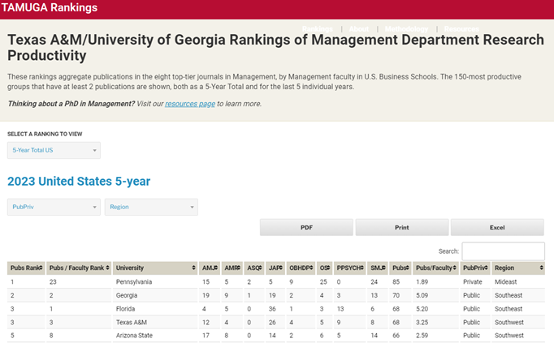
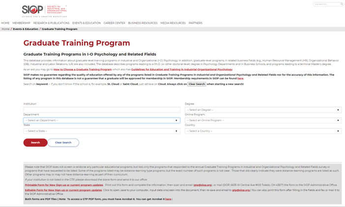
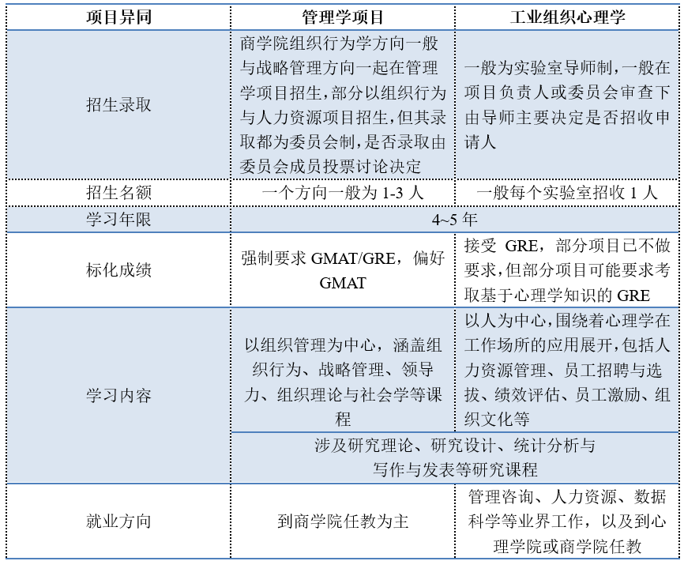
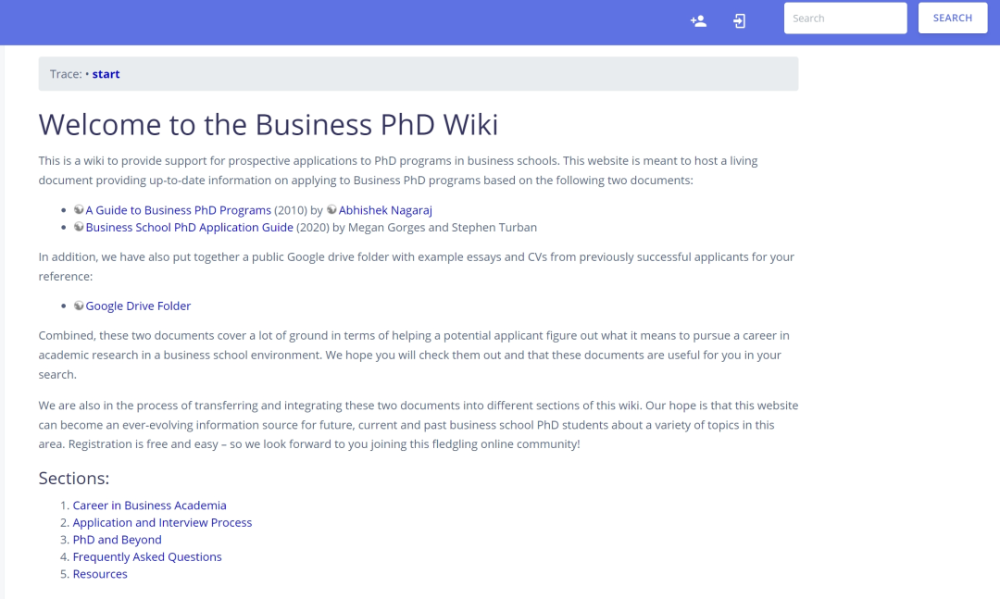
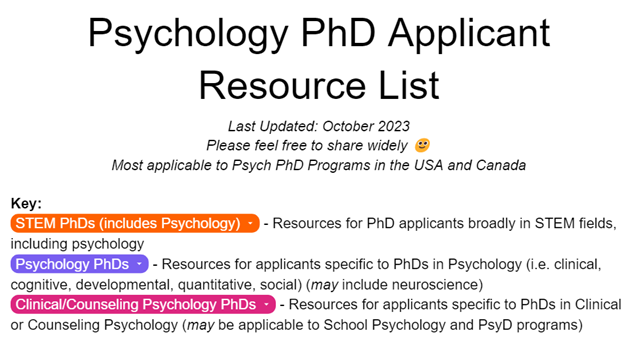
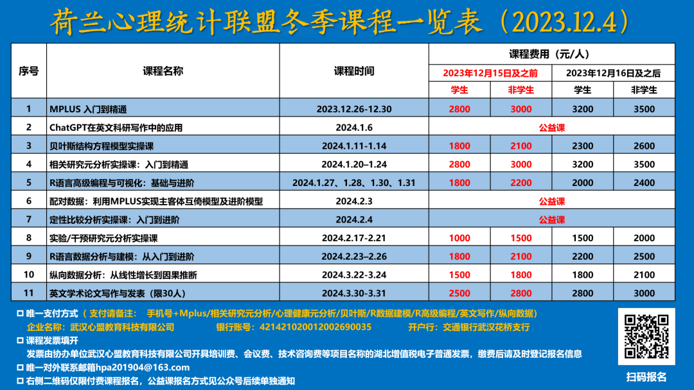

##

**引言**

##

我申请了美国与香港2024Fall工业组织心理学(Industrial/Organizational Psychology)方向以及管理学(Organizational behavior方向)的全奖博士，共申请约15所学校，获得11所学校的面试邀请，最终收到4个工业组织心理学以及2个管理学方向的正式/非正式offer，最终去处为美国某前50高校。作为平平无奇的陆本陆硕申请人，本人的申请及其结果并不具有该方向顶尖申请人获得诸多名校offer的代表性，但希望从一个普通申请人的视角为占绝大多数的普通申请人在近年日益激烈的环境下提供参考。申请过程也获得诸多老师和学长学姐的帮助与洞见，他们也希望我能将其传递，帮助更多中国学生获得到海外攻读博士，看看更大世界的机会。

斯坦福大学的Lijin Zhang学姐之前已经在荷兰心理统计联盟发布过北美博士项目申请的具体攻略，这份攻略从申请初试的时间规划到最终的offer都提供了详细普适的经验，是一份申请北美博士值得仔细阅读的宝贵材料。为避免重复，本分享更聚焦于商学院组织行为学和心理学院工业组织心理学申请的一些参考资料，并在个人的申请经历基础上提炼观点和一些踩过的坑。由于本分享基于自身经历和视角，因此该分享具有一定主观性和局限性，不太适用于欧陆、澳洲等地的申请人。对本篇推送内容有疑问和建议的同学也欢迎联系指正。

本分享将从个人背景、选校、管理学项目与工业组织心理学项目异同、时间线、申请材料、中介需求、套磁与申请材料提交、彩蛋展开，由于香港地区准备材料和时间线基本与北美一致，本文主要以北美为例阐述，其余相关内容请参考Lijin学姐的推送，也可能在后续临近时点读者觉得有必要再补充。

**Lijin Zhang学姐推送传送门：**

- [**北美博士项目申请攻略 | 第一期**](http://mp.weixin.qq.com/s?__biz=MzU5MjEwODg1OA==&mid=2247491321&idx=1&sn=2ac87ae4122750845d500797960a4f9f&chksm=fe2592acc9521bbabdfbbff8d209747099d22655b7a27aa2a1ac3495681c9936950283403eec&scene=21#wechat_redirect)
- [**北美博士项目申请攻略 | 第二期 GRE 托福及文书**](http://mp.weixin.qq.com/s?__biz=MzU5MjEwODg1OA==&mid=2247491389&idx=1&sn=09d28d35e2c22ab5529006accd8edcab&chksm=fe259368c9521a7eb1cb960e1fdcdc1ce9544f88b48c9e7c099c3ca6e5726c028e812bf5d16f&scene=21#wechat_redirect)
- [**北美博士项目申请攻略 | 第三期 择校、套磁和面试**](http://mp.weixin.qq.com/s?__biz=MzU5MjEwODg1OA==&mid=2247491581&idx=1&sn=a7f685fe2ec46b7631119d1aaa2f490c&chksm=fe2593a8c9521abe4dc85ea0d372db5987fac8a7e9892a7d6f9741dcb80440bdaf411903bcdb&scene=21#wechat_redirect)
- [**北美博士项目申请攻略 | 第四期 信息搜集及背景提升**](http://mp.weixin.qq.com/s?__biz=MzU5MjEwODg1OA==&mid=2247491628&idx=1&sn=750ebe28715c7398ff751393a75abe23&chksm=fe266c79c951e56f8fe49c75e34faf3b0b210da1597dbbdd3576e819bbd0f597ef3495614d65&scene=21#wechat_redirect)
- [**合辑 | 北美博士项目申请攻略**](http://mp.weixin.qq.com/s?__biz=MzU5MjEwODg1OA==&mid=2247491647&idx=1&sn=292586c93ed1dac01cc4bbdbc539e433&chksm=fe266c6ac951e57c1bf4b54b16858c253085dfae25d53ea01eb3084f2b6c84fdd196f891ad28&scene=21#wechat_redirect)

##

**个人背景**

##

对个人背景的清晰定位对后续申请的学校和项目具有锚定作用，其包含既定的客观条件和在正式提交申请前仍可不断积累的方面。个人背景主要包含本硕院校、基于科研项目、研究助理、期刊/会议论文发表的研究经历、推荐信/Connection、由GPA、托福/雅思与GRE/GMAT构成的标化成绩等方面。以我自己的申请背景为例给读者一个较为直观的轮廓作为参考。院校方面，本人为非两财一贸的普通211，本科专业为工商管理，硕士方向为管理心理学，无海外交换经历；标化成绩方面，本硕GPA3.5+，GRE325+，TOEFL100；科研经历方面，本科参与两项本科生校内课题，硕士期间发表一篇心理学中文核心期刊论文；推荐信方面，无北美香港推荐信和科研经历，以本硕结识的大陆华人老师为主。

除去一般被大家认为过线就行的标化成绩（GPA3.0+，GRE320+，托福100，当然在学有余力的情况下越高越好，部分学校fellowship会参考GRE等标化），其他几个方面总体上环环相扣。国内双非、普通985/211在北美学校方看来可能没有什么差异（在一般情况下不太适用于香港新加坡），因此院校背景在非顶尖项目的申请权重中可能并不高。但更为重要的是院校背后对申请人个人背景的潜在塑造，比如北美部分OB顶尖项目基本只招收国内顶尖学校的直博本科生、某个项目的老师或者校友便曾毕业于自己的本硕学校、本硕导师之前毕业于该项目或者与目标院校的老师有合作联系、本硕导师为自己推荐到海外做高质量的研究助理.......这些现象确实更可能发生在国内的头部学校。

综上，本人的个人背景在诸多优秀的申请人中并不亮眼，尤其是在推荐信和海外科研经历上叠满了陆本陆硕同学的debuff，也曾十分怀疑自己是否具有申请海外博士的资质。因此，我在申请的时候对自己就怀着有书读就好的低预期，并尽量在自己能做好的方面努力，比如不因为标化达不到基准线导致不能申请、尽量寻求科研经历丰富背景、明确自身定位、根据自身研究经历和匹配寻找项目。而最后获得的面试邀请以及offer也已经超出了我的预期。

这说明，背景与我一样较为一般的陆本陆硕同学在申请时也可以更加自信，并尽早围绕上述方面为背景提升而努力。个人认为申请人可以在标化、科研经历两个方面持续投入，并通过打磨最终体现在提交给项目方的文书材料。一方面，在合理的时间精力投入下，尽量确保标化成绩能达到目标院校申请要求。例如，我了解到今年部分申请人就由于没有在申请DDL前考出高于基准线的GRE分数而耽误很多学校的主轮申请；甚至有的项目会因为申请人都十分优秀，而将标化有比较明显短板的作为拒绝理由。

另一方面，主动寻求校内外科研经历的积累，微信公众号和小红书等平台都能够获取相关的招聘信息，只要主动投递都会有机会，当然前提还是自己在英语沟通、数据分析技能与科研写作等方面有亮点；同时，可以将研究成果投稿到AOM、SIOP与IACMR等公认的国际会议。另外，科研项目与论文宁缺毋滥，不要参与到一些中介收费的科研项目，通过该途径获得的科研经历和推荐信对科研能力提升有限，且可能会对申请起到反作用；同时，也不用为了有论文发表将时间耗费在低质量的研究和期刊上，绝大部分申请人都没有项目教授认可的论文发表。

##

**选校**

##

选校可以从个人侧与项目侧两个方面综合考虑，比如个人侧的个人背景、研究兴趣、职业目标与地理/气候/城市化程度等生活需求，以及项目侧的录取要求、项目-申请人匹配、项目毕业生就业情况、项目在读博士生履历、项目所在地及其政治政策等因素。之所以先提及选校，是因为尽早了解选校可以让我们增进对项目本身及其申请要求的理解，比如了解项目对标化成绩的要求、申请截止时间等，进而倒推自己需要在何时考出何种考试分数的标化（有的项目只接受托福或者对口语等小分有要求、有的项目只接受GMAT/GRE）。

个人背景基本在很大程度上决定自身申请院校的位置。例如，港三港五商学院管理学方向的申请人基本都是本/硕为985/两财一贸等财经类211，一般211及其他大陆院校申请人较为罕见，除非其他方面有突出表现，否则录取的几率相对较小。因此，我们在选校时也可以根据自身背景以及项目在读学生的履历判断项目招生的大致门槛和偏好。如果有好几项自己都达不到要求，那么就可以考虑跳过该项目的申请。另外，部分项目可能更偏好招收欧美本土学生或者具有海外经历的学生，尤其是项目可能从未招收过大陆学生时。

**项目匹****配方面**，项目匹配是学校决定是否给予面试和offer的重要考虑因素。个人认为主要有目标匹配、研究兴趣匹配与研究方法匹配等方面。首先，绝大部分博士项目的目标都是为研究型机构和大学培养从事学术研究和教学的博士生，如果自身并不志在学术，只是想要获得博士的头衔或者对管理实践更感兴趣，那对双方而言都存在一定的不匹配；其次，研究兴趣的匹配也决定项目能否为你提供有效的指导，你进入项目后能够与其他老师合作；最后，研究方法方面，部分项目的老师都是做定性研究，而你偏好使用定量方法，那么也可能存在的一定的不匹配，反之亦然。以我的申请为例，我在申请时收到了2个学校的面试邀请，但也了解到有几个在院校、推荐信等综合背景明显优于我的中国学生却没有收到该校的面试。因此，我主观推断是因为我体现在简历和个人陈述的研究兴趣和经历与其项目更匹配。

**研究兴****趣方面**，我一开始的理解是从个人侧按照自己当前的研究兴趣去找项目，这一策略本身对于申请来说并没有很大问题。但VCU的Cortina教授从项目侧提出的“对项目老师所感兴趣的感兴趣”也十分振聋发聩。他认为按照研究兴趣找导师可能存在两个缺陷：一个是我们现在的研究兴趣可能不断改变；另一个是以人为中心——找到一个好的博士生项目/博士生导师比自己当前的研究兴趣更重要。因此，如果在早期有了比较感兴趣的项目或者老师，可以尽量围绕其打磨自己的背景和材料，让其对自己的申请感兴趣。同时，在申请时也要对其他自己不熟悉的老师及其研究保持开放心态，形成一个有主线和支线的研究兴趣网络。

> It’s tempting to gravitate towards the people who share your interests. This may work out fine, but there are two problems with this approach. First, you learn a lot in your first year of graduate school, and your interests are likely to change.

> Second, it is FAR more important to work with a good mentor.

> My candid advice is, get interested in the things that interest the best mentors. You will develop more quickly, and you will be a happier person. Also, there is a good chance that you can get them interested in whatever interests you. Then everybody wins.

**项目选择****方面**，同一个相似的研究方向可能会在不同的学院开设，比如组织行为学相关的专业可能既在商学院、劳动学院或者又在心理学院开办。那么，此时结合自身的专业背景选择一些相对小众的项目，那么可能可以避开竞争过于激烈的红海，获得更高概率的面试与录取。例如，管理学+心理学的背景使得我的选校与其他只申请商学院管理学项目的同学有所差异，我同时申请了15个左右的管理学与心理学项目。这一申请策略使得我能够发挥自身心理学背景优势，申请更多与研究兴趣相关的项目，并避开部分竞争白热化的管理学项目，从而让我有相对更多的面试和offer。因此，个人比较推荐申请人在管理学项目时也可以考虑申请一些心理学项目或者其他学院开设的项目，尤其是具有一定心理学背景的同学（部分IO心理学项目对心理学相关学位和课程有要求）。

**项目选择**可以参考一些榜单筛选项目，而不是按照QS等世界排名衡量项目价值。管理学项目选择可以参考UTD Top100商学院榜单以及TAMUGA进行筛选。这两个榜单基于UTD-24期刊以及管理学相关顶刊将院校排名，对于申请人对项目的产出预期具有一定参考价值。

图1 UTD TOP100商学院排名

(https://jsom.utdallas.edu/the-utd-top-100-business-school-research-rankings/worldRankings#20182022)

图2 TAMUGA 管理系发表力排名

(https://www.tamugarankings.com/)

同时，美国工业与组织心理学学会(SIOP)也提供了开设组织行为学相关博士项目的院校检索系统，通过这个系统可以获取诸多OB或者IO相关的博士项目。工业组织心理学项目在美国和加拿大都有开设，每个项目都具有在培养模式和研究主题上的特色。

图3 SIOP Graduate Training Program

(https://www.siop.org/Events-Education/Graduate-Training-Program)

此外，**政治政策**等宏观因素也要提前纳入考量，避免申请过少或者把申请学校都集中在一个区域而导致遭受该风险。近年佛州出台的政策对中国大陆学生不太友好，直接使得申请的学生面临即便被录取也没有生活费来源等风险。

##

**管理学与工业组织心理学项目异同**

##

考虑到大陆本硕同学可能对工业组织心理学的博士申请不太了解，特此将其与管理学（组织行为学方向）项目进行比对：

在**项目名额和学习年限**方面，管理学项目一个方向一般为1-3人，而心理学项目一般每个实验室招收1人，两个项目的学习年限一般都为4-5年。

在**招生方面**，商学院组织行为学方向一般与战略管理方向一起在管理学项目下招生，部分以组织行为与人力资源为项目单独招生，但其录取都为**委员会制(committee)**，是否录取申请人由委员会成员投票讨论决定。而心理学院的工业组织心理学项目一般为实验室导师制，一般在项目负责人或委员会审查下由导师决定是否招收该申请人到其实验室。

在**申请材料方面**，两个项目都大同小异。对于标化成绩商学院一般同时接受GMAT和GRE，而心理学院一般只接受GRE，部分项目对GRE已经不强制，但部分项目可能还要求考取基于心理学专业的GRE。如果决定混申管理学和心理学项目，GRE会是更好的选择。

在**学习内容方面**，管理学项目以组织管理为中心，涵盖组织行为、战略管理、领导力、组织理论与社会学等课程；而工业组织心理学项目以人为中心，围绕着心理学在工作场所的应用展开，包括人力资源管理、员工招聘与选拔、绩效评估、员工激励、组织文化等。两者都涉及研究理论、研究设计、统计分析、写作与发表等研究课程。

**就业方向方面**，管理学项目毕业博士生以到商学院任教为主，而工业组织心理学项目的就业较为多元：从事管理咨询、人力资源、数据科学等业界工作，以及到心理学院或商学院任教。比如有部分毕业于工业组织心理学项目的华人学者毕业后就职于商学院，如荷兰心理统计联盟访谈过的管延军老师、姜峰老师、连汇文老师与林伟鹏等老师。

表1 管理学项目与心理学项目比较

##

**时间线**

##

个人将时间线分为申请前和申请后。申请前北美地区的**12月1日**对于管理学和心理学的项目都是一个重要节点。大部分管理学和心理学项目都在此时间截止提交申请，对于心理学的项目尤甚，我申请的心理学项目几乎都在该天截止。还有部分管理学项目在12月其他时间、1月、2月等时间都还能进行提交。因此，基于12月1日这个时间点，可以倒推自己需要在何时考出比较满意的标化成绩，以及完成文书和套磁等工作。GRE和托福一般需要分别投入1~3月的时间才能考取比较满意的成绩，GRE和托福出分大概为考试结束的1个星期左右。标化成绩对申请结果的影响权重并不大，但却是申请北美和香港地区博士的入场券，从身边因为标化折戟的申请人经验来看，还是需要对标化有一定重视。

部分项目可能需要有对学业成绩进行**WES、ECE等认证**的要求，大概也需要耗费一个月左右的时间才能完成认证，因此也注意提前规划好时间。还有申请费用需要用visa等国际信用卡用美元缴费，可以提前准备好材料申请支持外币支付的信用卡。这两个方向的申请由于招生名额少竞争激烈，一般都需要提交10几所学校的申请，单所学校包括申请费、标化成绩传送、成绩认证等费用可能就在100美元左右，因此也要在经济上有所规划。

如果顺利，提交申请后一般会在**12月底或者1月**开始陆续收到项目的面试通知，并一直持续到3月或者4月。如果自己是top candidate，一般面试后会在1-2个星期内会收到委员会进一步的积极沟通；如果1-2个星期左右还没有收到进一步反馈，可能已经被拒或进入waitlist，但仍然有一定希望获得offer。

##

**申请材料**

##

管理学和心理学项目对申请材料的要求基本一致，包**括简历(CV)、个人陈述(PS/SOP)、推荐信(RL)**。部分项目可能要求**写作样本(writing sample)**或者**研究计划(research proposal; 港新****为主)**。这些申请材料在排除connection等干扰因素后在申请过程中尤为重要，很多项目都认为申请人所提交的材料能为自身竞争力发声。同时，这些材料也具有很强的个性化属性，不仅需要根据自身情况进行打磨，也要依据不同的项目进行调整，做到CV、SOP和RL三者之间能够保持一致。

关于这些申请材料的总体介绍可以参考Lijin学姐攻略的介绍。同时，也可以参考由哈佛商学院博士生编纂的**Businessphdwiki**，其提供了CV和SOP等商科申请人的参考样例以及申请指南。

图4 Businessphdwiki

(https://businessphdwiki.com/doku.php?id=start)

此外，心理学项目申请也可以参考**Psychology PhD Applicant Resource List**获得相关信息和资源。

图5 Psychology PhD Applicant Resource List

(https://docs.google.com/document/d/16edCOL6srj8VkiKn18GSro85I-HSsAgHGL6-hw4YZ4A/edit#heading=h.f3wpc570m4jx)

##

**是否需要找博士申请中介？**

##

海外博士申请确实是一个耗时耗力的大工程，由最初的选校、考试、时间规划、申请材料准备、申请提交、面试和最终的录取都需要提前1~2年做规划和执行，个中辛酸只有亲历的申请人才能体会。在申请之初面对如此之多事务，是否寻找具有专业属性的中介机构提供帮助可能是部分申请人考虑过的问题。然而，博士申请不同于本硕申请，其是一个个性化和专业化的过程，不同地区、不同专业以及不同项目都具有显著差异。很多中介机构的服务者可能本身就不具备意向专业的博士提供指导。同时，大部分申请工作申请人也能自行完成，筛选信息、沟通与决策也是博士生必备的品质。因此，寻求中介机构的作用和意义可能并不大。

我自身作为大陆普通学校、没有诸多海外校友能提供帮助的申请人，在申请起初也面临迷茫和大海捞针的困顿，进而咨询相关中介，但被高昂的费用和存疑的服务劝退。后来，有幸申请加入一个由海外华人博士生发起的免费公益项目，获得他们从时间规划、文书到面试到录用的全过程指导，除了每周的会议讨论，负责带我的mentor不仅为我提供了他们自己申请到北美top校的文书，还为我的文书做了思路分析和逐字逐句批改，可以说没有站在他们这些巨人的肩膀我很难在文书上体现自己的优势。

同时，我也咨询一些同领域学长学姐听取其意见。因此，如果能够获得同领域前辈的指导，对自己申请确实有所裨益。如确有需要，可以申请类似的公益项目获得帮助，比如公众号、领英等平台有高校会组织申请讲座、文书修改等公益服务。或者在经济允许的情况下直接寻求同专业的在读博士生在某一方面的咨询指导，会比寻求中介机构更加高效经济。

##

**套磁与申请材料提交**

##

套磁是指给意向项目的老师发邮件交流申请相关事宜，表达对加入项目或实验室的兴趣，希望进一步了解与沟通。个人认为套磁分布在**申请前和申请后**两个时间段。申请前套磁对于管理学项目和工业组织心理学项目可能**作用比较有限**，因为这些项目基本都是需要经过研究生院、系里招生委员会成员先集中审核申请材料，且奖学金由学院资助而非单个导师出资招生。因此，我在没connection的情况下的十几次套磁尽管收到了较多回复，除了一个视频会议，基本都是比较官方的“欢迎报考”或没有回信，这的确很令人沮丧，但到后来才发现这并不影响我收到后续的正式面试或录用。

在时间允许的情况下，申请前的套磁也**具有一定****作用**。一方面，可以给感兴趣的老师留下一定的印象。例如，一个给了我offer的学校老师在视频时就说对我当时的套磁邮件还有印象。另一方面，能够了解自己感兴趣的老师是否有兴趣/有资格/有条件带自己，避免无效申请。以我自己为例：一个我套磁约面试的老师愿意给我offer，但进一步和系里沟通才发现今年没funding；一个我套磁的教授说虽然对我很感兴趣，但他已经多年不带博士生；还有一个项目的教授尽管已跳槽有段时间，但学院的教职工栏目却仍然挂着该教授的信息。因此，如果能通过套磁获得这些信息，可以避免后续耗费更多时间精力在这些项目的申请上。

在**提交申请****/面试****后**，如果对申请进度比如项目审核情况、自身申请状态（是否进入面试/面试结果/offer发放情况/是否在waitlist）等有疑问可以直接发邮件问项目负责人，一般都能够获得回复以减少申请的不确定性和焦虑。此外，Chasedream和小红书等平台也是了解项目进展的间接渠道。

**申请材料的提交**主要涉及需要自己提交的成绩单、文书和标化成绩的寄送，还有需要推荐人在推荐系统提交的推荐信。北美学校所使用的申请系统大同小异，一般所需要的信息都相似，因此可以提前把姓名、联系方式、学术背景等个人信息整理到一个文档方便复制粘贴。此外，为了方便推荐人，最好在一两个集中的时间段提交申请，然后提醒推荐人集中完成推荐，这样不会过多打扰推荐人给其带来过多负担。

申请材料的提交时间尽量**在DDL前****完成**，避免在DDL当天由于时区差异错过一些学校的提交。如果提交的材料有错误也不用太焦虑，亲测可以及时邮件跟工作人员沟通，让其完成正确材料的替换。同时，也要及时提醒推荐人完成推荐信的提交。在提交申请后的一段时间，也可以时不时登录系统查看申请状态的变化，有些项目会邮件提醒缺少申请材料，但有的项目只会在申请系统的checklist提示，如果不在一定时间内补充，可能会使申请无效。

**彩蛋**

**彩蛋1**采访了一些认识的24Fall小伙伴，收集了他们一些感触比较深的体会和建议：

1. 明确读博是否发自内心和兴趣，在申博和其他选项做取舍然后投入，争取一次能成功；即便gap也可以继续探寻内心或者丰富背景。

2. 选择学校的时候最好就有偏好的排序，但是不要执着于排名，不执着于某一个两个的学校，尽可能所有的选校，如果只有这个学校给了我 offer，那我也愿意上（A同学观点）；反之，在申请的时候，很担心没有书读所以申请一些保底校，但是越到后面会越发现即使这些保底校给offer也不会去，宁愿选择再战一年（B同学观点）；

3. 不要把一些学校想象得过于触不可及，事实上可能都不一定有国内申请难度高；

4. 能进面试说明已经很优秀，竞争十分激烈，没有offer不一定是自身问题；不能进面试也可能是项目委员会构成和偏好问题；

5. 放平心态。在申请的时候以为的好几个能进面的项目都没进面，却拿到了被认为进不了面试的学校的offer。所以没有什么是一定的，也没有什么是不可能的；

6. 个人认为比较重要的材料有推荐信、英语口语和文书。总结来说，我最后去的学校在我能力水平之内不算好也不算差。我个人认为我的推荐信还行，但是我的文书和口语对比其他申请人都准备得一般。

7. 收集信息但不要盲从信息。申请时候其实接受了很多信息，包括老师，学长学姐，各类网站。即使有些信息来源非常“权威”，也不一定就要全盘接受，因为实际上一个学院不同系风格也会有不同，就算是一个系，不同导师最后的结果也会不同。所以其实很多时候一些“权威”的信息也是有偏差的，他们很多信息实际上也是道听途说。这个系或者这个老师怎么样，真的是要靠自己和老师聊，和这个系的学生聊才能知道的；

8. 如果对于纯国内背景的学生来说，还是要好好准备标化。我个人认为如果你的其他背景都很突出，其实标化差一点没什么。但是很多国内的学生很难有机会拿到海外老师的推荐信，这点实话实说是比较吃亏的，因为很多时候不是说你能力不行，而只是单纯没有机会。但拿到好的推荐信其实也没有那么难。通过邮件套磁、学术讲座甚至小红书都有可能有机会；

9. 也许多年后回头看这段旅程，会发现它塑造了你。但也有可能发现什么都不是。所以，希望大家开心每一天！！！

彩蛋2后续我可能会作为博士申请公益项目的mentor继续传递帮助给25Fall，如果是具有陆本陆硕/第一代大学生等边缘化背景的心理学同学准备申请海外博士，欢迎联系我获取信息以提交后续申请获得**免费的****公益辅导机会**（项目往年入选率约为10%）；在时间精力允许下也接受少量同学的个人咨询指导。联系邮箱：hszyb@qq.com。

**博士申请道阻且长，把申博当成游戏关卡逐一通关，终会直挂云帆济沧海。祝看到这篇推送的申请人都顺利，并在来年之际继续传递洞见和帮助！**

**作者：大尾巴鱼**

**审校：代新宇**

**排版：张旭婵**

[**重磅冬季工作坊｜Mplus,贝叶斯,元分析,R语言,纵向数据, 英文写作**](http://mp.weixin.qq.com/s?__biz=MzU5MjEwODg1OA==&mid=2247497472&idx=2&sn=2a8d60b93f8ad514bb05332b4b54d952&chksm=fe267b55c951f2436b628761ad42f5ba77b69faea9c60fb48d93c63b238f3a821e7c4dcbcfb3&scene=21#wechat_redirect)

**（课程报名联系邮箱hpa201904@163.com）**

[**重磅 | 20万字英文学术写作文库笔记正式发布**](http://mp.weixin.qq.com/s?__biz=MzU5MjEwODg1OA==&mid=2247485590&idx=1&sn=3c6a1ee8e994b5ecbadea44b53f0671e&chksm=fe2584c3c9520dd555fbf081475965c6e3fcec16c6f09ef5cdf9b5b834562dba483478108762&scene=21#wechat_redirect)

**（公众号后台发送支付截图+接收邮箱即可）**

