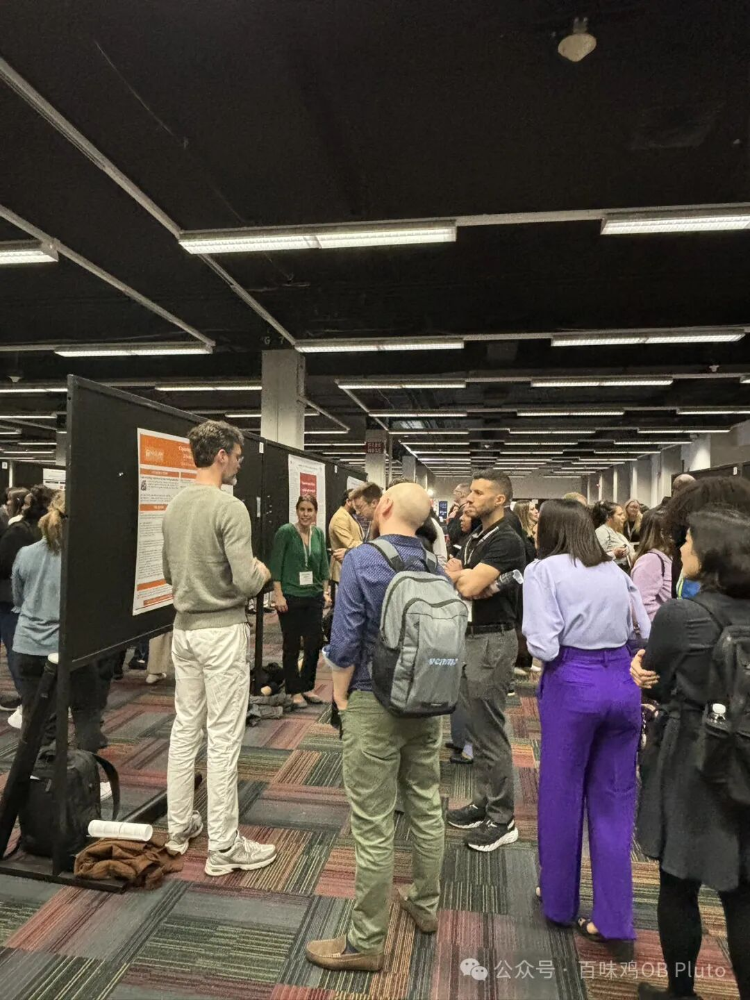
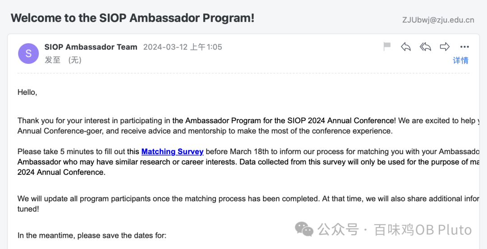
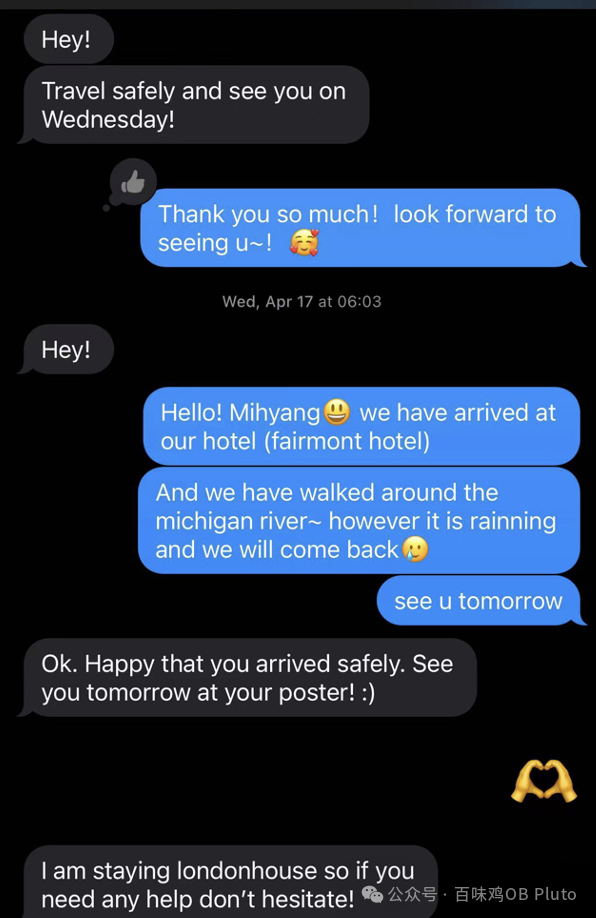
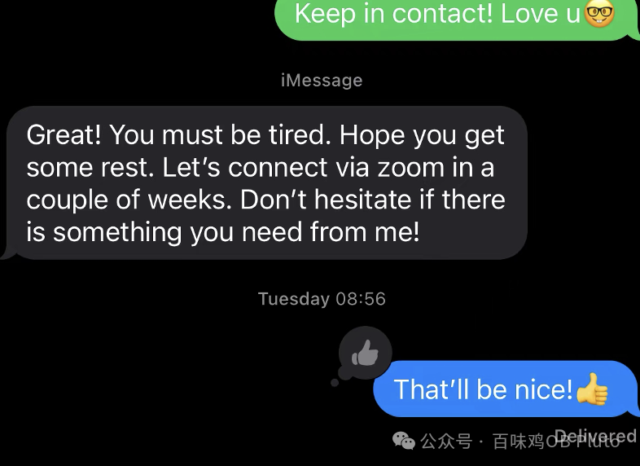
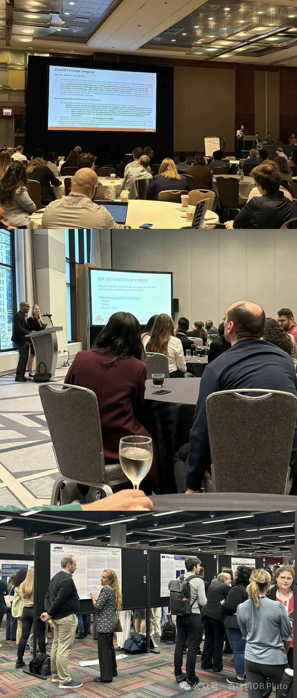
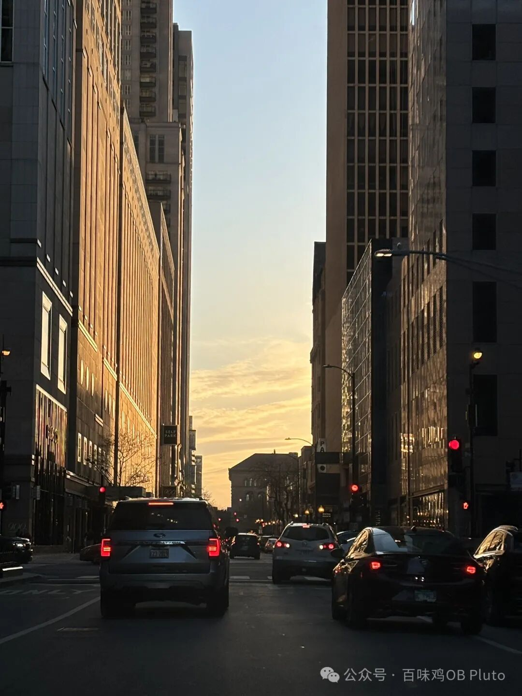
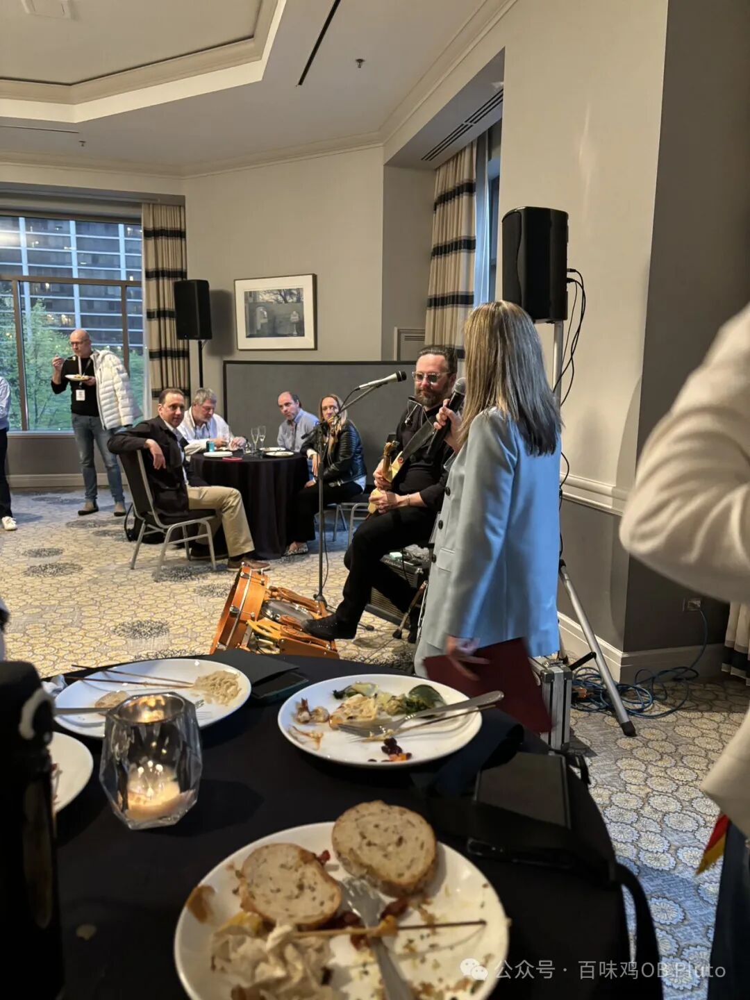
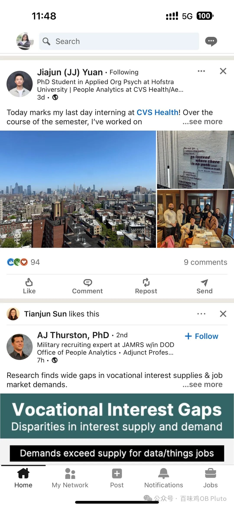

一整个四月几乎没有太多推进（一周感冒+一周会议准备+一周参会+一周回国休息+又感冒一次=泡汤的April），所以五月一直都在推进度🫠，且有一些生涯选择上的变化（结尾跟大家唠），所以又增加了很多每日todo，导致又很久没更了！

现在趁着一门助教课来还还债，并且帮我在公众号中储存一下美好记忆。

本篇推送就不过多阐述会议准备的心得了(小红书和微信推送都有很多会议准备)，直接分享一些在会议中收获的小小心得感悟（也不分享一些偏学术的内容了，怕有什么伦理问题…）

### **SIOP和AOM的区别**

*“如果做OB或者I/O方向，SIOP是很值得来的。你会看到这上面很多topic之后都会发在JAP上。”*——遇到的一位大佬说。

我想AOM和SIOP一个比较大的区别在于受众，AOM更偏学术，而SIOP有很多工业界的人参与，因而会有很多学术和实践的碰撞。

此外，由于SIOP为工业与组织心理学会议，心理学的会议就会有很多**warmth**，特别是SIOP今年提供的**Ambassador Program**，可以帮新人对接一个Ambassador，可以带你更好地参与会议。

这次我和师姐们都遇到了非常好的Ambassador，我的Ambassador是一个韩国中年女性 (从大学AP跨界到了工业界)，她带我漫步chicago街头、介绍她自己的职业与人生故事，带我去她博士学习的reception建立connection，去认识她目前的同事们（一个由I/O phd组成的队伍）并说有任何择校的问题都可以问她们，最后回国后也依然与我保持着联络，甚至还帮我联络了可能可以合作的导师，实在是感受到了那种**unconditional love and support**，真的太感人！

### **会议听什么？**

此次参会我参与最多的是**Poster**的部分，有一种逛集市一样、非常热闹的感觉，你可以和不同国家不同大学的研究者们面对面交流，询问他们的研究设计和想法，当然也可以快乐唠嗑儿。

而poster之外的**Symposium**和**Panel Discussion**则是针对同一个话题的五六位著名学者讨论。**全英文、高语速交流**对我来说还是很有难度的。所以我们就准备之后看看**W****hova**上的slides...

当然！最好的肯定还是**提前看材料**，然后去现场听，这样还能与学者交流对话... 但这个就是**next level**了，希望下次参会我可以做到！

一开始我看着这些poster会觉得，研究模型居然都这么简单，比如有的研究就是一个非常简单的中介模型。

后来我又遇到了上面那位大佬：*“虽然你可能会觉得里面有些研究做的很粗糙，但是更重要的是topic的选择。”*

听完之后我就会有意识地去问研究者*“How do you generate this idea? ”*这样的问题。听到的很多都是他们从自身经历、现象观察、吃饭聊天时突然产生的，还有一些有经验的学者会在阅读大量文献后对一些约定俗成的分类或框架进行Challenge。

总之，会议听什么？**听的是灵感、话题、是story，切忌被研究方法限制住想象力。**

### **会议要全程参与吗？**

在我还没去之前，我的Ambassador就跟我说，参加会议**是Kn****owledge**，但**更是travel、relationship、party**，不必全程在场而让自己burnout，所以可以选择性地去自己最喜欢的话题和学者那里，其他都可以事后email联络，大家都是很乐意分享的。

SIOP会把资料上传至**Whova软件**上，你可以下载到大部分Symposium、Poster、Panel Discussion的PDF材料，也可以联络到这些学者们。开放时间截止到会议后一周，之后还想要的话需要再付钱。

### **请对世界充满想象力**

这次参会也遇到了很多工业界的友人，有做consulting、coach、assessment的。最惊讶的在于，他们中的很多人也都在做一些有趣的研究，然后将研究结果反馈至公司让他们改进管理方案、或者更好地了解员工状态。他们说非常喜欢现在的工作，国外的公司很有钱，就是给钱让你做研究，或者去跟上级反馈一些top journal论文的结果，也不需要你产出什么... 而且，嗯，公司是真的会借鉴你的研究。

我上个学期也去参观过一些国内互联大厂，我也会问那里做OD、TD的人他们是否会看一些管理学方向的论文。他们毫不避讳地说，至少他们不会看，也许咨询公司会看吧。

当时我还真觉得，咱们这个研究方向就是自娱自乐。但这次听了听国外业界工作者的阐述，还是觉得自己的想象力太狭窄了，我们这些研究或许还真是有人在看、在借鉴的。

总之，世界很大的！不要被老生常谈限制了目前的想象力和目前工作的意义！

### **一些小点**

1. SIOP会后有很多reception，是一种非常经典的热闹（甚至喧嚣的）、有吃有喝的美式社交。参加reception的人都非常开放，可以互相分享人生故事。——我们更多地是去reception蹭吃蹭喝，social实在是太累了。

2. 国外建立connection很多用的是Linkedin，这个就像是科研人的朋友圈，可以看他们最新的论文、参加的学术活动等等，可以感受到更加立体的学者！

3. 还有一个令人印象深刻的瞬间是，我们看到非常有名的学者居然也站在poster session里面自己去present research，他说这是因为他的学术前辈们也都是这样做的，并且论文确实是他自己写、而不是学生的作品。说话的时候他眼里都带着光。——能亲眼见到这样纯粹的学者真的值了。

4. 这次也遇到了很多在国外读博的中国小伙伴，真的很亲切！真羡慕他们的自由、沉浸、大方，而他们也说我们自己从国内飞来开会真的很勇敢。说到这个，对我来说去年看了花少还是很有帮助的hhh！感觉没有什么事情是不可能的🌸想做的事情都可以努力去做，想去的地方也可以靠自己的努力攒钱去！

5. 如果不是去外面一趟，似乎会永远困在自己的刻板印象里，将芝加哥想象成一个仿佛出自哥谭市的电影场景，充斥着黑帮和混乱... 事实上，这里的人都很友善，白天天气都很好，旁边就是密歇根湖，海鸥还会飞进城市，遍地都是悠闲的白鸽，城市街道也都很干净。偶然会听到警报声，但是是因为Chicago没有电子监控，全都靠警察巡逻，所以有超速之类的就会响起警报....

### **一些变化**

其实从这学期开始时，我申请外面phd的心思就在蠢蠢欲动，特别是在大尾巴鱼等前辈的鼓励下，更是觉得世界很大、我还年轻、花一长段时间去探索世界的机会在整个人生中都不多。而我这人儿又实在是无趣、能看看论文、与同行讨论碰撞、平时宅着看看剧就足以消遣人生，同时骨子中又有几分叛逆、想做自己喜欢的研究、还不喜欢做太多dirty work，都让我离国内转博越来越远…

That’s it！开始踏上申请之路了！如果有同样想申请北美、香港PHD (商学院or心理学院都会想试试)的欢迎后台交流！
