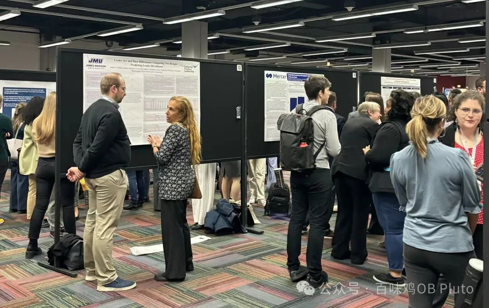
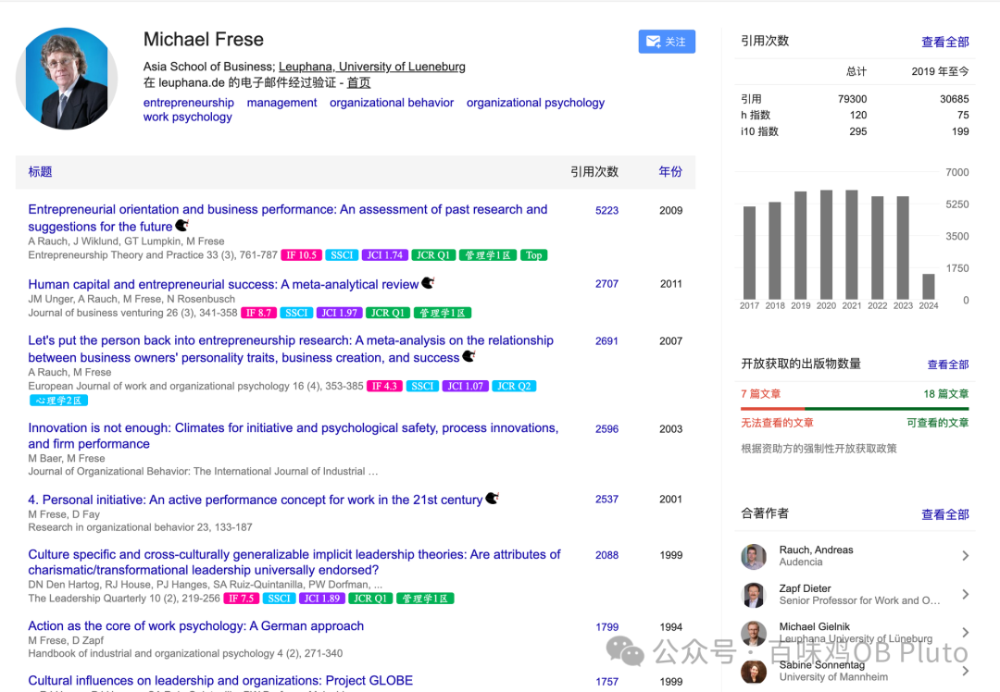
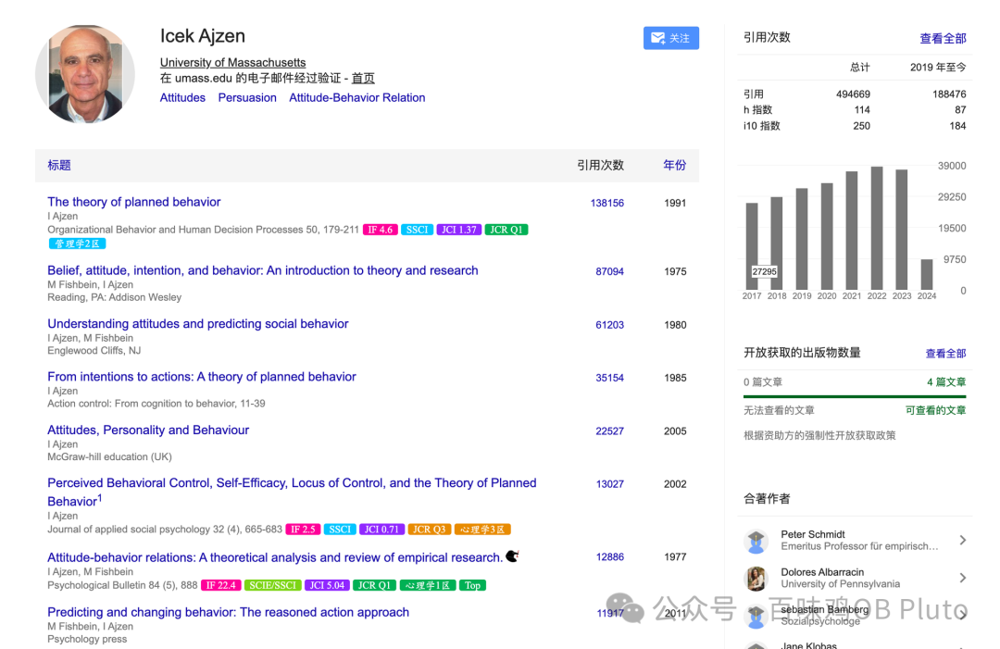
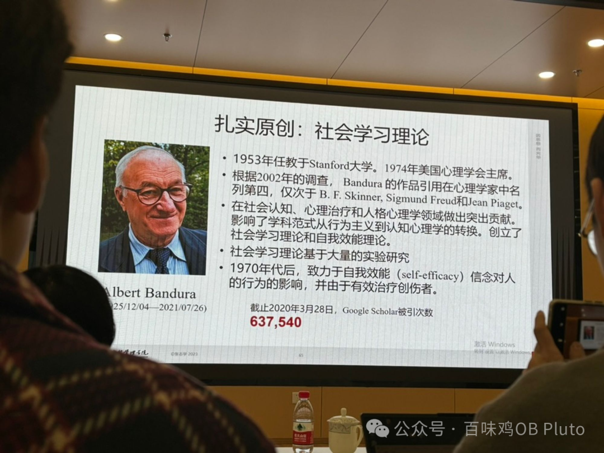
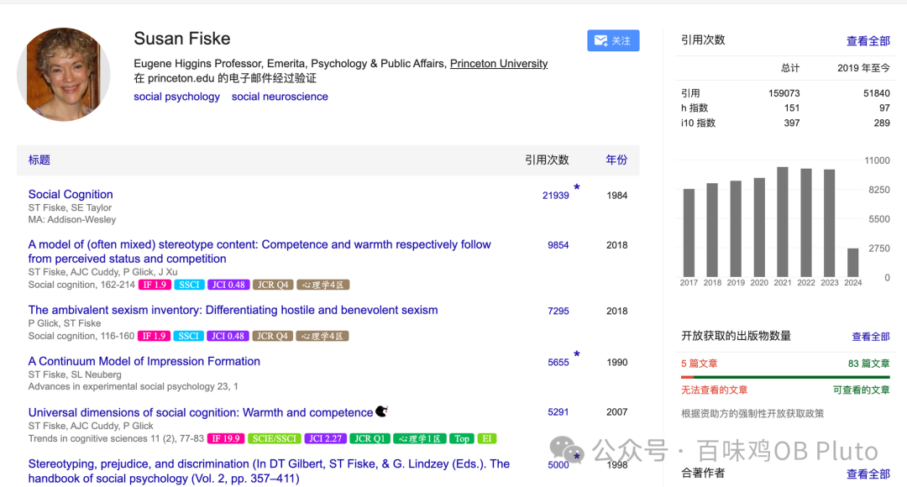
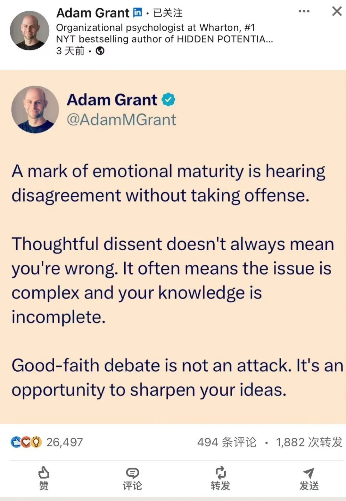

刚参加完SIOP回来，见了更大的世界，感觉自己的motivation又蹭蹭蹭上涨了！

在看poster session的时候，发现SIOP录用的研究也许模型会比较简单，但一定是有理论支持的，更上一次层则是能够丰富、挑战目前的理论框架。

于是想起我相册里之前拍过的**张志学老师**来我们系做讲座时推荐的四位理论大家，在此简单陈列。之后的推送里再逐个展开。

我想如果能把这四位提出的**理论的变化与发展**搞明白，那么对于**什么是理论、如何用理论、如何发展理论**就会更有实感，而不是单纯套用理论最粗浅的含义来解释自己的模型（我现在的水平仅仅停留在这一层）。

**第一位：Michael Frese-个人主动性**

**第二位：Lcek Ajzen-计划行为理论**

**第三位：Albert Bandura-社会学习**

**第四位：Susan Fiske-刻板印象**

我还在倒时差，所以先溜了——

之后会慢慢更新**SIOP的参会感想！**

也会分享一些非常简短的碎片话语  比如这些：

也会继续push自己多输出！！

感谢大家的关注与监督！！！

而且我发现 **我的公众号有留言功能了！！！**
