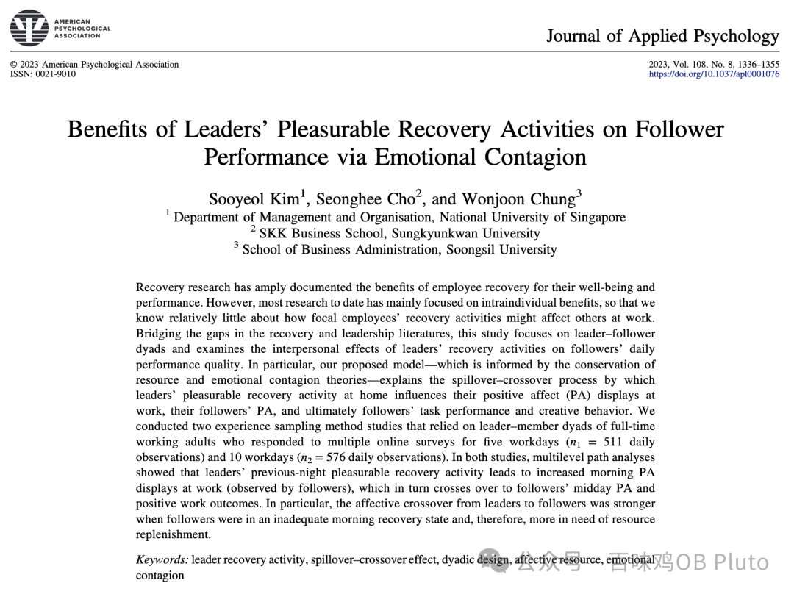
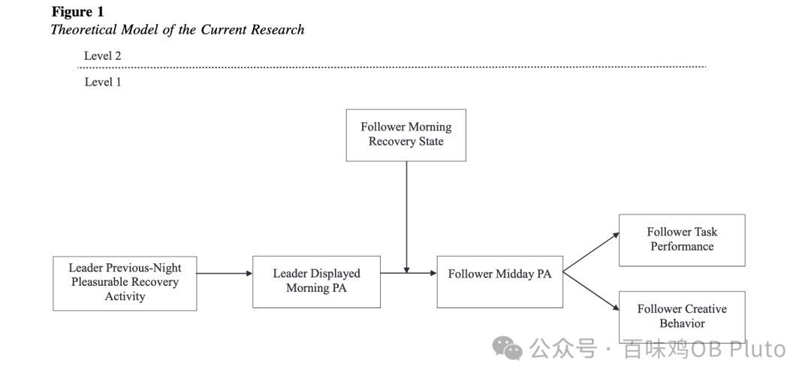
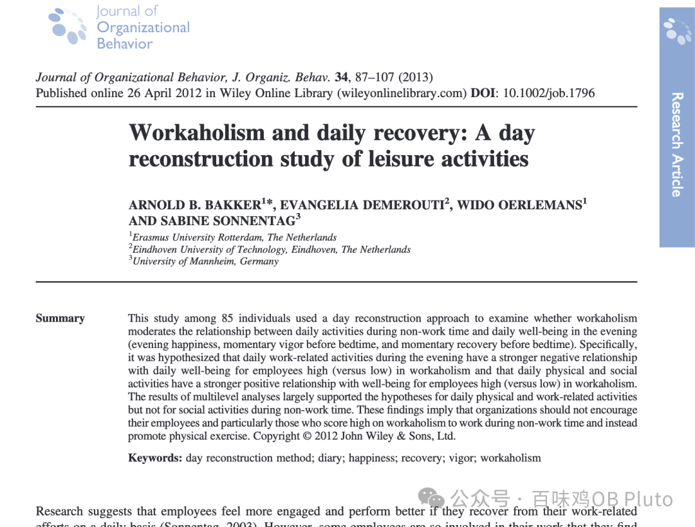
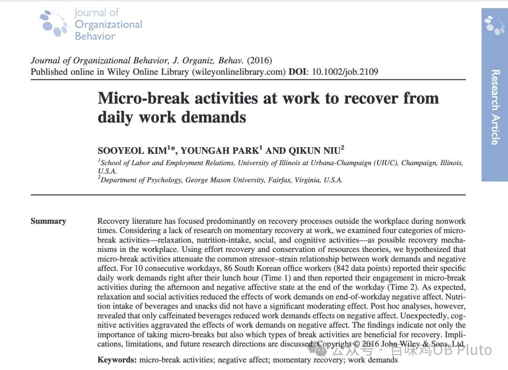
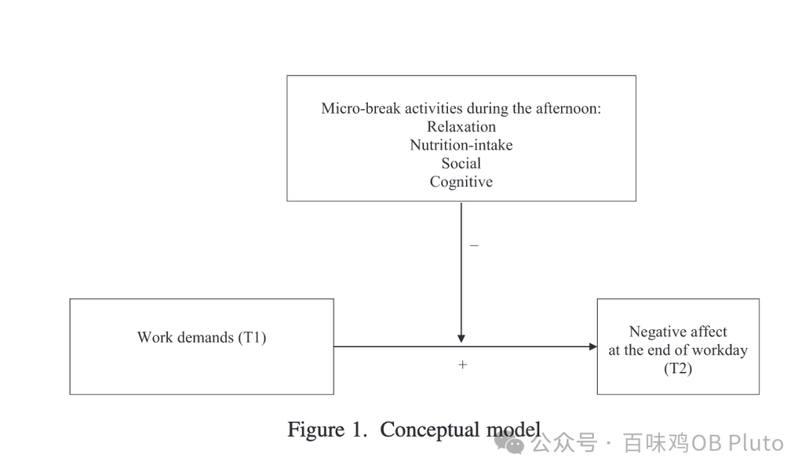
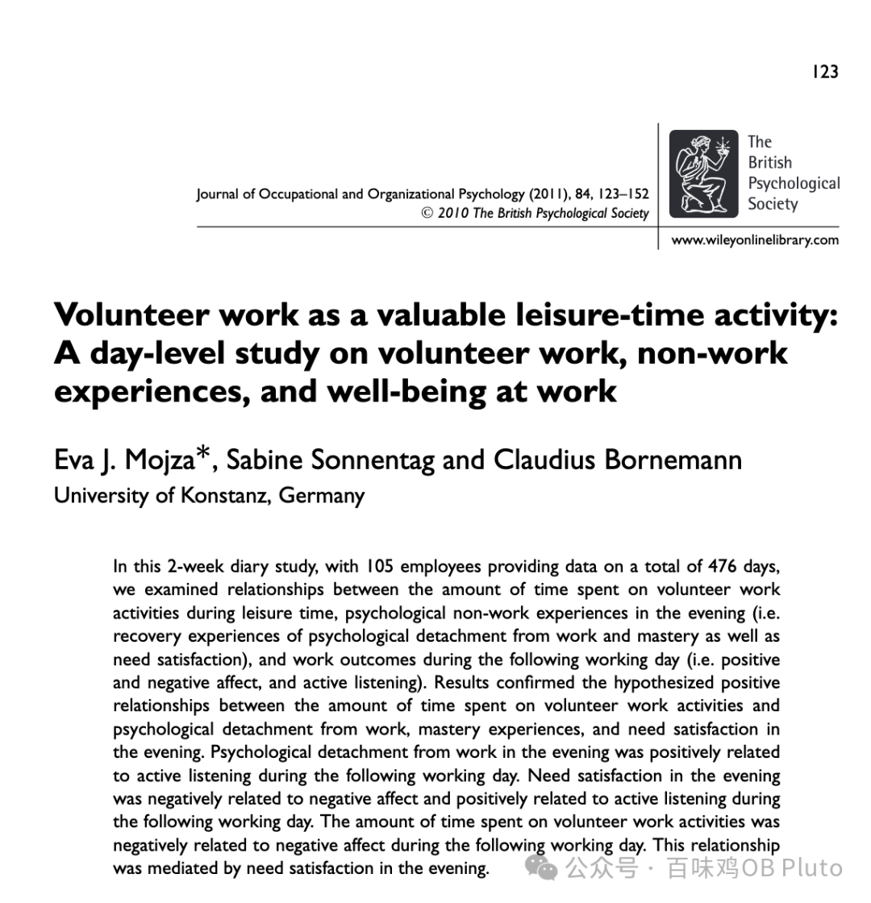
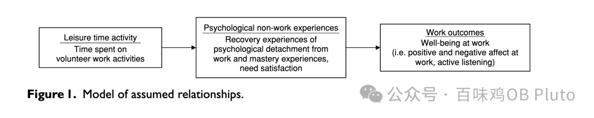
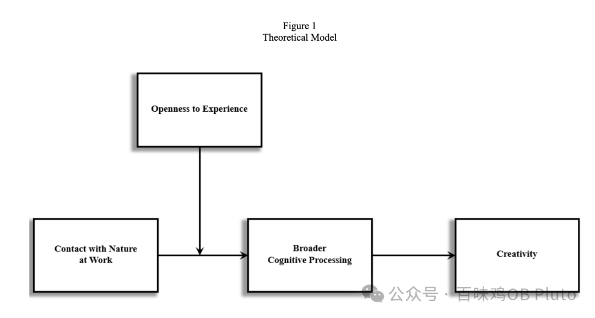
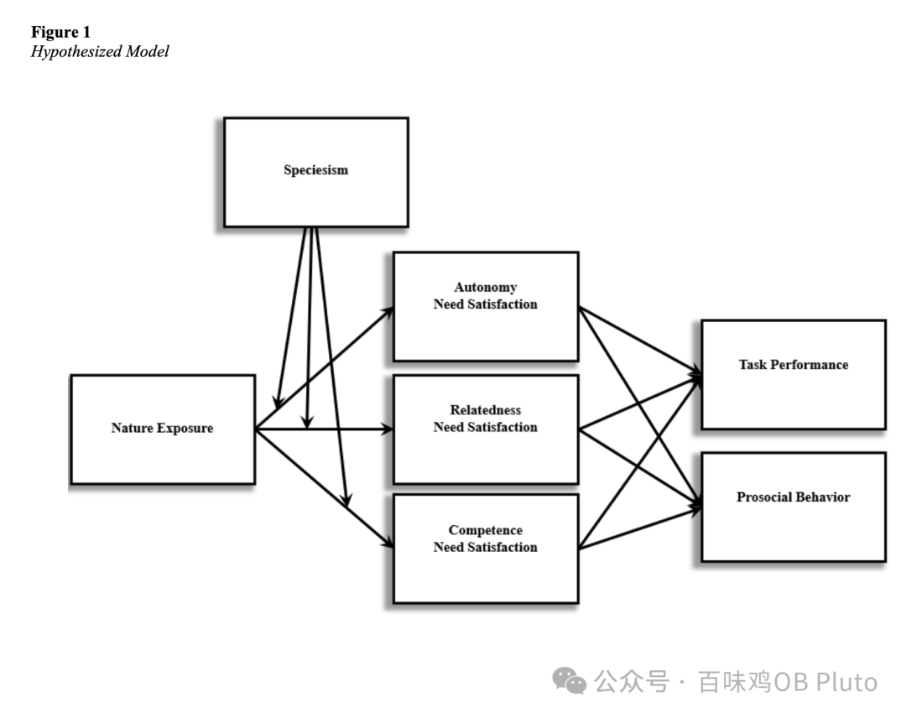
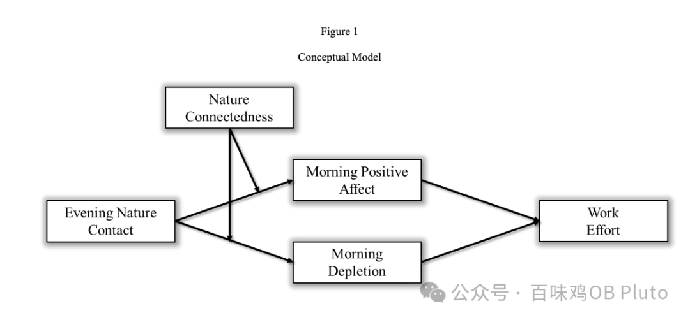

Beginning

好久不见朋友们！ 最近实在是太忙了，很多项目在同时推进。于是周中狠狠推进度，周末狠狠玩耍放松，就很久没有写推送了😭 现在正坐在前往上海办美签的高铁上，用这一个多小时浅浅写一期！

这期主题关于work-nonwork相关，也是我近期很感兴趣的主题。在优绩主义下成长起来的东亚小孩似乎都有一种娱乐羞耻——回家过年打游戏怕被父母唠叨，出去玩发朋友圈必须屏蔽领导，在考试季看一集电视剧都有一种偷着乐的满足与内疚并存的感觉...  但我到这个年纪，好像已经完全挣脱这套如pua一样的叙事了，卑微科研人就如同植物一样，是动不动就需要阳光、空气才能迸发生命力的！

有意义的工作固然可以让人产生passion，但生命中那些nonwork self-care也同样可以让人recovery-进而再用更多的活力去创造。

That's it！这期所有的文章都探讨了那些nonwork experience对打工人的影响，希望每一个打工人都能拒绝娱乐羞耻，沉浸享受生活！

ps. 大家如果看到有其他相关主题的论文也欢迎发给我呀！可后台回复「学术交流」。另外，还和好朋友录了一起self-care的播客！等剪辑完之后就share一下！

**论文1：JAP 2023**

领导前一天的娱乐回复行为会促进第二天早上的积极情绪，进而进行情绪传染，让下属也产生积极情绪，进而让下属有更好的工作绩效和创造行为。下属的晨间恢复状态起调节作用。

**论文2：JOB 2013**

****

这篇文章主要检验工作沉迷（Workaholism）的调节作用。研究发现，对于高工作沉迷的员工，夜晚工作相关行为会对员工幸福感产生更强的消极作用。但同时，对于高工作沉迷的员工，每天的体育和社交活动也会对他们的幸福感产生更强的积极作用。

因此作者建议组织不必鼓励Workaholism，而是要多提倡体育锻炼。

**论文3：JOB 2017**

这篇文章的模型很简单，主要是探讨下午的微休息活动的调节作用，并把这种微休息活动分成了休息、摄入影响、社交、认知四类，分别探讨了不同种类的micro-break对于工作要求到消极情感的缓解作用。

结果发现，休息和社交类活动会对工作要求到消极情感产生环节作用，但认知类休息会加强工作要求到消极情感的效应。但对于营养摄取类，研究发现摄入一些小零食无法起到缓解作用，但是喝咖啡可以！

**论文4：JOOP 2011**

    

花在志愿工作上的时间和晚间工作脱离、精通体验、需求满足有显著正相关关系，和第二天工作日的消极情感成显著的负相关关系（需求满足为中介）。晚间的工作脱离和第二天工作日的积极倾听成正相关，晚间的需求满足和第二天的负向情绪成负相关。

**自然接触三连发：**

**JOB 2013+JOM 2023+JOM 2023**

下面三篇都是来自Georgia的Pok Man Tang发的，总之自然接触可以让人认知扩展-产生创造力，会产生积极情绪并减少消耗，会提高工作绩效、工作努力、亲社会行为...春天祝大家都能快乐nature contact！

**没想到写合集3的时候还在祝大家冬天快乐，现在又已经是如此明媚的春天了，那么祝大家：**

****🌻春天快乐！！****

**（高铁马上到站 就写到这里了！）**
