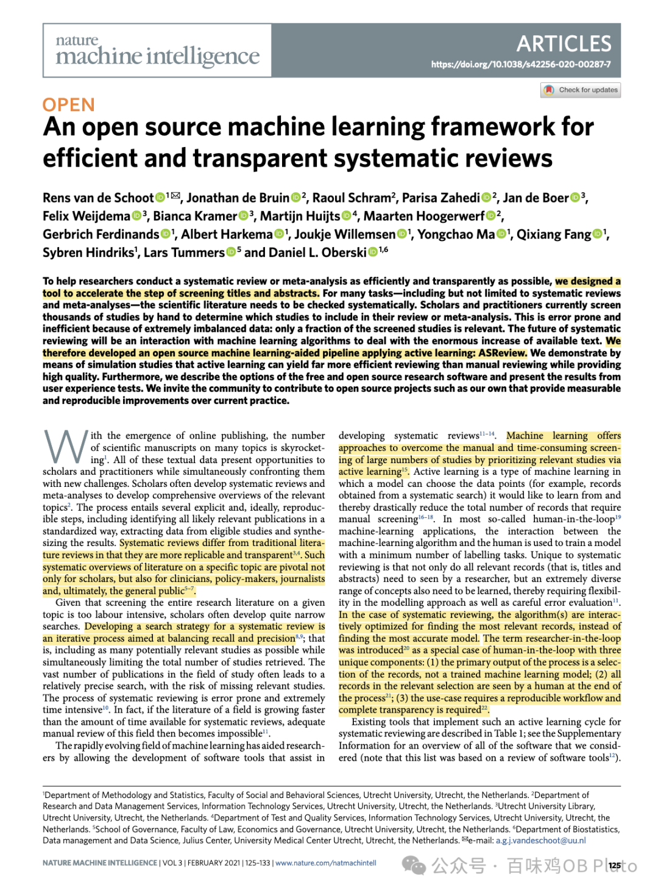
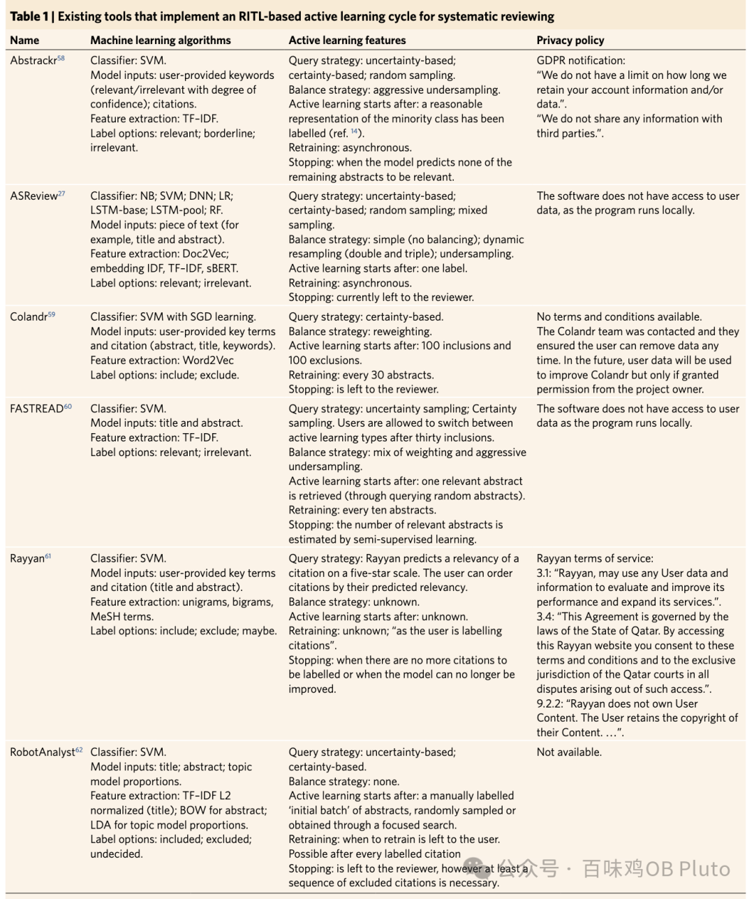
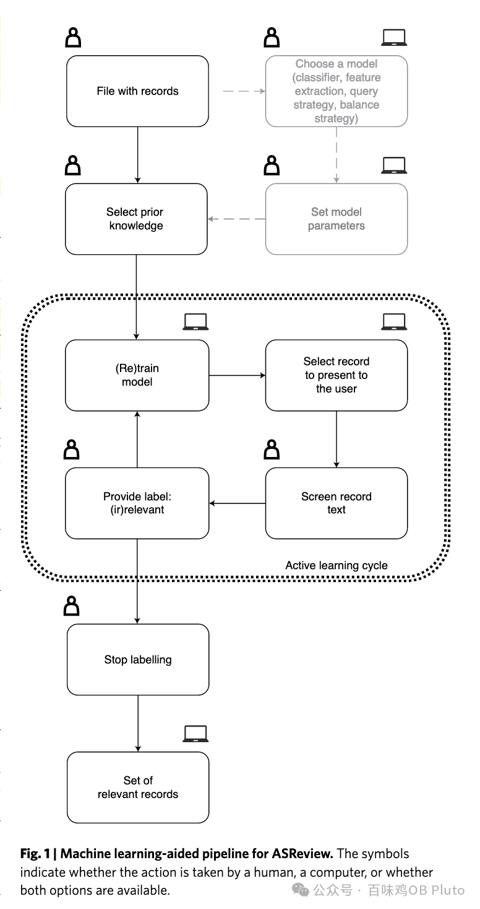
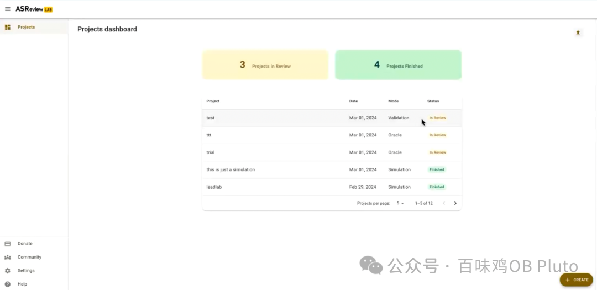
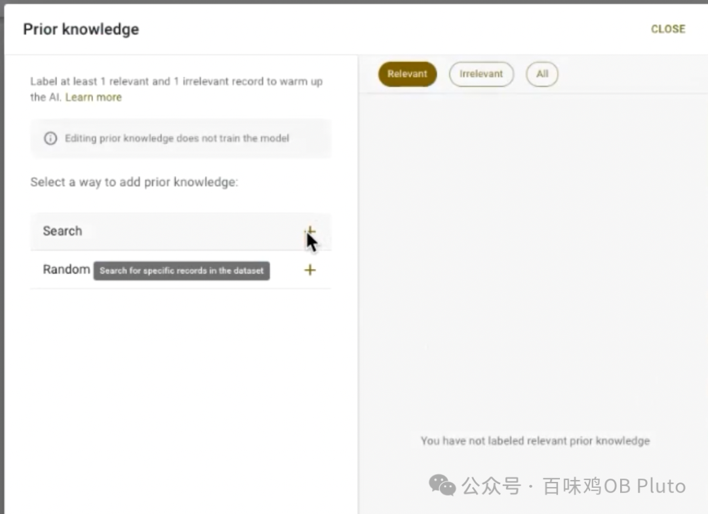
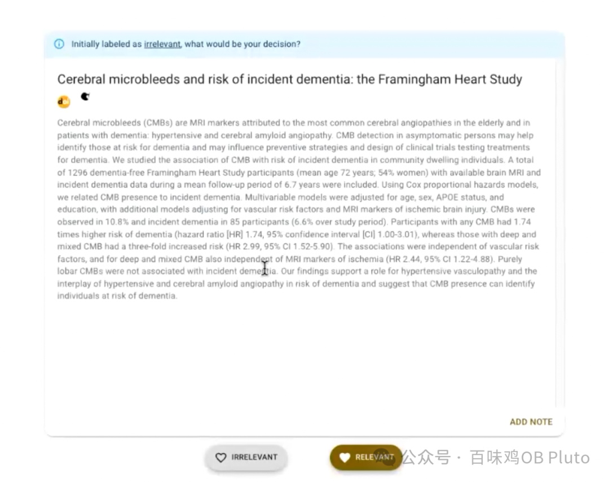
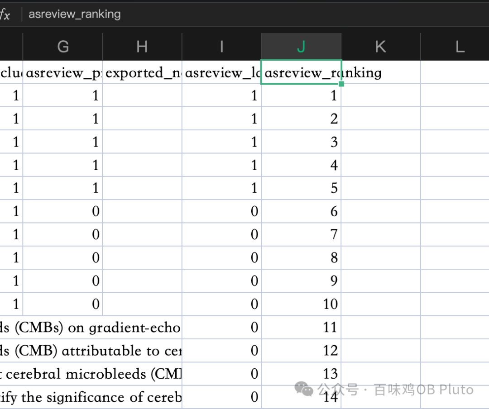
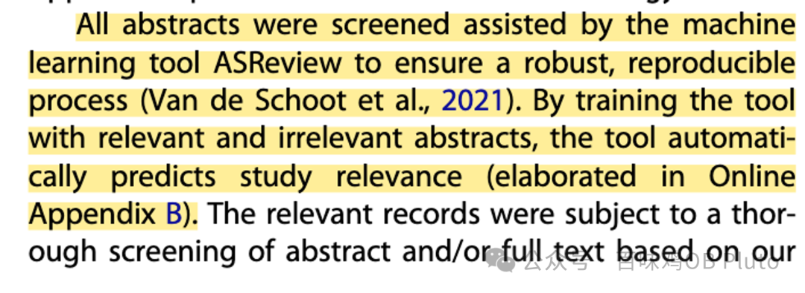
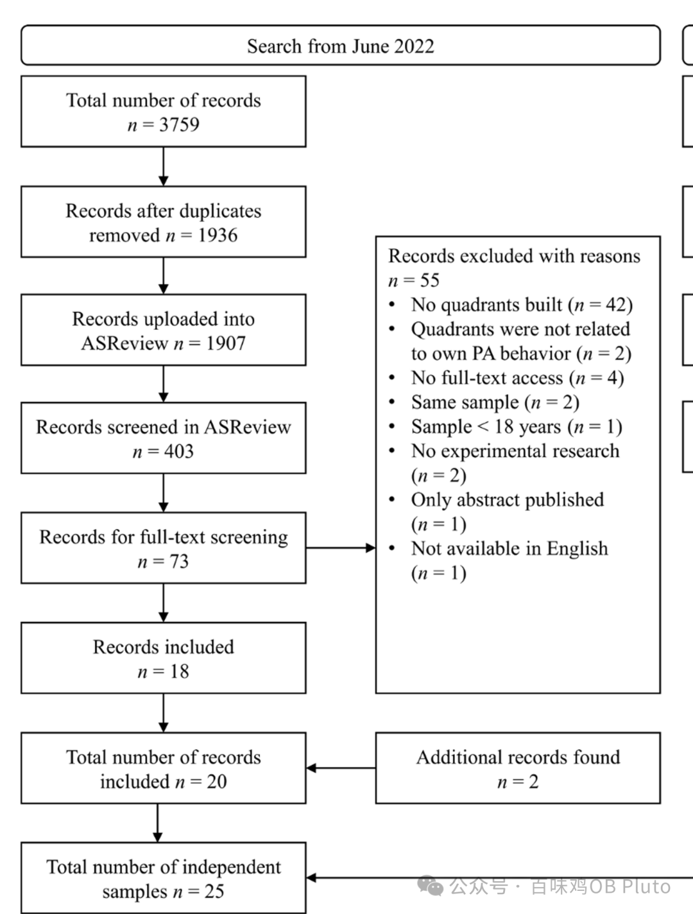

**文献信息：**

van de Schoot, R., de Bruin, J., Schram, R., Zahedi, P., de Boer, J., Weijdema, F., Kramer, B., Huijts, M., Hoogerwerf, M., Ferdinands, G., Harkema, A., Willemsen, J., Ma, Y., Fang, Q., Hindriks, S., Tummers, L., & Oberski, D. L. (2019). An open source machine learning framework for efficient and transparent systematic reviews. *Nature Machine Intelligence*, *3*(2), 125–133. https://doi.org/10.1038/s42256-020-00287-7

**PART 1**

**引入**

这篇文章可谓是大开眼界了！

众所周知，一篇元分析往往要纳入上千篇、甚至上万篇文章，之后再通过读标题和摘要、进而再通过全文内容判断是纳入还是排除。——这仅仅是method里面轻描淡写的一行，但确实卑微研究生数个月、有的甚至是数年的麻木与折磨。

而今天介绍的这个来自Utrecht University统计学家们开发的基于Active Learning算法的文献筛选工具ASReview，真可谓是一份来自Machine Learning的救赎❤️

话不多说，我直接介绍！

**PART 2**

ASReview

作者调研了目前一些采用机器学习算法进行系统性综述的软件（比如常见的Rayyan），但这些软件都存在以下的问题：

1）算法不公开透明，算法内部依然是个黑箱（black box）。——与open science的大趋势不符。

2）算法缺少灵活性。——无法根据随着看文献而不断变化的筛选要求来调整算法。

而他们新开发的ASReview就可以完全解决以上的问题：

**· 它的代码公开于GitHub**

**· 它的算法（active learning 会根据人类的筛选标准而不断迭代**

**· 它保护用户隐私 不会将数据传到云端**

下面是ASReview的大致流程（见下图）：

1. 在各大数据库中先初步下载符合条件的论文 导出ris格式

2. 导入ASReview

3. 告诉ASReview一些先验知识（Prior Knowledge）比如哪些是非常核心的文献

4. ASReview根据先验知识进行模型初步训练

5.输出给用户初始模型计算出的高度相关的文献

6.用户判断这些文献的相关性

7.ASReview不断根据用户的选择进行算法调整

8.用户根据适当标准停止判断

9.导出最终结果

**PART 3**

**实操！**

完整步骤可参考官方帮助文档：https://asreview.github.io/asreview-academy/ASReviewLAB.html

很详细！但考虑到英语还是不大方便，所以我也简单介绍下：

***第一步：安装与打开***

ASReview并不能直接下载，而是依托python运行。（具体安装文档可查看：https://asreview.nl/download/）

可以直接在windows的 ‘cmd’ or Mac的‘terminal’ 中输入安装和运行的两行代码：

pip install asreview

asreview lab

之后，就会非常神奇的自动打开网页！

***第二步：提供先验知识***

选定**oracle**模式后，点击**search**添加5篇高度相关的文献，点击**random**随机浏览摘要，选择相关or不相关。

等到有5篇相关、5篇不相关的先验知识后，ASReview就可以开始初步建模

***第三部：根据初始模型再次筛选***

此时界面提供的就是机器学习算法得出的高度相关的文章，你需要继续做出选择。这时候，**你的每一次选择都会让算法进行一次迭代更新——体现了Active Learning算法的灵活性。**

****

最后，等到出现的大量文章都是不相关的（至少连续20篇都是不相关）之后，就可以停止筛选。模型就此训练完毕！

***第四部：选择合适的格式导出***

这个时候选择ris格式导出，你会发现不仅有ASReview得出的高度相关的论文，还会有它得出的相关性从高到底的排序。太绝了！

最后再导入zotero将会达到绝杀。因为zotero会自动根据doi下载pdf，这样再集中浏览这些高度相关的论文全文就会省下非常多的时间！

如果有更多问题，可以看看GitHub上是否有相似提问，也可以直接在这GitHub里提问哦，再次向这些无私的科研人致敬！

https://github.com/asreview/asreview/discussions

**PART 4**

****已经用上ASReview的论文****

可以看到，目前已经有很多领域顶刊都在用这个技术，大家也可以参考这些文献中的报告。

*方法部分：*

*流程图：*

老样子，我会在我的学术小群里发一下上述文献，可以后台回复「学术交流」拉你入群~

终于更新啦！新学期我还是得记着坚持更新！长的短的、学术的生活的都要更新！

又多了一些关注  小君真是感谢大家的关注 其实我只是一个卑微的打工研究生 orz

anyway 春天马上就要来了 祝大家都科研顺利 身心健康 有空多出门吸氧呀~

（附上本周末的快乐！）

又是爱杭州的一天 55

