**/ 新年好呀朋友们！ /**

记得去年是大年初二因为百无聊赖才写了年终总结，当时觉得尚未有翻篇的感觉。但今年在大年二十八回复完审稿意见并上传后，倒是真的有一种2023年告一段落的感觉。

回顾过去几期年终总结([年终总结｜2022拼凑出了很不一样的我，2023要继续run and rebel](http://mp.weixin.qq.com/s?__biz=MzU1MzY1MjIxOQ==&mid=2247484600&idx=1&sn=e4134ba886a852c96c59e1346cc120ab&chksm=fbeede2ccc99573a7f594f12573a2bb422e34c2b7de5a082fe8bb00e41a7bf9008629ef6ef88&scene=21#wechat_redirect))，我的心情总是笼罩在一片朦胧之中。看似平静、实则悲伤的。想来也是因为当时还有一些内心的矛盾，对很多关键问题还想不明白、与自我尚未达成和解。

但是今年，我可开心了！

(随意配些相册图片...)

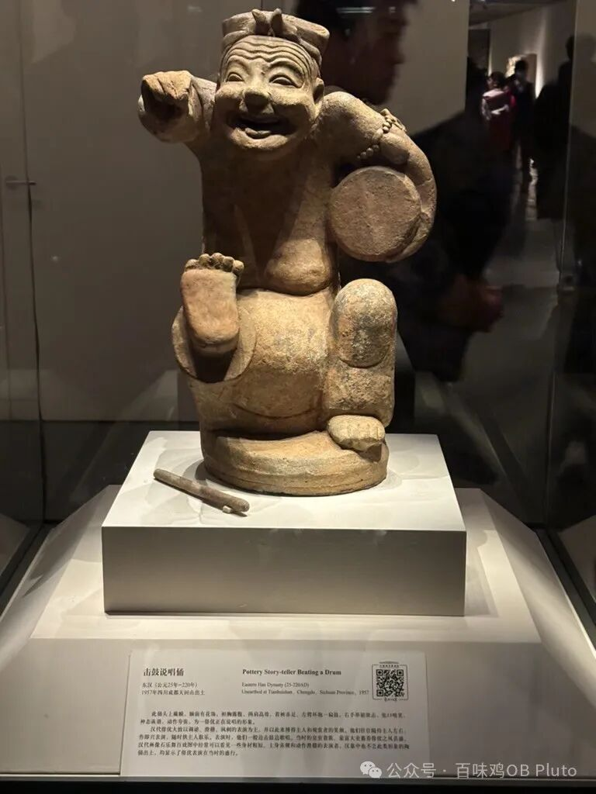

今年完成了很多事情，去了很多地方，看了一些书，酝酿了一些idea，在后期培养了一些习惯。真实地感受到自己生活状态的变化。

其实未必是有了什么辉煌成就，而是在每一次行走后的思考、创伤后的顿悟中找到了自我的定位，可以用平和、自洽、松弛的心态对待每一天、每一个事件了。

-

年终总结对我而言还是挺有意义的。就像是研究前的预注册是为研究打上一个时间戳一样。我的年终总结也是在给我的人生打下一个又一个节点，记录我每年的心态变化。

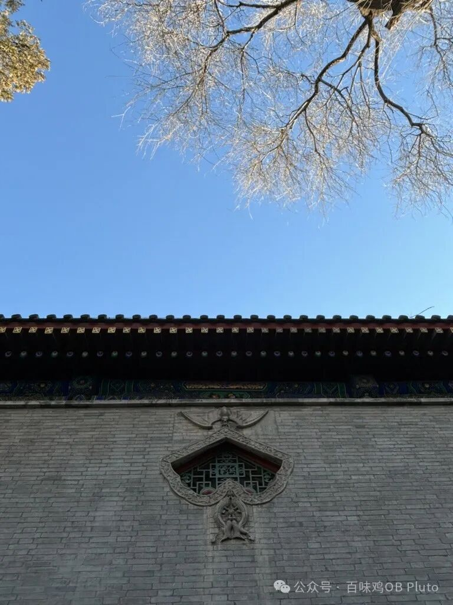

有人说，很可悲的是，在跨年的时候大家一起跳起来庆祝，可实际上，蹦完后还是停留在原地。

但我想我们漫长又短暂的生命里，离不开这些偶尔情绪澎湃、互相祝福的瞬间。不用管到底有没有意义、有没有资格，不用管跳跃之后是不是落在原地，不用管年后的任务到底要怎么做怎么跟导师汇报。就享受这宝贵的节日，享受一年一度self-reflection的时刻，享受对明年满怀憧憬的时刻~

cite 小董老师的话："做不到的事，就放在明年，不行就后年，且活呢。"

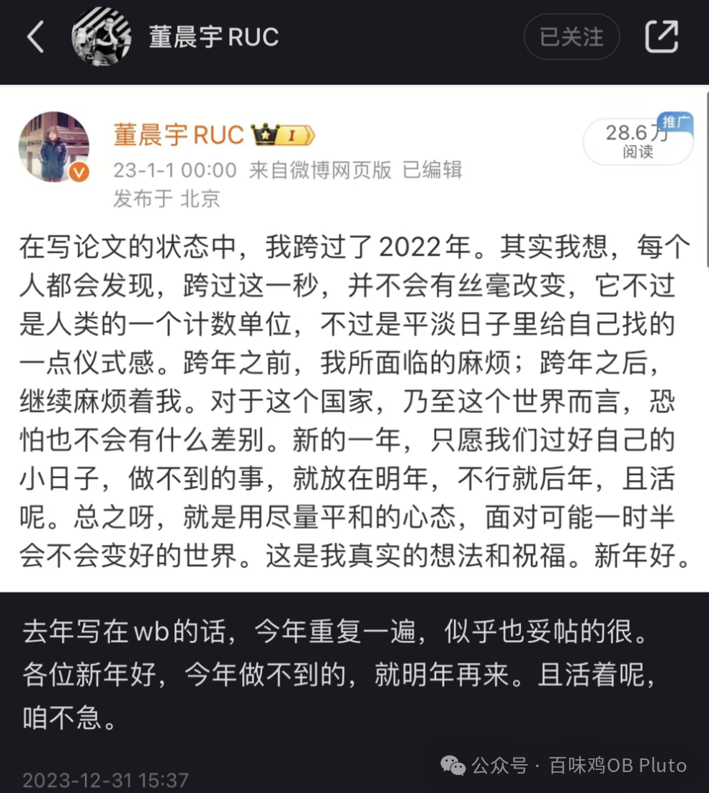

**/ 科研与自我 /**

和本科时不同，今年会觉得真正对科研入门了：实打实地搞了些数据分析、看了些好文章、了解了文章背后的大佬人生、经历了些繁琐的论文雕琢。

庆幸地是，虽然有时会和朋友们吐槽这苦哈哈的科研生活，但大部分时候我还真是苦中作乐、乐在其中。

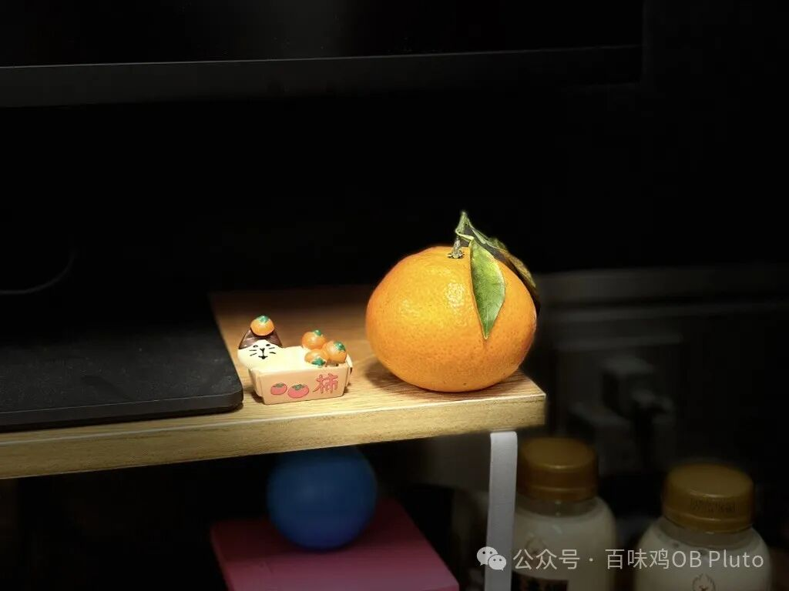

为什么会这样感觉呢？我也会经常问自己。

明明我记得，大二时我和zyy还在那儿说「这个研不读也罢，工作去了！」但现在我和zyy又开始每日与论文周旋，也会为一些新奇思路而感到Inspired。明明我记得，很多个假期里，我也就是天天睡到中午，看看电视度过假期。而现在，电脑是我最好的伙伴。

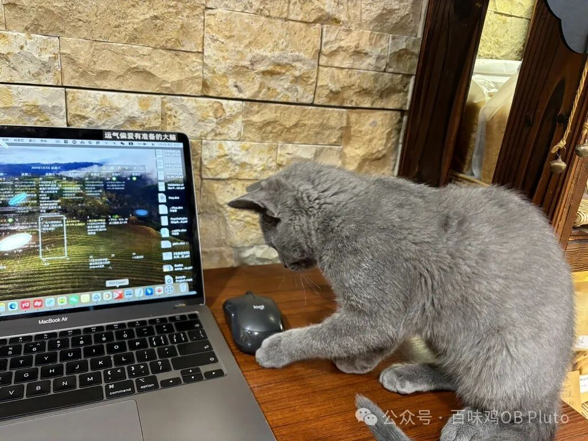

其实2023年有很多时刻影响着如今的我：

-读懂实证论文的时刻

-看From the Editors相关论文了解论文背后逻辑的时刻

-听大佬讲述学术之路的时刻

-在学术会议中听到有趣研究+魅力presenter的时候

-看真正热爱研究的老师为accept感慨的pyq的时刻

-与领域同行快乐探讨学术问题的时刻

-膜拜adam grant多元人生的时刻

-用R调教出好看的图的时刻

-用Mplus跑出模型的时刻

-写论文的时候，感觉自己的图表可视化非常清晰的时刻

...

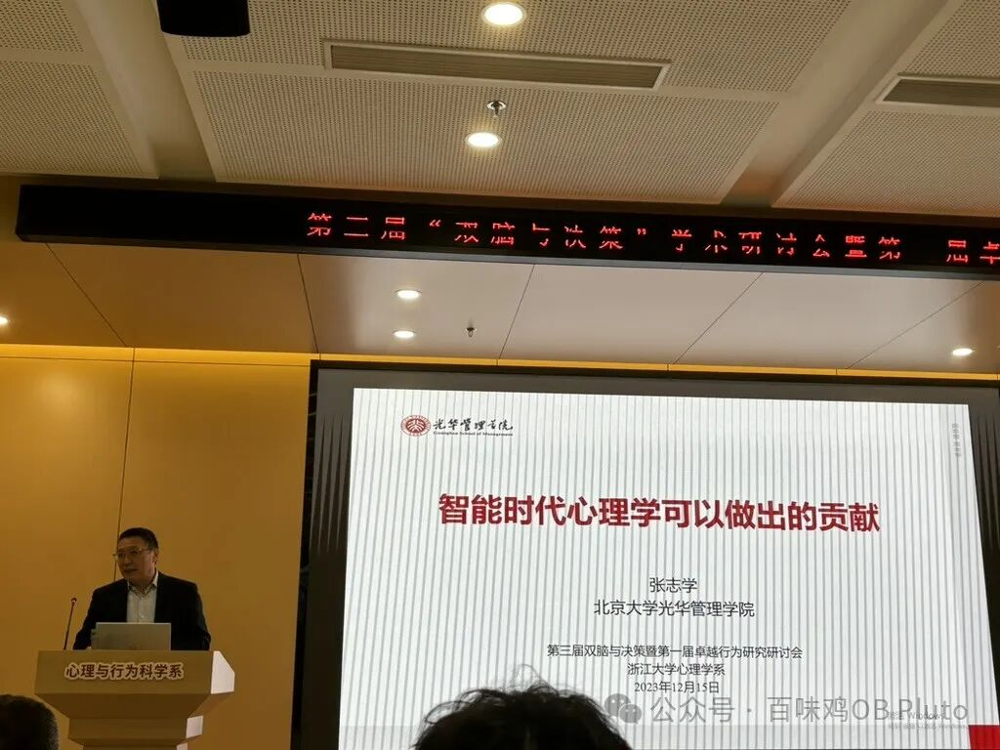

在我这个年纪，其实我还真是听不得『科研也就是那回事』这般的说辞。

因为我好像每天都能看到新的东西，方法永远会有更精细的，研究设计永远会有更精妙的，理论运用也总有更make sense的。我每天都觉得自己无知，学术的世界有太多可学。

真希望我能永远有这样所谓的“少年意气”，不要变成单调的中年人。真希望未来能一直做自己感兴趣的研究。

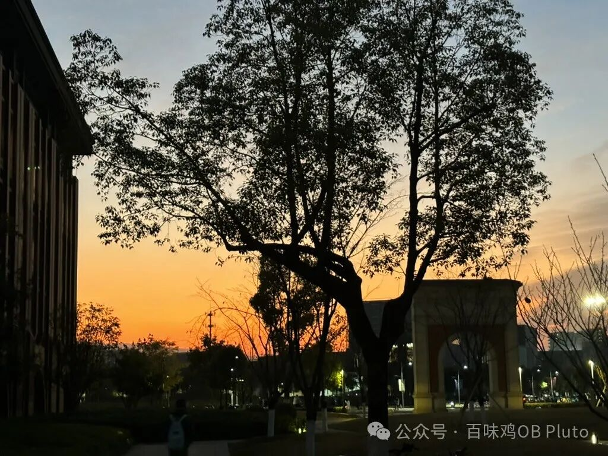

-

年末去练瑜伽的时候，在45分钟痛苦感知身体后，瑜伽老师说：

"其实瑜伽是一件能够不断收获小快乐的事情。不同的姿势就可以让你觉知到自己不同的肌肉。很多感觉是新的，你从来没有感受到你的身体还可以达到那样的柔韧度。从疼痛，到舒展，都是很开心的。这和那些反反复复只锻炼一个部位不同，瑜伽是在寻找自己的潜能。"

那一刻我突然顿悟！科研给我带来的也就是这样的感觉：和很多重复性工作不同，学习科研可以让我每天都获得新鲜的知识，训练自己的大脑，感受一次次的心流，这太不错了！

好吧。2023年的bwj想着，未来也许就是像现在这样，一台电脑相伴天涯海角的简单人生了。

**/ 我的精神世界：阅读、旅行、影视、播客 /**

今年走过的城市太多了：上海、天津、长沙、厦门、泰州、南京、云南、徐州、杭州、北京。

很爱天津的悠哉、长沙的年轻、厦门的浪漫、云南的惬意、北京的历史人文。而南京和杭州就像家一样，属实都是我的精神家园。

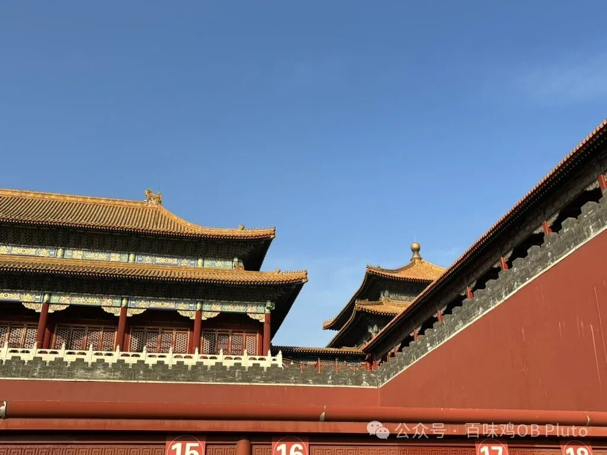

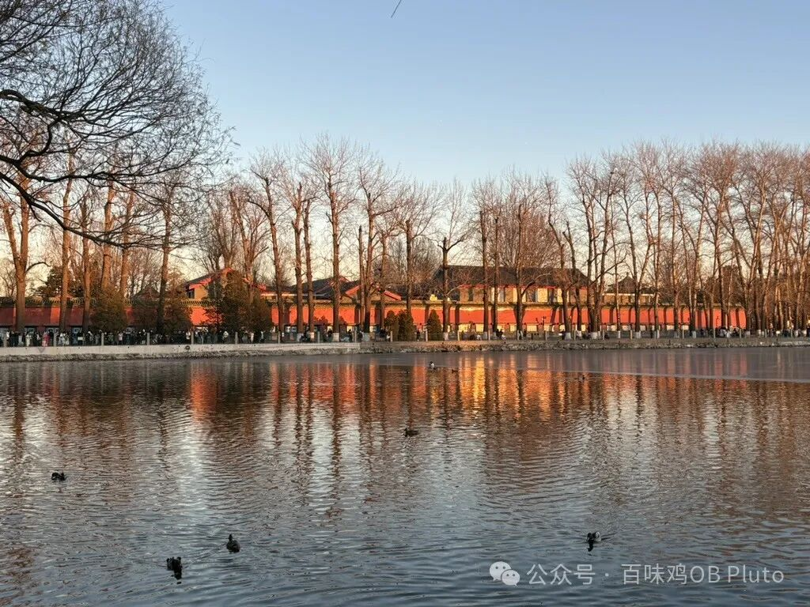

明年总觉得会比较忙碌了，没空转悠太多。但是希望4月能在芝加哥顺利玩耍！不仅是开会！

今年看了19本书，勉强达成去年目标。最爱的是《献给阿尔吉侬的花束》《不原谅也没关系》《动物农场》。不过忙起来总是搁置阅读的习惯，希望明年能学学、读读、走走，都不耽误。

电影就浅浅看了些，《长安三万里》《芭比》《宇宙探索编辑部》看完都有一些后劲儿和感慨！其他的就当消遣瞎看看了；今年没看啥剧，二刷了老友记和机医，年末看了今年唯一一部国产剧《莲花楼》，向全世界安利！

> 求一杯逍遥醉相宜
> 提一笔故人同归去
> 不过是挑个自己喜欢的结局

李莲花真的很符合我今年平和的心境🪷

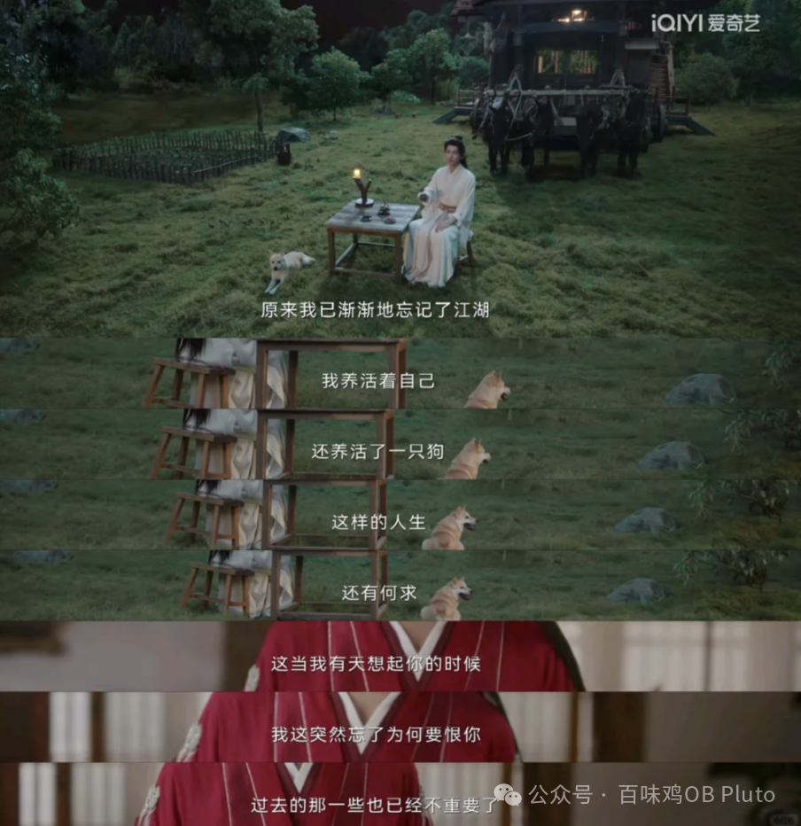

综艺的话完整看完了《再见爱人3》，产生了很多亲密关系的反思，但很多我还是想明白，似乎也已经懒得去想了。零零散散看了披荆斩棘、声声不息、种地吧少年，都很不错！

今年也依然爱着播客，除了老朋友的贤者时间、随机波动、问题不大，今年还爱着声动早咖啡、思文败类、fit4life、歪波音室、啊是猫咪呀、除你武器、阿弥晚安、肥话连篇...

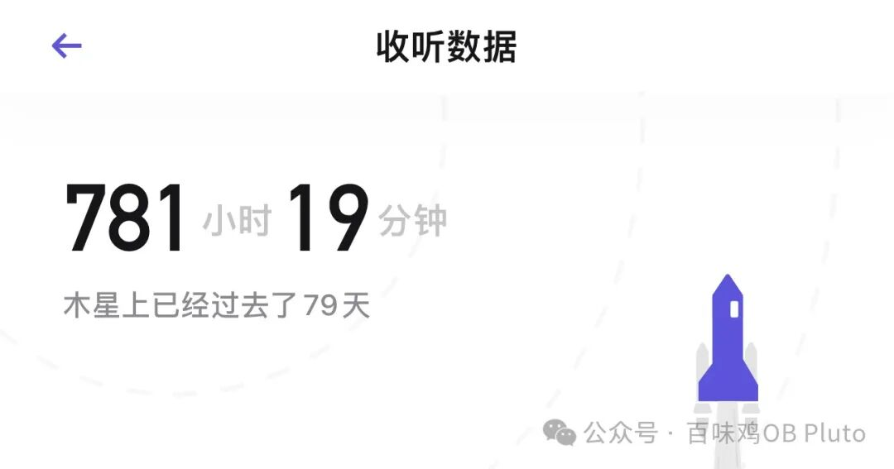

总觉得我到了80岁也会是个边听播客、边散散步的老奶奶🌻

**/ 为了多活几年，请保重身体！ /**

今年的身体还不错！懒惰bwj破天荒开始了健身和瑜伽，享受了些伸展和流汗的快乐。可惜后期太冷就搁置了。糟糕呀！希望天气回暖后君再接再厉！

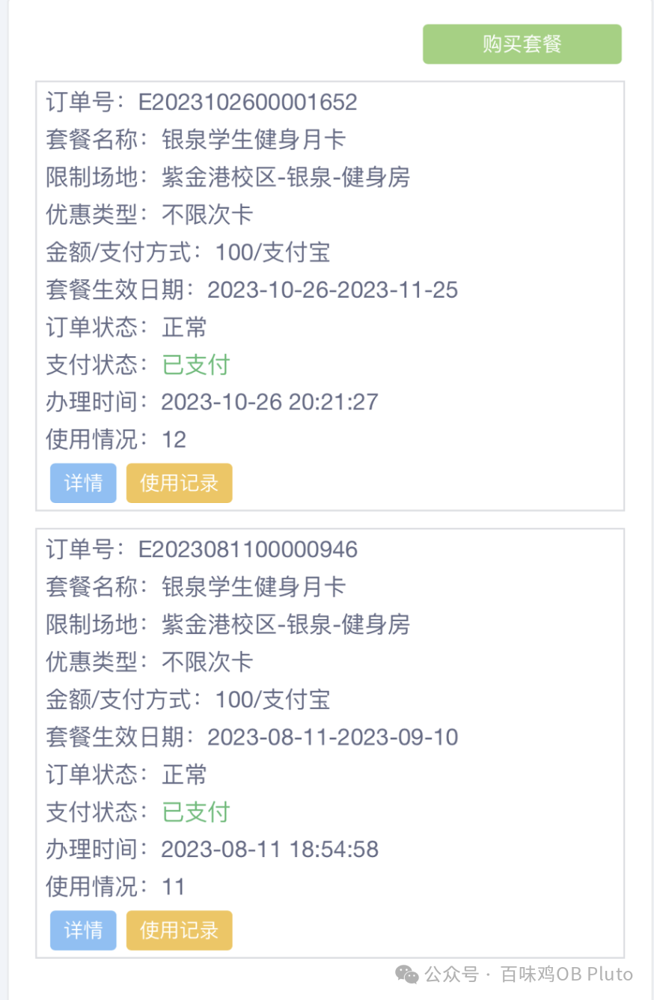

哎，过年回来又听了不少生死之事，每次听到这些就会觉得生命何其短暂，没有什么事情是比生命更重要的。

不必觉得“00后整顿职场”就是垮掉的一代，其实我们只是更惜命罢了🙏世界这么大，总要用健康的身体看看（昨天我还做梦去冰岛和朋友看了鲸鱼！）；家人朋友也很好，陪伴他们也很重要；想做的事情太多了，没有身体怎么行呢。请各位导师别再压榨了，陪陪家人吧🙏🏻

对了，今年去了趟北京后，养成了近乎每天22-8的健康作息，早点洗洗睡、早点开工、早点完成任务、理所当然享受睡前娱乐的感觉可真不错！

2024年我会劝每个人都早睡早起！

**/ 我****/**

今年我呀，真的在性格层面发生了很大的改变。（用简单点的mbti说，我已经变成了enfp快乐小狗截然相反的istj... （不过mbti纯粹当个参考了~）

以至于年末，我导评价到：“wj平时很内向”...

而从小到大我的评语都是“小板凳像抹了油”“别人上课她玩油画棒”般的评价...

-

无意碰瓷颜院士，但是这种「在琐碎忙碌后安静科研」的平静我还真是有点同感。

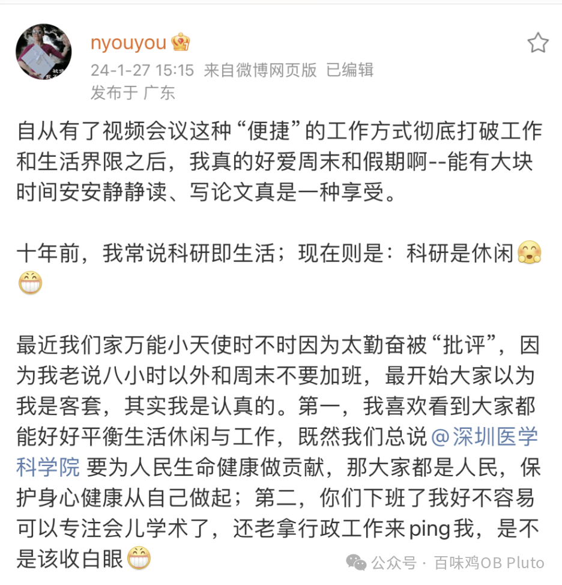

今年我已经无法承受音量过大、情绪过于澎湃、话语过密的social场合了。经历一次感觉都要独处一整天才能恢复。

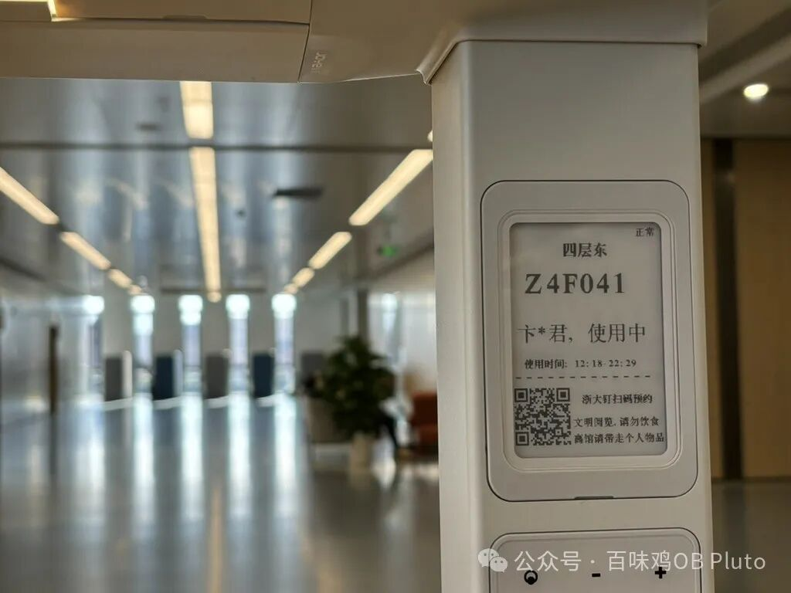

与此相伴的，是我骤降的物欲。对什么衣服鞋子都毫无欲望，就是喜欢吃点好吃的😋

去年写道“我有很多截然相反的瞬间，也做了不少让我自己后悔、诧异的事情，可以说直到今天，我都没有形成稳定的自我。”

但今年我好像真的找到一点自我了，是那部分意料之外的自我：

原来我是喜欢安静的感觉，原来我内心其实是一个平和的、无欲无求的人。

关于这点，今年我还一直想写写：

**/ 我，和我曾经排斥的女性身份 /**

我从小就是那种和男生玩的很好、穿黑色衣服、不穿裙子的女生。

甚至在班级活动女生都要穿裙子的时刻、我都会自己和班主任打电话说我是不穿裙子的。

我好像从小都在听着：别矫情，别骄傲，有什么好哭的，别计较。我在心里也总是不与那些“哭哭啼啼”的小女生为伍，所以我有很多好兄弟。

今年又读了很多女性访谈与随笔，让我突然想起上面的这些瞬间。不得不感慨，东亚传统教育形成的厌女情绪在我小时候体现的也太明显了。

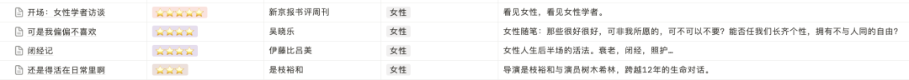

(放一些书摘)

“女性主义绝不是弱者试图变为强者的思想，女性主义是追求弱者也能得到尊重的思想。”

“同时我也不断告诉自己和伙伴，我们不要“加盟”社会性的对女性、对自己的迫害。某些时候，我们体认到至痛的伤害，来自社会的、主流人群的恶意和敌意，但此间是否也包含着某种我们因内化而潜意识认同的因素？在意识深处、在潜意识层面，是多少源远流长的父权文化的规训？我近来在很多议题中重申，女性/新女性是五四新文化运动中最大的“发明”。——这里说的当然不是生理性别，而是文化位置与社会功能角色。女性的公共生存刚刚走完不到一百年的时间，而此前是东西方世界的千年历史。女性很新，我们的课题很新。我们学，我们行。路还长。”

“正是因为有这样宝贵的女性话语在我们面前，它们才会成为我们的血与肉。语言不是自己一个人就可以发明的，你必须从某个地方借用到它。当你从前人手中接过它以后，才能逐渐将它变成你自己的血与肉。她们有恩于我。”

-

我也终于发现，这部分的教育就是我之前拧巴的来源：我总觉得有了情绪就是错的，计较就是小心眼，分享悲伤是脆弱的表现。所以我很多时候无法理解自己的行为，而转成了向内攻击。

直到看到如上野千鹤子、毛尖、戴锦华她们对于女性处境的清晰解释，我才发现其实我是可以表达、哭泣、脆弱的。今年的我也尝试着和很多优秀的女性好友谈论这些，被温柔与共情包裹的时刻让我真正感受到了舒展。

是的哦。其实我就是这样一个普通平凡的、有时候也有点脆弱的、有时候也有点野心的、有时候也有点优秀的女性哦！

感谢这一年里所有交好的朋友们！感谢那些深度交流，也感谢那些陌生人的支持和鼓励，希望大家都幸福、健康、有面对未来见招拆招的勇气！

**/ 再次：新年快乐啦！ /**

余华老师你说的太好了：

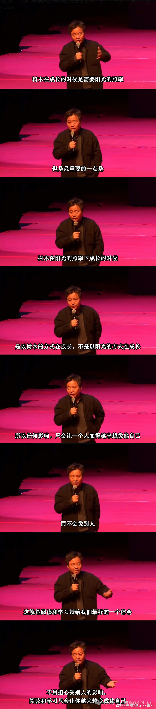

生活是一个动词，越是在不确定的时代，越要靠行动去对抗迷茫和焦灼。去阅读，但不要止于阅读；去爱生活，而不止于爱生活的意义。然后让知识变成生活里活生生的一部分。

祝大家贪婪地吸收阳光和知识。

爱自己，爱所爱之人，爱生活本身，爱生命。

不要只是低头寻找，要抬头去创造！

新年快乐朋友们！

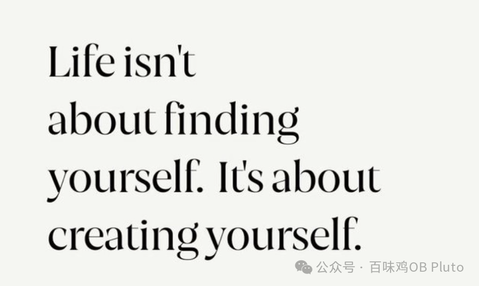

最后，放一张没有p过的与博雅塔的合影吧！

之前我其实也总会简单磨皮、祛痘、瘦脸的。但现在就希望，能在2024通过运动和健康，做纯天然的、美丽的自己吧！

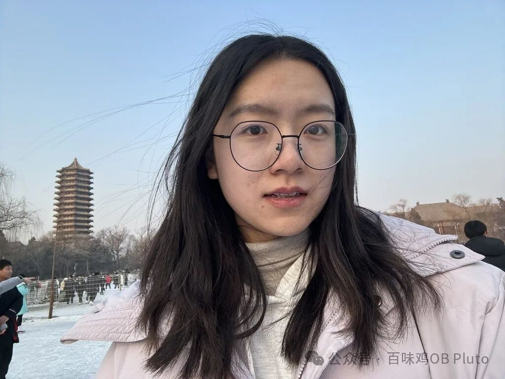
